# Technical Specification

# 1. Introduction

## 1.1 EXECUTIVE SUMMARY

### 1.1.1 Project Overview

This Technical Specification documents the **Artifact4** project, a software initiative that is currently in its inception phase. As of the documentation date, the repository represents a project skeleton consisting of a single Markdown file (`README.md`) containing only the project name as an H1 heading. No source code, build configuration, dependency manifests, or implementation artifacts exist in the repository at this time.

The only verifiable identifier for this project is its declared name, "Artifact4," as established in the repository's sole content file. This specification therefore documents both the verifiable state of the project and the structural placeholders that will be populated as the project progresses through subsequent phases of definition, design, and implementation.

| Attribute | Verified Value | Evidence Source |
|-----------|---------------|-----------------|
| Project Name | Artifact4 | `README.md` (line 1) |
| Repository Initialization Date | May 28, 2026 | Git commit metadata |
| Repository State | Pre-implementation skeleton | Filesystem inventory |
| Documentation Format | Markdown | `.md` file extension |

### 1.1.2 Current Project State

The repository has been initialized with the minimum viable artifact required to register a project identity. The complete inventory of repository content consists of one file with a single line of content. No technology stack, architectural pattern, framework, platform, or runtime environment has been selected or committed to the repository.


### 1.1.3 Core Business Problem

The core business problem that the Artifact4 project intends to address **is not articulated within any repository artifact** at the current time. No problem statement, business case, opportunity analysis, or domain context has been committed to version control. This information must be established through subsequent project planning activities and will be incorporated into future revisions of this specification.

### 1.1.4 Key Stakeholders and Users

The only stakeholder identifiable from repository evidence is the initial contributor recorded in the Git commit metadata. Additional stakeholder roles, user personas, sponsoring organizations, and end-user constituencies have not yet been documented.

| Stakeholder Role | Identity | Source |
|-----------------|----------|--------|
| Initial Contributor | shalini690 (associated with blitzy.io) | Git commit author metadata |
| Project Sponsor | Not Defined | No artifact present |
| End Users | Not Defined | No artifact present |
| Operational Owners | Not Defined | No artifact present |

### 1.1.5 Expected Business Impact and Value Proposition

The expected business impact and value proposition of Artifact4 have not been formalized in the repository. No value drivers, financial projections, strategic alignment statements, or impact metrics are present in any committed artifact. These elements will need to be defined as part of the project's requirements gathering and stakeholder alignment activities.

---

## 1.2 SYSTEM OVERVIEW

### 1.2.1 Project Context

#### Business Context and Market Positioning

The business context and market positioning of Artifact4 have not been established in any repository artifact. The project's intended industry vertical, competitive landscape, target market segment, and strategic differentiators remain undefined and cannot be inferred from the available evidence. The project name itself provides no semantic indication of domain, function, or industry alignment.

#### Current System Limitations

Because Artifact4 is a greenfield initiative with no implemented predecessor, there are no existing system limitations to document. The repository does not contain references to legacy systems, deprecated platforms, or systems being replaced. Whether Artifact4 will operate as a standalone solution, a replacement for an existing system, or an extension of established infrastructure remains undetermined.

#### Integration with Existing Enterprise Landscape

No integration points, dependent systems, upstream data providers, downstream consumers, or enterprise service endpoints are referenced in the repository. The project's integration topology has not been designed or declared.

### 1.2.2 High-Level Description

#### Primary System Capabilities

No system capabilities have been implemented or specified in the repository. The single artifact present (`README.md`) declares only a project name and does not enumerate functional capabilities, user-facing features, administrative functions, or non-functional behaviors.

| Capability Category | Defined? | Status |
|--------------------|----------|--------|
| User-Facing Features | No | To Be Determined |
| Administrative Functions | No | To Be Determined |
| Data Processing | No | To Be Determined |
| External Integrations | No | To Be Determined |
| Non-Functional Behaviors | No | To Be Determined |

#### Major System Components

No system components are present in the repository. There are no source code modules, service definitions, library declarations, container specifications, or infrastructure-as-code artifacts. The component architecture has not been designed.

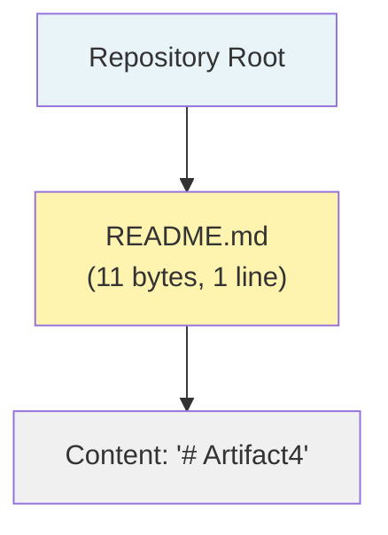

#### Core Technical Approach

No core technical approach has been declared. The repository does not specify:

- A programming language or runtime environment
- An application framework or development platform
- A persistence strategy or data storage technology
- A deployment model (e.g., monolith, microservices, serverless)
- A hosting environment or infrastructure provider
- A build, packaging, or distribution mechanism

The selection and documentation of these foundational technical decisions represents work that must be completed before implementation can commence.

### 1.2.3 Success Criteria

#### Measurable Objectives

No measurable objectives are defined in the repository. The project does not declare delivery targets, performance thresholds, quality gates, or completion criteria. These must be established through project planning activities and subsequently incorporated into this specification.

#### Critical Success Factors

Critical success factors for Artifact4 have not been articulated. No dependencies on organizational readiness, resource availability, technology maturity, or stakeholder commitment have been documented.

#### Key Performance Indicators

No Key Performance Indicators (KPIs) are defined for the Artifact4 project at this time.

| KPI Category | Defined Metric | Target Value | Status |
|-------------|---------------|--------------|--------|
| Functional Performance | None | Not Set | Undefined |
| Operational Quality | None | Not Set | Undefined |
| User Adoption | None | Not Set | Undefined |
| Business Outcomes | None | Not Set | Undefined |

---

## 1.3 SCOPE

### 1.3.1 In-Scope Elements

#### Core Features and Functionalities

The current scope of materialized work in the Artifact4 repository is limited exclusively to the establishment of a project identity through a single Markdown file. Based strictly on what has been committed to the repository, the in-scope elements are:

| In-Scope Element | Description | Evidence |
|-----------------|-------------|----------|
| Project Name Declaration | The project is identified as "Artifact4" | `README.md` H1 heading |
| Repository Initialization | A Git repository with a `main` branch exists | Git metadata |
| Documentation Foundation | Markdown selected as the documentation format | `.md` file extension |

No primary user workflows have been defined. No essential integrations have been declared. No key technical requirements have been specified within the repository.

#### Implementation Boundaries

The implementation boundary of the current repository state is precisely defined and exceptionally narrow:

| Boundary Dimension | Current Scope |
|-------------------|---------------|
| System Boundary | Single Markdown file at repository root |
| Code Modules | None present |
| Configuration Surface | None present |
| External Interfaces | None present |

#### User Groups Covered

No user groups have been identified, defined, or scoped. The repository does not contain user persona definitions, role-based access specifications, or audience analyses.

#### Geographic and Market Coverage

Geographic coverage, market coverage, regulatory jurisdictions, and localization requirements are not defined in the repository.

#### Data Domains Included

No data domains, entity models, schemas, or information architectures are defined. The repository contains no data dictionaries, entity-relationship diagrams, or persistence schemas.

### 1.3.2 Out-of-Scope Elements

Because no functional scope has been positively established, the out-of-scope determination is necessarily expansive. Every element typically associated with a software system is presently outside the materialized scope of the Artifact4 repository.

| Category | Out-of-Scope Items |
|----------|-------------------|
| Application Logic | All business logic, processing rules, and computational workflows |
| User Interfaces | All UI components, presentation layers, and user interaction designs |
| Data Persistence | All databases, schemas, storage mechanisms, and data access layers |
| Integrations | All external APIs, third-party services, and inter-system communication |
| Infrastructure | All hosting, networking, deployment, and operational tooling |
| Security | All authentication, authorization, encryption, and audit mechanisms |
| Testing | All unit, integration, performance, and acceptance testing frameworks |
| Build Tooling | All compilation, packaging, dependency management, and CI/CD pipelines |
| Documentation | All architectural documentation beyond the project name declaration |

#### Future Phase Considerations

The following activities are anticipated as future-phase work, although they have not been formally scheduled or committed to the repository:

| Future Phase | Anticipated Activities |
|--------------|----------------------|
| Phase 1 — Requirements | Define business problem, stakeholders, and success criteria |
| Phase 2 — Architecture | Select technology stack, design components, and define interfaces |
| Phase 3 — Implementation | Develop source code, configurations, and deployment artifacts |
| Phase 4 — Validation | Establish testing, quality assurance, and acceptance procedures |

#### Integration Points Not Covered

No integration points are currently covered by this specification because none have been defined. All potential integrations—including authentication providers, data sources, messaging systems, observability platforms, and third-party APIs—are presently out of scope.

#### Unsupported Use Cases

Because no use cases have been positively defined as supported, no use cases can be enumerated as explicitly unsupported. The repository's current state effectively means that all conceivable use cases are unsupported pending future definition and implementation activities.

---

## 1.4 SPECIFICATION INTERPRETATION GUIDANCE

This Introduction reflects the verifiable state of the Artifact4 repository as of the most recent commit (`81723e660ea11ed4011a777851f7d46efde4a724`, dated May 28, 2026). Sections that indicate "Not Defined," "To Be Determined," or "None Present" are factual statements about the absence of corresponding artifacts in the repository, not omissions in this documentation. As the project progresses and additional artifacts are committed to version control, this specification will be revised to reflect the evolving system definition.

---

#### References

#### Files Examined

- `README.md` — The sole file in the repository. Contains a single H1 Markdown heading (`# Artifact4`) totaling 11 bytes on 1 line. This file provided the project name, which is the only verifiable factual identifier for the project.

#### Folders Examined

- `/` (repository root) — The only folder in the repository. Confirmed to contain exactly one file (`README.md`) and no subdirectories. No hidden configuration files (e.g., `.gitignore`, `.env`, `.editorconfig`) are present beyond standard Git metadata.

#### Repository Metadata Examined

- Git commit history — Single commit (`81723e660ea11ed4011a777851f7d46efde4a724`) with message "Initial commit" authored by shalini690 <shalini@blitzy.io> on May 28, 2026.
- Git branch structure — Only the `main` branch exists; no tags are defined.
- Git tree — Contains exactly one blob (`1ba331f8f068747f5b14cd44441a416c93670ba9`) corresponding to `README.md`.

#### Verification Activities Performed

- Filesystem inventory traversal confirming the absence of source code, configuration files, build manifests, and test artifacts.
- Semantic searches for implementation, configuration, and architectural artifacts—all returning zero results.
- Verification of the absence of common repository scaffolding files (`.gitignore`, `package.json`, `Dockerfile`, `LICENSE`, etc.).

#### Technical Specification Cross-References

- No other Technical Specification sections were available for cross-reference at the time of authoring this section (empty section list provided).

# 2. Product Requirements

## 2.1 FEATURE CATALOG

### 2.1.1 Feature Catalog Status

The Artifact4 repository is presently in a pre-implementation skeleton state, and consequently no software product features have been formally defined, designed, or committed to version control. This determination is consistent with the findings recorded in §1.2.2 (Primary System Capabilities) and §1.3.1 (Core Features and Functionalities), which collectively confirm that no user-facing features, administrative functions, data processing capabilities, external integrations, or non-functional behaviors have been specified within any repository artifact.

In accordance with the interpretive convention established in §1.4, the statements of absence in this section are factual descriptions of the repository's current state rather than gaps in this documentation. The Feature Catalog will be expanded in future specification versions as features are formally proposed, approved, and incorporated into committed project artifacts.

#### Verified Catalog Inventory

| Catalog Dimension | Defined Items | Source of Truth |
|------------------|---------------|-----------------|
| Software Features Specified | 0 | Repository content (§1.3.1) |
| Features in Development | 0 | Git working tree state |
| Features Completed | 0 | Git commit history |
| Project Identity Artifacts | 1 | `README.md` H1 heading |

### 2.1.2 F-001 — Project Name Declaration

Although no software product features have been declared, a single verifiable in-scope element exists per §1.3.1: the Project Name Declaration. While this artifact does not constitute a software feature in the conventional sense (it lacks executable behavior, user interaction surfaces, or data processing semantics), it is documented here as the sole identifiable item in the project's current state and the only entry that can be populated with traceable evidence rather than speculation.

#### Feature Metadata

| Attribute | Value |
|-----------|-------|
| Unique ID | F-001 |
| Feature Name | Project Name Declaration |
| Feature Category | Project Identity Artifact |
| Priority Level | Critical |
| Status | Completed |

#### Description

| Aspect | Description |
|--------|-------------|
| Overview | Declares the project's canonical name ("Artifact4") through an H1 Markdown heading committed to the repository's `README.md` file |
| Business Value | Establishes a stable, version-controlled identifier that distinguishes the project within its hosting context and enables unambiguous reference in subsequent planning artifacts |
| User Benefits | Provides a human-readable name that contributors, reviewers, and tooling can use to reference the project consistently |
| Technical Context | Realized as an 11-byte, single-line Markdown file at the repository root, traceable to Git commit `81723e660ea11ed4011a777851f7d46efde4a724` per §1.4 |

#### Dependencies

| Dependency Type | Status |
|----------------|--------|
| Prerequisite Features | None — F-001 is the foundational and only artifact |
| System Dependencies | Git version control system; a CommonMark-compatible Markdown renderer for human display |
| External Dependencies | None — no third-party services, libraries, or APIs are invoked |
| Integration Requirements | None — F-001 does not integrate with any internal or external system |

### 2.1.3 Feature Categories Not Yet Populated

The feature categories referenced in §1.2.2 are anticipated to be populated as the project advances through the future phases enumerated in §1.3.2. None of these categories contain defined features at this time, and no priority levels, status designations, or descriptive content can be supplied without speculation.

| Feature Category | Current Status | Anticipated Phase (per §1.3.2) |
|-----------------|----------------|--------------------------------|
| User-Facing Features | Not Defined | Phase 1 — Requirements |
| Administrative Functions | Not Defined | Phase 1 — Requirements |
| Data Processing Capabilities | Not Defined | Phase 1 — Requirements |
| External Integrations | Not Defined | Phase 2 — Architecture |
| Non-Functional Behaviors | Not Defined | Phase 1 — Requirements |
| Security Capabilities | Not Defined | Phase 2 — Architecture |
| Operational Capabilities | Not Defined | Phase 3 — Implementation |

---

## 2.2 FUNCTIONAL REQUIREMENTS TABLE

### 2.2.1 Functional Requirements Status

No functional requirements have been authored, reviewed, or approved within the Artifact4 repository. The repository contains no requirements documents, no acceptance criteria documents, no user stories, no use cases, and no business rules. The only verifiable requirement is the implicit specification embodied by the F-001 artifact's existing content, formalized below as F-001-RQ-001.

#### Aggregate Requirement Counts

| Requirement Classification | Count | Notes |
|---------------------------|-------|-------|
| Must-Have Requirements | 1 | F-001-RQ-001 (project name persistence) |
| Should-Have Requirements | 0 | None defined |
| Could-Have Requirements | 0 | None defined |
| Won't-Have (Explicitly Excluded) | Not Determined | Exclusion list pending requirements phase |

### 2.2.2 Requirements for F-001 — Project Name Declaration

The requirements below describe the observable, verifiable characteristics of the single artifact currently committed to the repository. These requirements are derived from the artifact's current state rather than from any pre-existing requirements document.

#### F-001-RQ-001: Persist Project Name in Version Control

#### Requirement Details

| Attribute | Value |
|-----------|-------|
| Requirement ID | F-001-RQ-001 |
| Description | The project's canonical name shall be persisted in a version-controlled artifact at the repository root |
| Acceptance Criteria | A file named `README.md` exists at the repository root and contains an H1 Markdown heading whose text reads "Artifact4" |
| Priority | Must-Have |

#### Complexity Assessment

| Attribute | Value |
|-----------|-------|
| Implementation Complexity | Low |
| Testing Complexity | Low |
| Integration Complexity | None — no integrations involved |
| Maintenance Complexity | Low — updates require only a version-controlled commit |

#### Technical Specifications

| Specification | Value |
|--------------|-------|
| Input Parameters | None — content is static text |
| Output / Response | An 11-byte Markdown file with the exact content `# Artifact4` |
| Performance Criteria | Not Applicable — static content with no runtime execution path |
| Data Requirements | UTF-8 encoded text conforming to CommonMark Markdown syntax |

#### Validation Rules

| Rule Category | Rule |
|--------------|------|
| Business Rules | The H1 heading text shall match the project's canonical name "Artifact4" exactly |
| Data Validation | The file shall be syntactically valid Markdown renderable by standard CommonMark processors |
| Security Requirements | No secrets, credentials, tokens, or sensitive information shall be embedded in the file |
| Compliance Requirements | None defined — no regulatory or contractual obligations have been declared in the repository |

### 2.2.3 Requirements Domains Pending Definition

The functional requirements that the Artifact4 project will eventually need are not committed to the repository at this time. The following requirement domains are explicitly out-of-scope of the current specification per §1.3.2 and are deferred to future phases.

| Requirement Domain | Definition Status | Phase per §1.3.2 |
|-------------------|-------------------|------------------|
| Business Process Requirements | Not Defined | Phase 1 — Requirements |
| User Interaction Requirements | Not Defined | Phase 1 — Requirements |
| Data Management Requirements | Not Defined | Phase 1 — Requirements |
| Integration & Interface Requirements | Not Defined | Phase 2 — Architecture |
| Performance & Capacity Requirements | Not Defined | Phase 2 — Architecture |
| Security & Privacy Requirements | Not Defined | Phase 2 — Architecture |
| Operational & Observability Requirements | Not Defined | Phase 3 — Implementation |
| Test & Acceptance Requirements | Not Defined | Phase 4 — Validation |

---

## 2.3 FEATURE RELATIONSHIPS

### 2.3.1 Relationship Status

Feature relationships — including inter-feature dependency maps, integration points, shared components, and common services — cannot be enumerated because only one identity artifact (F-001) exists in the repository. With a single artifact in the system, no inter-feature relationships are present to document.

This conclusion is corroborated by §1.2.2 ("No system components are present in the repository ... The component architecture has not been designed.") and §1.2.1 ("No integration points, dependent systems, upstream data providers, downstream consumers, or enterprise service endpoints are referenced in the repository."). The section prompt's directive to document only relationships "clearly evident in the requirements or source code" therefore yields an empty relationship set.

### 2.3.2 Relationship Inventory

| Relationship Type | Number Defined | Source Evidence |
|------------------|----------------|-----------------|
| Feature-to-Feature Dependencies | 0 | F-001 has no prerequisite features |
| Internal Integration Points | 0 | No service or module boundaries exist (§1.2.2) |
| External Integration Points | 0 | No external integrations declared (§1.2.1) |
| Shared Components | 0 | No components present in repository (§1.2.2) |
| Common Services | 0 | No services defined (§1.2.2) |
| Cross-Cutting Concerns | 0 | No cross-cutting concerns identified |

### 2.3.3 Single-Artifact Topology

The current feature topology consists of a single isolated artifact with no inbound, outbound, or lateral relationships. This minimal topology will evolve into a multi-node graph as additional features are defined and integrated in future phases.

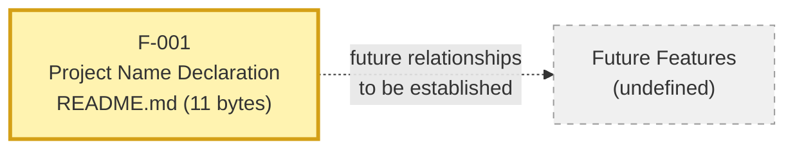

The dashed edge denotes anticipated future relationships that have not yet been established in the repository and are documented here solely to indicate the structural placeholder, consistent with the convention from §1.4.

---

## 2.4 IMPLEMENTATION CONSIDERATIONS

### 2.4.1 Implementation Considerations Status

Implementation considerations for prospective Artifact4 features cannot be derived from the repository because no technology stack, runtime environment, deployment model, hosting environment, or build mechanism has been selected. This is established in §1.2.2 (Core Technical Approach) and corroborated by §1.2.3 (Success Criteria), both of which confirm that the foundational technical decisions remain undefined.

The considerations documented in §2.4.2 below apply only to the existing F-001 artifact and reflect its observable, static nature. All other implementation considerations are deferred to future phases per §1.3.2.

### 2.4.2 Considerations Applicable to F-001

The following considerations are derived from the observable properties of the Project Name Declaration artifact:

| Consideration Type | Applicability to F-001 |
|--------------------|------------------------|
| Technical Constraints | Must be a valid CommonMark-compatible Markdown file at the repository root |
| Performance Requirements | Not Applicable — static content with no runtime behavior or measurable performance dimensions |
| Scalability Considerations | Not Applicable — single static file with no concurrency, throughput, or load characteristics |
| Security Implications | The file shall not contain secrets; access control is delegated to the Git hosting platform |
| Maintenance Requirements | Updates to the project name require a version-controlled commit and revision of dependent documentation |

### 2.4.3 Considerations Not Yet Determinable

The following implementation considerations cannot be specified for hypothetical future features because the project's technology choices, deployment targets, and quality targets have not been declared. Each row identifies the blocking decision that must be made before the corresponding consideration can be addressed.

| Consideration Domain | Determination Status | Blocking Decision (per §1.2.2 / §1.2.3) |
|---------------------|----------------------|----------------------------------------|
| Language and Framework Constraints | Not Determinable | Technology stack not selected |
| Throughput and Latency Targets | Not Determinable | No KPIs defined |
| Horizontal / Vertical Scalability Model | Not Determinable | Deployment model not declared |
| Authentication and Authorization Model | Not Determinable | Security architecture not defined |
| Data Persistence and Retention | Not Determinable | Persistence strategy not selected |
| Operational and Runbook Requirements | Not Determinable | Hosting environment not selected |
| Build, Packaging, and Distribution | Not Determinable | No build mechanism declared |

---

## 2.5 TRACEABILITY MATRIX

### 2.5.1 Current Traceability

The traceability matrix below captures the verifiable linkage between the single in-scope element and its supporting artifacts within the repository and this specification.

| Feature ID | Requirement ID | Evidence Artifact |
|-----------|----------------|-------------------|
| F-001 | F-001-RQ-001 | `README.md` (11 bytes, 1 line) |

#### Cross-Reference to Specification Sections

| Feature / Requirement | Referenced Specification Sections |
|----------------------|-----------------------------------|
| F-001 (Project Name Declaration) | §1.1.1 (Project Overview), §1.3.1 (In-Scope Elements) |
| F-001-RQ-001 (Persistence) | §1.4 (Git commit metadata), §1.3.1 (Evidence column) |
| Absence of all other features | §1.2.2 (Primary System Capabilities), §1.3.2 (Out-of-Scope Elements) |

### 2.5.2 Future Matrix Expansion

As features are added in future phases per §1.3.2, this matrix will expand to capture relationships between:

- Business goals and the features that fulfill them
- Features and the requirements that decompose them
- Requirements and the test cases that validate them
- Requirements and the source code modules that implement them
- Requirements and the operational artifacts that deploy them

None of these linkages can currently be established because their endpoints (business goals, additional features, test cases, source code, operational artifacts) do not exist in the repository.

---

## 2.6 ASSUMPTIONS AND CONSTRAINTS

### 2.6.1 Documented Assumptions

The following assumptions are intrinsic to the current state of this specification and are stated explicitly to support future revisions:

| Assumption ID | Statement |
|--------------|-----------|
| A-001 | The project name "Artifact4" recorded in `README.md` is the project's intended canonical name |
| A-002 | The single commit by shalini690 (blitzy.io) represents an authorized initialization of the project |
| A-003 | Subsequent phases of the project will populate requirements, architecture, and implementation artifacts as outlined in §1.3.2 |
| A-004 | The four-phase progression outlined in §1.3.2 represents the intended sequencing for project maturation, although no formal schedule has been committed |

### 2.6.2 Documented Constraints

| Constraint ID | Statement | Source |
|--------------|-----------|--------|
| C-001 | All documented features and requirements must be grounded in artifacts committed to version control | §1.4 (Interpretation Guidance) |
| C-002 | The specification shall not infer features, technology choices, or business goals that lack repository evidence | §1.4 (Interpretation Guidance) |
| C-003 | The current materialized scope is limited to a project identity declaration; all other capabilities are out-of-scope until formally defined | §1.3.2 (Out-of-Scope Elements) |
| C-004 | Feature relationships shall be documented only when clearly evident in committed requirements or source code | Section 2 prompt directive |

### 2.6.3 Specification Revision Triggers

This Product Requirements section shall be revised when any of the following events occur in the repository or in companion governance artifacts:

- A requirements document, user story, or use case is committed to the repository
- A technology stack, framework, or platform is selected and documented
- A feature is implemented in source code, regardless of completion status
- An integration point or external dependency is declared in a manifest or configuration file
- A business goal, KPI, success criterion, or compliance obligation is formally documented
- A stakeholder, user persona, or operational owner is identified beyond the initial contributor recorded in §1.1.4

---

## 2.7 RELATED PROCESS REFERENCES

### 2.7.1 Process Flowchart Linkages

No process flowcharts are referenced from within this Product Requirements section beyond the high-level project phase progression already depicted in §1.1.2. As features and workflows are defined in future phases, process flowcharts will be incorporated and cross-referenced from this section.

### 2.7.2 Related Specification Sections

| Topic | Related Section | Relationship |
|-------|----------------|--------------|
| Repository state evidence | §1.1.1, §1.1.2 | Provides the verified baseline used throughout Section 2 |
| Capability category enumeration | §1.2.2 | Source of the feature category list in §2.1.3 |
| Future-phase sequencing | §1.3.2 | Source of the phase references in §2.1.3 and §2.2.3 |
| Documentation interpretation convention | §1.4 | Authoritative guidance for "Not Defined" statements used throughout Section 2 |

---

#### References

#### Files Examined

- `README.md` — The sole file in the repository, containing the single H1 Markdown heading `# Artifact4` (11 bytes, 1 line). This file provides the only verifiable artifact (F-001 Project Name Declaration) documented in this section and is the evidence basis for F-001-RQ-001.

#### Folders Examined

- `/` (repository root) — Confirmed to contain only `README.md` and the standard `.git/` metadata directory. No source code modules, configuration directories, feature implementation folders, test directories, or build artifacts are present.

#### Repository Metadata Referenced

- Git commit `81723e660ea11ed4011a777851f7d46efde4a724` (dated May 28, 2026, authored by shalini690 <shalini@blitzy.io>) — The single commit that established the repository's current state and the evidentiary anchor for the F-001 artifact's existence.
- Git branch structure — Only the `main` branch exists; no tags are defined; no additional branches contain feature-related work.

#### Technical Specification Sections Referenced

- §1.1 Executive Summary — Established that the project is in inception phase with no implementation; provided stakeholder, business problem, and value proposition status (all "Not Defined"); established the phase progression diagram referenced in §2.7.1.
- §1.2 System Overview — Established that no system capabilities, components, or technical approach have been defined; provided the KPI table showing all categories undefined; provided the capability category enumeration used in §2.1.3.
- §1.3 Scope — Established the single in-scope element (Project Name Declaration) used as the basis for F-001; established the comprehensive out-of-scope list referenced in §2.2.3; enumerated the four future phases referenced throughout this section.
- §1.4 Specification Interpretation Guidance — Established the verbatim Git commit hash, the interpretive convention that "Not Defined" statements are factual content rather than documentation omissions, and the list of verification activities performed against the repository.

# 3. Technology Stack

## 3.1 TECHNOLOGY STACK STATUS

The Artifact4 repository, as of Git commit `81723e660ea11ed4011a777851f7d46efde4a724` (dated May 28, 2026), does not declare, configure, or commit any technology stack components. No programming languages, runtime environments, application frameworks, libraries, persistence technologies, infrastructure tooling, or deployment mechanisms are present in version control. This section documents the verified absence of these elements as a factual representation of the repository's pre-implementation state.

### 3.1.1 Interpretive Framework

In strict accordance with the interpretive convention established in §1.4 (Specification Interpretation Guidance), the entries marked "Not Defined," "None Present," or "Not Determinable" throughout this section are **factual descriptions of repository content**, not gaps in documentation. The repository has been exhaustively inspected and contains exactly one file (`README.md`, 11 bytes, single H1 heading `# Artifact4`) alongside the standard Git metadata directory. No subdirectories, no manifest files, no configuration files, no source code, no schemas, and no infrastructure artifacts exist.

### 3.1.2 Governing Constraints

Three documented constraints from §2.6.2 govern the contents of this Technology Stack section and prohibit the inference of technology choices not present in the repository:

| Constraint ID | Statement | Application to Section 3 |
|--------------|-----------|--------------------------|
| C-001 | All documented features and requirements must be grounded in artifacts committed to version control | Each technology entry in this section must reference a verifiable artifact (manifest, configuration file, source file) |
| C-002 | The specification shall not infer features, technology choices, or business goals that lack repository evidence | Default or assumed technology stacks shall not be introduced into this section without supporting committed artifacts |
| C-003 | The current materialized scope is limited to a project identity declaration; all other capabilities are out-of-scope until formally defined | All technology-stack categories beyond the project-identity Markdown file are out-of-scope at this revision |

These constraints, in combination with the out-of-scope determination in §1.3.2 (which expressly lists "Application Logic," "User Interfaces," "Data Persistence," "Integrations," "Infrastructure," "Security," and "Build Tooling" as out-of-scope categories), define the boundary conditions for every subsection that follows.

### 3.1.3 Current Repository Topology

The complete technology footprint of the repository is depicted below. No node beyond the single Markdown artifact has any committed evidence in version control.

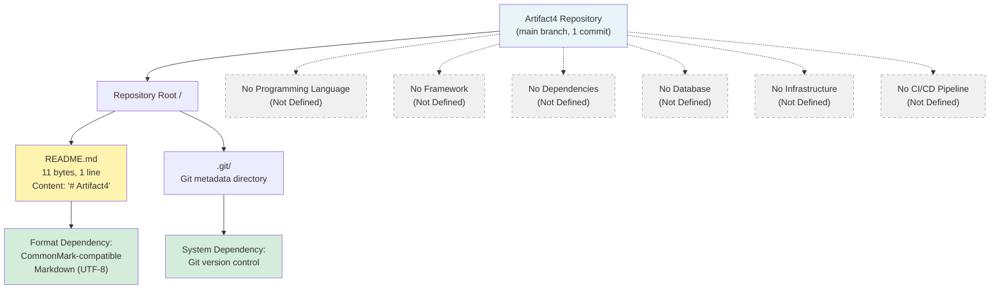

---

## 3.2 CURRENTLY OBSERVABLE TECHNOLOGY ELEMENTS

Although no technology stack is declared, the existence of a Markdown file under Git version control implies two minimal technology dependencies that are observable from the committed artifacts themselves. These are recorded for completeness and traceability, consistent with the dependency declarations enumerated in §2.1.2 for feature F-001 (Project Name Declaration).

### 3.2.1 Documentation Format — CommonMark-Compatible Markdown

| Attribute | Detail |
|-----------|--------|
| Element | Markdown document format |
| Specification Variant | CommonMark-compatible (per §2.1.2 System Dependencies) |
| Character Encoding | UTF-8 |
| Evidence Artifact | `README.md` at the repository root (`.md` extension) |
| Role | Format of the sole committed file conveying the project name |
| Version | Not pinned in repository (no version manifest is committed) |
| Justification | The `.md` extension and use of an H1 heading (`# Artifact4`) require a Markdown renderer for human display. Per §2.2 (F-001-RQ-001), the file must satisfy UTF-8 Markdown / CommonMark compliance |

### 3.2.2 Version Control System — Git

| Attribute | Detail |
|-----------|--------|
| Element | Git distributed version control |
| Evidence Artifact | `.git/` metadata directory and committed object graph |
| Role | Authoritative store for the `README.md` blob, branch references, and commit history |
| Branch Inventory | A single `main` branch is defined; no tags exist |
| Commit Inventory | One commit (`81723e660ea11ed4011a777851f7d46efde4a724`, "Initial commit" by shalini690 <shalini@blitzy.io>, May 28, 2026) |
| Tree Composition | A single blob `1ba331f8f068747f5b14cd44441a416c93670ba9` corresponding to `README.md` |
| Version | Not pinned in repository (no `.gitattributes`, `.gitconfig`, or hosting-platform metadata is committed) |
| Justification | Required to host and version the `README.md` artifact, per the "System Dependencies" field of F-001 in §2.1.2 |

### 3.2.3 Verifiable Technology Element Summary

| Layer | Verifiable Technology | Evidence Source | Version Pinned? |
|-------|----------------------|-----------------|-----------------|
| Documentation Format | CommonMark-compatible Markdown | `README.md` (`.md` extension, H1 heading) | No |
| Version Control | Git | `.git/` metadata, commit history | No |
| All Other Layers | None | No supporting artifact present | N/A |

No other technology category contains any verifiable element. The remainder of Section 3 documents the absence of each category in turn.

---

## 3.3 PROGRAMMING LANGUAGES

### 3.3.1 Current State

No programming language is declared, configured, or used in the Artifact4 repository. Per §1.2.2 (Core Technical Approach), "the repository does not specify ... a programming language or runtime environment." This is corroborated by the verified absence of any source code file, language-specific manifest, or runtime configuration:

| Language Indicator | Present in Repository? | Verification |
|--------------------|------------------------|--------------|
| `package.json` / `package-lock.json` (Node.js/JavaScript) | No | Repository contains only `README.md` |
| `requirements.txt` / `pyproject.toml` / `Pipfile` / `setup.py` (Python) | No | Repository contains only `README.md` |
| `go.mod` / `go.sum` (Go) | No | Repository contains only `README.md` |
| `Cargo.toml` / `Cargo.lock` (Rust) | No | Repository contains only `README.md` |
| `pom.xml` / `build.gradle` (Java/JVM) | No | Repository contains only `README.md` |
| `Gemfile` (Ruby) | No | Repository contains only `README.md` |
| `composer.json` (PHP) | No | Repository contains only `README.md` |
| `.csproj` / `.sln` (.NET) | No | Repository contains only `README.md` |
| Source files (`.py`, `.js`, `.ts`, `.go`, `.rs`, `.java`, `.kt`, `.swift`, `.m`, etc.) | No | Repository contains only `README.md` |

### 3.3.2 Platform-Specific Language Assignments

| Platform / Component | Selected Language | Status |
|----------------------|-------------------|--------|
| Backend / Server | Not Defined | No backend component exists |
| Web Frontend | Not Defined | No web component exists |
| Mobile / Cross-Platform | Not Defined | No mobile component exists |
| Native iOS | Not Defined | No iOS component exists |
| Native Android | Not Defined | No Android component exists |
| Native macOS | Not Defined | No macOS component exists |
| Desktop | Not Defined | No desktop component exists |
| Infrastructure as Code | Not Defined | No IaC component exists |
| Build / Scripting | Not Defined | No build tooling exists |

### 3.3.3 Blocking Decision and Future Determination

Per §2.4.3 (Considerations Not Yet Determinable), the "Language and Framework Constraints" domain is recorded as Not Determinable, with the blocking decision identified as "Technology stack not selected." Language selection is anticipated to occur in **Phase 2 — Architecture** per §1.3.2, where the future-phase activity is explicitly "Select technology stack, design components, and define interfaces."

---

## 3.4 FRAMEWORKS AND LIBRARIES

### 3.4.1 Current State

No application frameworks, libraries, or supporting toolkits are present in the Artifact4 repository. Per §1.2.2 (Core Technical Approach), the repository does not specify "an application framework or development platform." This absence is verified by the lack of any manifest, lockfile, vendored library directory, or framework configuration file in the repository.

### 3.4.2 Framework Category Inventory

| Framework Category | Identified Selection | Version | Evidence |
|--------------------|----------------------|---------|----------|
| Web Application Framework | Not Defined | N/A | No backend manifest present |
| Frontend Framework / Library | Not Defined | N/A | No frontend manifest present |
| Mobile / Cross-Platform Framework | Not Defined | N/A | No mobile manifest present |
| ORM / Data Access Layer | Not Defined | N/A | No data layer artifact present |
| Authentication / Authorization Library | Not Defined | N/A | No security artifact present |
| Testing Framework | Not Defined | N/A | No test directory or manifest present |
| Logging / Observability Library | Not Defined | N/A | No observability artifact present |
| AI / ML Framework | Not Defined | N/A | No AI/ML artifact present |
| CSS / Styling Framework | Not Defined | N/A | No styling artifact present |

### 3.4.3 Compatibility Requirements

No compatibility requirements can be expressed because no frameworks have been selected. Per §2.4.3, framework constraints are Not Determinable until a technology stack is selected. Per §1.3.2 (Out-of-Scope Elements), "All business logic, processing rules, and computational workflows" and "All UI components, presentation layers, and user interaction designs" are explicitly out-of-scope at the current revision.

---

## 3.5 OPEN SOURCE DEPENDENCIES

### 3.5.1 Current State

No open-source dependencies are declared in the Artifact4 repository. The repository does not contain a dependency manifest of any kind. Per §2.1.2, the "External Dependencies" attribute of the sole feature F-001 is recorded as "None — no third-party services, libraries, or APIs are invoked."

### 3.5.2 Package Manifest and Registry Inventory

| Manifest File | Associated Registry | Present? |
|---------------|---------------------|----------|
| `package.json` | npm / Yarn / pnpm | No |
| `requirements.txt` | PyPI | No |
| `pyproject.toml` | PyPI | No |
| `Pipfile` / `Pipfile.lock` | PyPI | No |
| `go.mod` / `go.sum` | Go Modules Proxy | No |
| `Cargo.toml` / `Cargo.lock` | crates.io | No |
| `pom.xml` | Maven Central | No |
| `build.gradle` / `build.gradle.kts` | Maven Central / Gradle | No |
| `Gemfile` / `Gemfile.lock` | RubyGems | No |
| `composer.json` / `composer.lock` | Packagist | No |
| `Podfile` / `Cartfile` | CocoaPods / Carthage | No |
| `Package.swift` | Swift Package Manager | No |

### 3.5.3 Dependency Pinning and Provenance

No dependency pinning policy, supply-chain verification mechanism, or provenance attestation is present. Software Bill of Materials (SBOM), license inventory, and vulnerability scanning policies cannot be documented because no third-party packages are declared. These are anticipated as Phase 2 / Phase 3 deliverables per §1.3.2.

---

## 3.6 THIRD-PARTY SERVICES

### 3.6.1 Current State

No third-party services, external APIs, or hosted integrations are configured in the Artifact4 repository. Per §1.2.1 (Integration with Existing Enterprise Landscape), "No integration points, dependent systems, upstream data providers, downstream consumers, or enterprise service endpoints are referenced in the repository. The project's integration topology has not been designed or declared." This is reinforced by §2.3.2, which records zero external integration points.

### 3.6.2 Service Category Inventory

| Service Category | Selected Provider | Status |
|------------------|-------------------|--------|
| Authentication / Identity Provider | Not Defined | No security architecture defined (per §2.4.3) |
| Authorization / Policy Service | Not Defined | No security architecture defined |
| External API Integration | Not Defined | No integration declared (per §1.2.1) |
| Email / Notification Service | Not Defined | No notification artifact present |
| Payment / Billing Service | Not Defined | No commerce artifact present |
| Object Storage Service | Not Defined | No storage artifact present |
| Content Delivery Network | Not Defined | No CDN artifact present |
| Application Performance Monitoring | Not Defined | No observability artifact present |
| Logging / Telemetry Service | Not Defined | No observability artifact present |
| Error Tracking Service | Not Defined | No observability artifact present |
| Analytics Service | Not Defined | No analytics artifact present |
| Feature Flag Service | Not Defined | No feature management artifact present |
| Search Service | Not Defined | No search artifact present |
| Message Bus / Event Broker | Not Defined | No messaging artifact present |

### 3.6.3 Cloud Platform Selection

No cloud platform has been selected. Per §2.4.3, the "Operational and Runbook Requirements" domain is recorded as Not Determinable, with the blocking decision identified as "Hosting environment not selected." Per §1.3.2 (Out-of-Scope Elements), "All hosting, networking, deployment, and operational tooling" is explicitly out-of-scope at the current revision.

---

## 3.7 DATABASES AND STORAGE

### 3.7.1 Current State

No databases, persistent stores, caching layers, or object storage services are declared, configured, or used in the Artifact4 repository. Per §1.2.2 (Core Technical Approach), the repository does not specify "a persistence strategy or data storage technology." Per §1.3.1 (Data Domains Included), "No data domains, entity models, schemas, or information architectures are defined. The repository contains no data dictionaries, entity-relationship diagrams, or persistence schemas."

### 3.7.2 Storage Category Inventory

| Storage Category | Selected Technology | Version | Evidence |
|------------------|---------------------|---------|----------|
| Primary Relational Database | Not Defined | N/A | No schema or ORM artifact present |
| Document / NoSQL Database | Not Defined | N/A | No document-store artifact present |
| Key-Value Store | Not Defined | N/A | No key-value artifact present |
| In-Memory Cache | Not Defined | N/A | No cache artifact present |
| Search Index | Not Defined | N/A | No search artifact present |
| Object / Blob Storage | Not Defined | N/A | No object-storage artifact present |
| Time-Series Database | Not Defined | N/A | No metrics-store artifact present |
| Graph Database | Not Defined | N/A | No graph-store artifact present |
| Message Queue Storage | Not Defined | N/A | No messaging artifact present |

### 3.7.3 Data Persistence Strategy

No data persistence strategy has been defined. Per §2.4.3, the "Data Persistence and Retention" domain is recorded as Not Determinable, with the blocking decision identified as "Persistence strategy not selected." Per §1.3.2 (Out-of-Scope Elements), "All databases, schemas, storage mechanisms, and data access layers" is explicitly listed under the out-of-scope category "Data Persistence."

### 3.7.4 Storage Footprint of the Current Artifact

The only persistent storage occurring in the current repository is the storage of the `README.md` blob (11 bytes) within the Git object database, addressed by SHA-1 hash `1ba331f8f068747f5b14cd44441a416c93670ba9`. This is metadata storage of the repository itself and is not a data-persistence layer in the application sense.

---

## 3.8 DEVELOPMENT AND DEPLOYMENT

### 3.8.1 Current State

No development tooling, build system, containerization, infrastructure-as-code, or continuous integration / continuous delivery (CI/CD) configuration is present in the Artifact4 repository. Per §1.2.2 (Core Technical Approach), the repository does not specify "a build, packaging, or distribution mechanism," nor a "deployment model (e.g., monolith, microservices, serverless)," nor a "hosting environment or infrastructure provider."

### 3.8.2 Development Tooling

| Tooling Category | Configured Tool | Evidence |
|------------------|-----------------|----------|
| Code Editor / IDE Configuration | Not Defined | No `.editorconfig` present |
| Linter Configuration | Not Defined | No linter configuration file present |
| Formatter Configuration | Not Defined | No `.prettierrc` or equivalent present |
| Git Hooks / Pre-Commit | Not Defined | No `.husky/` or `pre-commit-config.yaml` present |
| Environment Variable Management | Not Defined | No `.env`, `.env.example`, or schema present |
| `.gitignore` | Not Present | Verified absent |
| `LICENSE` | Not Present | Verified absent |
| `CONTRIBUTING.md` | Not Present | Verified absent |

### 3.8.3 Build System

| Build Element | Configured? | Evidence |
|---------------|-------------|----------|
| Build Tool (Make, Bazel, Gradle, npm scripts, etc.) | No | No build manifest present |
| Compilation Targets | Not Defined | No source code to compile |
| Artifact Output Format | Not Defined | No build mechanism declared |
| Build Reproducibility Controls | Not Defined | No build mechanism declared |

Per §2.4.3, the "Build, Packaging, and Distribution" domain is recorded as Not Determinable, with the blocking decision identified as "No build mechanism declared."

### 3.8.4 Containerization

| Container Element | Configured? | Evidence |
|-------------------|-------------|----------|
| `Dockerfile` | No | Verified absent |
| `docker-compose.yml` / `compose.yaml` | No | Verified absent |
| Container Image Registry | Not Defined | No registry reference present |
| Kubernetes Manifests / Helm Charts | No | No `k8s/`, `manifests/`, or `charts/` directories present |
| Container Runtime Selection | Not Defined | No runtime declared |

### 3.8.5 Infrastructure as Code

| IaC Element | Configured? | Evidence |
|-------------|-------------|----------|
| Terraform (`.tf` files) | No | Verified absent |
| AWS CloudFormation | No | Verified absent |
| Pulumi | No | Verified absent |
| Ansible / Chef / Puppet | No | Verified absent |
| Cloud-specific IaC (ARM, Deployment Manager, etc.) | No | Verified absent |

### 3.8.6 CI/CD Pipeline

| CI/CD Element | Configured? | Evidence |
|---------------|-------------|----------|
| `.github/workflows/` (GitHub Actions) | No | No `.github/` directory present |
| `.gitlab-ci.yml` (GitLab CI) | No | Verified absent |
| `Jenkinsfile` (Jenkins) | No | Verified absent |
| CircleCI / Travis / Azure Pipelines configuration | No | Verified absent |
| Pipeline Stages | Not Defined | No pipeline configuration present |
| Deployment Targets | Not Defined | No deployment configuration present |
| Quality Gates / Test Automation | Not Defined | No test or coverage configuration present |

Per §1.3.2 (Out-of-Scope Elements), "All compilation, packaging, dependency management, and CI/CD pipelines" are explicitly out-of-scope under the "Build Tooling" category.

---

## 3.9 TECHNOLOGY STACK INVENTORY SUMMARY

### 3.9.1 Consolidated Inventory by Category

The following matrix consolidates the findings of §3.3 through §3.8 into a single inventory aligned with the categories enumerated in the section prompt. Each row represents a category required by the prompt; the **Defined Items** column gives the count of repository-verifiable selections.

| Category | Defined Items | Blocking Decision (per §2.4.3) | Out-of-Scope Reference (per §1.3.2) |
|----------|---------------|--------------------------------|--------------------------------------|
| Programming Languages | 0 | Technology stack not selected | All language selection out-of-scope |
| Frameworks & Libraries | 0 | Technology stack not selected | All framework selection out-of-scope |
| Open Source Dependencies | 0 | Technology stack not selected | "Build Tooling" out-of-scope |
| Third-Party Services | 0 | Security architecture not defined; Hosting environment not selected | "Integrations" out-of-scope |
| Databases & Storage | 0 | Persistence strategy not selected | "Data Persistence" out-of-scope |
| Development Tooling | 0 | No build mechanism declared | "Build Tooling" out-of-scope |
| Build System | 0 | No build mechanism declared | "Build Tooling" out-of-scope |
| Containerization | 0 | Hosting environment not selected | "Infrastructure" out-of-scope |
| Infrastructure as Code | 0 | Hosting environment not selected | "Infrastructure" out-of-scope |
| CI/CD | 0 | No build mechanism declared | "Build Tooling" out-of-scope |
| **Observable Format / Tooling** | **2** | — | — |
| └ Markdown (CommonMark) | 1 | N/A — observable from `.md` extension | In-scope per §1.3.1 ("Documentation Foundation") |
| └ Git Version Control | 1 | N/A — observable from `.git/` metadata | In-scope per §1.3.1 ("Repository Initialization") |

### 3.9.2 Disposition of the Default Technology Stack

The Default Technology Stack provided in the section prompt (AWS, Docker, Terraform, GitHub Actions, Python, Flask, Auth0, MongoDB, Langchain, React, TypeScript, TailwindCSS, React-Native, Swift, Kotlin, Objective-C, ElectronJS) is **not adopted** in this specification revision. The disposition of each candidate element is recorded below for traceability.

| Default Stack Component | Adopted? | Rationale |
|--------------------------|----------|-----------|
| AWS (Cloud Platform) | No | No hosting selection in repository; introducing violates C-002 |
| Docker (Containerization) | No | No `Dockerfile` or container artifact present; introducing violates C-002 |
| Terraform (IaC) | No | No `.tf` files or IaC artifact present; introducing violates C-002 |
| GitHub Actions (CI/CD) | No | No `.github/workflows/` present; introducing violates C-002 |
| Python (Backend Language) | No | No Python source or manifest present; introducing violates C-002 |
| Flask (Backend Framework) | No | No Flask configuration or import present; introducing violates C-002 |
| Auth0 (Authentication) | No | No security configuration present; introducing violates C-002 |
| MongoDB (Database) | No | No database driver, schema, or connection string present; introducing violates C-002 |
| Langchain (AI Framework) | No | No AI artifact present; introducing violates C-002 |
| React + TypeScript (Web) | No | No `package.json` or `.tsx` source present; introducing violates C-002 |
| TailwindCSS | No | No `tailwind.config.*` present; introducing violates C-002 |
| React-Native + TypeScript (Mobile) | No | No React Native artifact present; introducing violates C-002 |
| Swift (iOS), Kotlin (Android), Objective-C (macOS), ElectronJS (Desktop) | No | No native or desktop source present; introducing violates C-002 |

The justification for non-adoption is grounded in §2.6.2 Constraint **C-002**, which establishes: "The specification shall not infer features, technology choices, or business goals that lack repository evidence." Each component in the Default Technology Stack lacks any repository evidence and therefore cannot be incorporated into this specification at the current revision.

### 3.9.3 Security Implications of the Current State

Because no technology has been selected, no security implications can be attributed to a specific stack. The security posture of the repository is governed exclusively by the platform hosting the Git repository (which is responsible for access control to the single committed file), as documented in §2.4.2 ("access control is delegated to the Git hosting platform"). The Maintenance Requirements row in §2.4.2 further establishes that "Updates to the project name require a version-controlled commit and revision of dependent documentation," which is the only currently applicable change-management consideration. Per §2.4.3, the Authentication and Authorization Model is Not Determinable until the security architecture is defined.

---

## 3.10 SPECIFICATION REVISION TRIGGERS FOR THIS SECTION

### 3.10.1 Triggering Events

Per §2.6.3, this Technology Stack section shall be revised when any of the following events are observable in the repository:

| Trigger Event | Effect on Section 3 |
|---------------|---------------------|
| A technology stack, framework, or platform is selected and documented | Populate §3.3 (Programming Languages) and §3.4 (Frameworks and Libraries) with the selected items |
| An integration point or external dependency is declared in a manifest or configuration file | Populate §3.5 (Open Source Dependencies) and §3.6 (Third-Party Services) with the declared entries |
| A feature is implemented in source code | Populate language, framework, and dependency tables with the verified selections |
| A requirements document, user story, or use case is committed | May enable §3.7 (Databases and Storage) selections downstream |

### 3.10.2 Anticipated Phase Alignment

Per the four-phase progression in §1.3.2, technology stack selection is anticipated to occur in **Phase 2 — Architecture**, whose stated activity is "Select technology stack, design components, and define interfaces." Subsequent phases will introduce the dependencies and operational tooling addressed by §3.5 through §3.8:

| Phase | Activity | Expected Section 3 Impact |
|-------|----------|---------------------------|
| Phase 1 — Requirements | Define business problem, stakeholders, and success criteria | No direct §3 impact, but may unlock data-domain choices for §3.7 |
| Phase 2 — Architecture | Select technology stack, design components, and define interfaces | Populates §3.3, §3.4, §3.6, §3.7 |
| Phase 3 — Implementation | Develop source code, configurations, and deployment artifacts | Populates §3.5, §3.8 |
| Phase 4 — Validation | Establish testing, quality assurance, and acceptance procedures | Populates testing-framework entries under §3.4 and CI/CD entries under §3.8 |

### 3.10.3 Stability of Currently Documented Elements

Until at least one of the triggers listed in §3.10.1 is observed in the repository, this section's findings remain stable: the only technologies materially present are CommonMark-compatible Markdown (as the format of the sole committed file) and Git (as the version-control system hosting that file). All other categories will continue to be recorded as Not Defined in conformance with §1.4, §2.6.2 (C-001 and C-002), and §1.3.2.

---

#### References

#### Files Examined

- `README.md` — The sole file in the repository. Verified as an 11-byte, single-line Markdown file containing the H1 heading `# Artifact4`. Establishes the only verifiable technology-adjacent observation (CommonMark Markdown format).

#### Folders Examined

- `/` (repository root) — Confirmed to contain exactly one file (`README.md`) and the standard `.git/` metadata directory. No source directories, configuration directories, or hidden tooling configuration files are present.
- `.git/` — Standard Git metadata directory. Establishes Git as a verifiable technology element for the current artifact.

#### Repository Metadata Examined

- Git commit history — Single commit `81723e660ea11ed4011a777851f7d46efde4a724` ("Initial commit" by shalini690 <shalini@blitzy.io>, May 28, 2026) confirming the absence of any prior or alternate technology-stack state.
- Git branch and tag inventory — Only the `main` branch exists; no tags are defined.
- Git tree — Contains exactly one blob (`1ba331f8f068747f5b14cd44441a416c93670ba9`) corresponding to `README.md`.

#### Technical Specification Cross-References

- §1.2 SYSTEM OVERVIEW — Source for the enumerated non-declarations in Core Technical Approach (no language, framework, persistence, deployment model, hosting environment, or build mechanism). Authoritative basis for §3.1, §3.3, §3.4, §3.7, and §3.8.
- §1.3 SCOPE — Source for In-Scope ("Documentation Foundation" via Markdown, "Repository Initialization" via Git) and Out-of-Scope categories ("Infrastructure," "Build Tooling," "Data Persistence," "Integrations," "Security," "UI"). Authoritative basis for §3.1.2, §3.6, §3.7, §3.8, and §3.10.
- §1.4 SPECIFICATION INTERPRETATION GUIDANCE — Establishes the interpretive convention that "Not Defined" is factual content. Authoritative basis for §3.1.1.
- §2.1 FEATURE CATALOG — Source for F-001 system dependencies (Git and CommonMark-compatible Markdown). Authoritative basis for §3.2.1 and §3.2.2.
- §2.3 FEATURE RELATIONSHIPS — Source for zero external integration points. Authoritative basis for §3.6.
- §2.4 IMPLEMENTATION CONSIDERATIONS — Source for the "Considerations Not Yet Determinable" table mapping blocking decisions to Section 3 subsections, and for the Security Implications and Maintenance Requirements of F-001. Authoritative basis for §3.3.3, §3.4.3, §3.6.3, §3.7.3, §3.8.3, §3.9.1, and §3.9.3.
- §2.6 ASSUMPTIONS AND CONSTRAINTS — Source for governing constraints C-001, C-002, and C-003, and for the Specification Revision Triggers. Authoritative basis for §3.1.2, §3.9.2, and §3.10.1.

# 4. Process Flowchart

## 4.1 PROCESS FLOWCHART STATUS AND INTERPRETIVE FRAMEWORK

### 4.1.1 Overall Status of Process Flow Content

The Artifact4 repository is in a pre-implementation inception phase, and consequently no business processes, system workflows, integration sequences, state machines, or error-handling flows exist within any committed artifact. Per §1.1.1, the repository "represents a project skeleton consisting of a single Markdown file (`README.md`) containing only the project name as an H1 heading. No source code, build configuration, dependency manifests, or implementation artifacts exist in the repository at this time." Because executable behavior is a prerequisite for the existence of process flows, the categories of content enumerated in the section prompt — end-to-end user journeys, system interactions, decision points, error handling paths, integration workflows, state transitions, and operational SLAs — are not represented in the repository.

The information in this section is therefore organized around three honest findings:

1. The **only verifiable high-level workflow** observable from repository evidence is the **project lifecycle phase progression** depicted in §1.1.2, of which the **Inception** stage is the current verified state.
2. The **only verifiable detailed process flow** is the **single editorial action** that produced the F-001 Project Name Declaration artifact, traceable to Git commit `81723e660ea11ed4011a777851f7d46efde4a724` per §1.4.
3. **All other workflow categories** required by the section prompt are documented as Not Defined, with explicit cross-references to the authoritative absence statements in §1.2.2, §1.3.1, §2.1.1, §2.3.1, §2.3.2, §2.4.3, and §3.1 through §3.9.

This treatment is consistent with the interpretive convention established in §1.4: "Sections that indicate 'Not Defined,' 'To Be Determined,' or 'None Present' are factual statements about the absence of corresponding artifacts in the repository, not omissions in this documentation."

### 4.1.2 Governing Constraints

The following constraints from §2.6.2 directly control the form and content of this section. They prohibit the manufacture of speculative flowcharts for hypothetical features:

| Constraint | Statement (per §2.6.2) | Effect on Section 4 |
|-----------|------------------------|---------------------|
| C-001 | All documented features and requirements must be grounded in artifacts committed to version control | Every Mermaid diagram in this section must trace to a verifiable repository artifact |
| C-002 | The specification shall not infer features, technology choices, or business goals that lack repository evidence | No invented workflows; no assumed APIs, events, batch jobs, retries, fallbacks, or SLAs |
| C-003 | The current materialized scope is limited to a project identity declaration; all other capabilities are out-of-scope until formally defined | Process content beyond F-001 is deferred to future phases per §1.3.2 |
| C-004 | Feature relationships shall be documented only when clearly evident in committed requirements or source code | Inter-component workflows cannot be manufactured for non-existent components |

### 4.1.3 Relationship to §2.7.1

This section operationalizes the statement already recorded in §2.7.1: "No process flowcharts are referenced from within this Product Requirements section beyond the high-level project phase progression already depicted in §1.1.2. As features and workflows are defined in future phases, process flowcharts will be incorporated and cross-referenced from this section." Section 4 inherits that posture and provides the structural placeholders for all process-flow categories required by enterprise-grade specifications, marking each category with its current Not Defined status and the future phase in which it is anticipated to be populated.

---

## 4.2 SYSTEM WORKFLOWS

### 4.2.1 Core Business Processes

#### End-to-End User Journeys

No end-to-end user journeys exist within the repository. Per §2.1.1, "Software Features Specified | 0" and per §1.3.1, "No user groups have been identified, defined, or scoped. The repository does not contain user persona definitions, role-based access specifications, or audience analyses." Because there are zero user-facing features defined per §2.1.3 ("User-Facing Features | Not Defined | Phase 1 — Requirements"), the construction of any user journey diagram would violate constraint C-002.

| User Journey Attribute | Status | Authoritative Source |
|------------------------|--------|----------------------|
| Personas Defined | None | §1.3.1 |
| Entry Points | None | §2.1.3 (no user-facing features) |
| Journey Stages | None | §2.2.3 (User Interaction Requirements Not Defined) |
| Exit Points / Goals | None | §1.1.5 (value proposition Not Defined) |
| Expected Population Phase | Phase 1 — Requirements | §1.3.2 |

#### System Interactions

No system interactions exist within the repository. Per §2.3.1, "Feature relationships — including inter-feature dependency maps, integration points, shared components, and common services — cannot be enumerated because only one identity artifact (F-001) exists in the repository. With a single artifact in the system, no inter-feature relationships are present to document." The relationship inventory in §2.3.2 records zero feature-to-feature dependencies, zero internal integration points, zero external integration points, zero shared components, zero common services, and zero cross-cutting concerns.

#### Decision Points

No decision points exist within the repository. Per §1.3.2, "All business logic, processing rules, and computational workflows" are explicitly out-of-scope. No conditional branches, business rules engines, validation funnels, or routing logic have been committed. The only documented business rule applies to the static content of F-001 and is recorded under Validation Rules in §4.4.2 below.

#### Error Handling Paths

No error handling paths exist within the repository. The F-001 artifact is, per §2.2.2, "static content with no runtime execution path"; consequently there is no runtime within which failures could occur. Per §3.4.2, the Logging / Observability Library is "Not Defined," meaning no observability scaffolding exists to instrument any future error flow. Detailed error-handling status is recorded in §4.5.2.

### 4.2.2 Integration Workflows

#### Data Flow Between Systems

No data flow between systems exists within the repository. Per §1.2.1, "No integration points, dependent systems, upstream data providers, downstream consumers, or enterprise service endpoints are referenced in the repository." Per §2.3.2, both internal and external integration points are recorded at zero.

#### API Interactions

No API interactions exist within the repository. No service manifests, OpenAPI specifications, GraphQL schemas, gRPC service definitions, or RPC stubs are present in any folder. Per §3.4 (Frameworks and Libraries), no application framework or HTTP client library has been declared, so no API call sites exist for which a flowchart could be constructed.

#### Event Processing Flows

No event processing flows exist within the repository. No message broker configurations, no event bus declarations, no event handlers, no queue topology definitions, and no stream-processing topologies have been committed. The repository contains no dependencies on event-oriented frameworks (e.g., message brokers, stream processors), and constraint C-002 prohibits the inference of such flows in their absence.

#### Batch Processing Sequences

No batch processing sequences exist within the repository. No schedulers, no cron specifications, no workflow orchestrators, no ETL pipelines, and no batch-job manifests are present. Per §3.8 (Development and Deployment), no build/deploy tooling or scheduled-job machinery has been declared.

#### Integration Workflow Inventory

| Integration Workflow Category | Defined Items | Authoritative Source |
|-------------------------------|---------------|----------------------|
| Synchronous API Sequences | 0 | §2.3.2 |
| Asynchronous Message Flows | 0 | §2.3.2 |
| Event-Sourcing / Pub-Sub Topologies | 0 | §2.3.2 |
| Scheduled Batch Jobs | 0 | §3.8 |
| ETL / Data Pipelines | 0 | §1.2.2 |
| Webhook / Callback Patterns | 0 | §2.3.2 |
| File-Transfer Workflows | 0 | §1.3.2 (no data persistence) |

---

## 4.3 CURRENTLY VERIFIABLE PROCESSES

This subsection contains the **only** workflow diagrams that can be honestly produced from repository evidence. They are limited to the project lifecycle progression established in §1.1.2 and the single editorial action that materialized the F-001 artifact.

### 4.3.1 Project Lifecycle Phase Progression (High-Level Workflow)

The project lifecycle phase progression is the highest-level "workflow" that the repository can verifiably support. It is derived directly from the four-phase progression enumerated in §1.3.2 and reproduces the structural diagram established in §1.1.2. The **Inception** phase is the current verified state per §1.1.2; all subsequent phases are anticipated but unrealized.

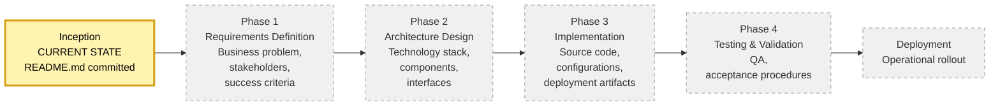

**Diagram Notes:**

- **Start point:** Inception (verified by Git commit `81723e660ea11ed4011a777851f7d46efde4a724` per §1.4).
- **End point:** Deployment (anticipated; no schedule has been committed per §2.6.1 assumption A-004).
- **Decision diamonds:** None — the progression is sequential with no documented branching criteria.
- **System boundaries:** The boundary at Inception encompasses only the repository root and the single `README.md` file per §1.3.1.
- **User touchpoints:** The only identified contributor is `shalini690 <shalini@blitzy.io>` per §1.1.4.
- **Error states / recovery paths:** None defined.
- **Timing / SLA:** None defined — per §1.2.3 all KPI categories are recorded as Undefined.

### 4.3.2 F-001 Project Name Persistence Workflow (Sole Detailed Process Flow)

The single observable detailed process is the manual editorial action that produced the F-001 Project Name Declaration. This workflow is reconstructed from the validation rules in §2.2.2, the artifact metadata in §2.1.2, and the commit metadata in §1.4. It is presented in swim-lane form to distinguish the Contributor's actions from the Git Repository's responsibilities.

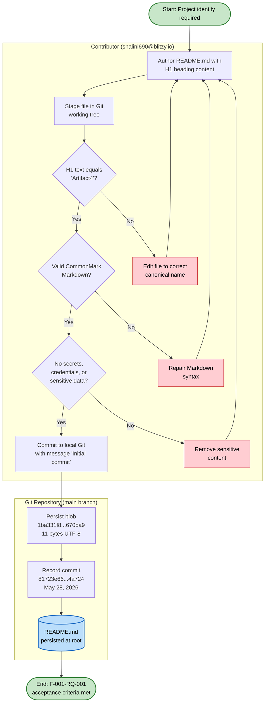

**Diagram Notes (mapping to §2.2.2 validation rules):**

- **Decision C3** enforces the business rule from §2.2.2: "The H1 heading text shall match the project's canonical name 'Artifact4' exactly."
- **Decision C4** enforces the data validation rule from §2.2.2: "The file shall be syntactically valid Markdown renderable by standard CommonMark processors."
- **Decision C5** enforces the security requirement from §2.2.2: "No secrets, credentials, tokens, or sensitive information shall be embedded in the file."
- **Authorization checkpoint:** Per §2.4.2, "access control is delegated to the Git hosting platform." No application-level authorization exists.
- **Compliance check:** Per §2.2.2, "None defined — no regulatory or contractual obligations have been declared in the repository."
- **Timing / SLA:** Not Applicable — per §2.2.2, "Performance Criteria | Not Applicable — static content with no runtime execution path."

### 4.3.3 Single-Artifact Topology (Current Workflow Surface)

The current "workflow surface" of the system consists of one isolated node corresponding to F-001 and an undefined future-state envelope, reproduced here from §2.3.3 to establish that no inter-component flows exist:

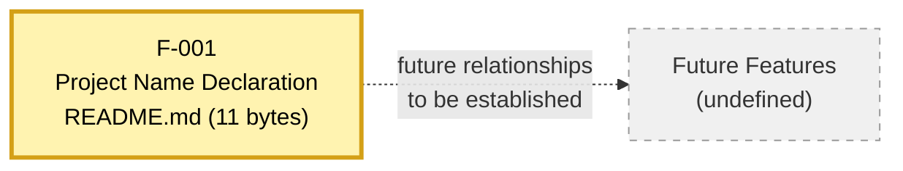

The dashed edge represents anticipated future relationships and is included solely as a structural placeholder per §1.4. No callers, callees, message producers, message consumers, or upstream/downstream systems are present.

---

## 4.4 FLOWCHART REQUIREMENTS COVERAGE

The section prompt enumerates seven elements that every major workflow flowchart must include. The table below records the present coverage of each element against repository evidence.

### 4.4.1 Element-Level Coverage Matrix

| Required Flowchart Element | Coverage in §4.3.1 (Phase Progression) | Coverage in §4.3.2 (F-001 Persistence) | Coverage Elsewhere |
|----------------------------|----------------------------------------|----------------------------------------|--------------------|
| Start and end points | Inception → Deployment (anticipated) | Start (identity required) → End (acceptance met) | None — no further workflows defined |
| Process steps | 6 sequential phases per §1.3.2 | 3 contributor steps + 3 repository steps | None |
| Decision diamonds | None (sequential) | 3 validation gates from §2.2.2 | None |
| System boundaries | Repository root per §1.3.1 | Contributor vs. Git Repository swim lanes | None |
| User touchpoints | Initial contributor per §1.1.4 | Single editorial action by initial contributor | None |
| Error states / recovery paths | None defined | Three local re-edit loops (correction paths) | None — no runtime errors possible per §2.2.2 |
| Timing / SLA considerations | None defined per §1.2.3 | Not Applicable per §2.2.2 | None |

### 4.4.2 Validation Rules

The validation rules in the table below constitute the **complete inventory** of validation logic in the repository. They are reproduced verbatim from §2.2.2 and apply exclusively to the F-001 persistence workflow depicted in §4.3.2.

| Rule Category | Rule (per §2.2.2) | Enforcement Point in §4.3.2 |
|---------------|-------------------|------------------------------|
| Business Rule | "The H1 heading text shall match the project's canonical name 'Artifact4' exactly" | Decision diamond C3 |
| Data Validation | "The file shall be syntactically valid Markdown renderable by standard CommonMark processors" | Decision diamond C4 |
| Security | "No secrets, credentials, tokens, or sensitive information shall be embedded in the file" | Decision diamond C5 |
| Authorization Checkpoint | "access control is delegated to the Git hosting platform" (per §2.4.2) | Implicit — handled outside the workflow boundary |
| Regulatory Compliance | "None defined — no regulatory or contractual obligations have been declared in the repository" (per §2.2.2) | Not Applicable |

No other validation rules exist in the repository. Per §2.2.3, the requirement domains that would introduce additional validation rules — Business Process Requirements, User Interaction Requirements, Data Management Requirements, Integration & Interface Requirements, Performance & Capacity Requirements, Security & Privacy Requirements, Operational & Observability Requirements, and Test & Acceptance Requirements — are all recorded as Not Defined.

### 4.4.3 Timing and SLA Considerations

Per §2.2.2, performance criteria are "Not Applicable — static content with no runtime execution path." Per §2.4.2, "Performance Requirements | Not Applicable — static content with no runtime behavior or measurable performance dimensions." Per §2.4.3, throughput, latency, and scalability targets are all "Not Determinable" pending the blocking decisions enumerated there. Per §1.2.3 (referenced in §2.4.3), all KPI categories — Functional Performance, Operational Quality, User Adoption, and Business Outcomes — are recorded as Undefined.

Consequently, no SLA timing annotations can be placed on any of the diagrams in §4.3 without violating constraint C-002.

---

## 4.5 TECHNICAL IMPLEMENTATION

### 4.5.1 State Management

#### State Transitions

The only state transition observable in the repository is the binary persistence state of the F-001 artifact: prior to commit `81723e660ea11ed4011a777851f7d46efde4a724`, the README.md did not exist in version control; after the commit, it persists as the Git blob `1ba331f8f068747f5b14cd44441a416c93670ba9` per §1.4. This minimal state model is the only state diagram that can be honestly produced from repository evidence:

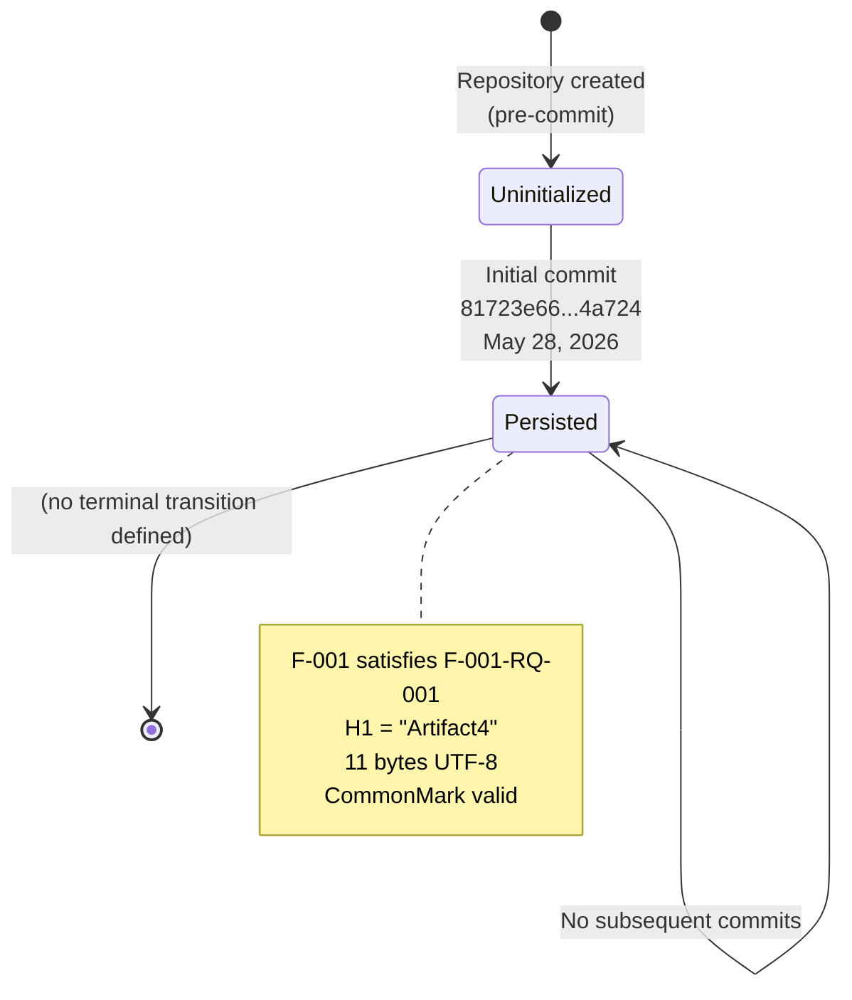

No application-level state machines exist. Per §2.4.3, the Authentication and Authorization Model is "Not Determinable" (security architecture not defined), and no session, workflow, or domain-state models are committed.

#### Data Persistence Points

The only data persistence point in the repository is the Git object database. Per §2.4.3, the broader "Data Persistence and Retention" consideration is "Not Determinable" because the "Persistence strategy not selected." Per §1.3.2, "All databases, schemas, storage mechanisms, and data access layers" are out-of-scope. No databases, no key-value stores, no document stores, no blob stores, no file storage systems, and no message persistence layers are declared.

#### Caching Requirements

No caching requirements are defined. Per §3.1 (Technology Stack Status), no infrastructure has been declared, which includes the absence of any caching layer (in-process, distributed, edge, or CDN). Per §3.9 (Technology Stack Inventory Summary), the Default Technology Stack is recorded as non-adopted due to constraint C-002.

#### Transaction Boundaries

No transaction boundaries are defined. Because no database connectivity exists per §3.7 (Databases and Storage) and no service framework exists per §3.4 (Frameworks and Libraries), no ACID transactions, no saga orchestrations, no two-phase commit protocols, and no idempotency contracts can be documented.

#### State Management Inventory

| State Management Aspect | Defined Items | Authoritative Source |
|-------------------------|---------------|----------------------|
| Application State Machines | 0 | §2.4.3 |
| Session State Models | 0 | §2.4.3 |
| Domain Entity Lifecycles | 0 | §1.3.1 (no data domains) |
| Persistence Points | 1 (Git object database) | §1.4 |
| Cache Tiers | 0 | §3.1 |
| Transaction Scopes | 0 | §3.7 |

### 4.5.2 Error Handling

Per §2.2.2, the F-001 artifact is "static content with no runtime execution path." There is no runtime within which errors could be generated, observed, retried, or recovered. Each error-handling category required by the section prompt is therefore recorded as Not Defined with the relevant authoritative source.

#### Error Handling Status Matrix

| Error Handling Category | Status | Authoritative Source | Anticipated Phase per §1.3.2 |
|-------------------------|--------|----------------------|------------------------------|
| Retry Mechanisms | Not Defined — no executable code exists | §3.4 (no framework declared) | Phase 3 — Implementation |
| Fallback Processes | Not Defined — no services to fall back from | §2.3.2 (zero components/services) | Phase 2 — Architecture |
| Circuit Breaker Patterns | Not Defined — no integrations to protect | §2.3.2 | Phase 2 — Architecture |
| Error Notification Flows | Not Defined — no observability library | §3.4 | Phase 3 — Implementation |
| Dead-Letter Queues | Not Defined — no message infrastructure | §3.4 | Phase 2 — Architecture |
| Compensating Transactions | Not Defined — no transaction boundaries | §3.7 | Phase 2 — Architecture |
| Recovery Procedures | Not Defined — Operational & Runbook Requirements "Not Determinable" | §2.4.3 | Phase 3 — Implementation |
| Incident Response Runbooks | Not Defined — hosting environment not selected | §2.4.3 | Phase 3 — Implementation |

The only "recovery path" documented in the repository is the local re-edit loop in the F-001 persistence workflow (§4.3.2), where a contributor whose edit fails any of the three validation gates returns to the authoring step to correct the file before re-attempting the commit. This is an editorial process, not a runtime error-handling mechanism.

---

## 4.6 REQUIRED DIAGRAMS — STATUS REGISTRY

The section prompt requires five Mermaid diagram families. The table below records which of these can be honestly produced today and which are deferred pending the specification revision triggers in §4.7.

### 4.6.1 Diagrams Currently Producible

| Required Diagram Family | Produced In | Evidence Basis |
|-------------------------|-------------|----------------|
| High-level system workflow | §4.3.1 | §1.1.2 phase progression; §1.3.2 four-phase table |
| Detailed process flow for each core feature | §4.3.2 (F-001 only; the sole feature per §2.1.2) | §2.2.2 validation rules; §1.4 commit metadata |
| State transition diagram | §4.5.1 | §1.4 commit metadata (binary persistence state) |
| Single-artifact topology | §4.3.3 | §2.3.3 |

### 4.6.2 Diagrams Pending Future Phases

The following diagram families cannot be produced today because the underlying artifacts do not exist. Each row identifies the trigger from §4.7.1 that would unlock the diagram and the anticipated phase per §1.3.2.

| Required Diagram Family | Blocking Absence | Unlocking Trigger (per §4.7.1) | Anticipated Phase (per §1.3.2) |
|-------------------------|------------------|--------------------------------|-------------------------------|
| Detailed process flows for additional features | Zero features beyond F-001 (§2.1.1) | A feature is implemented in source code with workflow logic | Phase 3 — Implementation |
| Error handling flowcharts | No runtime, no observability (§3.4) | Error handling or retry logic is committed | Phase 3 — Implementation |
| Integration sequence diagrams | Zero integration points (§2.3.2) | An integration point is declared in a manifest | Phase 2 — Architecture |
| Multi-state state machines (beyond persistence binary) | No application state machine exists (§2.4.3) | A state machine or workflow library is incorporated | Phase 2 — Architecture |
| Swim-lane diagrams across multiple systems | Only one actor and one repository (§1.1.4, §1.3.1) | A second system, service, or actor is declared in committed artifacts | Phase 2 — Architecture |
| Timing / SLA-annotated diagrams | No KPIs defined (§1.2.3); no performance criteria (§2.2.2) | SLAs or performance KPIs are documented in committed artifacts | Phase 1 — Requirements |

---

## 4.7 SPECIFICATION REVISION TRIGGERS FOR SECTION 4

### 4.7.1 Triggering Events

Per the precedent established in §2.6.3 and §3.10.1, this Process Flowchart section shall be revised when any of the following events become observable in the repository or in companion governance artifacts. Each trigger is paired with the Section 4 subsection(s) it would unlock.

| Trigger Event | Effect on Section 4 |
|---------------|---------------------|
| A feature is implemented in source code with workflow logic | Populate §4.2.1 (Core Business Processes) and §4.6.2 (detailed feature flows) |
| An integration point is declared in a manifest or configuration file | Populate §4.2.2 (Integration Workflows) and §4.6.2 (integration sequence diagrams) |
| A state machine, workflow library, or orchestrator is incorporated | Populate §4.5.1 (State Management) and §4.6.2 (state diagrams) |
| Error handling or retry logic is committed | Populate §4.5.2 (Error Handling) and §4.6.2 (error flowcharts) |
| A logging, observability, or telemetry library is declared | Populate §4.5.2 (Error Notification Flows) |
| A user persona, journey, or use case is committed | Populate §4.2.1 (End-to-End User Journeys) |
| An SLA, KPI, or performance criterion is documented | Populate §4.4.3 (Timing and SLA Considerations) |
| A business rule, regulatory obligation, or compliance checkpoint is declared | Populate §4.4.2 (Validation Rules) beyond the F-001 set |
| A scheduler, cron job, or batch orchestrator is configured | Populate §4.2.2 (Batch Processing Sequences) |
| A second system, service, or actor is introduced to committed artifacts | Populate cross-system swim-lane diagrams in §4.6.2 |

### 4.7.2 Anticipated Phase Alignment

Per the four-phase progression in §1.3.2 (cross-referenced via §3.10.2), Section 4 content is anticipated to populate as follows:

| Phase | Activity (per §1.3.2) | Expected Section 4 Impact |
|-------|----------------------|---------------------------|
| Phase 1 — Requirements | Define business problem, stakeholders, and success criteria | Populates §4.2.1 (user journeys), §4.4.2 (business rules), §4.4.3 (SLA targets) |
| Phase 2 — Architecture | Select technology stack, design components, and define interfaces | Populates §4.2.2 (integration workflows), §4.5.1 (state management), §4.5.2 (fallback patterns) |
| Phase 3 — Implementation | Develop source code, configurations, and deployment artifacts | Populates §4.2.1 (decision logic), §4.5.2 (retry and recovery procedures), §4.6.1 (detailed feature flows) |
| Phase 4 — Validation | Establish testing, quality assurance, and acceptance procedures | Populates §4.4.2 (validation rules) and §4.5.2 (incident response runbooks) |

### 4.7.3 Stability of Currently Documented Diagrams

Until at least one of the triggers in §4.7.1 is observed in the repository, the four diagrams currently produced in §4.3 and §4.5 remain stable: the project lifecycle phase progression in §4.3.1, the F-001 persistence swim-lane workflow in §4.3.2, the single-artifact topology in §4.3.3, and the binary persistence state machine in §4.5.1. All other diagram families will continue to be recorded as deferred in conformance with §1.4, §2.6.2 (C-001 and C-002), and §1.3.2.

---

#### References

#### Files Examined

- `README.md` — The sole file in the repository (11 bytes, 1 line, content `# Artifact4`). Provides the only verifiable workflow output (F-001 artifact) referenced throughout this section.

#### Folders Examined

- `/` (repository root) — Confirmed to contain exactly one file (`README.md`) and the standard `.git/` metadata directory. No subdirectories exist, confirming that no source modules, configuration directories, workflow definitions, or integration manifests are present.

#### Repository Metadata Referenced

- Git commit `81723e660ea11ed4011a777851f7d46efde4a724` (May 28, 2026, authored by shalini690 <shalini@blitzy.io>) — The evidentiary anchor for the F-001 persistence workflow depicted in §4.3.2 and the state-transition event depicted in §4.5.1.
- Git blob `1ba331f8f068747f5b14cd44441a416c93670ba9` — The persisted content of the F-001 artifact.
- Git branch structure — Only the `main` branch exists; no tags are defined. Confirms the absence of release-management workflows.

#### Technical Specification Cross-References

- §1.1 EXECUTIVE SUMMARY — Source of the project lifecycle phase progression reproduced in §4.3.1 and the verified Inception state. Authoritative basis for §4.1.1 and §4.3.1.
- §1.2 SYSTEM OVERVIEW — Source of the absence statements regarding integration points (§1.2.1), system components (§1.2.2), and KPI categories (§1.2.3). Authoritative basis for §4.2.2 and §4.4.3.
- §1.3 SCOPE — Source of the comprehensive out-of-scope categorization (application logic, UI, data persistence, integrations, infrastructure, security, testing, build tooling) and the four-phase progression. Authoritative basis for §4.2 and §4.7.2.
- §1.4 SPECIFICATION INTERPRETATION GUIDANCE — Source of the interpretive convention that "Not Defined" is factual content, the verbatim Git commit hash, and verification activities. Authoritative basis for §4.1.1 and §4.1.3.
- §2.1 FEATURE CATALOG — Source of the F-001 metadata (project identity artifact, completed status, no prerequisites, no integrations) and the verified count of zero software features. Authoritative basis for §4.2.1 and §4.3.2.
- §2.2 FUNCTIONAL REQUIREMENTS TABLE — Source of the F-001-RQ-001 validation rules (business rule, data validation, security, compliance) reproduced as decision diamonds in §4.3.2 and inventoried in §4.4.2. Authoritative basis for §4.4 and §4.3.2.
- §2.3 FEATURE RELATIONSHIPS — Source of the zero-relationship inventory and the single-artifact topology diagram reproduced in §4.3.3. Authoritative basis for §4.2.1, §4.2.2, and §4.3.3.
- §2.4 IMPLEMENTATION CONSIDERATIONS — Source of the "Considerations Not Yet Determinable" table mapping blocking decisions (authentication, persistence, runbooks) to absent workflow elements. Authoritative basis for §4.5.1 and §4.5.2.
- §2.6 ASSUMPTIONS AND CONSTRAINTS — Source of governing constraints C-001 through C-004 reproduced in §4.1.2 and the Specification Revision Triggers pattern reused in §4.7.1.
- §2.7 RELATED PROCESS REFERENCES — Source of the directive that Section 4 inherits, namely that no process flowcharts exist beyond the §1.1.2 phase progression. Authoritative basis for §4.1.3.
- §3.1 TECHNOLOGY STACK STATUS — Source of the no-infrastructure determination affecting §4.5.1 (caching) and §4.5.2 (observability).
- §3.4 FRAMEWORKS AND LIBRARIES — Source of the "Logging / Observability Library | Not Defined" determination affecting §4.2.1 (error handling paths) and §4.5.2 (error notification flows).
- §3.7 DATABASES AND STORAGE — Source of the no-persistence determination affecting §4.5.1 (transaction boundaries).
- §3.8 DEVELOPMENT AND DEPLOYMENT — Source of the no-build-tooling determination affecting §4.2.2 (batch processing sequences).
- §3.10 SPECIFICATION REVISION TRIGGERS FOR THIS SECTION — Pattern source for §4.7.1 and §4.7.2 (trigger table and phase-alignment table).

# 5. System Architecture

## 5.1 ARCHITECTURE STATUS AND INTERPRETIVE FRAMEWORK

### 5.1.1 Current Architectural State

The Artifact4 repository is in the **Inception phase** of its lifecycle (per §1.1.2). The complete materialized state consists of exactly one committed artifact — `README.md` (11 bytes, single line `# Artifact4`) — together with the standard Git metadata directory. No source code, manifests, configuration files, infrastructure declarations, or deployment artifacts have been committed. Consequently, there is no architecture style to characterize, no components to enumerate beyond the single F-001 artifact, no data flows to trace, no integrations to describe, no technology stack to depict, and no operational concerns to address.

This section therefore serves a different purpose than is typical of a "System Architecture" chapter. Rather than describing an architecture that exists, it documents — exhaustively and with full traceability to repository evidence — the verified absence of architecture across every category required by the section prompt. This treatment is consistent with the convention established in §1.4 and applied throughout Sections 2, 3, and 4.

### 5.1.2 Governing Constraints (Restated)

The following constraints from §2.6.2 govern every statement in this section. They are restated here because they are the central architectural rationale for the "Not Defined" dispositions that follow:

| Constraint ID | Statement |
|---------------|-----------|
| C-001 | All documented features and requirements must be grounded in artifacts committed to version control |
| C-002 | The specification shall not infer features, technology choices, or business goals that lack repository evidence |
| C-003 | The current materialized scope is limited to a project identity declaration; all other capabilities are out-of-scope until formally defined |
| C-004 | Feature relationships shall be documented only when clearly evident in committed requirements or source code |

### 5.1.3 Interpretive Convention

Per §1.4, statements of "Not Defined," "Not Determinable," or "None Present" appearing throughout this section are **factual descriptions of repository content**, not omissions from the documentation. Every such statement is paired with an authoritative reference to the section establishing the underlying absence and, where applicable, the blocking decision that prevents resolution.

The remainder of Section 5 follows the structure required by the section prompt: high-level architecture (§5.2), component details (§5.3), technical decisions (§5.4), and cross-cutting concerns (§5.5), followed by specification revision triggers (§5.6).

---

## 5.2 HIGH-LEVEL ARCHITECTURE

### 5.2.1 System Overview

#### 5.2.1.1 Architecture Style and Rationale

No architecture style has been declared. Per §1.2.2, the repository contains "no deployment model (e.g., monolith, microservices, serverless)." Per §3.1, no technology stack has been selected. Per §2.4.3, the deployment-model, build-mechanism, hosting, persistence, and security architecture decisions are all recorded as "Not Determinable," each blocking the derivation of an architecture style.

The rationale for the absence is not a documentation gap but an explicit project posture: per §1.3.2 the Inception phase produces only a project identity declaration, and per §2.6.2 Constraint **C-002** "the specification shall not infer features, technology choices, or business goals that lack repository evidence." Substantive architectural content will be populated during **Phase 2 — Architecture Design** (per §1.3.2), at which point a style (monolith, modular monolith, microservices, serverless, event-driven, etc.) will be selected and recorded.

#### 5.2.1.2 Architectural Principles and Patterns

No architectural principles or patterns are committed. The only principle currently in force is the procedural discipline encoded by constraints **C-001 through C-004** in §2.6.2 — namely that all architectural statements must be evidence-grounded and that the specification shall not extrapolate beyond committed artifacts. This is a **specification-authorship principle**, not a system-design principle.

#### 5.2.1.3 System Boundaries

The verifiable system boundary at Inception encompasses only the repository root and the single `README.md` file, per §1.3.1. No process boundaries, network boundaries, security perimeters, trust zones, or deployment-environment boundaries are defined.

#### 5.2.1.4 Major Interfaces

No major interfaces exist. Per §1.2.1, no integration points are present. Per §2.3.2, the repository contains zero internal integration points, zero external integration points, zero shared components, and zero cross-cutting concerns. The only interaction surface is the editorial act of committing the `README.md` artifact, which is described as a process (not an interface) in §4.3.2.

### 5.2.2 Core Components Table

Only two items meet the evidentiary threshold to appear as "components" — and even then, neither is a software component in the conventional sense. They are listed below for completeness; all other component categories are deferred to Phase 2 per §2.3.2 (zero components/services).

| Component Name | Primary Responsibility | Key Dependencies | Critical Considerations |
|----------------|------------------------|------------------|-------------------------|
| `README.md` (F-001 artifact) | Declare the project's canonical name "Artifact4" via a single H1 heading | CommonMark-compatible Markdown renderer; the Git object database holding blob `1ba331f8...670ba9` | Must satisfy F-001-RQ-001 acceptance criteria per §2.2.2; static content with no runtime behavior |
| Git Repository (main branch) | Persist the `README.md` blob and its commit history | Local Git tooling on the contributor machine; the unspecified Git hosting platform referenced in §2.4.2 | Single commit `81723e66...4a724` (May 28, 2026); access control is delegated to the hosting platform per §2.4.2 |

**Integration Points** for both rows are recorded as **None** per §1.2.1 and §2.3.2 and have therefore been omitted from the table to preserve the four-column constraint required by the section prompt.

### 5.2.3 Data Flow Description

#### 5.2.3.1 Primary Data Flows Between Components

No inter-component data flows exist because only one artifact (the `README.md` file) and its hosting repository are present. Per §2.3.2 the count of feature-to-feature relationships is zero, and per §4.2 there are "zero core business processes, zero integration workflows, zero data flows, zero API interactions, zero events, zero batch jobs." Consequently no runtime data path can be drawn between components.

The only observable "flow" in the repository is the **editorial action** documented in §4.3.2 — a contributor authors `README.md`, validates it against three acceptance gates (canonical-name match, CommonMark validity, absence of secrets), and commits it to the Git object store. This is a one-time human-driven workflow, not an application data flow, and it is reproduced as a sequence diagram in §5.3.5 of this section.

#### 5.2.3.2 Integration Patterns and Protocols

No integration patterns or protocols are defined. Per §1.2.1 the integration topology is empty; per §3.4 no framework or library has been selected (including transport, RPC, messaging, or streaming libraries); per §3.6 no third-party services are declared. Synchronous request/response, asynchronous messaging, event streaming, publish/subscribe, and webhook patterns are all categorically absent.

#### 5.2.3.3 Data Transformation Points

No data transformation points exist. Per §2.2.2 the F-001 artifact is "static content with no runtime execution path." There are no parsers, serializers, validators, mappers, projectors, or enrichers committed to the repository.

#### 5.2.3.4 Key Data Stores and Caches

Only one data store is observable: the **Git object database**, which holds the single blob `1ba331f8f068747f5b14cd44441a416c93670ba9` (11 bytes, UTF-8). Per §4.5.1, this is the sole "Data Persistence Point" in the repository. No application databases, key-value stores, document stores, blob stores, search indices, message brokers, or file-storage systems are declared. Per §4.5.1 the number of cache tiers is zero — no in-process, distributed, edge, or CDN caches are configured because no infrastructure has been declared in §3.1.

### 5.2.4 External Integration Points

Per §1.2.1 and §2.3.2, zero external integration points are present. The required table is preserved below for structural completeness and to make the absence explicit:

| System Name | Integration Type | Protocol / Format | SLA Requirements |
|-------------|------------------|-------------------|------------------|
| None Defined | Not Applicable | Not Applicable | Not Applicable |

**Data Exchange Pattern** is also Not Applicable for the same reasons and has been omitted to preserve the four-column constraint.

Per §1.3.2, "All external APIs, third-party services, and inter-system communication" are explicitly out-of-scope at the current revision. External integration content will be authored during Phase 2 — Architecture Design.

---

## 5.3 COMPONENT DETAILS

Per §1.2.2 "No system components are present in the repository," and per §2.3.2 the component count is zero. The two items detailed below are the only entities in the repository that can be described under the "component" rubric — and each is qualified accordingly.

### 5.3.1 README.md (the F-001 Artifact)

#### 5.3.1.1 Purpose and Responsibilities

The `README.md` file is the sole materialization of feature F-001 (Project Name Declaration). Its single responsibility, as established in §2.2.2 by requirement F-001-RQ-001, is to persist the project's canonical name "Artifact4" as a top-level Markdown heading visible both in raw text and when rendered by any CommonMark-compatible processor.

#### 5.3.1.2 Technologies and Frameworks Used

The only technologies relevant to this artifact are those observable in §3.2 — CommonMark-compatible Markdown (UTF-8 encoding) for the file format, evidenced by the `.md` extension and the H1 heading syntax. No framework is involved, and no version pinning is applied per §3.9.1.

#### 5.3.1.3 Key Interfaces and APIs

None. The file is static content with no API surface. Per §2.2.2 and §4.5.1, there is no runtime execution path through which an interface could be exposed.

#### 5.3.1.4 Data Persistence Requirements

The artifact is persisted as blob `1ba331f8f068747f5b14cd44441a416c93670ba9` in the Git object database, attached to commit `81723e660ea11ed4011a777851f7d46efde4a724` per §1.4. No additional persistence tier (database, cache, object store) is engaged.

#### 5.3.1.5 Scaling Considerations

**Not Applicable.** Per §2.4.2, performance and scalability requirements are not applicable because the artifact is "static content with no runtime behavior or measurable performance dimensions."

### 5.3.2 Git Repository (Version Control)

#### 5.3.2.1 Purpose and Responsibilities

The Git repository (single `main` branch with one commit and no tags per §1.4) is responsible for storing the `README.md` blob, preserving its commit history, and exposing it to contributors via standard Git tooling.

#### 5.3.2.2 Technologies and Frameworks Used

Git distributed version control, observable from the `.git/` metadata directory per §3.2. No framework is layered atop Git in the repository.

#### 5.3.2.3 Key Interfaces and APIs

The Git protocol (HTTPS/SSH/local) is the conventional interface for interacting with any Git repository, but no hosting endpoint, remote, or access-control configuration is committed to this repository. Per §2.4.2, access control is delegated to whatever Git hosting platform ultimately serves the repository.

#### 5.3.2.4 Data Persistence Requirements

Persistence is supplied by the `.git/` metadata directory at the repository root. Per §4.5.1, the Git object database is the only declared persistence point.

#### 5.3.2.5 Scaling Considerations

**Not Applicable.** A single 11-byte blob within a single commit on a single branch does not exercise any of Git's scalability dimensions (object count, pack size, fan-out, large-file handling, mono-repo concerns).

### 5.3.3 Component Interaction Diagram

The only honest component interaction diagram is the two-node topology shown below. It depicts the F-001 artifact, its persistence in the Git object database, and an explicit envelope of undefined future components retained as a structural placeholder per §1.4. No additional inter-component edges can be drawn without violating constraint **C-002**.

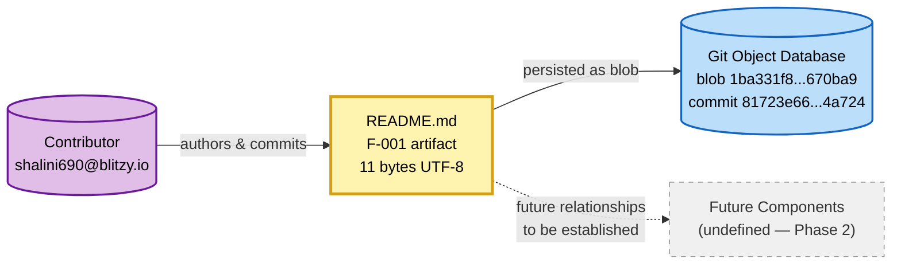

### 5.3.4 State Transition Diagram

The only state transition observable in the repository is the binary persistence transition of the F-001 artifact: it did not exist prior to commit `81723e66...4a724`, and it persists in the Git object database afterward. This diagram is reproduced from §4.5.1 because it is the only state machine currently expressible from repository evidence. No application-level state machines, session state models, or domain entity lifecycles are committed.


### 5.3.5 Sequence Diagram — F-001 Persistence Flow

The single key flow that can be honestly documented is the editorial action that produced the F-001 artifact. The sequence diagram below renders the swim-lane flow from §4.3.2 in `sequenceDiagram` form, preserving the three validation gates (canonical-name match, CommonMark validity, secret-absence) established by §2.2.2.

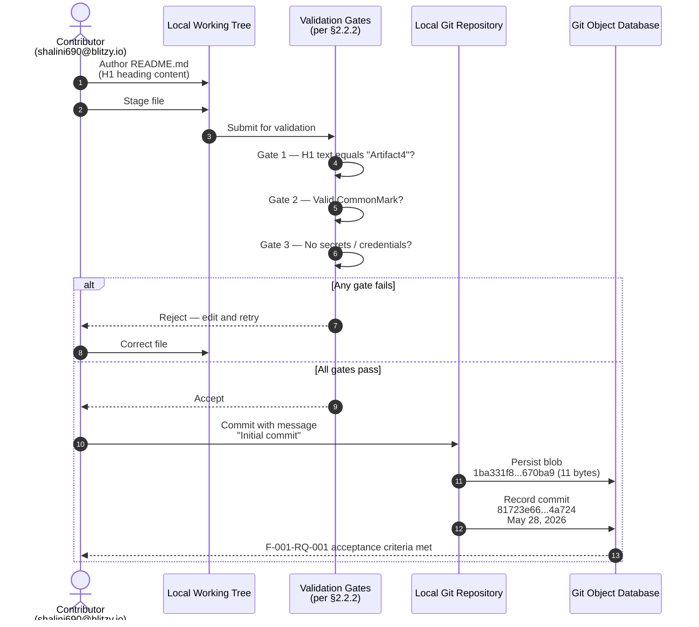

This sequence diagram is the **only key flow** the repository supports. No additional sequence diagrams (login, request handling, batch jobs, integration callbacks) can be produced because, per §4.2, no such flows exist.

---

## 5.4 TECHNICAL DECISIONS

### 5.4.1 Architecture Style Decisions and Tradeoffs

No architecture style has been chosen, and no tradeoff analysis has been performed. The status of every category required by the section prompt is summarized below; each row references the blocking decision recorded in §2.4.3 that prevents resolution.

| Architectural Decision Category | Status | Blocking Decision (per §2.4.3) |
|---------------------------------|--------|--------------------------------|
| Architecture Style (monolith / microservices / serverless / event-driven) | Not Determinable | Deployment model not declared |
| Communication Pattern (sync vs. async; REST / gRPC / messaging) | Not Determinable | No application framework declared |
| Data Storage Solution (relational / document / KV / graph) | Not Determinable | Persistence strategy not selected |
| Caching Strategy (in-process / distributed / edge / CDN) | Not Determinable | No infrastructure declared |
| Security Mechanism (transport, identity, authz model) | Not Determinable | Security architecture not defined |
| Throughput / Latency Targets | Not Determinable | No KPIs defined |
| Horizontal / Vertical Scalability Model | Not Determinable | Deployment model not declared |
| Build / Packaging / Distribution | Not Determinable | No build mechanism declared |

### 5.4.2 Communication Pattern Choices

No communication pattern has been chosen. Synchronous request/response, asynchronous messaging, event-driven, streaming, and batch patterns are all categorically unselected because no application framework, no transport library, and no message-broker dependency exist per §3.4 and §3.6. Introducing any of these patterns at the current revision would violate constraint **C-002**.

### 5.4.3 Data Storage Solution Rationale

No data storage solution has been selected. Per §3.7, "no databases, no caches, no object storage" are declared, and the Git object database (holding the 11-byte blob) is the only persistence layer observable in the repository. Per §2.4.3, the "Data Persistence and Retention" consideration is recorded as "Not Determinable" with the blocking decision "Persistence strategy not selected." A storage rationale will be authored during Phase 2 — Architecture Design once a persistence strategy is selected.

### 5.4.4 Caching Strategy Justification

No caching strategy is justified because no caching layer exists. Per §4.5.1, the cache-tier count is zero. Per §3.7 and §3.1, no in-process, distributed, edge, or CDN caching infrastructure has been declared. Justification of a caching strategy presupposes (a) a workload to cache, (b) a deployment topology in which caching is meaningful, and (c) measured or estimated KPIs against which cache effectiveness can be evaluated — none of which exist per §1.2.3 and §2.4.3.

### 5.4.5 Security Mechanism Selection

No security mechanism has been selected at the application layer. Per §2.4.3, the "Authentication and Authorization Model" is recorded as "Not Determinable" with the blocking decision "Security architecture not defined." Per §3.6, no identity provider, secrets manager, key-management service, or security-monitoring service is declared.

Per §3.9.3, "the security posture of the repository is governed exclusively by the platform hosting the Git repository (which is responsible for access control to the single committed file)." Per §2.4.2, "access control is delegated to the Git hosting platform." The only currently applicable security rule, per §2.2.2, is that the file shall not contain secrets, credentials, tokens, or sensitive data — a constraint enforced at authoring time by Gate 3 of the editorial workflow in §5.3.5.

### 5.4.6 Disposition of the Default Technology Stack

Per §3.9.2, the Default Technology Stack candidate list (AWS, Docker, Terraform, GitHub Actions, Python, Flask, Auth0, MongoDB, Langchain, React, TypeScript, TailwindCSS, React-Native, Swift, Kotlin, Objective-C, ElectronJS) is **not adopted**. Each candidate lacks repository evidence and would violate constraint **C-002** if introduced. The non-adoption of these defaults is itself a technical decision and is recorded as such here for traceability.

### 5.4.7 ADR-0001 — Defer Architectural Commitments to Phase 2

The single architectural decision that can be honestly recorded from repository evidence is the implicit decision to defer all architectural commitments until Phase 2 — Architecture Design. It is recorded below in Architecture Decision Record (ADR) form.

| ADR Field | Content |
|-----------|---------|
| ADR ID | ADR-0001 |
| Title | Defer all architectural commitments until Phase 2 |
| Status | Accepted (by virtue of repository state at commit `81723e66...4a724`) |
| Context | The repository contains only F-001 (Project Name Declaration). Per §2.6.2, constraints **C-001** and **C-002** prohibit asserting features or technology choices that lack committed evidence. |
| Decision | No technology stack, communication pattern, storage technology, caching strategy, security mechanism, or deployment model shall be selected at the Inception revision. All such selections are deferred to Phase 2 per §1.3.2. |
| Consequences | Section 5 (and Sections 3 and 4) record "Not Defined / Not Determinable" across every architectural category. Substantive architectural content becomes authorable when any specification revision trigger in §5.6 fires. |
| Alternatives Considered | (a) Adopt a default stack (e.g., AWS + Python + Flask) — **rejected** because it would violate C-002 (§3.9.2). (b) Hypothesize a probable style based on the project name — **rejected** because no semantic content beyond "Artifact4" is committed. |

### 5.4.8 Decision Tree — The "Defer Until Evidence" Pattern

The decision tree below depicts the single procedure governing every architectural choice at the current revision. It is the operational form of constraint **C-002**.

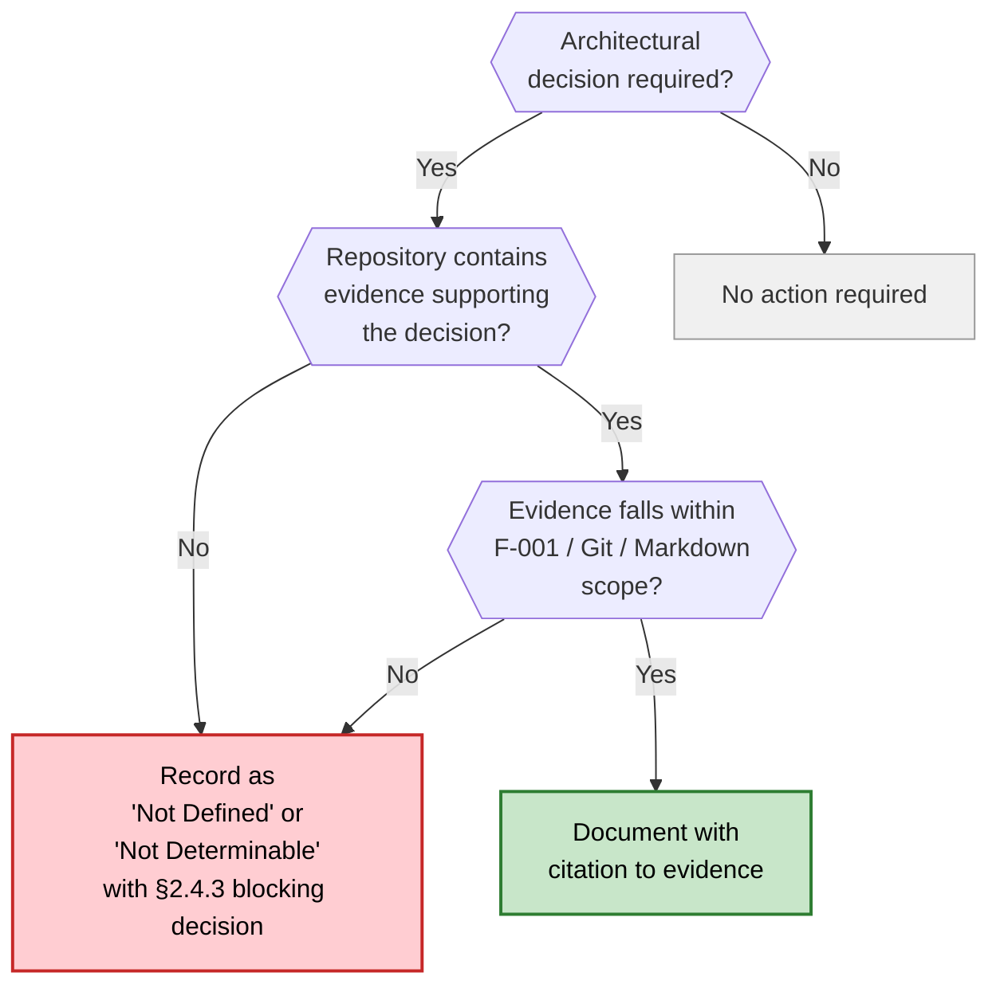

At the current revision, every architectural decision routed through this tree terminates at the **Defer** node because no evidence outside the F-001 / Git / Markdown envelope is committed.

---

## 5.5 CROSS-CUTTING CONCERNS

Per §4.5.2, every cross-cutting concern enumerated by the section prompt is recorded as "Not Defined" with the relevant authoritative source. The matrix below mirrors that finding and extends it to the additional categories required by the Section 5 prompt.

### 5.5.1 Cross-Cutting Concerns Status Matrix

| Concern | Status | Authoritative Source |
|---------|--------|----------------------|
| Monitoring / Observability Approach | Not Defined | §3.4.2 (no observability library); §3.6 (no APM or telemetry service) |
| Logging Strategy | Not Defined | §3.4.2 (no logging library) |
| Distributed Tracing Strategy | Not Defined | §3.4.2, §3.6 |
| Error Handling — Retry Mechanisms | Not Defined (no executable code) | §4.5.2 |
| Error Handling — Fallback Processes | Not Defined (no services) | §4.5.2 |
| Error Handling — Circuit Breakers | Not Defined (no integrations) | §4.5.2 |
| Error Notification Flows | Not Defined (no observability) | §4.5.2 |
| Dead-Letter Queues | Not Defined (no messaging) | §4.5.2 |
| Compensating Transactions | Not Defined (no transaction boundaries) | §4.5.2 |
| Authentication Framework | Not Determinable | §2.4.3; §3.6 |
| Authorization Framework | Not Determinable | §2.4.3 |
| Performance Requirements / SLAs | Not Applicable (static content) | §2.2.2, §2.4.2 |
| KPIs (functional, operational, adoption, business) | Undefined | §1.2.3 |
| Recovery Procedures | Not Defined | §4.5.2 |
| Incident Response Runbooks | Not Defined (hosting not selected) | §4.5.2 |
| Disaster Recovery | Not Defined | §1.3.2, §4.5.2 |

### 5.5.2 Monitoring, Observability, Logging, and Tracing

No monitoring, observability, logging, or tracing capability exists. Per §3.4.2, the Logging/Observability Library category is "Not Defined." Per §3.6.2, no Application Performance Monitoring (APM) platform, telemetry service, log-aggregation backend, error-tracking service, or distributed-tracing collector has been declared. The substrate that ordinarily emits the signals consumed by these tools — application code — does not exist per §2.2.2 ("static content with no runtime execution path").

Anticipated phase: **Phase 3 — Implementation** for emitter selection (logging library, tracing SDK, metric exporters), with collector and dashboard selections potentially commencing earlier in **Phase 2 — Architecture Design**.

### 5.5.3 Error Handling Patterns

#### 5.5.3.1 Runtime Error Handling

No runtime error handling exists because no runtime exists. The eight error-handling categories enumerated in §4.5.2 — retry, fallback, circuit breaker, error notification, dead-letter queue, compensating transactions, recovery procedures, incident runbooks — are uniformly "Not Defined." Retry policies, exponential-backoff schedules, jitter strategies, idempotency keys, and saga compensations cannot be authored against a non-existent codebase without violating constraint **C-002**.

#### 5.5.3.2 The Only Observable "Recovery Path"

The only recovery path documented in the repository is the **editorial re-edit loop** of §4.3.2 / §5.3.5: when any of the three validation gates fails, the contributor returns to the authoring step, corrects the file, and re-submits. This is explicitly an **editorial process** at authoring time, not a runtime error handler. It is rendered below for completeness and to make its scope unambiguous.

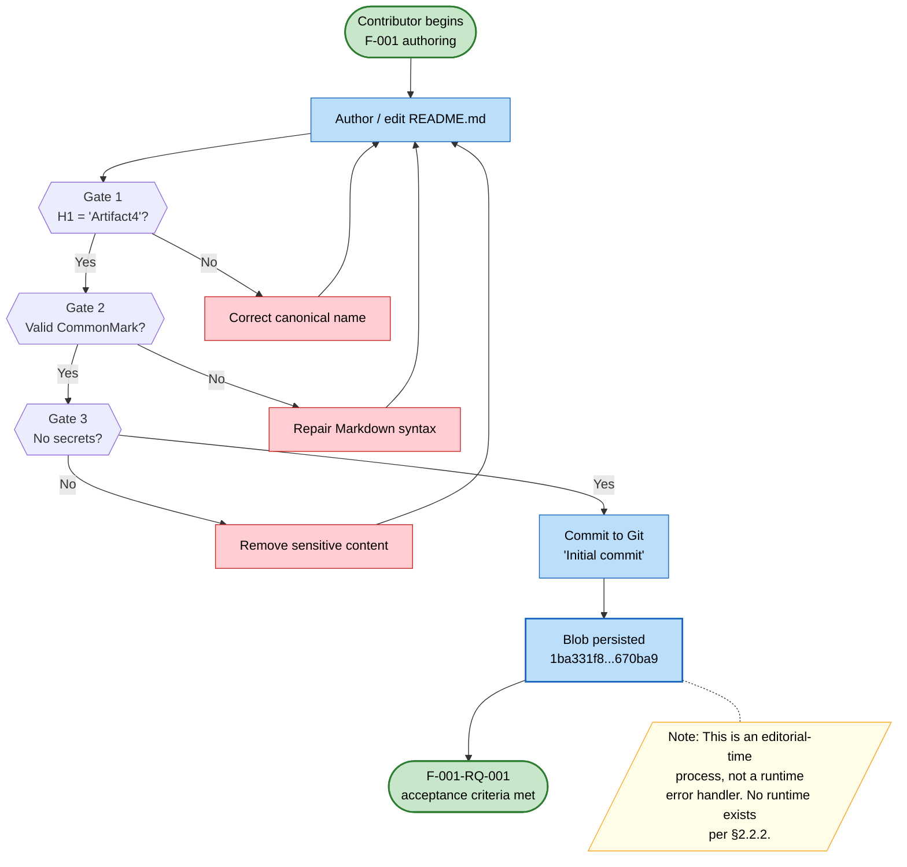

### 5.5.4 Authentication and Authorization Framework

No application-layer authentication or authorization framework has been selected. Per §2.4.3, the "Authentication and Authorization Model" is recorded as "Not Determinable." Per §3.6, no identity provider (Auth0, Cognito, Keycloak, Okta, custom IdP) and no policy-management service have been declared.

Per §2.4.2 and §3.9.3, **access control is delegated to whichever Git hosting platform ultimately hosts the repository.** No platform identity is committed to the repository (no `CODEOWNERS` file, no branch-protection rules, no required-reviewer policy), so even the delegated access-control surface is governed entirely by hosting-platform defaults at the current revision.

Anticipated phase: **Phase 2 — Architecture Design** for framework selection and trust-boundary definition.

### 5.5.5 Performance Requirements and SLAs

**No SLAs are applicable.** Per §2.4.2, performance requirements are "Not Applicable — static content with no runtime behavior or measurable performance dimensions." Per §1.2.3, all KPI categories (functional performance, operational quality, user adoption, business outcomes) are recorded as Undefined.

The only "performance"-adjacent property of the current artifact is its size (11 bytes) and the latency of a CommonMark renderer parsing a single H1 heading — neither of which constitutes a meaningful SLA. Latency targets, throughput targets, error-budget allocations, p50/p95/p99 distributions, and availability targets will be authored once a runtime workload exists, at the earliest in Phase 2 — Architecture Design.

### 5.5.6 Disaster Recovery Procedures

No disaster-recovery procedures are defined. Per §1.3.2, "all hosting, networking, deployment, and infrastructure" topics are out-of-scope at the current revision, and per §4.5.2 "Recovery Procedures" and "Incident Response Runbooks" are recorded as "Not Defined." Recovery Time Objectives (RTO), Recovery Point Objectives (RPO), backup cadence, restore drills, multi-region failover, and chaos-engineering practices are all unselected because there is no runtime system to protect.

The Git object database does provide implicit redundancy in the conventional Git sense (every clone is a full backup), but no formal redundancy policy is committed to the repository.

Anticipated phase: **Phase 3 — Implementation** (with policy framing potentially commencing in **Phase 2 — Architecture Design**).

### 5.5.7 Anticipated Phase Mapping

The matrix below maps each cross-cutting concern to the lifecycle phase from §1.3.2 during which substantive content is expected to be authored.

| Concern Cluster | Anticipated Phase per §1.3.2 |
|-----------------|------------------------------|
| Authentication / Authorization framework selection | Phase 2 — Architecture Design |
| Observability stack selection (collector / backend) | Phase 2 — Architecture Design |
| Disaster-recovery policy framing | Phase 2 — Architecture Design |
| Logging / tracing library adoption | Phase 3 — Implementation |
| Runtime retry / fallback / circuit-breaker code | Phase 3 — Implementation |
| Incident response runbook authoring | Phase 3 — Implementation |
| SLA targets and KPI definitions | Phase 1 — Requirements Definition |
| Recovery / runbook validation drills | Phase 4 — Testing & Validation |

---

## 5.6 SPECIFICATION REVISION TRIGGERS

Following the pattern established by §3.10 and §4.7, Section 5 shall be revised when any of the following events occur in the repository:

- A technology stack, framework, language runtime, or platform is selected and reflected in a committed manifest (e.g., `package.json`, `pyproject.toml`, `go.mod`, `Cargo.toml`, `pom.xml`, `build.gradle`, `Gemfile`, `composer.json`).
- A source-code artifact in any language is committed to the repository.
- A deployment artifact is committed (`Dockerfile`, `docker-compose.yml`, Kubernetes manifest, Helm chart, Terraform `.tf` file, CloudFormation template).
- A CI/CD configuration is committed (`.github/workflows/`, `.gitlab-ci.yml`, `Jenkinsfile`, `azure-pipelines.yml`, CircleCI / Travis configuration).
- An integration point is declared by configuration (API client SDK, message-broker connection string, external-service credentials, webhook handler).
- A data persistence technology is declared (database driver, ORM configuration, schema migration, connection string).
- A security mechanism is declared (identity-provider configuration, secrets-manager binding, certificate, IAM policy).
- A monitoring, logging, or tracing integration is declared (APM agent, log shipper, OpenTelemetry SDK, exporter configuration).
- An SLA target, KPI, or non-functional requirement is committed to a requirements document.
- A `CODEOWNERS`, branch-protection, or required-reviewer policy is committed to the repository.

Until at least one of these triggers fires, the dispositions recorded throughout Section 5 — "Not Defined," "Not Determinable," "Not Applicable," and the ADR-0001 deferral — remain the authoritative architectural statement for the system.

---

## 5.7 REFERENCES

#### Files Examined

- `README.md` — Sole repository artifact (11 bytes, single line `# Artifact4`); the F-001 materialization and the only evidentiary anchor for Section 5.
- `.git/` — Standard Git metadata directory; sole persistence point per §4.5.1; evidence basis for the Git Repository component documented in §5.3.2.

#### Folders Explored

- `/` (repository root) — Verified to contain exactly one file (`README.md`) and no subdirectories beyond `.git/`; basis for §5.2.1.3 system-boundary statement.

#### Technical Specification Sections Cross-Referenced

- **§1.1 EXECUTIVE SUMMARY** — Inception phase status; commit metadata cited throughout §5.2 and §5.3.
- **§1.2 SYSTEM OVERVIEW** — Absence of deployment model and integration points (cited in §5.2.1.1, §5.2.4).
- **§1.3 SCOPE** — In-scope/out-of-scope categorization; four-phase progression (cited throughout §5.4–§5.6).
- **§1.4 SPECIFICATION INTERPRETATION GUIDANCE** — Interpretive convention restated in §5.1.3; commit-hash provenance.
- **§2.1 FEATURE CATALOG** — F-001 metadata used in §5.3.1.
- **§2.2 FUNCTIONAL REQUIREMENTS TABLE** — F-001-RQ-001 acceptance criteria; three validation gates used in §5.3.5 and §5.5.3.2.
- **§2.3 FEATURE RELATIONSHIPS** — Zero-integration topology cited in §5.2.2, §5.2.3, §5.2.4.
- **§2.4 IMPLEMENTATION CONSIDERATIONS** — Blocking decisions cited throughout §5.4 (§2.4.3) and §5.5.
- **§2.6 ASSUMPTIONS AND CONSTRAINTS** — Constraints C-001 through C-004 restated in §5.1.2.
- **§3.1 TECHNOLOGY STACK STATUS** — Absence of declared technology (cited in §5.2.1.1 and §5.4.4).
- **§3.2 CURRENTLY OBSERVABLE TECHNOLOGY ELEMENTS** — CommonMark Markdown and Git as the only observable technologies (cited in §5.3.1.2 and §5.3.2.2).
- **§3.4 FRAMEWORKS AND LIBRARIES** — Absence of frameworks (cited in §5.4.2, §5.5.2).
- **§3.6 THIRD-PARTY SERVICES** — Absence of external services (cited in §5.4.5, §5.5.2, §5.5.4).
- **§3.7 DATABASES AND STORAGE** — Absence of databases/caches (cited in §5.2.3.4, §5.4.3).
- **§3.9 TECHNOLOGY STACK INVENTORY SUMMARY** — Non-adoption of Default Technology Stack (cited in §5.4.6); security-posture statement (cited in §5.5.4).
- **§4.2 SYSTEM WORKFLOWS** — Zero workflows finding (cited in §5.2.3.1).
- **§4.3 CURRENTLY VERIFIABLE PROCESSES** — F-001 swim-lane (basis for §5.3.5 sequence diagram and §5.5.3.2 error-handling flow).
- **§4.5 TECHNICAL IMPLEMENTATION** — State diagram reproduced in §5.3.4; error-handling status matrix mirrored in §5.5.

# 6. SYSTEM COMPONENTS DESIGN

## 6.1 Core Services Architecture

**Core Services Architecture is not applicable for this system.**

The Artifact4 repository, at the commit recorded in §1.1 (`81723e660ea11ed4011a777851f7d46efde4a724`, "Initial commit"), contains exactly one tracked file (`README.md`, 11 bytes, single line `# Artifact4`) and standard Git metadata. No source code, services, components, frameworks, manifests, deployment artifacts, or infrastructure-as-code descriptors have been committed. The conditional clause in the Section 6.1 prompt — *"If the system does not require microservices, distributed architecture, or distinct service components, clearly state 'Core Services Architecture is not applicable for this system' and explain why"* — applies in full.

This determination is not editorial or interpretive; it is the direct consequence of four independent findings recorded elsewhere in this specification:

1. The repository contains no system components (§1.2.2).
2. The system declares no deployment model (e.g., monolith, microservices, serverless) (§1.2.2).
3. The relationship inventory records zero common services, zero internal integration points, zero external integration points, and zero shared components (§2.3.2).
4. ADR-0001 — *Defer all architectural commitments until Phase 2* — has been recorded as Accepted by virtue of the current repository state (§5.4.7).

The remainder of this section documents (a) the governing constraints that prohibit speculative service-architecture content, (b) the disposition of each sub-topic required by the section prompt, (c) the only diagrams that can be honestly expressed against the current repository, and (d) the revision triggers and anticipated phases at which substantive Section 6.1 content will become authorable.

---

### 6.1.1 Applicability Determination

#### 6.1.1.1 Primary Repository Evidence

The materialized scope of the system at the current revision consists of a single 11-byte Markdown artifact (`README.md`) containing only the heading `# Artifact4`. This artifact is identified in §2.1 as Feature F-001 (Project Name Declaration) and is the sole feature in the catalog. Per §1.2.2, "no system components are present in the repository. There are no source code modules, service definitions, library declarations, container specifications, or infrastructure-as-code artifacts."

The repository state therefore yields the following categorical absences directly relevant to Section 6.1:

| Architectural Element | Presence in Repository | Authoritative Source |
|----------------------|------------------------|----------------------|
| Source code modules | None | §1.2.2 |
| Service definitions | None | §1.2.2, §2.3.2 |
| Communication patterns | None declared | §5.4.2 |
| Deployment model | None declared | §1.2.2, §2.4.3 |
| Hosting environment | None selected | §1.2.2, §3.6 |
| Build / packaging mechanism | None declared | §1.2.2, §3.8 |

#### 6.1.1.2 ADR-0001 — The Governing Decision

The single architectural decision honestly recorded from repository evidence is the deferral of all architectural commitments, captured as ADR-0001 in §5.4.7. The decision states that "no technology stack, communication pattern, storage technology, caching strategy, security mechanism, or deployment model shall be selected at the Inception revision. All such selections are deferred to Phase 2 per §1.3.2." The consequence is that Section 5 (and Sections 3 and 4) record "Not Defined / Not Determinable" across every architectural category — and this section (6.1) inherits that disposition by direct consequence.

#### 6.1.1.3 Disposition Vocabulary Used in This Section

This section uses the four-valued disposition vocabulary established in §1.4 and applied throughout §5.5:

| Disposition | Meaning in This Section |
|------------|--------------------------|
| **Not Defined** | The category is meaningful but no decision has been recorded in the repository |
| **Not Determinable** | A prerequisite decision (per §2.4.3) is missing, preventing this category from being resolved |
| **Not Applicable** | The category is structurally inapplicable to a static-content artifact (per §2.4.2, §5.5.5) |
| **Deferred** | The decision is explicitly postponed to a future phase per ADR-0001 (§5.4.7) |

---

### 6.1.2 Governing Constraints and Evidence Base

The constraints below, recorded in §2.6.2, prohibit the author of this section from inferring services, communication patterns, or resilience mechanisms in the absence of repository evidence. Any speculative content in Section 6.1 would directly violate one or more of these constraints.

| Constraint ID | Statement | Effect on Section 6.1 |
|--------------|-----------|----------------------|
| **C-001** | All documented features and requirements must be grounded in artifacts committed to version control | Prohibits asserting any service that is not present in a committed artifact |
| **C-002** | The specification shall not infer features, technology choices, or business goals that lack repository evidence | Prohibits inferring deployment models, communication patterns, or scalability strategies |
| **C-003** | The current materialized scope is limited to a project identity declaration; all other capabilities are out-of-scope until formally defined | Confines Section 6.1 to a "not applicable" disposition |
| **C-004** | Feature relationships shall be documented only when clearly evident in committed requirements or source code | Confines the relationship inventory in §2.3.2 to zero entries |

Per §1.3.2, the following categories are explicitly out-of-scope at the current revision and are therefore unavailable as evidence for Section 6.1: **Application Logic**, **Data Persistence**, **Integrations**, **Infrastructure**, and **Security**.

---

### 6.1.3 Service Components — Status Disposition

#### 6.1.3.1 Sub-Topic Status Matrix

Each sub-topic required by the section prompt is recorded below with its disposition and the authoritative source within this specification. The dispositions reflect the cross-cutting concerns matrix in §5.5.1 and the relationship inventory in §2.3.2.

| Sub-Topic | Disposition | Authoritative Source |
|-----------|------------|----------------------|
| Service boundaries and responsibilities | Not Defined — zero services exist | §1.2.2, §2.3.2 |
| Inter-service communication patterns | Not Determinable — no framework declared | §5.4.2, §3.4 |
| Service discovery mechanisms | Not Defined — no services to discover | §3.6 |
| Load balancing strategy | Not Defined — no runtime workload | §3.6, §5.5.5 |
| Circuit breaker patterns | Not Defined — no integrations to protect | §5.5.1, §4.5.2 |
| Retry and fallback mechanisms | Not Defined — no executable code | §5.5.1, §4.5.2 |

#### 6.1.3.2 Service Boundaries and Inter-Service Communication

No service boundaries exist because no services exist. Per §5.4.2, "no communication pattern has been chosen. Synchronous request/response, asynchronous messaging, event-driven, streaming, and batch patterns are all categorically unselected because no application framework, no transport library, and no message-broker dependency exist per §3.4 and §3.6." Introducing any service decomposition, transport protocol (REST / gRPC / GraphQL / messaging), or interaction style at the current revision would violate constraint **C-002**.

#### 6.1.3.3 Service Discovery, Load Balancing, Circuit Breakers, Retry, Fallback

These six runtime concerns are uniformly inapplicable to the current revision because they presuppose (a) a deployed runtime, (b) multiple service instances or external integrations, and (c) observable network behavior — none of which exist in the repository. Per §5.5.3.1, "no runtime error handling exists because no runtime exists. The eight error-handling categories enumerated in §4.5.2 — retry, fallback, circuit breaker, error notification, dead-letter queue, compensating transactions, recovery procedures, incident runbooks — are uniformly 'Not Defined.'"

Per §5.5.3.1, "retry policies, exponential-backoff schedules, jitter strategies, idempotency keys, and saga compensations cannot be authored against a non-existent codebase without violating constraint C-002."

#### 6.1.3.4 Current and Future Service Interaction Topology

The diagram below depicts the only service interaction that exists in the repository: the editorial-time persistence of the single `README.md` artifact into the Git object database. A dashed structural placeholder indicates where future service boundaries will be established once architectural decisions are made in Phase 2.

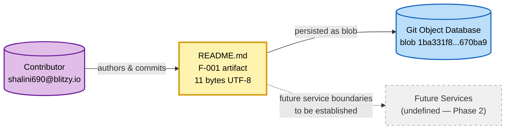

The dashed edge to *Future Services* is included as a structural placeholder consistent with the convention from §1.4 and §2.3.3; it does not assert any service-decomposition decision.

---

### 6.1.4 Scalability Design — Status Disposition

#### 6.1.4.1 Sub-Topic Status Matrix

| Sub-Topic | Disposition | Authoritative Source |
|-----------|------------|----------------------|
| Horizontal / vertical scaling approach | Not Determinable — deployment model not declared | §2.4.3, §5.4.1 |
| Auto-scaling triggers and rules | Not Defined — no infrastructure declared | §3.8, §5.4.1 |
| Resource allocation strategy | Not Defined — no hosting environment selected | §3.6, §3.8 |
| Performance optimization techniques | Not Applicable — static content with no runtime | §2.4.2, §5.5.5 |
| Capacity planning guidelines | Not Defined — no KPIs defined | §1.2.3, §5.4.1 |

#### 6.1.4.2 Horizontal / Vertical Scaling Approach

Per §5.4.1, the "Horizontal / Vertical Scalability Model" is recorded as "Not Determinable" with the blocking decision "Deployment model not declared." This blocking decision is itself recorded in §2.4.3 and propagates to every scalability sub-topic. Until a deployment model is committed to the repository (per the revision triggers in §6.1.6), no scaling approach can be selected without violating constraint **C-002**.

#### 6.1.4.3 Auto-Scaling Triggers, Resource Allocation, Capacity Planning

These three sub-topics share a common prerequisite: a hosting environment and runtime workload. Per §3.6 and §3.8, no third-party services and no deployment artifacts (`Dockerfile`, `docker-compose.yml`, Kubernetes manifest, Helm chart, Terraform `.tf` file, CloudFormation template) are present. Per §1.2.3, no Key Performance Indicators are defined — and capacity planning is meaningless absent KPIs against which capacity can be sized.

#### 6.1.4.4 Performance Optimization — Categorical Inapplicability

This sub-topic warrants explicit emphasis because its disposition is **Not Applicable** (a stronger statement than "Not Defined"). Per §5.5.5, "performance requirements are 'Not Applicable — static content with no runtime behavior or measurable performance dimensions.'" Per §5.3.1.5, scaling considerations for the `README.md` artifact are categorically inapplicable because the artifact is "static content with no runtime behavior or measurable performance dimensions." Per §5.3.2.5, scaling considerations for the Git Repository are inapplicable because "a single 11-byte blob within a single commit on a single branch does not exercise any of Git's scalability dimensions."

Latency targets, throughput targets, error-budget allocations, p50/p95/p99 distributions, and availability targets cannot be authored at the current revision and will be authored, at the earliest, in Phase 2 — Architecture Design.

#### 6.1.4.5 Scalability Decision Architecture — The "Defer Until Evidence" Pattern

The decision tree below, adapted from §5.4.8, depicts the single procedure governing every scalability and service-architecture choice at the current revision. It is the operational form of constraint **C-002** as it applies to Section 6.1.

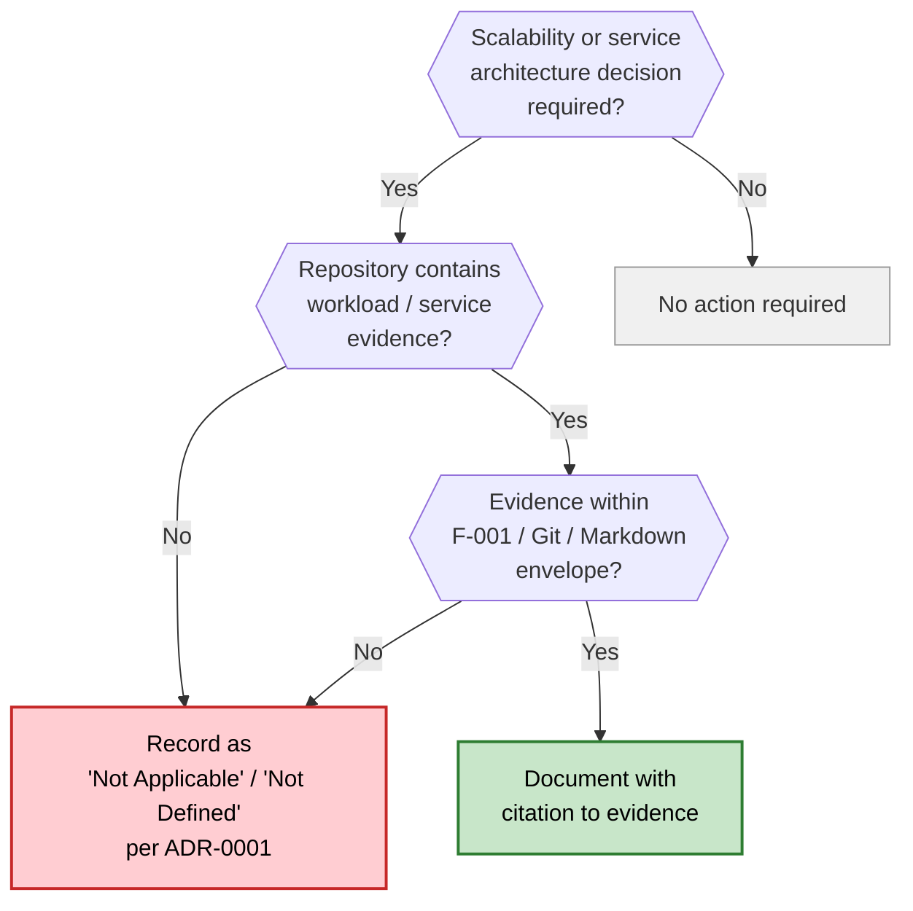

At the current revision, every decision routed through this tree terminates at the **Defer** node because no evidence outside the F-001 / Git / Markdown envelope is committed.

---

### 6.1.5 Resilience Patterns — Status Disposition

#### 6.1.5.1 Sub-Topic Status Matrix

| Sub-Topic | Disposition | Authoritative Source |
|-----------|------------|----------------------|
| Fault tolerance mechanisms | Not Defined — no runtime exists | §5.5.3.1, §4.5.2 |
| Disaster recovery procedures | Not Defined | §5.5.6, §4.5.2 |
| Data redundancy approach | Implicit Git redundancy only — no formal policy | §5.5.6 |
| Failover configurations | Not Defined — no multi-region / hosting topology | §5.5.6 |
| Service degradation policies | Not Defined — no services to degrade | §5.5.1 |

#### 6.1.5.2 Fault Tolerance Mechanisms

Per §5.5.3.1, "no runtime error handling exists because no runtime exists." The eight error-handling categories enumerated in §4.5.2 — retry, fallback, circuit breaker, error notification, dead-letter queue, compensating transactions, recovery procedures, incident runbooks — are uniformly "Not Defined." Bulkheads, timeouts, rate-limiters, graceful-degradation paths, and saga compensations are inapplicable at the current revision for the same structural reason.

#### 6.1.5.3 Disaster Recovery and Failover

Per §5.5.6, "no disaster-recovery procedures are defined." Recovery Time Objectives (RTO), Recovery Point Objectives (RPO), backup cadence, restore drills, multi-region failover, and chaos-engineering practices are all unselected because there is no runtime system to protect. Per §1.3.2, "all hosting, networking, deployment, and infrastructure" topics are out-of-scope at the current revision.

#### 6.1.5.4 Data Redundancy — The Only Implicit Property

Per §5.5.6, "the Git object database does provide implicit redundancy in the conventional Git sense (every clone is a full backup), but no formal redundancy policy is committed to the repository." This implicit property is a side-effect of using Git for version control and does not constitute a designed data-redundancy strategy. No replication factor, no consistency model, and no quorum policy is authored.

#### 6.1.5.5 Service Degradation Policies

Service degradation policies presuppose the existence of services. Per §5.5.1, error-handling fallback processes are "Not Defined (no services)." Per §2.3.2, the relationship inventory records zero services. Graceful degradation, feature toggles, kill switches, traffic shedding, and load shedding are therefore inapplicable at the current revision.

#### 6.1.5.6 The Only Observable "Recovery" Path — Editorial Re-Edit Loop

Per §5.5.3.2, "the only recovery path documented in the repository is the editorial re-edit loop of §4.3.2 / §5.3.5." This is explicitly an authoring-time editorial process, **not a runtime resilience pattern.** It is reproduced below for completeness and to make its scope unambiguous: it does not address any of the resilience concerns required by the Section 6.1 prompt (fault tolerance, disaster recovery, failover, degradation), all of which remain Not Defined.

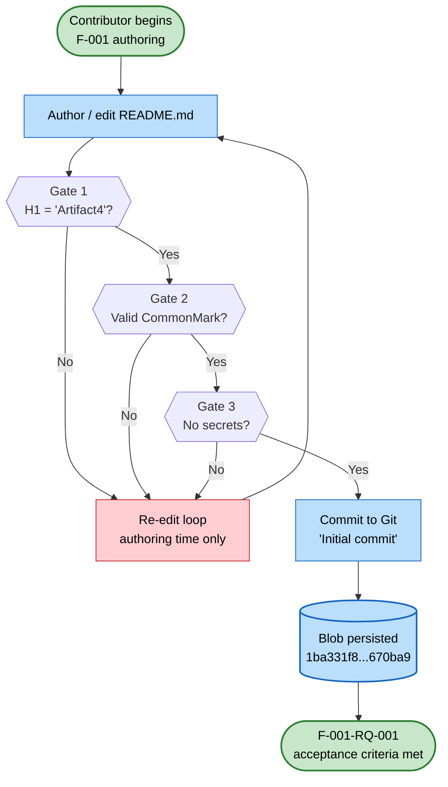

#### 6.1.5.7 Resilience Pattern Phase Progression

The diagram below shows the lifecycle progression at which each Resilience Patterns sub-topic becomes authorable. It is the visualization of §5.5.7 as it applies to Section 6.1.

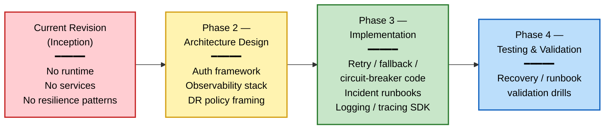

---

### 6.1.6 Specification Revision Triggers for Section 6.1

This section shall be revised (i.e., its "Not Applicable" disposition shall be reconsidered) when any of the following events occur in the repository. The trigger list is inherited from §5.6 and filtered for relevance to Core Services Architecture.

#### 6.1.6.1 Triggers That Unblock Service Components Content

| Trigger Event | Unblocks |
|--------------|----------|
| A source-code artifact in any language is committed | Service boundaries, communication patterns |
| A technology stack / framework / runtime is selected in a committed manifest (e.g., `package.json`, `pyproject.toml`, `go.mod`, `Cargo.toml`, `pom.xml`, `build.gradle`, `Gemfile`, `composer.json`) | Inter-service communication patterns |
| An integration point is declared by configuration (API client SDK, message-broker connection string, webhook handler) | Service discovery, retry / fallback / circuit breaker |
| A deployment artifact is committed (`Dockerfile`, `docker-compose.yml`, Kubernetes manifest, Helm chart) | Service decomposition, load balancing |

#### 6.1.6.2 Triggers That Unblock Scalability Design Content

| Trigger Event | Unblocks |
|--------------|----------|
| A deployment artifact or IaC template (Terraform `.tf` file, CloudFormation template) is committed | Horizontal / vertical scaling approach |
| A CI/CD configuration is committed (`.github/workflows/`, `.gitlab-ci.yml`, `Jenkinsfile`, `azure-pipelines.yml`) | Auto-scaling triggers and rules |
| An SLA target, KPI, or non-functional requirement is committed | Capacity planning, performance optimization |
| A data persistence technology is declared (database driver, ORM, schema migration, connection string) | Resource allocation, performance tiers |

#### 6.1.6.3 Triggers That Unblock Resilience Patterns Content

| Trigger Event | Unblocks |
|--------------|----------|
| A monitoring, logging, or tracing integration is declared (APM agent, log shipper, OpenTelemetry SDK) | Fault tolerance instrumentation |
| A security mechanism is declared (identity-provider configuration, secrets-manager binding, IAM policy) | Service degradation policies |
| A `CODEOWNERS`, branch-protection, or required-reviewer policy is committed | Incident response governance |
| A hosting environment commitment is reflected in IaC (multi-region or multi-AZ configuration) | Disaster recovery, failover configurations |

Until at least one of these triggers fires, the "Not Applicable" disposition recorded throughout Section 6.1 remains the authoritative architectural statement for the system, consistent with the closing directive of §5.6.

---

### 6.1.7 Anticipated Phase Mapping for Section 6.1 Topics

The matrix below maps each Section 6.1 sub-topic to the lifecycle phase from §1.3.2 during which substantive content is expected to be authored. The mapping is consistent with §5.5.7.

#### 6.1.7.1 Phase Mapping — Service Components

| Sub-Topic | Anticipated Phase |
|-----------|-------------------|
| Service boundaries and responsibilities | Phase 2 — Architecture Design |
| Inter-service communication patterns | Phase 2 — Architecture Design |
| Service discovery mechanisms | Phase 2 — Architecture Design |
| Load balancing strategy | Phase 2 — Architecture Design |
| Circuit breaker patterns | Phase 3 — Implementation |
| Retry and fallback mechanisms | Phase 3 — Implementation |

#### 6.1.7.2 Phase Mapping — Scalability Design

| Sub-Topic | Anticipated Phase |
|-----------|-------------------|
| Horizontal / vertical scaling approach | Phase 2 — Architecture Design |
| Auto-scaling triggers and rules | Phase 3 — Implementation |
| Resource allocation strategy | Phase 2 — Architecture Design |
| Performance optimization techniques | Phase 3 — Implementation |
| Capacity planning guidelines | Phase 1 — Requirements Definition (KPIs first) |

#### 6.1.7.3 Phase Mapping — Resilience Patterns

| Sub-Topic | Anticipated Phase |
|-----------|-------------------|
| Fault tolerance mechanisms | Phase 3 — Implementation |
| Disaster recovery procedures | Phase 2 — Architecture Design (policy framing) |
| Data redundancy approach | Phase 2 — Architecture Design |
| Failover configurations | Phase 2 — Architecture Design |
| Service degradation policies | Phase 3 — Implementation |

#### 6.1.7.4 Concluding Disposition

The combined effect of (a) the categorical absence of services per §1.2.2 and §2.3.2, (b) the architectural deferral encoded in ADR-0001 per §5.4.7, (c) the constraints C-001 through C-004 per §2.6.2, and (d) the cross-cutting concerns matrix per §5.5.1 is that **no element of Core Services Architecture — Service Components, Scalability Design, or Resilience Patterns — is authorable at the current revision.** The disposition will be revisited as the triggers in §6.1.6 fire and as the project progresses through the lifecycle phases of §1.3.2.

---

#### References

**Files Examined**

- `README.md` — The sole tracked artifact in the repository (11 bytes, single line `# Artifact4`). Verified as the only material evidence supporting the F-001 feature and as the basis for the categorical absence of services, components, frameworks, and infrastructure.
- `/` (repository root) — Confirmed to contain exactly one tracked file (`README.md`) and Git metadata only; no source directories, configuration folders, manifest files, or deployment artifacts exist.

**Technical Specification Sections Referenced**

- §1.1 *Executive Summary* — Establishes inception-phase status and commit metadata
- §1.2 *System Overview* — Confirms no system components, no deployment model declared, and no integration topology
- §1.3 *Scope* — Identifies Infrastructure and Integrations as out-of-scope at the current revision
- §1.4 *Specification Interpretation Guidance* — Establishes the "Not Defined / Not Determinable / Not Applicable" interpretive vocabulary
- §2.1 *Feature Catalog* — Identifies F-001 (Project Name Declaration) as the sole feature
- §2.3 *Feature Relationships* — Records zero services, zero internal/external integration points, zero shared components
- §2.4 *Implementation Considerations* — Records performance/scalability as "Not Applicable" and other domains as "Not Determinable"
- §2.6 *Assumptions and Constraints* — Source of constraints C-001 through C-004 governing this section
- §3.1 *Technology Stack Status* — Confirms no technology stack declared
- §3.4 *Frameworks and Libraries* — Confirms no application or observability frameworks
- §3.6 *Third-Party Services* — Confirms zero third-party services
- §3.8 *Development and Deployment* — Confirms no containerization, IaC, or CI/CD artifacts
- §4.5 *Technical Implementation* — Source of the eight-category error-handling status matrix
- §5.2 *High-Level Architecture* — Establishes architectural void posture
- §5.3 *Component Details* — Records README.md and Git Repository as the only "components" with "Not Applicable" scaling
- §5.4 *Technical Decisions* — Source of ADR-0001 (architectural deferral) and the "Defer Until Evidence" decision tree
- §5.5 *Cross-Cutting Concerns* — Source of the complete status matrix used in §6.1.3, §6.1.4, and §6.1.5
- §5.6 *Specification Revision Triggers* — Source of the trigger list adapted for §6.1.6

## 6.2 Database Design

**Database Design is not applicable to this system.**

The Artifact4 repository, at the commit recorded in §1.1 (`81723e660ea11ed4011a777851f7d46efde4a724`, "Initial commit"), contains exactly one tracked file (`README.md`, 11 bytes, single line `# Artifact4`) and standard Git metadata. No database technology, no persistence layer, no schema, no migration framework, no ORM configuration, no connection string, no caching tier, and no data-related artifact of any kind has been committed to version control. The conditional clause in the Section 6.2 prompt — *"If the system does not require or direct database or persistent storage interactions are not clearly evident, clearly state 'Database Design is not applicable to this system' and explain why"* — applies in full.

This determination is not editorial or interpretive; it is the direct consequence of five independent findings recorded elsewhere in this specification:

1. Per §3.7.1, "no databases, persistent stores, caching layers, or object storage services are declared, configured, or used in the Artifact4 repository."
2. Per §3.7.2, every storage category in the Storage Category Inventory (relational, document/NoSQL, key-value, in-memory cache, search index, object/blob, time-series, graph, message queue) is recorded as **Not Defined**.
3. Per §1.3.2, "Data Persistence" — encompassing "all databases, schemas, storage mechanisms, and data access layers" — is explicitly listed as out-of-scope.
4. Per §2.4.3, the "Data Persistence and Retention" consideration is recorded as **Not Determinable** with the blocking decision "Persistence strategy not selected."
5. Per §5.4.7, ADR-0001 — *Defer all architectural commitments until Phase 2* — has been recorded as Accepted, explicitly deferring storage technology selection.

The remainder of this section documents (a) the governing constraints that prohibit speculative database design content, (b) the disposition of each sub-topic required by the section prompt across Schema Design, Data Management, Compliance Considerations, and Performance Optimization, (c) the only diagrams that can be honestly expressed against the current repository, and (d) the revision triggers and anticipated phases at which substantive Section 6.2 content will become authorable.

---

### 6.2.1 Applicability Determination

#### 6.2.1.1 Primary Repository Evidence

The materialized scope of the system at the current revision consists of a single 11-byte Markdown artifact (`README.md`) containing only the heading `# Artifact4`. This artifact is identified in §2.1 as Feature F-001 (Project Name Declaration) and is the sole feature in the catalog. Per §1.3.1 (Data Domains Included), "No data domains, entity models, schemas, or information architectures are defined. The repository contains no data dictionaries, entity-relationship diagrams, or persistence schemas."

The repository state therefore yields the following categorical absences directly relevant to Section 6.2:

| Database Design Element | Presence in Repository | Authoritative Source |
|------------------------|------------------------|----------------------|
| Schema definition (`.sql`, `.prisma`, `schema.rb`, etc.) | None | §3.7.1, §3.7.2 |
| Migration scripts or framework | None | §3.7.3, §5.4.3 |
| ORM configuration | None | §3.4.2 (ORM/Data Access Layer "Not Defined") |
| Database driver dependency | None | §3.5 (no dependency manifest) |
| Connection string / configuration | None | §3.7.1 |
| Cache configuration | None | §4.5.1 (zero cache tiers) |
| Entity model / data dictionary | None | §1.3.1 |

#### 6.2.1.2 ADR-0001 — The Governing Decision

The single architectural decision honestly recorded from repository evidence is the deferral of all architectural commitments, captured as ADR-0001 in §5.4.7. The decision states that "no technology stack, communication pattern, **storage technology**, caching strategy, security mechanism, or deployment model shall be selected at the Inception revision. All such selections are deferred to Phase 2 per §1.3.2." The consequence is that Section 5.4.3 (Data Storage Solution Rationale) and Section 5.4.4 (Caching Strategy Justification) record "No data storage solution has been selected" and "No caching strategy is justified because no caching layer exists," respectively — and this section (6.2) inherits that disposition by direct consequence.

#### 6.2.1.3 The Only Observable Persistence — Git Object Database

Per §3.7.4, "the only persistent storage occurring in the current repository is the storage of the `README.md` blob (11 bytes) within the Git object database, addressed by SHA-1 hash `1ba331f8f068747f5b14cd44441a416c93670ba9`. This is metadata storage of the repository itself and is not a data-persistence layer in the application sense." Per §4.5.1, this is the sole "Data Persistence Point" in the repository.

The Git object database is a content-addressable storage subsystem internal to Git itself; it is not an application database, has no schema in the relational or document sense, accepts no queries, supports no transactions in the ACID sense, and exposes no connection protocol for application use. Treating it as a "database" for the purposes of Section 6.2 would conflate version-control metadata storage with application data persistence and would violate the documentary precision required by §1.4.

#### 6.2.1.4 Disposition Vocabulary Used in This Section

This section uses the four-valued disposition vocabulary established in §1.4 and applied throughout §5.5 and §6.1:

| Disposition | Meaning in This Section |
|------------|--------------------------|
| **Not Defined** | The category is meaningful but no decision has been recorded in the repository |
| **Not Determinable** | A prerequisite decision (per §2.4.3) is missing, preventing this category from being resolved |
| **Not Applicable** | The category is structurally inapplicable to a repository containing no databases or application data |
| **Deferred** | The decision is explicitly postponed to a future phase per ADR-0001 (§5.4.7) |

---

### 6.2.2 Governing Constraints and Evidence Base

The constraints below, recorded in §2.6.2, prohibit the author of this section from inferring schemas, entities, indexes, replication topologies, or query patterns in the absence of repository evidence. Any speculative content in Section 6.2 — including hypothetical ERDs, candidate index strategies, or assumed migration tooling — would directly violate one or more of these constraints.

| Constraint ID | Statement | Effect on Section 6.2 |
|--------------|-----------|----------------------|
| **C-001** | All documented features and requirements must be grounded in artifacts committed to version control | Prohibits asserting any entity, table, collection, or index that is not present in a committed schema or migration artifact |
| **C-002** | The specification shall not infer features, technology choices, or business goals that lack repository evidence | Prohibits inferring database engines (MongoDB, PostgreSQL, MySQL, Redis, etc.), ORM frameworks, or caching technologies |
| **C-003** | The current materialized scope is limited to a project identity declaration; all other capabilities are out-of-scope until formally defined | Confines Section 6.2 to a "not applicable" disposition for all schema, data management, compliance, and performance sub-topics |
| **C-004** | Feature relationships shall be documented only when clearly evident in committed requirements or source code | Confines the entity-relationship inventory to zero entries because no entities are committed |

Per §1.3.2, the "Data Persistence" category is explicitly out-of-scope, encompassing "all databases, schemas, storage mechanisms, and data access layers." Per §3.9.2, MongoDB is explicitly listed as **Not Adopted** with the rationale "No database driver, schema, or connection string present; introducing violates C-002." This non-adoption precedent applies to every database technology in the Default Technology Stack.

---

### 6.2.3 Schema Design — Status Disposition

#### 6.2.3.1 Schema Design Sub-Topic Status Matrix

Each sub-topic required by the Schema Design portion of the section prompt is recorded below with its disposition and the authoritative source within this specification. The dispositions reflect the storage inventory in §3.7.2 and the state-management inventory in §4.5.1.

| Sub-Topic | Disposition | Authoritative Source |
|-----------|-------------|----------------------|
| Entity relationships | Not Applicable — zero entities defined | §1.3.1, §3.7.1 |
| Data models and structures | Not Applicable — no data models exist | §1.3.1, §3.7.2 |
| Indexing strategy | Not Applicable — no database to index | §3.7.2, §5.4.3 |
| Partitioning approach | Not Applicable — no database to partition | §3.7.2, §5.4.3 |
| Replication configuration | Not Applicable — no database to replicate | §3.7.2, §5.4.3 |
| Backup architecture | Not Defined — only implicit Git redundancy observed | §5.5.6 |

#### 6.2.3.2 Entity Relationships and Data Models

No entities, aggregates, value objects, or domain models are committed to the repository. Per §1.3.1, "no data domains, entity models, schemas, or information architectures are defined." Per §4.5.1, the Domain Entity Lifecycles count is zero. Per §2.3.2, the relationship inventory records zero common services, zero internal integration points, and zero shared components.

An Entity-Relationship Diagram (ERD) is therefore inauthorable at the current revision. Authoring a hypothetical ERD — including any speculative entities such as `User`, `Account`, `Artifact`, or `Project` — would violate constraint **C-001** (no evidence in version control) and constraint **C-002** (no inferring features). The required ERD will become authorable when entity definitions are committed in any of the following forms: SQL schema (`CREATE TABLE` statements), ORM model definitions (e.g., SQLAlchemy `Model`, Django `Model`, Prisma `model`, Mongoose `Schema`, Entity Framework `DbSet`), GraphQL schema (`type` definitions), Protocol Buffer message definitions, or formal data dictionaries.

#### 6.2.3.3 Indexing, Partitioning, and Replication

These three sub-topics share a single common prerequisite: the existence of a database. Per §3.7.2, every database category (Primary Relational, Document/NoSQL, Key-Value, In-Memory Cache, Search Index, Object/Blob Storage, Time-Series, Graph, Message Queue) is recorded as Not Defined. Per §5.4.3, "no data storage solution has been selected." Consequently:

| Schema Aspect | Index Count | Constraint Count | Authoritative Source |
|---------------|-------------|------------------|----------------------|
| Primary keys | 0 | 0 | §3.7.2 |
| Foreign keys | 0 | 0 | §3.7.2 |
| Unique indexes | 0 | 0 | §3.7.2 |
| Composite indexes | 0 | 0 | §3.7.2 |
| Full-text indexes | 0 | 0 | §3.7.2 |
| Check constraints | 0 | 0 | §3.7.2 |
| Partition keys | 0 | N/A | §3.7.2 |
| Replication factor | N/A | N/A | §5.4.3 |

Partitioning strategies (horizontal sharding, vertical partitioning, range partitioning, hash partitioning, list partitioning), replication topologies (primary-replica, multi-primary, quorum-based, chain replication, gossip), and consistency models (strong, eventual, causal, read-your-writes, monotonic-read) cannot be authored at the current revision without violating constraint **C-002**. These selections will be authored during Phase 2 — Architecture Design once a persistence technology is committed.

#### 6.2.3.4 Backup Architecture — The Implicit Git Property

Per §5.5.6, "no disaster-recovery procedures are defined." Recovery Time Objectives (RTO), Recovery Point Objectives (RPO), backup cadence, point-in-time recovery (PITR), snapshot policies, cross-region replication, and restore drills are all unselected because there is no application database to back up.

Per §5.5.6, the Git object database does provide implicit redundancy in the conventional Git sense — every clone is a full backup — but no formal redundancy policy is committed to the repository. This implicit property is a side-effect of using Git for version control and does not constitute a designed backup architecture. No replication factor, no consistency model, no quorum policy, and no recovery procedure is authored.

#### 6.2.3.5 The Only Honest Storage Topology Diagram

The diagram below depicts the only persistence topology that exists in the repository: the Git object database holding a single 11-byte blob, with a structural placeholder for future application-data stores that will be defined in Phase 2. No additional storage nodes (relational primary, read replicas, cache tiers, search indices, object stores) can be drawn without violating constraint **C-002**.

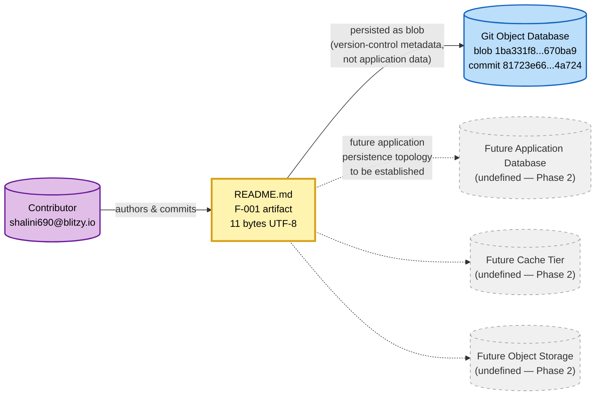

The dashed edges to the *Future* nodes are included as structural placeholders consistent with the convention from §1.4, §2.3.3, and §5.3.3; they do not assert any persistence-technology decision.

---

### 6.2.4 Data Management — Status Disposition

#### 6.2.4.1 Data Management Sub-Topic Status Matrix

| Sub-Topic | Disposition | Authoritative Source |
|-----------|-------------|----------------------|
| Migration procedures | Not Applicable — no schema to migrate | §3.7.3, §5.4.3 |
| Versioning strategy | Not Applicable — no schema to version | §3.7.3 |
| Archival policies | Not Applicable — no application data | §1.3.2 |
| Data storage and retrieval mechanisms | Not Applicable — no application data | §3.7.1, §5.2.3.4 |
| Caching policies | Not Applicable — zero cache tiers | §4.5.1, §5.4.4 |

#### 6.2.4.2 Migration Procedures and Versioning Strategy

No schema migration framework is committed to the repository. Per §3.7.3, "no data persistence strategy has been defined." Per §3.4.2, the ORM/Data Access Layer category is recorded as "Not Defined — No data layer artifact present." None of the conventional migration tooling — Flyway, Liquibase, Alembic, Django migrations, Rails ActiveRecord migrations, Knex, Prisma Migrate, Sequelize migrations, Goose, golang-migrate, EF Core migrations — has been declared in any dependency manifest. Per §3.5, no dependency manifest of any kind exists.

Schema versioning strategies (semantic versioning of schemas, forward-only migrations, expand-contract / parallel-change patterns, blue-green schema deploys, backward-compatibility windows) are inapplicable because no schema exists to be versioned. Migration procedures (idempotent migration scripts, dry-run validation, rollback procedures, online schema change tooling such as `gh-ost` or `pt-online-schema-change`) cannot be authored against a non-existent schema without violating constraint **C-002**.

#### 6.2.4.3 Archival Policies

No archival policy is defined. Per §1.3.2, "Data Persistence" — including all storage mechanisms — is explicitly out-of-scope at the current revision. Archival concerns (cold/warm/hot storage tiering, time-based partitioning for archival, archival-to-object-store pipelines, compliance-driven archival windows, archive integrity verification) presuppose the existence of operational data subject to lifecycle management. No such data exists in the repository.

#### 6.2.4.4 Data Storage and Retrieval Mechanisms

Per §5.2.3.4, "only one data store is observable: the Git object database, which holds the single blob `1ba331f8f068747f5b14cd44441a416c93670ba9` (11 bytes, UTF-8). Per §4.5.1, this is the sole 'Data Persistence Point' in the repository. No application databases, key-value stores, document stores, blob stores, search indices, message brokers, or file-storage systems are declared."

The retrieval mechanism for the single committed artifact is the standard Git protocol (e.g., `git clone`, `git fetch`, `git checkout`). This is not an application data-retrieval mechanism in the database sense; no query language (SQL, GQL, MongoQL, Cypher, SPARQL), no data access pattern (Repository, Data Mapper, Active Record, CQRS, Unit of Work), and no retrieval API (REST, GraphQL, gRPC, ODBC, JDBC) is declared.

#### 6.2.4.5 Caching Policies

Per §5.4.4, "no caching strategy is justified because no caching layer exists." Per §4.5.1, the cache-tier count is zero. Per §3.7.2, the In-Memory Cache category is recorded as Not Defined.

Cache policies (cache-aside, read-through, write-through, write-behind, refresh-ahead), eviction strategies (LRU, LFU, FIFO, ARC, TTL-based), invalidation strategies (TTL, event-driven, manual, version-keyed), and consistency models (strong, eventual, write-through guarantees) are uniformly inapplicable. Cache topologies (in-process / L1, distributed / L2, CDN / edge) are similarly absent. Per §5.4.4, justification of a caching strategy presupposes "(a) a workload to cache, (b) a deployment topology in which caching is meaningful, and (c) measured or estimated KPIs against which cache effectiveness can be evaluated — none of which exist."

---

### 6.2.5 Compliance Considerations — Status Disposition

#### 6.2.5.1 Compliance Sub-Topic Status Matrix

| Sub-Topic | Disposition | Authoritative Source |
|-----------|-------------|----------------------|
| Data retention rules | Not Applicable — no data to retain | §2.4.3, §1.3.2 |
| Backup and fault tolerance policies | Not Defined — only implicit Git redundancy | §5.5.6 |
| Privacy controls | Not Defined — no PII or application data | §1.3.2, §2.4.3 |
| Audit mechanisms | Not Defined — no observability stack | §5.5.2 |
| Access controls | Delegated to Git hosting platform | §2.4.2, §5.4.5, §5.5.4 |

#### 6.2.5.2 Data Retention Rules

No data retention rules are defined. Per §2.4.3, the "Data Persistence and Retention" consideration is recorded as Not Determinable with the blocking decision "Persistence strategy not selected." Per §1.3.2, "all databases, schemas, storage mechanisms, and data access layers" are out-of-scope.

Retention concerns — including statutory retention periods (e.g., SOX seven-year retention, HIPAA six-year retention, GDPR data-minimization), time-to-live policies, soft-delete vs. hard-delete patterns, tombstoning, and right-to-erasure workflows — are inapplicable at the current revision because no application data exists subject to retention. No regulatory jurisdiction, compliance framework, or data-classification taxonomy is declared in the repository (per §1.3.1, "Geographic coverage, market coverage, regulatory jurisdictions, and localization requirements are not defined").

#### 6.2.5.3 Backup and Fault Tolerance Policies

Per §5.5.6, "no disaster-recovery procedures are defined." No formal backup policy, restore policy, fault-tolerance design, or business-continuity plan is committed. The only redundancy in evidence is the implicit Git property described in §6.2.3.4 — every Git clone is a full backup — and this is explicitly characterized in §5.5.6 as an implicit side-effect rather than a designed policy.

Recovery Time Objectives (RTO), Recovery Point Objectives (RPO), Mean Time To Recovery (MTTR), Mean Time Between Failures (MTBF), backup cadence (continuous, hourly, daily, weekly), backup retention windows, restoration testing schedules, and chaos-engineering drills are all unselected.

#### 6.2.5.4 Privacy Controls

Per §1.3.2, "Security" — encompassing "all authentication, authorization, encryption, and audit mechanisms" — is explicitly out-of-scope at the current revision. Per §2.2.2 and §5.4.5, the only currently applicable data-content rule is that the committed file "shall not contain secrets, credentials, tokens, or sensitive data," enforced at authoring time by Gate 3 of the editorial workflow in §5.3.5.

Privacy controls applicable to a database — field-level encryption, column masking, row-level security policies, data-classification tags, PII detection and tokenization, pseudonymization, k-anonymity / l-diversity transformations, data residency enforcement — are inapplicable because (a) no database exists and (b) the single 11-byte artifact contains the static literal "Artifact4" and no personal data of any kind.

#### 6.2.5.5 Audit Mechanisms

Per §5.5.2, "no monitoring, observability, logging, or tracing capability exists." Database audit mechanisms (audit tables, audit logs, change-data-capture / CDC streams to audit sinks, query-log shipping, login auditing, privileged-access audit trails, schema-change audit) presuppose the existence of (a) a database engine to emit audit events and (b) an audit-log destination to consume them. Neither exists in the repository.

The only audit trail in evidence is the Git commit history itself, which currently consists of the single commit `81723e660ea11ed4011a777851f7d46efde4a724` (per §1.4). This is repository-metadata auditing, not application-data auditing, and the distinction is preserved in §3.7.4.

#### 6.2.5.6 Access Controls

Per §5.4.5 and §2.4.2, access control at the current revision is delegated entirely to the Git hosting platform. Per §3.9.3, "the security posture of the repository is governed exclusively by the platform hosting the Git repository (which is responsible for access control to the single committed file)." No platform identity is committed to the repository (no `CODEOWNERS` file, no branch-protection rules, no required-reviewer policy), so even the delegated access-control surface is governed entirely by hosting-platform defaults at the current revision.

Database-specific access controls — role-based access control (RBAC), attribute-based access control (ABAC), row-level security (RLS), column-level grants, schema-level grants, connection-level authentication (mTLS, SCRAM, IAM-based DB auth), service-account scoping, secrets-manager integration — are inapplicable because no database exists. These controls will become authorable when a persistence technology and a security mechanism are jointly committed (per §5.4.5 and the revision triggers in §6.2.8).

---

### 6.2.6 Performance Optimization — Status Disposition

#### 6.2.6.1 Performance Optimization Sub-Topic Status Matrix

| Sub-Topic | Disposition | Authoritative Source |
|-----------|-------------|----------------------|
| Query optimization patterns | Not Applicable — no queries exist | §3.7.2, §5.5.5 |
| Caching strategy | Not Applicable — no cache exists | §5.4.4 |
| Connection pooling | Not Applicable — no connections exist | §3.7.2, §5.4.3 |
| Read/write splitting | Not Applicable — no database exists | §5.4.3 |
| Batch processing approach | Not Applicable — no batch jobs declared | §4.2 |

#### 6.2.6.2 Query Optimization Patterns

Per §5.5.5, "no SLAs are applicable. Performance requirements are 'Not Applicable — static content with no runtime behavior or measurable performance dimensions.'" Per §3.7.2, no query engine of any kind is declared.

Query optimization patterns — query plan analysis (`EXPLAIN ANALYZE`, `EXPLAIN PLAN`), index hint usage, covering indexes, materialized views, denormalization for read performance, predicate pushdown, join order optimization, N+1 query elimination, query result memoization, prepared statement caching, parameterization — are inapplicable because no query language, no query workload, and no query execution engine is declared in the repository.

#### 6.2.6.3 Caching Strategy

Per §5.4.4 (already cited in §6.2.4.5), "no caching strategy is justified because no caching layer exists." This sub-topic is fully addressed in §6.2.4.5 and is restated here only because the Section 6.2 prompt enumerates "caching strategy" under both Data Management and Performance Optimization. The disposition is identical: **Not Applicable**.

#### 6.2.6.4 Connection Pooling

No connection pool is configured because no database connection exists. Per §3.5, no database driver is declared in any dependency manifest. Per §3.7.2, no database connection string, no connection-pool library (e.g., HikariCP, c3p0, PgBouncer, ProxySQL, RDS Proxy, node-postgres pool, SQLAlchemy QueuePool), and no connection-management framework is committed.

Connection pool tuning parameters — minimum pool size, maximum pool size, connection acquisition timeout, idle-connection eviction, leak detection threshold, prepared-statement cache size per connection, validation queries, failover endpoints — are inapplicable because no pool exists.

#### 6.2.6.5 Read/Write Splitting

Read/write splitting (also referred to as primary-replica routing, read-replica fan-out, or CQRS at the persistence layer) presupposes (a) a database with replication topology, (b) multiple replica endpoints, and (c) a routing layer (in-application, sidecar, or middleware) capable of directing reads vs. writes. None of these prerequisites exist at the current revision per §5.4.3 and §3.7.2.

Routing strategies (round-robin, least-latency, region-affinity, replica-lag-aware), consistency tradeoffs (read-your-writes guarantees, monotonic-read guarantees), and failure handling (replica fallback to primary, replica quarantine) are uniformly inapplicable.

#### 6.2.6.6 Batch Processing Approach

Per §4.2, "zero core business processes, zero integration workflows, zero data flows, zero API interactions, zero events, zero batch jobs" are declared. No batch processing framework (Spring Batch, Apache Beam, Apache Spark, Apache Flink, AWS Glue, Airflow, Luigi, Dagster, Prefect), no ETL/ELT pipeline, no bulk-load utility (`COPY`, `LOAD DATA INFILE`, `BULK INSERT`, `bcp`, `pg_bulkload`), no message-consumer batch processor, and no scheduled job (cron, systemd timer, Kubernetes CronJob) is committed.

Batch concerns — checkpointing, idempotency, exactly-once vs. at-least-once delivery, backpressure handling, dead-letter routing, retry-with-exponential-backoff, batch size tuning, parallel-shard processing — are inapplicable because no batch workload exists.

---

### 6.2.7 Honest Diagrams Against Current Repository State

This sub-section catalogs the four diagrams that can be honestly authored against current repository evidence. The Section 6.2 prompt requests three diagram categories — *Database schema diagrams* (ERD), *Data flow diagrams*, and *Replication architecture* — and explicitly notes "Include ERD diagrams." Per constraints **C-001** and **C-002**, none of these three can be authored substantively: there are no entities, no application data flows, and no replication topology to draw. The diagrams below are the only honest expressions available, and each is annotated to make its scope unambiguous.

#### 6.2.7.1 Inauthorable Diagrams (per Constraint C-002)

| Requested Diagram | Inauthorability Cause | Authoritative Source |
|-------------------|----------------------|----------------------|
| Entity-Relationship Diagram (ERD) | Zero entities defined | §1.3.1, §3.7.1 |
| Database schema diagram | Zero schemas committed | §3.7.2 |
| Application data flow diagram | Zero data flows declared | §4.2, §5.2.3.1 |
| Replication architecture diagram | Zero replication topology | §5.4.3, §3.7.2 |

#### 6.2.7.2 Persistence State Transition (the Only Data-Persistence State Machine)

The only state transition observable in the repository is the binary persistence transition of the F-001 artifact, reproduced from §4.5.1 and §5.3.4. This is the only state machine that can be expressed for a "Database Design" section because (a) it is the only persistence event in the repository's history and (b) no application-level state machines, session state models, or domain entity lifecycles are committed (per §4.5.1, all counts are zero).

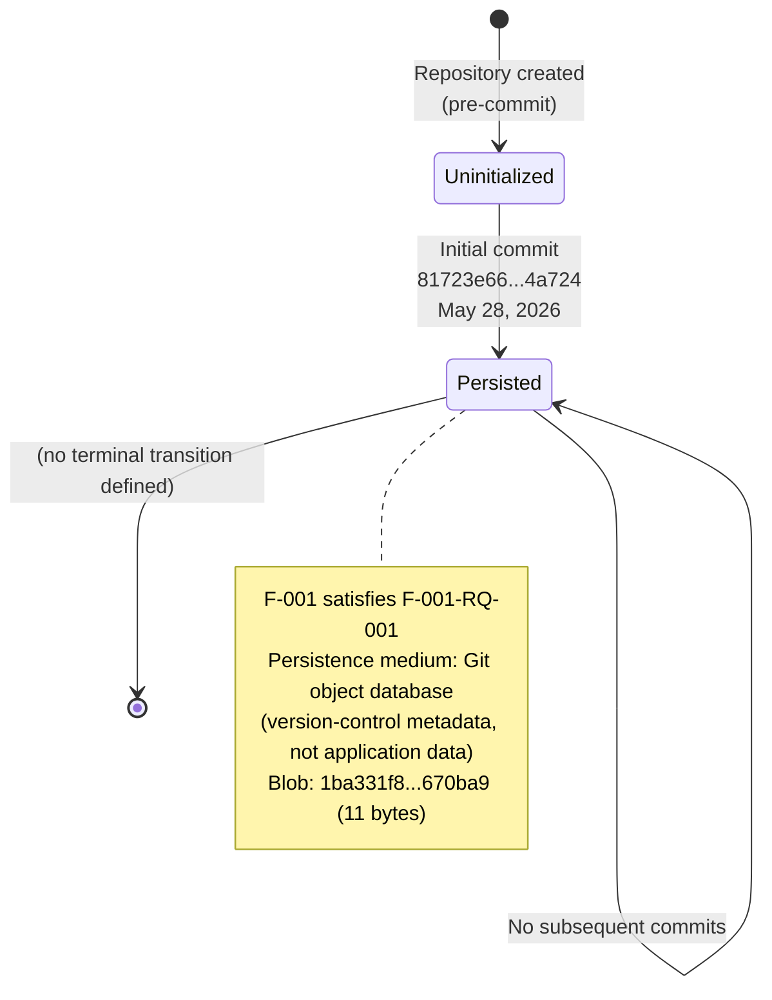

#### 6.2.7.3 Editorial Persistence Flow (the Only "Data Flow")

The only flow that touches a persistence layer in this repository is the editorial action that produced the F-001 artifact, reproduced from §5.3.5. This is **not** an application data flow; it is an authoring-time editorial workflow targeting the Git object database. It is included here for completeness because the Section 6.2 prompt requests "Data flow diagrams," and this is the only flow in evidence.


#### 6.2.7.4 Defer-Until-Evidence Decision Tree

The decision tree below, adapted from §5.4.8 and §6.1.4.5, depicts the single procedure governing every database design choice at the current revision. It is the operational form of constraint **C-002** as it applies to Section 6.2 sub-topics.

```mermaid
flowchart TD
    Q1{{Database design<br/>decision required?}}
    Q2{{Repository contains<br/>schema / migration /<br/>ORM evidence?}}
    Q3{{Evidence within<br/>F-001 / Git / Markdown<br/>envelope?}}
    Defer[Record as<br/>'Not Applicable' / 'Not Defined'<br/>per ADR-0001]:::defer
    Doc[Document with<br/>citation to evidence]:::accept
    Skip[No action required]:::neutral

    Q1 -- No --> Skip
    Q1 -- Yes --> Q2
    Q2 -- No --> Defer
    Q2 -- Yes --> Q3
    Q3 -- No --> Defer
    Q3 -- Yes --> Doc

    classDef defer fill:#ffcdd2,stroke:#c62828,stroke-width:2px,color:#000
    classDef accept fill:#c8e6c9,stroke:#2e7d32,stroke-width:2px,color:#000
    classDef neutral fill:#f0f0f0,stroke:#999,stroke-width:1px,color:#333
```

At the current revision, every database design decision routed through this tree terminates at the **Defer** node because no schema, no migration, no ORM, no connection string, and no caching configuration exists outside the F-001 / Git / Markdown envelope.

---

### 6.2.8 Specification Revision Triggers for Section 6.2

This section shall be revised (i.e., its "Not Applicable" disposition shall be reconsidered) when any of the following events occur in the repository. The trigger list is inherited from §5.6 and §3.10 and filtered for relevance to Database Design.

#### 6.2.8.1 Triggers That Unblock Schema Design Content

| Trigger Event | Unblocks |
|---------------|----------|
| A schema file is committed (`.sql`, `.prisma`, `schema.rb`, `*.proto`, GraphQL `*.graphql`) | Entity relationships, data models, ERD |
| An ORM model definition is committed (SQLAlchemy `Model`, Django `Model`, Mongoose `Schema`, EF Core `DbContext`) | Entity relationships, data structures |
| An index definition or `CREATE INDEX` statement is committed | Indexing strategy |
| A partitioning configuration is committed (e.g., `PARTITION BY`, sharding key declaration) | Partitioning approach |
| A replication configuration is committed (replica-set config, primary-replica topology, streaming-replication setup) | Replication configuration |
| A backup policy, snapshot configuration, or PITR setting is committed | Backup architecture |

#### 6.2.8.2 Triggers That Unblock Data Management Content

| Trigger Event | Unblocks |
|---------------|----------|
| A migration framework is declared in a dependency manifest (Flyway, Liquibase, Alembic, Knex, Prisma Migrate) | Migration procedures |
| A migration script is committed (`*.up.sql`, `*.down.sql`, versioned migration directory) | Migration procedures, versioning strategy |
| An archival policy or lifecycle rule is committed (S3 lifecycle, table TTL, cold-storage tiering) | Archival policies |
| A database driver dependency is committed (`pg`, `psycopg2`, `mongoose`, `pymongo`, `redis-py`, etc.) | Data storage and retrieval mechanisms |
| A cache library or configuration is committed (Redis client, Memcached client, in-memory cache library) | Caching policies |

#### 6.2.8.3 Triggers That Unblock Compliance Content

| Trigger Event | Unblocks |
|---------------|----------|
| A retention policy or compliance framework reference is committed | Data retention rules |
| A backup or disaster-recovery policy document is committed | Backup and fault tolerance policies |
| A data classification, PII inventory, or privacy-impact assessment is committed | Privacy controls |
| An audit-logging configuration, CDC pipeline, or audit-table schema is committed | Audit mechanisms |
| A database-level access-control policy is committed (RBAC roles, IAM-DB-auth config, RLS policies) | Access controls |

#### 6.2.8.4 Triggers That Unblock Performance Optimization Content

| Trigger Event | Unblocks |
|---------------|----------|
| A query workload or representative query file is committed | Query optimization patterns |
| A connection-pool configuration is committed (HikariCP, PgBouncer, SQLAlchemy pool settings) | Connection pooling |
| A read-replica configuration or routing rule is committed | Read/write splitting |
| A batch job, ETL pipeline, or scheduled task definition is committed | Batch processing approach |
| An SLA target, latency budget, or throughput KPI is committed | Performance tuning targets |

Until at least one of these triggers fires, the "Not Applicable" disposition recorded throughout Section 6.2 remains the authoritative database-design statement for the system, consistent with the closing directive of §5.6.

---

### 6.2.9 Anticipated Phase Mapping for Section 6.2 Topics

The matrix below maps each Section 6.2 sub-topic to the lifecycle phase from §1.3.2 during which substantive content is expected to be authored. The mapping is consistent with §5.5.7 and §6.1.7.

#### 6.2.9.1 Phase Mapping — Schema Design

| Sub-Topic | Anticipated Phase |
|-----------|-------------------|
| Entity relationships / ERD | Phase 2 — Architecture Design |
| Data models and structures | Phase 2 — Architecture Design |
| Indexing strategy | Phase 2 — Architecture Design (initial); Phase 3 — Implementation (refinement) |
| Partitioning approach | Phase 2 — Architecture Design |
| Replication configuration | Phase 2 — Architecture Design |
| Backup architecture | Phase 2 — Architecture Design (policy framing) |

#### 6.2.9.2 Phase Mapping — Data Management

| Sub-Topic | Anticipated Phase |
|-----------|-------------------|
| Migration procedures | Phase 2 — Architecture Design (framework selection); Phase 3 — Implementation |
| Versioning strategy | Phase 2 — Architecture Design |
| Archival policies | Phase 1 — Requirements Definition (retention requirements); Phase 2 — Architecture Design (tiering) |
| Data storage and retrieval mechanisms | Phase 2 — Architecture Design |
| Caching policies | Phase 2 — Architecture Design |

#### 6.2.9.3 Phase Mapping — Compliance Considerations

| Sub-Topic | Anticipated Phase |
|-----------|-------------------|
| Data retention rules | Phase 1 — Requirements Definition |
| Backup and fault tolerance policies | Phase 2 — Architecture Design |
| Privacy controls | Phase 1 — Requirements Definition (classification); Phase 2 — Architecture Design (mechanism) |
| Audit mechanisms | Phase 2 — Architecture Design |
| Access controls | Phase 2 — Architecture Design |

#### 6.2.9.4 Phase Mapping — Performance Optimization

| Sub-Topic | Anticipated Phase |
|-----------|-------------------|
| Query optimization patterns | Phase 3 — Implementation |
| Caching strategy | Phase 2 — Architecture Design |
| Connection pooling | Phase 3 — Implementation |
| Read/write splitting | Phase 2 — Architecture Design |
| Batch processing approach | Phase 2 — Architecture Design (framework selection); Phase 3 — Implementation |

#### 6.2.9.5 Concluding Disposition

The combined effect of (a) the categorical absence of databases per §3.7.1 and §3.7.2, (b) the architectural deferral encoded in ADR-0001 per §5.4.7, (c) the constraints **C-001** through **C-004** per §2.6.2, (d) the explicit out-of-scope determination for Data Persistence in §1.3.2, and (e) the Not Determinable status of Data Persistence and Retention in §2.4.3 is that **no element of Database Design — Schema Design, Data Management, Compliance Considerations, or Performance Optimization — is authorable at the current revision.** The disposition will be revisited as the triggers in §6.2.8 fire and as the project progresses through the lifecycle phases of §1.3.2.

---

#### References

**Files Examined**

- `README.md` — The sole tracked artifact in the repository (11 bytes, single line `# Artifact4`). Verified as the only material evidence supporting the F-001 feature; persisted as Git blob `1ba331f8f068747f5b14cd44441a416c93670ba9`. Confirmed to contain no schema, no data definition, no entity declaration, and no persistence-related content.
- `/` (repository root) — Confirmed to contain exactly one tracked file (`README.md`) and Git metadata only; no `schema.sql`, no `schema.prisma`, no `models/` directory, no `migrations/` directory, no `db/` directory, no ORM configuration file, no database connection configuration, and no caching configuration.

**Technical Specification Sections Referenced**

- §1.1 *Executive Summary* — Established inception-phase status, commit metadata (`81723e66...4a724`), and the singleton-file repository state
- §1.2 *System Overview* — Confirms no persistence strategy or data storage technology declared
- §1.3 *Scope* — Identifies "Data Persistence" (all databases, schemas, storage mechanisms, data access layers) as explicitly out-of-scope; records no data domains, entity models, schemas, or persistence schemas
- §1.4 *Specification Interpretation Guidance* — Establishes the "Not Defined / Not Determinable / Not Applicable" interpretive vocabulary used throughout this section
- §2.1 *Feature Catalog* — Identifies F-001 (Project Name Declaration) as the sole feature; zero data-processing capabilities defined
- §2.2 *Functional Requirements* — Confirms F-001 artifact is "static content with no runtime execution path"
- §2.3 *Feature Relationships* — Records zero common services, zero internal integration points, zero external integration points, zero shared components, zero feature-to-feature relationships
- §2.4 *Implementation Considerations* — Records "Data Persistence and Retention" as Not Determinable; blocking decision: "Persistence strategy not selected"
- §2.6 *Assumptions and Constraints* — Source of constraints **C-001** through **C-004** governing this section
- §3.1 *Technology Stack Status* — Confirms zero technology stack components selected
- §3.4 *Frameworks and Libraries* — Confirms ORM / Data Access Layer category is Not Defined ("No data layer artifact present")
- §3.5 *Open Source Dependencies* — Confirms no dependency manifest of any kind exists; no database driver, ORM library, or persistence-related dependency declared
- §3.7 *Databases and Storage* — **Most directly relevant source**: comprehensive Storage Category Inventory (all categories "Not Defined"); explicit statement that no persistence strategy has been defined; identification of Git object database storage of the README.md blob as version-control metadata, not application persistence
- §3.9 *Technology Stack Inventory Summary* — MongoDB and all default DB technologies explicitly non-adopted per constraint **C-002**; security posture delegated to Git hosting platform
- §4.2 *System Workflows* — Confirms zero data flows between systems, zero ETL pipelines, zero batch jobs, zero API interactions
- §4.5 *Technical Implementation* — Source of state-management inventory: 1 persistence point (Git object database), 0 application state machines, 0 session state models, 0 domain entity lifecycles, 0 cache tiers, 0 transaction scopes; source of the persistence state transition diagram
- §5.2 *High-Level Architecture* — Confirms Git object database (holding single blob) is the only data store observable; zero application databases, key-value stores, document stores, blob stores, search indices, message brokers, or file-storage systems
- §5.3 *Component Details* — Records README.md and Git Repository as the only "components" with "Not Applicable" scaling; source of the component interaction and editorial sequence diagrams reproduced in §6.2.7
- §5.4 *Technical Decisions* — Source of ADR-0001 (architectural deferral); §5.4.3 confirms data storage solution is Not Determinable; §5.4.4 confirms no caching strategy; §5.4.5 confirms access control is delegated to Git hosting platform; §5.4.8 source of the Defer-Until-Evidence decision tree
- §5.5 *Cross-Cutting Concerns* — Source of complete status matrix; §5.5.2 confirms no audit/observability; §5.5.6 confirms no disaster recovery defined and notes implicit Git redundancy
- §5.6 *Specification Revision Triggers* — Source of the trigger list adapted for §6.2.8
- §6.1 *Core Services Architecture* — **Authorial precedent**: established the "Not Applicable" disposition pattern, the four-valued disposition vocabulary, the constraints-and-evidence table, the sub-topic status matrices, the honest-diagrams discipline, the revision triggers structure, and the anticipated phase mapping format adopted by this section

## 6.3 Integration Architecture

**Integration Architecture is not applicable for this system.**

The Artifact4 repository, at the commit recorded in §1.1 (`81723e660ea11ed4011a777851f7d46efde4a724`, "Initial commit"), contains exactly one tracked file (`README.md`, 11 bytes, single line `# Artifact4`) and standard Git metadata. No service manifest, no OpenAPI specification, no GraphQL schema, no gRPC service definition, no RPC stub, no message broker configuration, no event-bus declaration, no webhook handler, no API gateway artifact, no third-party service credential, and no external service contract has been committed to version control. The conditional clause in the Section 6.3 prompt — *"If the system does not require integration with external systems or services, clearly state 'Integration Architecture is not applicable for this system' and explain why"* — applies in full.

This determination is not editorial or interpretive; it is the direct consequence of five independent findings recorded elsewhere in this specification:

1. Per §1.2.1, "No integration points, dependent systems, upstream data providers, downstream consumers, or enterprise service endpoints are referenced in the repository. The project's integration topology has not been designed or declared."
2. Per §1.3.2, "Integrations" — encompassing "all external APIs, third-party services, and inter-system communication" — is explicitly listed as out-of-scope at the current revision.
3. Per §2.3.2, the relationship inventory records zero internal integration points, zero external integration points, zero shared components, zero common services, and zero cross-cutting concerns.
4. Per §3.6.1, "No third-party services, external APIs, or hosted integrations are configured in the Artifact4 repository." Every one of the fourteen service categories enumerated in §3.6.2 is recorded as **Not Defined**.
5. Per §5.4.7, ADR-0001 — *Defer all architectural commitments until Phase 2* — has been recorded as Accepted, explicitly deferring communication-pattern and integration-mechanism selection.

The remainder of this section documents (a) the governing constraints that prohibit speculative integration architecture content, (b) the disposition of each sub-topic required by the section prompt across API Design, Message Processing, and External Systems, (c) the only diagrams that can be honestly expressed against the current repository, and (d) the revision triggers and anticipated phases at which substantive Section 6.3 content will become authorable.

---

### 6.3.1 Applicability Determination

#### 6.3.1.1 Primary Repository Evidence

The materialized scope of the system at the current revision consists of a single 11-byte Markdown artifact (`README.md`) containing only the heading `# Artifact4`. This artifact is identified in §2.1 as Feature F-001 (Project Name Declaration) and is the sole feature in the catalog. Per §4.2.2, "No API interactions exist within the repository… No event processing flows exist within the repository… No batch processing sequences exist within the repository." Per §5.2.3.2, "No integration patterns or protocols are defined… Synchronous request/response, asynchronous messaging, event streaming, publish/subscribe, and webhook patterns are all categorically absent."

The repository state therefore yields the following categorical absences directly relevant to Section 6.3:

| Integration Architecture Element | Presence in Repository | Authoritative Source |
|----------------------------------|------------------------|----------------------|
| Service manifest (`package.json`, `pyproject.toml`, etc.) | None | §3.5 |
| OpenAPI / Swagger specification | None | §4.2.2 |
| GraphQL schema (`*.graphql`) | None | §4.2.2 |
| gRPC / Protocol Buffer definition (`*.proto`) | None | §4.2.2 |
| HTTP client / framework library | None | §3.4, §4.2.2 |
| Message broker configuration | None | §3.6.2, §4.2.2 |
| Event bus declaration | None | §4.2.2 |
| Stream-processing topology | None | §4.2.2 |
| Webhook handler / callback | None | §4.2.2 |
| API gateway artifact | None | §3.6.2 |
| Identity provider configuration | None | §3.6.2, §5.5.4 |
| External service credential / connection string | None | §3.6.1 |
| Service contract document (AsyncAPI, etc.) | None | §1.2.1, §2.3.2 |

#### 6.3.1.2 ADR-0001 — The Governing Decision

The single architectural decision honestly recorded from repository evidence is the deferral of all architectural commitments, captured as ADR-0001 in §5.4.7. The decision states that "no technology stack, **communication pattern**, storage technology, caching strategy, **security mechanism**, or deployment model shall be selected at the Inception revision. All such selections are deferred to Phase 2 per §1.3.2." The consequence is that §5.4.2 (Communication Pattern Choices) records "No communication pattern has been chosen. Synchronous request/response, asynchronous messaging, event-driven, streaming, and batch patterns are all categorically unselected because no application framework, no transport library, and no message-broker dependency exist per §3.4 and §3.6" — and this section (6.3) inherits that disposition by direct consequence.

#### 6.3.1.3 The Only Observable "Integration" — Editorial Authoring Action

The only interaction that touches the boundary between an external actor and the system at the current revision is the editorial action by which the F-001 artifact was authored and committed to the Git object database. Per §5.2.1.4, "No major interfaces exist. Per §1.2.1, no integration points are present… The only interaction surface is the editorial act of committing the `README.md` artifact, which is described as a process (not an interface) in §4.3.2."

This editorial action is explicitly **not a runtime integration**: it is an authoring-time persistence event of static content into version-control metadata. It does not constitute an API, a message exchange, a webhook callback, an event publication, or any other integration mechanism in the architectural sense. Treating it as an integration for the purposes of Section 6.3 would conflate authoring-time editorial workflow with runtime system integration and would violate the documentary precision required by §1.4.

#### 6.3.1.4 Disposition Vocabulary Used in This Section

This section uses the four-valued disposition vocabulary established in §1.4 and applied throughout §5.5, §6.1, and §6.2:

| Disposition | Meaning in This Section |
|-------------|--------------------------|
| **Not Defined** | The category is meaningful but no decision has been recorded in the repository |
| **Not Determinable** | A prerequisite decision (per §2.4.3) is missing, preventing this category from being resolved |
| **Not Applicable** | The category is structurally inapplicable to a repository containing no services, APIs, or integrations |
| **Deferred** | The decision is explicitly postponed to a future phase per ADR-0001 (§5.4.7) |

---

### 6.3.2 Governing Constraints and Evidence Base

The constraints below, recorded in §2.6.2, prohibit the author of this section from inferring API contracts, authentication mechanisms, message-broker selections, gateway configurations, or external service relationships in the absence of repository evidence. Any speculative content in Section 6.3 — including hypothetical API endpoints, candidate IdP selections, or assumed message-bus topologies — would directly violate one or more of these constraints.

| Constraint ID | Statement | Effect on Section 6.3 |
|---------------|-----------|----------------------|
| **C-001** | All documented features and requirements must be grounded in artifacts committed to version control | Prohibits asserting any API endpoint, message topic, event type, webhook URL, or external service connection not present in a committed artifact |
| **C-002** | The specification shall not infer features, technology choices, or business goals that lack repository evidence | Prohibits inferring API frameworks (Express, FastAPI, Flask, Spring Boot, etc.), authentication mechanisms (JWT, OAuth2, SAML, mTLS), message brokers (Kafka, RabbitMQ, SQS, SNS), or API gateways (Kong, AWS API Gateway, Apigee) |
| **C-003** | The current materialized scope is limited to a project identity declaration; all other capabilities are out-of-scope until formally defined | Confines Section 6.3 to a "not applicable" disposition for all API, message-processing, and external-systems sub-topics |
| **C-004** | Feature relationships shall be documented only when clearly evident in committed requirements or source code | Confines the integration-relationship inventory in §2.3.2 to zero entries because no integration points are committed |

Per §1.3.2, "Integrations" is explicitly out-of-scope, encompassing "all external APIs, third-party services, and inter-system communication." Additionally, "Security" — encompassing "all authentication, authorization, encryption, and audit mechanisms" — is explicitly out-of-scope, which propagates directly to the authentication and authorization sub-topics of API Design. Per §1.3.2, "No integration points are currently covered by this specification because none have been defined. All potential integrations — including authentication providers, data sources, messaging systems, observability platforms, and third-party APIs — are presently out of scope."

Per §3.9, the Default Technology Stack candidate list (which would otherwise contribute integration-relevant components such as Flask, Auth0, MongoDB, AWS) is explicitly **not adopted** because each candidate lacks repository evidence and would violate constraint **C-002** if introduced. This non-adoption precedent applies to every integration technology in the Default Stack.

---

### 6.3.3 API Design — Status Disposition

#### 6.3.3.1 API Design Sub-Topic Status Matrix

Each sub-topic required by the API Design portion of the section prompt is recorded below with its disposition and the authoritative source within this specification. The dispositions reflect the integration workflow inventory in §4.2.2 and the cross-cutting concerns matrix in §5.5.1.

| Sub-Topic | Disposition | Authoritative Source |
|-----------|-------------|----------------------|
| Protocol specifications | Not Determinable — no framework declared | §3.4, §5.4.2 |
| Authentication methods | Not Determinable — security architecture not defined | §2.4.3, §5.5.4 |
| Authorization framework | Not Determinable — no identity provider declared | §2.4.3, §5.5.4 |
| Rate limiting strategy | Not Applicable — no API surface exists | §4.2.2 |
| Versioning approach | Not Applicable — no API to version | §4.2.2 |
| Documentation standards | Not Applicable — no OpenAPI / GraphQL schema present | §4.2.2 |

#### 6.3.3.2 Protocol Specifications

No transport protocol or API style has been selected. Per §4.2.2, "No API interactions exist within the repository. No service manifests, OpenAPI specifications, GraphQL schemas, gRPC service definitions, or RPC stubs are present in any folder. Per §3.4 (Frameworks and Libraries), no application framework or HTTP client library has been declared, so no API call sites exist for which a flowchart could be constructed."

Per §5.4.2, REST, GraphQL, gRPC, JSON-RPC, XML-RPC, SOAP, WebSocket, Server-Sent Events (SSE), HTTP/2 streaming, HTTP/3 (QUIC), and proprietary binary protocols are all categorically unselected. Wire formats (JSON, Protocol Buffers, Apache Avro, Apache Thrift, MessagePack, CBOR, XML, FlatBuffers), serialization frameworks (Jackson, Gson, kryo, protobuf-net), and content negotiation conventions (`Accept` / `Content-Type` headers, `application/vnd.*+json` media-type vendoring) cannot be specified at the current revision without violating constraint **C-002**.

#### 6.3.3.3 Authentication Methods

Per §5.5.4, "No application-layer authentication or authorization framework has been selected. Per §2.4.3, the 'Authentication and Authorization Model' is recorded as 'Not Determinable.' Per §3.6, no identity provider (Auth0, Cognito, Keycloak, Okta, custom IdP) and no policy-management service have been declared." Per §3.6.2, both the "Authentication / Identity Provider" and "Authorization / Policy Service" categories are recorded as **Not Defined** with the rationale "No security architecture defined."

Authentication mechanisms applicable to APIs — API keys, HTTP Basic, HTTP Bearer / JWT, OAuth 2.0 (authorization code, client credentials, PKCE, device flow), OpenID Connect, SAML 2.0, mTLS / mutual-TLS certificate authentication, AWS SigV4, HMAC request signing, session cookies — are all categorically inapplicable at the current revision because (a) no API surface exists and (b) no identity provider is declared. Per §2.4.2 and §3.9.3, access control is currently delegated entirely to whichever Git hosting platform ultimately hosts the repository; this is repository-level access control, not API-level authentication.

#### 6.3.3.4 Authorization Framework

No authorization framework has been selected. Per §5.5.4, the authorization framework category is recorded as **Not Determinable**, with the blocking decision "Security architecture not defined." Per §3.6.2, the "Authorization / Policy Service" category records no provider.

Authorization models — Role-Based Access Control (RBAC), Attribute-Based Access Control (ABAC), Policy-Based Access Control (PBAC), Relationship-Based Access Control (ReBAC), capability tokens, scoped OAuth 2.0 access tokens, JWT claims-based authorization — are uniformly inapplicable. Policy engines (Open Policy Agent, AWS Cedar, Casbin, AuthZed/SpiceDB, Oso) and policy languages (Rego, Cedar, XACML) are similarly absent. Trust-boundary definitions, scope hierarchies, and consent flows cannot be authored against a non-existent API surface without violating constraint **C-002**.

#### 6.3.3.5 Rate Limiting Strategy

No rate-limiting strategy is defined because no API surface exists. Per §4.2.2, the count of synchronous API sequences is zero. Per §3.6.2, no API gateway, no edge proxy, and no rate-limiting middleware has been declared.

Rate-limiting algorithms — fixed-window, sliding-window, leaky-bucket, token-bucket, GCRA (Generic Cell Rate Algorithm), adaptive concurrency limits — are inapplicable. Quota dimensions (per-IP, per-API-key, per-tenant, per-endpoint, per-method, global), enforcement points (API gateway, sidecar proxy, application middleware, CDN edge), and quota persistence (Redis, in-memory, distributed counters) cannot be specified because no traffic source, no enforcement layer, and no consumer taxonomy exist in the repository.

#### 6.3.3.6 Versioning Approach

No API versioning approach is defined because no API exists to be versioned. Per §4.2.2, zero API interactions are declared. Versioning conventions — URI path versioning (`/v1/`, `/v2/`), HTTP header versioning (`Accept-Version`, `X-API-Version`), query-parameter versioning (`?version=`), media-type versioning (`application/vnd.example.v1+json`), semantic versioning of API contracts — are inapplicable in the absence of an API.

API lifecycle policies (deprecation windows, sunset headers per RFC 8594, backward-compatibility guarantees, breaking-change communication, parallel-version routing, dual-write transition patterns) cannot be authored at the current revision without violating constraint **C-002**.

#### 6.3.3.7 Documentation Standards

No API documentation standard is selected because no API exists to document. Per §4.2.2, no OpenAPI / Swagger specification, no GraphQL schema (with introspection or SDL), no AsyncAPI document, no gRPC service definition, and no Protocol Buffer file is committed to the repository.

Documentation toolchains — Swagger UI, ReDoc, Stoplight, Postman collections, Insomnia exports, Spectacle, Slate, Docusaurus + OpenAPI plugins, GraphQL Voyager, Bruno — and documentation generators (`swagger-codegen`, `openapi-generator`, `oapi-codegen`, `protoc` documentation plugins, `graphql-codegen`) are uniformly inapplicable. Style guides (Microsoft REST API Guidelines, Zalando RESTful API Guidelines, Google API Improvement Proposals, Heroku Platform API style) cannot be cited as governing at the current revision without violating constraint **C-002**.

---

### 6.3.4 Message Processing — Status Disposition

#### 6.3.4.1 Message Processing Sub-Topic Status Matrix

| Sub-Topic | Disposition | Authoritative Source |
|-----------|-------------|----------------------|
| Event processing patterns | Not Applicable — zero events declared | §4.2.2, §2.3.2 |
| Message queue architecture | Not Applicable — no message broker | §3.4, §3.6.2 |
| Stream processing design | Not Applicable — no stream processor | §3.4, §4.2.2 |
| Batch processing flows | Not Applicable — zero batch jobs | §4.2.2, §3.8 |
| Error handling strategy | Not Defined — uniformly per §4.5.2 | §4.5.2, §5.5.3.1 |

#### 6.3.4.2 Event Processing Patterns

No event processing patterns exist. Per §4.2.2, "No event processing flows exist within the repository. No message broker configurations, no event bus declarations, no event handlers, no queue topology definitions, and no stream-processing topologies have been committed. The repository contains no dependencies on event-oriented frameworks (e.g., message brokers, stream processors), and constraint C-002 prohibits the inference of such flows in their absence."

Per §4.2.2, the Integration Workflow Inventory records uniformly zero items across the relevant event categories:

| Integration Workflow Category | Defined Items | Authoritative Source |
|-------------------------------|---------------|----------------------|
| Asynchronous Message Flows | 0 | §2.3.2 |
| Event-Sourcing / Pub-Sub Topologies | 0 | §2.3.2 |
| Webhook / Callback Patterns | 0 | §2.3.2 |

Event-driven patterns — event sourcing, Command-Query Responsibility Segregation (CQRS), the Saga pattern (choreography and orchestration variants), the Outbox pattern, the Inbox pattern, event collaboration, domain events, integration events — are categorically inapplicable. Event-schema technologies (CloudEvents specification, AsyncAPI specification, schema registries such as Confluent Schema Registry or AWS Glue Schema Registry, Apache Avro schemas, JSON Schema) cannot be specified because no event exists to be schematized.

#### 6.3.4.3 Message Queue Architecture

No message queue architecture is defined because no message broker is declared. Per §3.6.2, the "Message Bus / Event Broker" service category records no provider. Per §3.4, no application framework, no transport library, and no message-broker client dependency exists.

Broker technologies — Apache Kafka, RabbitMQ, Apache ActiveMQ, Apache Pulsar, NATS / NATS JetStream, AWS SQS, AWS SNS, AWS EventBridge, AWS Kinesis, Google Pub/Sub, Azure Service Bus, Azure Event Hubs, Redis Streams, ZeroMQ, IBM MQ, Amazon MQ — are uniformly absent. Topology constructs (topics, partitions, consumer groups, exchanges, queues, bindings, routing keys, subjects, streams, shards) and delivery guarantees (at-most-once, at-least-once, exactly-once, in-order delivery, FIFO queues) cannot be authored at the current revision without violating constraint **C-002**.

Per §4.5.1, the count of "Application State Machines," "Session State Models," and "Domain Entity Lifecycles" is zero — there are no stateful workflows that would consume or emit messages even if a broker were configured.

#### 6.3.4.4 Stream Processing Design

No stream processing design is defined. Per §4.2.2, no stream-processing topology has been committed. Per §3.4 and §3.6.2, no stream-processing framework is declared.

Stream-processing engines — Apache Kafka Streams, Apache Flink, Apache Beam, Apache Spark Streaming / Structured Streaming, AWS Kinesis Data Analytics, Azure Stream Analytics, Google Dataflow, Materialize, RisingWave, ksqlDB, Faust, Bytewax — are uniformly absent. Stream-processing constructs (windowing strategies including tumbling, sliding, session, and global; watermarks and late-data handling; stateful operators with RocksDB or in-memory state stores; exactly-once processing semantics; stream-table duality; complex event processing) cannot be authored against a non-existent stream workload.

#### 6.3.4.5 Batch Processing Flows

No batch processing flows are defined. Per §4.2.2, "No batch processing sequences exist within the repository. No schedulers, no cron specifications, no workflow orchestrators, no ETL pipelines, and no batch-job manifests are present. Per §3.8 (Development and Deployment), no build/deploy tooling or scheduled-job machinery has been declared."

Per §4.2.2, the Integration Workflow Inventory records:

| Integration Workflow Category | Defined Items | Authoritative Source |
|-------------------------------|---------------|----------------------|
| Scheduled Batch Jobs | 0 | §3.8 |
| ETL / Data Pipelines | 0 | §1.2.2 |
| File-Transfer Workflows | 0 | §1.3.2 |

Batch-processing frameworks — Spring Batch, Apache Beam, Apache Spark, Apache Airflow, Luigi, Dagster, Prefect, AWS Glue, AWS Step Functions, AWS Batch, Azure Data Factory, Google Cloud Composer — are uniformly absent. Scheduling mechanisms (cron, systemd timers, Kubernetes CronJobs, cloud-managed schedulers, Quartz Scheduler), checkpointing strategies, retry-with-exponential-backoff policies, dead-letter routing, and parallelization patterns cannot be authored at the current revision without violating constraint **C-002**.

#### 6.3.4.6 Error Handling Strategy

Error-handling strategy for integration workloads is uniformly **Not Defined** because no integration workload exists. Per §5.5.3.1, "No runtime error handling exists because no runtime exists. The eight error-handling categories enumerated in §4.5.2 — retry, fallback, circuit breaker, error notification, dead-letter queue, compensating transactions, recovery procedures, incident runbooks — are uniformly 'Not Defined.'"

The error-handling status applicable to integration architecture, reproduced from §4.5.2 and filtered for integration relevance:

| Error Handling Category | Status | Authoritative Source |
|-------------------------|--------|----------------------|
| Retry Mechanisms | Not Defined — no executable code exists | §3.4 |
| Fallback Processes | Not Defined — no services to fall back from | §2.3.2 |
| Circuit Breaker Patterns | Not Defined — no integrations to protect | §2.3.2 |
| Error Notification Flows | Not Defined — no observability library | §3.4 |
| Dead-Letter Queues | Not Defined — no message infrastructure | §3.4 |
| Compensating Transactions | Not Defined — no transaction boundaries | §3.7 |

Resilience patterns specific to integration — exponential backoff with jitter, the Bulkhead pattern, the Circuit Breaker pattern (Hystrix-style, resilience4j-style), the Retry pattern with idempotency keys, the Saga pattern with compensating transactions, the Outbox pattern for transactional messaging, the Inbox pattern for idempotent consumers, poison-message handling, dead-letter routing with reprocessing tooling — are uniformly inapplicable. Resilience libraries (Polly for .NET, resilience4j for JVM, Hystrix [archived], Sentinel, failsafe-go, tenacity for Python) cannot be selected without violating constraint **C-002**.

---

### 6.3.5 External Systems — Status Disposition

#### 6.3.5.1 External Systems Sub-Topic Status Matrix

| Sub-Topic | Disposition | Authoritative Source |
|-----------|-------------|----------------------|
| Third-party integration patterns | Not Defined — zero third-party services | §3.6.1, §3.6.2 |
| Legacy system interfaces | Not Applicable — greenfield project | §1.2.1 |
| API gateway configuration | Not Defined — no gateway artifact present | §3.6.2 |
| External service contracts | Not Defined — zero contracts declared | §1.2.1, §2.3.2 |

#### 6.3.5.2 Third-Party Integration Patterns

Per §3.6.1, "No third-party services, external APIs, or hosted integrations are configured in the Artifact4 repository." Per §3.6.2, every one of the fourteen service categories — Authentication / Identity Provider, Authorization / Policy Service, External API Integration, Email / Notification Service, Payment / Billing Service, Object Storage Service, Content Delivery Network, Application Performance Monitoring, Logging / Telemetry Service, Error Tracking Service, Analytics Service, Feature Flag Service, Search Service, Message Bus / Event Broker — is recorded as **Not Defined**.

The reference table from §3.6.2 is reproduced below in four-column form for direct citation within this section:

| Service Category | Selected Provider | Status |
|------------------|-------------------|--------|
| Authentication / Identity Provider | Not Defined | No security architecture defined |
| Authorization / Policy Service | Not Defined | No security architecture defined |
| External API Integration | Not Defined | No integration declared |
| Email / Notification Service | Not Defined | No notification artifact present |
| Payment / Billing Service | Not Defined | No commerce artifact present |
| Object Storage Service | Not Defined | No storage artifact present |
| Content Delivery Network | Not Defined | No CDN artifact present |
| Application Performance Monitoring | Not Defined | No observability artifact present |
| Logging / Telemetry Service | Not Defined | No observability artifact present |
| Error Tracking Service | Not Defined | No observability artifact present |
| Analytics Service | Not Defined | No analytics artifact present |
| Feature Flag Service | Not Defined | No feature management artifact present |
| Search Service | Not Defined | No search artifact present |
| Message Bus / Event Broker | Not Defined | No messaging artifact present |

Integration patterns from Enterprise Integration Patterns (EIP) and similar canonical catalogs — Message Broker, Publish-Subscribe Channel, Point-to-Point Channel, Message Translator, Content-Based Router, Aggregator, Splitter, Anti-Corruption Layer, Strangler Fig, Backend-for-Frontend (BFF), API Composition, Service Façade, Adapter, Gateway, Sidecar — are uniformly inapplicable because no third-party endpoint, no inbound webhook, no outbound HTTP client, and no message client is present in the repository.

#### 6.3.5.3 Legacy System Interfaces

Per §1.2.1, "Because Artifact4 is a greenfield initiative with no implemented predecessor, there are no existing system limitations to document. The repository does not contain references to legacy systems, deprecated platforms, or systems being replaced." Legacy-system integration is therefore structurally **Not Applicable** at the current revision.

Legacy-integration patterns — Strangler Fig migration, Anti-Corruption Layer, façade adapters, screen scraping, COBOL / EDI / EDIFACT interchange, ESB (Enterprise Service Bus) integration, MQ-Series bridges, mainframe terminal emulation, file-drop / SFTP gateways, fixed-width record parsers — are inapplicable because no legacy system is referenced anywhere in the repository.

#### 6.3.5.4 API Gateway Configuration

No API gateway is configured. Per §3.6.2, no gateway artifact is committed; the "External API Integration" category records no provider, and no equivalent edge-proxy or front-door category records a selection. Per §5.4.5, "No security mechanism has been selected at the application layer," which propagates to the absence of any gateway-level authentication policy.

Gateway technologies — AWS API Gateway, AWS AppSync, Azure API Management, Google Cloud API Gateway / Apigee, Kong Gateway / Kong Konnect, Tyk, KrakenD, Gloo Edge, Ambassador / Emissary-Ingress, Traefik, Envoy Proxy, NGINX (commercial/OSS), HAProxy, AWS App Mesh, Istio (as a sidecar-based gateway), Consul service mesh — are uniformly absent. Gateway-level concerns (request routing, request transformation, response transformation, JSON-to-XML mediation, header injection, CORS policy enforcement, IP allowlisting / denylisting, WAF rules, OAuth introspection, JWT validation, mTLS termination, rate-limiting policies, quota enforcement, canary routing, blue-green deployment routing, traffic mirroring) cannot be authored at the current revision without violating constraint **C-002**.

#### 6.3.5.5 External Service Contracts

No external service contracts are declared. Per §1.2.1, "No integration points, dependent systems, upstream data providers, downstream consumers, or enterprise service endpoints are referenced in the repository." Per §5.2.4, the External Integration Points table records zero entries, reproduced below for completeness:

| System Name | Integration Type | Protocol / Format | SLA Requirements |
|-------------|------------------|-------------------|------------------|
| None Defined | Not Applicable | Not Applicable | Not Applicable |

Contract artifacts — OpenAPI 3.x specifications (formerly Swagger), AsyncAPI specifications for event-driven contracts, Protocol Buffer service definitions, GraphQL Schema Definition Language (SDL) documents, JSON Schema validation documents, XML Schema (XSD) definitions, WSDL service descriptions, Pact contract files (consumer-driven contract testing), Spring Cloud Contract definitions, RAML specifications, API Blueprint documents — are uniformly absent. Service-level objectives (SLOs), service-level agreements (SLAs), and service-level indicators (SLIs) for hypothetical external dependencies cannot be authored because §5.5.5 records performance requirements as "Not Applicable — static content with no runtime behavior or measurable performance dimensions" and §1.2.3 records all KPIs as Undefined.

**External Dependencies Documentation:** Per the section prompt requirement to "document all external dependencies," the comprehensive answer is **none**. Per §3.5, no dependency manifest of any kind exists in the repository. Per §3.6.1, no third-party service is configured. Per §1.2.1 and §2.3.2, no enterprise service endpoint, no upstream data provider, no downstream consumer, and no inter-system communication is declared. The only "dependency" of any kind in evidence is the implicit dependency of the `README.md` artifact on a CommonMark-compatible Markdown renderer (per §5.3.1.2) — this is a content-rendering dependency, not an integration dependency.

---

### 6.3.6 Honest Diagrams Against Current Repository State

This sub-section catalogs the diagrams that can be honestly authored against current repository evidence. The Section 6.3 prompt requests three diagram categories — *Integration flow diagrams*, *API architecture diagrams*, and *Message flow diagrams* — and additionally requests "sequence diagrams for key flows." Per constraints **C-001** and **C-002**, none of the three requested integration diagrams can be authored substantively: there are no integration flows, no API architecture, and no message flows to draw. The diagrams below are the only honest expressions available, and each is annotated to make its scope unambiguous.

#### 6.3.6.1 Inauthorable Diagrams Catalog

| Requested Diagram | Inauthorability Cause | Authoritative Source |
|-------------------|----------------------|----------------------|
| Integration flow diagram | Zero integration flows declared | §1.2.1, §2.3.2 |
| API architecture diagram | Zero APIs, zero endpoints, zero frameworks | §4.2.2, §3.4 |
| Message flow diagram | Zero message brokers, zero events, zero topics | §4.2.2, §3.6.2 |
| Webhook / callback sequence | Zero webhook handlers declared | §4.2.2 |
| External-dependency landscape | Zero third-party services configured | §3.6.1, §3.6.2 |

Drawing any of these diagrams with hypothetical content — for example, a notional REST architecture with `/api/v1/artifacts` endpoints, a notional Kafka topology with `artifact-events` topics, or a notional gateway routing diagram with hypothetical upstream services — would violate constraints **C-001** and **C-002**.

#### 6.3.6.2 Single-Node Integration Topology (the Only Honest Topology Diagram)

The diagram below depicts the only "integration" topology that exists in the repository: the editorial-time persistence of the single `README.md` artifact into the Git object database, with structural placeholders for the integration endpoints that will be defined in Phase 2. This is the integration-architecture analog of the component-interaction diagram in §5.3.3 and the storage-topology diagram in §6.2.3.5.

```mermaid
flowchart LR
    Contributor[("Contributor<br/>shalini690@blitzy.io")]:::actor
    README["README.md<br/>F-001 artifact<br/>11 bytes UTF-8"]:::current
    GitDB[("Git Object Database<br/>blob 1ba331f8...670ba9<br/>commit 81723e66...4a724")]:::store
    FutureAPI["Future API Surface<br/>(undefined — Phase 2)"]:::future
    FutureBroker["Future Message Broker<br/>(undefined — Phase 2)"]:::future
    FutureGateway["Future API Gateway<br/>(undefined — Phase 2)"]:::future
    FutureExt["Future External Services<br/>(undefined — Phase 2)"]:::future

    Contributor -- "authors &amp; commits<br/>(editorial action,<br/>not runtime integration)" --> README
    README -- "persisted as blob<br/>(version-control metadata)" --> GitDB
    README -.->|"future integration<br/>endpoints to be<br/>established"| FutureAPI
    README -.-> FutureBroker
    README -.-> FutureGateway
    README -.-> FutureExt

    classDef actor fill:#e1bee7,stroke:#6a1b9a,stroke-width:2px,color:#000
    classDef current fill:#fff3b0,stroke:#d4a017,stroke-width:3px,color:#000
    classDef store fill:#bbdefb,stroke:#1565c0,stroke-width:2px,color:#000
    classDef future fill:#f0f0f0,stroke:#999999,stroke-width:1px,stroke-dasharray: 5 5,color:#333
```

The dashed edges to *Future API Surface*, *Future Message Broker*, *Future API Gateway*, and *Future External Services* are included as structural placeholders consistent with the convention from §1.4, §2.3.3, §5.3.3, and §6.2.3.5; they do not assert any integration-technology decision.

#### 6.3.6.3 Editorial Persistence Sequence (the Only Sequence Diagram Available)

The Section 6.3 prompt requests "sequence diagrams for key flows." The only flow that can be honestly rendered as a sequence diagram is the editorial action that produced the F-001 artifact, reproduced from §5.3.5 / §6.2.7.3. This is **not** a runtime integration flow; it is an authoring-time editorial workflow targeting the Git object database. It is included here for completeness because no other sequence diagram is authorable at the current revision per §4.2.2 (zero API interactions, zero event flows, zero batch sequences).

```mermaid
sequenceDiagram
    autonumber
    actor Author as Contributor<br/>(shalini690@blitzy.io)
    participant WT as Local Working Tree
    participant Val as Validation Gates<br/>(per §2.2.2)
    participant Git as Local Git Repository
    participant Blob as Git Object Database

    Author->>WT: Author README.md<br/>(H1 heading content)
    Author->>WT: Stage file
    WT->>Val: Submit for validation
    Val->>Val: Gate 1 — H1 text equals "Artifact4"?
    Val->>Val: Gate 2 — Valid CommonMark?
    Val->>Val: Gate 3 — No secrets / credentials?
    alt Any gate fails
        Val-->>Author: Reject — edit and retry
        Author->>WT: Correct file
    else All gates pass
        Val-->>Author: Accept
        Author->>Git: Commit with message<br/>"Initial commit"
        Git->>Blob: Persist blob<br/>1ba331f8...670ba9 (11 bytes)
        Git->>Blob: Record commit<br/>81723e66...4a724<br/>May 28, 2026
        Blob-->>Author: F-001-RQ-001 acceptance criteria met
    end
```

This sequence diagram is **not a runtime integration flow** in the sense intended by the Section 6.3 prompt. It is reproduced here exclusively to honor the prompt's request for sequence diagrams of "key flows" while preserving documentary precision: per §4.2 (which records zero core business processes, zero integration workflows, zero data flows, zero API interactions, zero events, zero batch jobs), this is the only sequence-renderable flow in the repository, and it concerns version-control persistence rather than system-to-system integration.

#### 6.3.6.4 Defer-Until-Evidence Decision Tree

The decision tree below, adapted from §5.4.8, §6.1.4.5, and §6.2.7.4, depicts the single procedure governing every integration architecture choice at the current revision. It is the operational form of constraint **C-002** as it applies to Section 6.3 sub-topics.

```mermaid
flowchart TD
    Q1{{Integration architecture<br/>decision required?<br/>(API / Message / External)}}
    Q2{{Repository contains<br/>integration evidence?<br/>(manifest / spec / client)}}
    Q3{{Evidence within<br/>F-001 / Git / Markdown<br/>envelope?}}
    Defer[Record as<br/>'Not Applicable' / 'Not Defined'<br/>per ADR-0001]:::defer
    Doc[Document with<br/>citation to evidence]:::accept
    Skip[No action required]:::neutral

    Q1 -- No --> Skip
    Q1 -- Yes --> Q2
    Q2 -- No --> Defer
    Q2 -- Yes --> Q3
    Q3 -- No --> Defer
    Q3 -- Yes --> Doc

    classDef defer fill:#ffcdd2,stroke:#c62828,stroke-width:2px,color:#000
    classDef accept fill:#c8e6c9,stroke:#2e7d32,stroke-width:2px,color:#000
    classDef neutral fill:#f0f0f0,stroke:#999,stroke-width:1px,color:#333
```

At the current revision, every integration architecture decision routed through this tree terminates at the **Defer** node because no API specification, no message-broker dependency, no third-party service credential, and no gateway configuration exists outside the F-001 / Git / Markdown envelope.

#### 6.3.6.5 Integration Architecture Phase Progression

The diagram below shows the lifecycle progression at which each Integration Architecture sub-topic becomes authorable. It is the integration-specific visualization of §5.5.7 and §6.1.5.7.

```mermaid
flowchart LR
    C1["Current Revision<br/>(Inception)<br/>━━━━━<br/>No APIs<br/>No messaging<br/>No external services"]:::current
    P2["Phase 2 —<br/>Architecture Design<br/>━━━━━<br/>API protocol selection<br/>Auth framework<br/>Broker selection<br/>Gateway design<br/>Service contracts"]:::phase2
    P3["Phase 3 —<br/>Implementation<br/>━━━━━<br/>API endpoint code<br/>Rate-limiting config<br/>Retry / circuit-breaker<br/>Batch job code"]:::phase3
    P4["Phase 4 —<br/>Testing &amp; Validation<br/>━━━━━<br/>Contract testing<br/>Load testing<br/>Chaos engineering"]:::phase4

    C1 --> P2 --> P3 --> P4

    classDef current fill:#ffcdd2,stroke:#c62828,stroke-width:2px,color:#000
    classDef phase2 fill:#fff3b0,stroke:#d4a017,stroke-width:2px,color:#000
    classDef phase3 fill:#c8e6c9,stroke:#2e7d32,stroke-width:2px,color:#000
    classDef phase4 fill:#bbdefb,stroke:#1565c0,stroke-width:2px,color:#000
```

---

### 6.3.7 Specification Revision Triggers for Section 6.3

This section shall be revised (i.e., its "Not Applicable" disposition shall be reconsidered) when any of the following events occur in the repository. The trigger list is inherited from §5.6 and filtered for relevance to Integration Architecture, following the precedent established by §6.1.6 and §6.2.8.

#### 6.3.7.1 Triggers That Unblock API Design Content

| Trigger Event | Unblocks |
|---------------|----------|
| An OpenAPI / Swagger specification (`openapi.yaml`, `swagger.json`) is committed | Protocol specifications, documentation standards |
| A GraphQL schema (`*.graphql`, `*.gql`) is committed | Protocol specifications, documentation standards |
| A gRPC service definition (`*.proto`) is committed | Protocol specifications, documentation standards |
| An API framework is declared in a manifest (Express, FastAPI, Flask, Spring Boot, Gin, ASP.NET Core, NestJS, etc.) | Protocol specifications |
| An authentication library / SDK is added (JWT library, OAuth client, Auth0 SDK, Passport.js, Spring Security, etc.) | Authentication methods |
| An authorization library or policy engine binding is committed (OPA, Casbin, Cerbos, OSO, Cedar) | Authorization framework |
| A rate-limiting middleware / configuration is committed (express-rate-limit, slowapi, Bucket4j, gateway-level policy) | Rate limiting strategy |
| An API versioning convention is committed (URI versioning route, header-version middleware, media-type vendoring) | Versioning approach |

#### 6.3.7.2 Triggers That Unblock Message Processing Content

| Trigger Event | Unblocks |
|---------------|----------|
| A message broker client / SDK is declared (Kafka, RabbitMQ, AWS SQS / SNS, Pulsar, NATS, Redis Streams) | Message queue architecture, event processing patterns |
| An event bus configuration is committed (EventBridge rule, NATS subject hierarchy, Kafka topic definition) | Event processing patterns |
| An AsyncAPI specification is committed | Event processing patterns, error handling strategy |
| A stream processor declaration is added (Kafka Streams, Flink, Beam, Kinesis Analytics, ksqlDB) | Stream processing design |
| A batch job orchestrator is configured (Airflow DAG, Luigi task, Dagster job, Prefect flow, AWS Step Function) | Batch processing flows |
| A scheduled-job manifest is committed (`crontab`, Kubernetes `CronJob`, systemd timer) | Batch processing flows |
| A webhook handler is implemented in source code | Event processing patterns |
| A resilience library is declared (Polly, resilience4j, tenacity, failsafe) | Error handling strategy |
| A dead-letter-queue configuration is committed | Error handling strategy |

#### 6.3.7.3 Triggers That Unblock External Systems Content

| Trigger Event | Unblocks |
|---------------|----------|
| An external API client SDK is added (Stripe SDK, Twilio SDK, SendGrid SDK, AWS SDK, etc.) | Third-party integration patterns |
| An API gateway configuration is committed (Kong, AWS API Gateway YAML, Apigee proxy bundle, Tyk config) | API gateway configuration |
| A third-party service credential or connection string is configured (in environment variable scaffold, secrets-manager binding, IaC) | Third-party integration patterns |
| A service contract document (OpenAPI, AsyncAPI, Pact, gRPC `.proto`) for an external dependency is committed | External service contracts |
| A legacy system adapter or façade is implemented | Legacy system interfaces |
| An IdP configuration is committed (Auth0 tenant config, Cognito user pool, Keycloak realm, Okta application) | Third-party integration patterns |
| An SLA / SLO definition for an external dependency is committed | External service contracts |
| A `CODEOWNERS`, branch-protection, or required-reviewer policy referencing integration code paths is committed | External service governance |

Until at least one of these triggers fires, the "Not Applicable" disposition recorded throughout Section 6.3 remains the authoritative integration-architecture statement for the system, consistent with the closing directive of §5.6.

---

### 6.3.8 Anticipated Phase Mapping for Section 6.3 Topics

The matrix below maps each Section 6.3 sub-topic to the lifecycle phase from §1.3.2 during which substantive content is expected to be authored. Per §1.3.2, Phase 2 — Architecture explicitly handles: "Select technology stack, design components, and define interfaces." The mapping is consistent with §5.5.7, §6.1.7, and §6.2.9.

#### 6.3.8.1 Phase Mapping — API Design

| Sub-Topic | Anticipated Phase |
|-----------|-------------------|
| Protocol specifications (REST / gRPC / GraphQL / WebSocket) | Phase 2 — Architecture Design |
| Authentication methods | Phase 2 — Architecture Design |
| Authorization framework | Phase 2 — Architecture Design |
| Rate limiting strategy | Phase 3 — Implementation |
| API versioning approach | Phase 2 — Architecture Design |
| Documentation standards | Phase 2 — Architecture Design |

#### 6.3.8.2 Phase Mapping — Message Processing

| Sub-Topic | Anticipated Phase |
|-----------|-------------------|
| Event processing patterns | Phase 2 — Architecture Design |
| Message queue architecture | Phase 2 — Architecture Design |
| Stream processing design | Phase 2 — Architecture Design |
| Batch processing flows | Phase 2 — Architecture Design (framework selection); Phase 3 — Implementation (job definition) |
| Error handling strategy (retry / fallback / circuit-breaker) | Phase 3 — Implementation |

#### 6.3.8.3 Phase Mapping — External Systems

| Sub-Topic | Anticipated Phase |
|-----------|-------------------|
| Third-party integration patterns | Phase 2 — Architecture Design |
| Legacy system interfaces | Not Applicable (greenfield project) |
| API gateway configuration | Phase 2 — Architecture Design |
| External service contracts | Phase 2 — Architecture Design |

#### 6.3.8.4 Concluding Disposition

The combined effect of (a) the categorical absence of integrations per §1.2.1, §2.3.2, §3.6.1, and §4.2.2, (b) the architectural deferral encoded in ADR-0001 per §5.4.7, (c) the constraints **C-001** through **C-004** per §2.6.2, (d) the explicit out-of-scope determination for both "Integrations" and "Security" in §1.3.2, and (e) the Not Determinable status of the Authentication and Authorization Model in §2.4.3 is that **no element of Integration Architecture — API Design, Message Processing, or External Systems — is authorable at the current revision.** The disposition will be revisited as the triggers in §6.3.7 fire and as the project progresses through the lifecycle phases of §1.3.2.

In summary, the Integration Architecture posture at the current revision is best characterized as a **zero-integration boundary condition**: zero APIs, zero messages, zero events, zero batch jobs, zero webhooks, zero external services, zero gateways, zero contracts, and zero dependencies. This is not a deficiency of the specification; it is the faithful documentation of a repository whose materialized scope per §1.3.1 is limited to a single 11-byte project-name declaration.

---

#### References

**Files Examined**

- `README.md` — The sole tracked artifact in the repository (11 bytes, single line `# Artifact4`). Verified as the only material evidence supporting the F-001 feature; persisted as Git blob `1ba331f8f068747f5b14cd44441a416c93670ba9`. Confirmed to contain no API definition, no service contract, no integration manifest, no message specification, no external-service reference, and no authentication/authorization metadata.
- `/` (repository root) — Confirmed to contain exactly one tracked file (`README.md`) and Git metadata only; no `api/` directory, no `openapi.yaml` / `swagger.json`, no `*.proto` file, no `*.graphql` file, no `messages/` or `events/` directory, no `gateway/` configuration, no `integrations/` directory, no third-party SDK manifest, and no `.env` / environment configuration file.

**Technical Specification Sections Referenced**

- §1.1 *Executive Summary* — Established inception-phase status, commit metadata (`81723e66...4a724`), and the singleton-file repository state
- §1.2 *System Overview* — Confirms no integration points, dependent systems, or enterprise service endpoints; no system capabilities of any kind; integration topology not designed or declared
- §1.3 *Scope* — Identifies "Integrations" (all external APIs, third-party services, inter-system communication) and "Security" (all authentication, authorization, encryption, audit mechanisms) as explicitly out-of-scope
- §1.4 *Specification Interpretation Guidance* — Establishes the "Not Defined / Not Determinable / Not Applicable" interpretive vocabulary used throughout this section
- §2.1 *Feature Catalog* — Identifies F-001 (Project Name Declaration) as the sole feature
- §2.3 *Feature Relationships* — Records zero internal integration points, zero external integration points, zero shared components, zero common services, zero cross-cutting concerns
- §2.4 *Implementation Considerations* — Records Authentication and Authorization Model, Data Persistence and Retention, and Operational Requirements as Not Determinable
- §2.6 *Assumptions and Constraints* — Source of constraints **C-001** through **C-004** governing this section
- §3.4 *Frameworks and Libraries* — Confirms no application framework, no HTTP client library, no transport library
- §3.5 *Open Source Dependencies* — Confirms no dependency manifest of any kind exists
- §3.6 *Third-Party Services* — **Most directly relevant source**: comprehensive Service Category Inventory across fourteen categories, every category recorded as Not Defined; explicit statement that no third-party services, external APIs, or hosted integrations are configured
- §3.7 *Databases and Storage* — Confirms no transaction boundaries, no message persistence layers
- §3.8 *Development and Deployment* — Confirms no scheduled-job machinery, no orchestration tooling
- §3.9 *Technology Stack Inventory Summary* — Default Technology Stack (including Auth0, Flask, MongoDB) explicitly non-adopted per constraint **C-002**
- §4.2 *System Workflows* — **Most directly relevant source**: Integration Workflow Inventory with all zeros; explicit statement that no API interactions, no event processing flows, no batch processing sequences exist
- §4.5 *Technical Implementation* — Source of the error-handling status matrix (all Not Defined); zero transaction scopes
- §5.2 *High-Level Architecture* — Confirms no major interfaces; External Integration Points table with "None Defined"; no integration patterns or protocols defined
- §5.3 *Component Details* — README.md "Key Interfaces and APIs: None"; source of the editorial persistence sequence diagram reproduced in §6.3.6.3
- §5.4 *Technical Decisions* — Source of ADR-0001 (architectural deferral); §5.4.2 confirms categorical absence of communication patterns; §5.4.5 confirms no security mechanism selected; §5.4.8 source of the Defer-Until-Evidence decision tree
- §5.5 *Cross-Cutting Concerns* — Source of complete status matrix; §5.5.3.1 confirms no runtime error handling; §5.5.4 confirms no authentication/authorization framework selected
- §5.6 *Specification Revision Triggers* — Source of the trigger list adapted for §6.3.7
- §6.1 *Core Services Architecture* — **Authorial precedent**: established the "Not Applicable" disposition pattern, the four-valued disposition vocabulary, the constraints-and-evidence table, the sub-topic status matrices, the honest-diagrams discipline, the revision triggers structure, and the anticipated phase mapping format adopted by this section
- §6.2 *Database Design* — **Authorial precedent**: refined the pattern with explicit sub-section structure, inauthorable diagram catalogs, anticipated phase mappings, and four-column table discipline adopted by this section

## 6.4 Security Architecture

**Detailed Security Architecture is not applicable for this system.**

The Artifact4 repository, at the commit recorded in §1.1 (`81723e660ea11ed4011a777851f7d46efde4a724`, "Initial commit"), contains exactly one tracked file (`README.md`, 11 bytes, single line `# Artifact4`) and standard Git metadata. No identity provider configuration, no authentication framework, no authorization policy, no encryption library, no key-management binding, no certificate, no secrets-manager configuration, no audit-log sink, no `CODEOWNERS` file, no branch-protection policy, no IAM artifact, and no compliance-framework reference has been committed to version control. The conditional clause in the Section 6.4 prompt — *"If the system does not require specific security considerations beyond standard practices, clearly state 'Detailed Security Architecture is not applicable for this system' and explain which standard security practices will be followed instead"* — applies in full.

This determination is not editorial or interpretive; it is the direct consequence of six independent findings recorded elsewhere in this specification:

1. Per §1.3.2, "Security" — encompassing "all authentication, authorization, encryption, and audit mechanisms" — is explicitly listed as out-of-scope at the current revision.
2. Per §2.4.3, the "Authentication and Authorization Model" is recorded as **Not Determinable** with the blocking decision "Security architecture not defined."
3. Per §5.4.5, "No security mechanism has been selected at the application layer… no identity provider, secrets manager, key-management service, or security-monitoring service is declared."
4. Per §5.5.4, "No application-layer authentication or authorization framework has been selected… no identity provider (Auth0, Cognito, Keycloak, Okta, custom IdP) and no policy-management service have been declared."
5. Per §3.6.2, both the "Authentication / Identity Provider" and "Authorization / Policy Service" service categories are recorded as **Not Defined** with the rationale "No security architecture defined."
6. Per §5.4.7, ADR-0001 — *Defer all architectural commitments until Phase 2* — has been recorded as Accepted, explicitly deferring "security mechanism" selection alongside technology stack, communication pattern, storage technology, caching strategy, and deployment model.

The standard security practice currently in force — and the only such practice currently in force — is the delegation of repository access control to the Git hosting platform per §2.4.2 and §3.9.3, supplemented by an authoring-time editorial rule (Gate 3) per §2.2.2 prohibiting the embedding of secrets, credentials, tokens, or sensitive information in the committed file. These two controls are documented in §6.4.1.3 and §6.4.6.3 below.

The remainder of this section documents (a) the governing constraints that prohibit speculative security architecture content, (b) the disposition of each sub-topic required by the section prompt across Authentication Framework, Authorization System, and Data Protection, (c) the only diagrams that can be honestly expressed against the current repository, and (d) the revision triggers and anticipated phases at which substantive Section 6.4 content will become authorable.

---

### 6.4.1 Applicability Determination

#### 6.4.1.1 Primary Repository Evidence

The materialized scope of the system at the current revision consists of a single 11-byte Markdown artifact (`README.md`) containing only the heading `# Artifact4`. This artifact is identified in §2.1 as Feature F-001 (Project Name Declaration) and is the sole feature in the catalog. Per §1.3.1, "no user groups have been identified, defined, or scoped. The repository does not contain user persona definitions, role-based access specifications, or audience analyses." Per §1.3.1, "Geographic coverage, market coverage, regulatory jurisdictions, and localization requirements are not defined." Per §1.3.1, "No data domains, entity models, schemas, or information architectures are defined."

The repository state therefore yields the following categorical absences directly relevant to Section 6.4:

| Security Architecture Element | Presence in Repository | Authoritative Source |
|------------------------------|------------------------|----------------------|
| Identity provider configuration | None | §3.6.2, §5.5.4 |
| Authentication library / SDK | None | §3.4, §5.5.4 |
| Authorization policy / engine | None | §3.6.2, §5.5.4 |
| Session-store configuration | None | §4.5.1 (0 session models) |
| Token issuance / validation library | None | §3.4, §3.5 |
| Password policy / validator | None | §1.3.1 (no users) |
| Multi-factor authentication config | None | §3.6.2 |
| Encryption library / cipher suite declaration | None | §3.4, §3.5 |
| Key-management service binding | None | §3.6.2 |
| Secrets manager binding (Vault, ASM, AKV, GSM) | None | §3.6.2 |
| TLS / mTLS certificate or configuration | None | §3.6.2 |
| `CODEOWNERS` file | None | §5.5.4 |
| Branch-protection / required-reviewer policy | None | §5.5.4 |
| IAM policy / role definition | None | §3.6 |
| Audit-log destination / SIEM binding | None | §3.6.2, §5.5.2 |
| Compliance framework reference (SOC 2, HIPAA, PCI, GDPR) | None | §1.3.1, §2.2.2 |
| Data classification / PII inventory | None | §1.3.1 |

#### 6.4.1.2 ADR-0001 — The Governing Decision

The single architectural decision honestly recorded from repository evidence is the deferral of all architectural commitments, captured as ADR-0001 in §5.4.7. The decision states that "no technology stack, communication pattern, storage technology, caching strategy, **security mechanism**, or deployment model shall be selected at the Inception revision. All such selections are deferred to Phase 2 per §1.3.2." The consequence is that §5.4.5 (Security Mechanism Selection) records "No security mechanism has been selected at the application layer" and §5.5.4 (Authentication and Authorization Framework) records "No application-layer authentication or authorization framework has been selected" — and this section (6.4) inherits that disposition by direct consequence.

The ADR-0001 record reproduced from §5.4.7 (showing only the rows directly germane to Section 6.4):

| ADR Field | Content |
|-----------|---------|
| ADR ID | ADR-0001 |
| Decision | No security mechanism shall be selected at the Inception revision; deferred to Phase 2 |
| Status | Accepted (by virtue of repository state at commit `81723e66...4a724`) |
| Consequences | Section 6.4 records "Not Defined / Not Determinable / Not Applicable" across every security category |

#### 6.4.1.3 The Only Observable Security Controls

Two — and only two — security-relevant controls can be honestly documented at the current revision. They are reproduced below to make the scope of currently applicable "standard practice" unambiguous and to avoid any speculation about additional controls.

| Control ID | Control | Authoritative Source |
|-----------|---------|----------------------|
| SC-1 | Repository access control delegated to the Git hosting platform | §2.4.2, §3.9.3, §5.4.5 |
| SC-2 | Authoring-time editorial Gate 3: "No secrets, credentials, tokens, or sensitive information shall be embedded in the file" | §2.2.2, §4.3.2 (decision C5), §5.3.5 (Gate 3) |

**Control SC-1** is hosted by the platform — not by this repository — and is governed entirely by that platform's defaults. Per §5.5.4, "No platform identity is committed to the repository (no `CODEOWNERS` file, no branch-protection rules, no required-reviewer policy), so even the delegated access-control surface is governed entirely by hosting-platform defaults at the current revision." This is a delegated control, not an architected control.

**Control SC-2** is an authoring-time editorial discipline, **not a runtime security mechanism**. It is enforced by the contributor reviewing the file before commit (per §4.3.2 decision diamond C5) and rejecting commits whose content includes secrets. It addresses the single security-relevant validation rule in §2.2.2 and is the only "security requirement" formally documented in the requirements catalog. It is rendered diagrammatically in §6.4.6.3.

#### 6.4.1.4 Disposition Vocabulary Used in This Section

This section uses the four-valued disposition vocabulary established in §1.4 and applied throughout §5.5, §6.1, §6.2, and §6.3:

| Disposition | Meaning in This Section |
|-------------|--------------------------|
| **Not Defined** | The category is meaningful but no security decision has been recorded in the repository |
| **Not Determinable** | A prerequisite decision (per §2.4.3) is missing, preventing this security category from being resolved |
| **Not Applicable** | The category is structurally inapplicable to a repository with no users, no runtime, and no application data |
| **Deferred** | The decision is explicitly postponed to a future phase per ADR-0001 (§5.4.7) |

---

### 6.4.2 Governing Constraints and Evidence Base

The constraints below, recorded in §2.6.2, prohibit the author of this section from inferring authentication mechanisms, authorization models, encryption algorithms, key-management designs, compliance obligations, or audit-logging topologies in the absence of repository evidence. Any speculative content in Section 6.4 — including hypothetical JWT structures, candidate RBAC role hierarchies, assumed encryption algorithms (AES-256, RSA-2048), or imagined compliance frameworks (SOC 2, HIPAA, PCI DSS, GDPR) — would directly violate one or more of these constraints.

| Constraint ID | Statement | Effect on Section 6.4 |
|--------------|-----------|----------------------|
| **C-001** | All documented features and requirements must be grounded in artifacts committed to version control | Prohibits asserting any identity provider, role, permission, encryption standard, key, or audit policy not present in a committed artifact |
| **C-002** | The specification shall not infer features, technology choices, or business goals that lack repository evidence | Prohibits inferring IdPs (Auth0, Cognito, Keycloak, Okta), MFA mechanisms (TOTP, WebAuthn, SMS), token formats (JWT, PASETO, opaque session cookies), encryption algorithms (AES-GCM, ChaCha20-Poly1305, RSA-OAEP), or compliance frameworks (SOC 2, HIPAA, PCI DSS, GDPR, ISO 27001) |
| **C-003** | The current materialized scope is limited to a project identity declaration; all other capabilities are out-of-scope until formally defined | Confines Section 6.4 to a "not applicable" disposition for all Authentication, Authorization, and Data Protection sub-topics |
| **C-004** | Feature relationships shall be documented only when clearly evident in committed requirements or source code | Confines the security-relationship inventory to zero entries |

Per §1.3.2, "Security" is explicitly out-of-scope, encompassing "all authentication, authorization, encryption, and audit mechanisms." Per §1.3.2, "All potential integrations — including authentication providers, data sources, messaging systems, observability platforms, and third-party APIs — are presently out of scope." Per §2.2.2, the "Compliance Requirements" row records: "None defined — no regulatory or contractual obligations have been declared in the repository."

Per §3.9.2, the Default Technology Stack candidate **Auth0 (Authentication)** is explicitly **not adopted** with the rationale "No security configuration present; introducing violates C-002." This non-adoption precedent applies to every authentication and authorization technology candidate.

---

### 6.4.3 Authentication Framework — Status Disposition

#### 6.4.3.1 Authentication Framework Sub-Topic Status Matrix

Each sub-topic required by the Authentication Framework portion of the section prompt is recorded below with its disposition and the authoritative source within this specification. The dispositions reflect the security framework status in §5.5.4 and the third-party services inventory in §3.6.2.

| Sub-Topic | Disposition | Authoritative Source |
|-----------|-------------|----------------------|
| Identity management | Not Determinable — no IdP declared | §2.4.3, §3.6.2, §5.5.4 |
| Multi-factor authentication | Not Defined — no auth mechanism exists | §5.4.5, §5.5.4 |
| Session management | Not Applicable — no runtime, zero session models | §4.5.1, §5.5.5 |
| Token handling | Not Defined — no token format selected | §5.4.5, §3.4 |
| Password policies | Not Applicable — no user accounts defined | §1.3.1, §5.5.4 |

#### 6.4.3.2 Identity Management

No identity management system is defined. Per §5.5.4, "no identity provider (Auth0, Cognito, Keycloak, Okta, custom IdP) and no policy-management service have been declared." Per §3.6.2, the "Authentication / Identity Provider" service category records: provider "Not Defined," status "No security architecture defined (per §2.4.3)." Per §2.4.3, the "Authentication and Authorization Model" consideration is recorded as **Not Determinable** with the blocking decision "Security architecture not defined."

Identity management technologies — Auth0, Amazon Cognito, Keycloak, Okta, Microsoft Entra ID (formerly Azure AD), Ping Identity, ForgeRock, Google Identity Platform, AWS IAM Identity Center, OneLogin, Authelia, Authentik, Ory Kratos, FusionAuth, JumpCloud, Duo, custom OIDC providers — are uniformly inapplicable at the current revision. Identity protocols (OpenID Connect, SAML 2.0, LDAP, Kerberos, OAuth 2.0 with PKCE, OAuth 2.1, FIDO2 / WebAuthn for passwordless) cannot be selected without violating constraint **C-002**.

Per §1.3.1, "no user groups have been identified, defined, or scoped." Per §1.3.1, "No data domains, entity models, schemas, or information architectures are defined." There is, therefore, no user population subject to identity management at the current revision — no end users, no administrators, no service accounts, no machine identities, no federated identities, and no anonymous-user provisioning.

The only "identity" recorded in the repository is the Git committer identity `shalini690 <shalini@blitzy.io>` (per §1.1.4). This is a version-control commit attribution, not an application identity, and it is bound entirely to the Git hosting platform's identity model rather than to any application identity model.

#### 6.4.3.3 Multi-Factor Authentication

No multi-factor authentication (MFA) mechanism is defined. Per §5.5.4 and §5.4.5, no authentication mechanism of any kind has been selected; the question of whether that mechanism is single-factor or multi-factor is therefore meaningless at the current revision. Per §3.6.2, no notification service is configured — there is no SMS gateway, no email provider, and no push-notification service that could deliver MFA challenges.

MFA mechanisms — time-based one-time passwords (TOTP per RFC 6238, e.g., Google Authenticator, Authy, Duo Mobile), HMAC-based one-time passwords (HOTP per RFC 4226), WebAuthn / FIDO2 with platform or roaming authenticators, hardware security keys (YubiKey, Google Titan, Solo), SMS-based one-time passwords (deprecated by NIST SP 800-63B Section 5.1.3.3), email-based magic links, push-notification approvals, biometric verification (fingerprint, FaceID, Windows Hello), risk-based / adaptive MFA, step-up authentication — are uniformly inapplicable. MFA enrollment workflows, recovery code generation, account-lockout policies after MFA failure, and backup-authentication paths cannot be authored at the current revision without violating constraint **C-002**.

#### 6.4.3.4 Session Management

No session management is defined. Per §4.5.1, the count of "Session State Models" is zero. Per §5.5.5, "Performance requirements are 'Not Applicable — static content with no runtime behavior or measurable performance dimensions.'" Per §2.4.2, the F-001 artifact has no runtime execution path — sessions are a runtime concept and therefore structurally inapplicable to a static-content artifact.

Session-management technologies — server-side session stores (Redis, Memcached, encrypted database-backed sessions, sticky-session affinity in load balancers), client-side session tokens (signed cookies, JWT in httpOnly cookies, JWT in `Authorization: Bearer` header, double-submit CSRF cookies), session-affinity strategies (sticky load balancing, shared-state replication, distributed session caches), session lifecycle management (idle timeout, absolute timeout, sliding expiration, concurrent session limits, session invalidation on credential change), session security attributes (`Secure`, `HttpOnly`, `SameSite=Strict|Lax|None`, `__Host-` cookie prefix), and session-fixation mitigations (regenerate session ID on authentication, regenerate on privilege change) — are uniformly inapplicable.

#### 6.4.3.5 Token Handling

No token format has been selected. Per §5.4.5, "no security mechanism has been selected at the application layer." Per §3.4 and §3.5, no JWT library, no PASETO library, no Macaroon library, no token-signing primitive, no token-verification primitive, and no JOSE (JSON Object Signing and Encryption) library is declared in any dependency manifest. Per §3.6.2, no authentication / identity provider is configured to issue tokens.

Token formats and protocols — JSON Web Tokens (JWT, RFC 7519) with HS256 / RS256 / ES256 / EdDSA signing, JSON Web Signature (JWS, RFC 7515), JSON Web Encryption (JWE, RFC 7516), JSON Web Keys (JWK, RFC 7517), Platform-Agnostic Security Tokens (PASETO v1–v4), Macaroons with caveats and discharge, opaque session tokens, OAuth 2.0 access tokens, OAuth 2.0 refresh tokens, OAuth 2.0 ID tokens, OAuth 2.0 Demonstrating Proof-of-Possession (DPoP per RFC 9449), Mutual-TLS Client Certificate-Bound Access Tokens (RFC 8705), Token Binding (RFC 8471, deprecated by major browsers), AWS SigV4 request signing — are uniformly inapplicable. Token lifecycle concerns (issuance, validation, refresh, rotation, revocation, introspection per RFC 7662, exchange per RFC 8693, audience binding, claims structure, key rotation, JWKS endpoint exposure) cannot be specified at the current revision without violating constraint **C-002**.

#### 6.4.3.6 Password Policies

No password policy is defined because no user accounts are defined. Per §1.3.1, no user groups, personas, or roles are committed. Per §2.4.3 the Authentication Model is Not Determinable. Per §3.6.2 no identity provider has been declared to administer credentials.

Password policy dimensions — minimum length, complexity requirements (uppercase, lowercase, digit, symbol mixes per NIST SP 800-63B), maximum length, allowed character set, breached-password screening (e.g., Have I Been Pwned k-Anonymity API, custom denylists), password history depth, expiration / rotation cadence (deprecated by NIST SP 800-63B Section 5.1.1.2), reuse prevention, account lockout thresholds, brute-force throttling, credential-stuffing detection, password-strength estimation (zxcvbn, pwnedpasswords), password-hash algorithms (bcrypt, scrypt, Argon2id with appropriate work-factor parameters), per-user salt generation, pepper / HMAC-with-secret hashing, password-reset flows, password-change flows with re-authentication — are uniformly inapplicable.

A standard practice notice: **NIST SP 800-63B**, **OWASP Application Security Verification Standard (ASVS) v4.0.3 Chapter 2 (Authentication)**, and **OWASP Authentication Cheat Sheet** are the conventional reference frameworks the project should consult once a user-credential domain is committed, but neither these frameworks nor any other authentication standard is currently referenced in the repository. Citing them as governing at the current revision would constitute inference and would violate constraint **C-002**.

---

### 6.4.4 Authorization System — Status Disposition

#### 6.4.4.1 Authorization System Sub-Topic Status Matrix

| Sub-Topic | Disposition | Authoritative Source |
|-----------|-------------|----------------------|
| Role-based access control (RBAC) | Not Determinable — no authz framework | §5.5.4, §3.6.2 |
| Permission management | Not Applicable — no resource model exists | §1.3.1, §2.3.2 |
| Resource authorization | Not Applicable — no application resources | §1.2.2, §2.3.2 |
| Policy enforcement points (PEPs) | Not Defined — no policy engine | §3.6.2, §5.5.4 |
| Audit logging | Not Defined — no observability stack | §5.5.2, §6.2.5.5 |

#### 6.4.4.2 Role-Based Access Control

No role-based access control (RBAC) is defined. Per §5.5.4, "no application-layer authentication or authorization framework has been selected." Per §3.6.2, the "Authorization / Policy Service" service category records: provider "Not Defined," status "No security architecture defined." Per §1.3.1, "no user groups have been identified, defined, or scoped." Per §1.3.1, the repository "does not contain user persona definitions, role-based access specifications, or audience analyses."

Authorization models — Role-Based Access Control (RBAC per NIST RBAC standard), Attribute-Based Access Control (ABAC per NIST SP 800-162), Policy-Based Access Control (PBAC), Relationship-Based Access Control (ReBAC per Zanzibar / Google's papers), Discretionary Access Control (DAC), Mandatory Access Control (MAC), capability-based access control, scoped OAuth 2.0 access tokens with `scope` claims, claims-based authorization with JWT custom claims, hierarchical roles with inheritance, separation of duties, least privilege — are uniformly inapplicable at the current revision. No role hierarchy, no permission matrix, no role-assignment policy, and no role-revocation policy exists or can be authored.

Per §2.3.2, the relationship inventory records zero common services, zero internal integration points, zero external integration points, and zero shared components — there are, accordingly, no role-bearing subjects and no role-protected objects to be related.

#### 6.4.4.3 Permission Management

No permission model is defined because no resources exist to be permissioned. Per §1.3.1, "no data domains, entity models, schemas, or information architectures are defined." Per §1.3.1, "No primary user workflows have been defined. No essential integrations have been declared. No key technical requirements have been specified within the repository." Per §2.3.2, the relationship inventory records zero entries across every category.

Permission models — coarse-grained permissions (e.g., `read`, `write`, `admin`), fine-grained permissions (e.g., `artifact:read:own`, `artifact:write:any`, `tenant:admin`), action-resource-condition tuples (per AWS IAM, GCP IAM, Azure RBAC), CRUDL (Create-Read-Update-Delete-List) permission grids, scope-based permissions (OAuth 2.0 `scope` claim values), permission inheritance and hierarchies, dynamic permissions resolved at evaluation time, delegated permissions (impersonation, "on-behalf-of" flows per RFC 8693) — are uniformly inapplicable. No permission catalog, no permission-grant workflow, no permission-revocation workflow, and no permission-audit workflow can be authored at the current revision.

#### 6.4.4.4 Resource Authorization

No resource authorization model is defined. Per §1.2.2 (cited in §6.1.1.1), "no system components are present in the repository. There are no source code modules, service definitions, library declarations, container specifications, or infrastructure-as-code artifacts." Per §2.3.2, zero resources are declared as relationships. The single committed artifact (`README.md`) is not an application resource subject to runtime authorization; it is a version-control artifact whose access is governed by Control SC-1 (Git hosting platform delegation) per §6.4.1.3.

Resource-authorization patterns — resource-level access control lists (ACLs), object-level permissions (per-object owner / group / world tuples akin to POSIX, AWS S3 bucket policies, AWS S3 object ACLs, GCP Cloud Storage IAM at object granularity), row-level security (RLS in PostgreSQL, Oracle VPD, SQL Server RLS), column-level security and column masking, tenant-scoped resource isolation (multi-tenancy with hard or soft isolation), resource hierarchies and inheritance (folder → file inheritance, project → resource inheritance), context-aware authorization (time-of-day, geolocation, device-posture, IP-allowlist conditions) — are uniformly inapplicable at the current revision.

#### 6.4.4.5 Policy Enforcement Points

No policy enforcement points (PEPs) are defined. Per §5.5.4 and §3.6.2, no policy decision point (PDP) is declared, no policy information point (PIP) is configured, no policy administration point (PAP) is provisioned, and no policy enforcement point (PEP) is implemented. Per §5.4.2, no transport protocol is selected — there is no entry point at which an authorization check could be inserted.

Policy engines and PEP placements — Open Policy Agent (OPA) as a sidecar, OPA Gatekeeper for Kubernetes admission control, AWS Cedar policy engine, Casbin, Cerbos, Oso (Polar policy language), AuthZed / SpiceDB (Zanzibar implementation), Permit.io, Styra DAS, in-application authorization middleware (e.g., Express middleware, Spring Security `@PreAuthorize`, ASP.NET Core authorization policies, Django permissions, Rails Pundit / CanCanCan), API-gateway-level authorization (Kong plugins, AWS API Gateway authorizers, Envoy External Authorization filter, Istio AuthorizationPolicy), service-mesh authorization, sidecar-based PEPs, library-level authorization decorators — are uniformly inapplicable. Policy languages (Rego for OPA, Cedar, XACML, Polar for Oso, JSON-based policy documents) cannot be cited as governing at the current revision without violating constraint **C-002**.

#### 6.4.4.6 Audit Logging

No audit-logging mechanism is defined. Per §5.5.2, "no monitoring, observability, logging, or tracing capability exists. Per §3.4.2, the Logging/Observability Library category is 'Not Defined.' Per §3.6.2, no Application Performance Monitoring (APM) platform, telemetry service, log-aggregation backend, error-tracking service, or distributed-tracing collector has been declared." Per §6.2.5.5 (already cited from §6.2), "The only audit trail in evidence is the Git commit history itself, which currently consists of the single commit `81723e660ea11ed4011a777851f7d46efde4a724`… This is repository-metadata auditing, not application-data auditing."

Audit-logging dimensions and destinations — structured audit events (JSON-formatted with consistent field schemas), tamper-evident audit logs (hash-chained, append-only, signed records), centralized audit-log destinations (Splunk, Elastic Stack, Datadog Audit Trail, AWS CloudTrail, GCP Cloud Audit Logs, Azure Monitor, Sumo Logic, New Relic Logs, Loggly, Papertrail), Security Information and Event Management (SIEM) integration (Splunk Enterprise Security, IBM QRadar, Microsoft Sentinel, Sumo Logic Cloud SIEM, Exabeam, Securonix), audit-event categorization (authentication events, authorization events, administrative actions, data-access events, configuration changes, privilege escalation), audit retention windows aligned with compliance requirements, log integrity controls (immutability, write-once-read-many storage, cryptographic chaining), real-time alerting on suspicious audit events — are uniformly inapplicable at the current revision.

The Section 6.4 prompt requests "Audit logging" as a sub-topic of the Authorization System; per §5.5.2 and §6.2.5.5, the audit-logging substrate (a deployed runtime with an audit-event emitter and an audit-log destination) does not exist and cannot be authored. The only "audit trail" in the entire system is the immutable Git commit history maintained by the version-control substrate itself; this is documented for completeness but cannot substitute for application-layer audit logging.

---

### 6.4.5 Data Protection — Status Disposition

#### 6.4.5.1 Data Protection Sub-Topic Status Matrix

| Sub-Topic | Disposition | Authoritative Source |
|-----------|-------------|----------------------|
| Encryption standards | Not Defined — no encryption mechanism selected | §5.4.5, §3.4 |
| Key management | Not Defined — no KMS or secrets manager declared | §3.6.2, §5.4.5 |
| Data masking rules | Not Applicable — no application data | §1.3.1, §6.2.5.4 |
| Secure communication | Not Determinable — no transport protocol selected | §5.4.2, §6.3.3.2 |
| Compliance controls | Not Defined — no regulatory framework declared | §2.2.2, §1.3.1 |

#### 6.4.5.2 Encryption Standards

No encryption standard has been selected. Per §5.4.5, "no security mechanism has been selected at the application layer." Per §3.4, no cryptographic library is declared in any framework or libraries inventory. Per §3.5, no dependency manifest of any kind exists — there is no `package.json`, `pyproject.toml`, `go.mod`, `Cargo.toml`, `pom.xml`, or comparable artifact in which an encryption library (OpenSSL, libsodium, BoringSSL, BouncyCastle, PyNaCl, cryptography, node:crypto, Microsoft.AspNetCore.DataProtection, etc.) could be declared.

Encryption-at-rest standards — Advanced Encryption Standard (AES-128, AES-192, AES-256) in authenticated modes (GCM, CCM, OCB), ChaCha20-Poly1305 (RFC 8439), XSalsa20-Poly1305, envelope encryption with KMS-wrapped data keys, transparent data encryption (TDE) at the database layer, full-disk encryption (LUKS, BitLocker, FileVault, AWS EBS encryption, GCP Persistent Disk encryption, Azure Disk Encryption), object-storage encryption (SSE-S3, SSE-KMS, SSE-C, GCS CMEK, Azure Storage Service Encryption), field-level / column-level encryption — are uniformly inapplicable. Per §6.2.5.4, "the single 11-byte artifact contains the static literal 'Artifact4' and no personal data of any kind," and per §3.7.1 (cited in §6.2), "no databases, persistent stores, caching layers, or object storage services are declared." There is, therefore, no data at rest beyond the 11-byte `README.md` blob in the Git object database to which any encryption standard could meaningfully be applied.

Encryption-in-transit standards — TLS 1.2, TLS 1.3, mutual TLS (mTLS), QUIC / HTTP/3 with TLS 1.3 cryptographic binding, IPsec (transport mode and tunnel mode), WireGuard, SSH transport, Noise Protocol framework variants, post-quantum hybrid key exchange (e.g., X25519+Kyber per draft-ietf-tls-hybrid-design) — are uniformly inapplicable because no transport protocol has been selected (per §5.4.2 and §6.3.3.2: "REST, GraphQL, gRPC, JSON-RPC, XML-RPC, SOAP, WebSocket, Server-Sent Events (SSE), HTTP/2 streaming, HTTP/3 (QUIC), and proprietary binary protocols are all categorically unselected").

Cryptographic primitives — symmetric ciphers (AES, ChaCha20), asymmetric primitives (RSA-OAEP, RSA-PSS, ECDSA over P-256 / P-384 / P-521, EdDSA over Ed25519 / Ed448), hash functions (SHA-256, SHA-384, SHA-512, SHA-3, BLAKE2, BLAKE3), key-derivation functions (HKDF, PBKDF2, scrypt, Argon2id), message-authentication codes (HMAC-SHA-256, KMAC), random number generation (CSPRNG sourcing from `/dev/urandom`, `BCryptGenRandom`, `SecRandomCopyBytes`, `getrandom(2)`), post-quantum primitives (CRYSTALS-Kyber for KEM, CRYSTALS-Dilithium for signatures, SPHINCS+ as stateless hash-based signature, FALCON) — cannot be selected at the current revision without violating constraint **C-002**.

#### 6.4.5.3 Key Management

No key-management system is defined. Per §3.6.2, no "Authentication / Identity Provider," no "Authorization / Policy Service," no "Object Storage Service," and no equivalent key-management service category records any provider. Per §5.4.5, no key-management service is declared. There is no AWS Key Management Service (KMS) binding, no AWS CloudHSM cluster, no Azure Key Vault binding, no Azure Dedicated HSM, no Azure Managed HSM, no GCP Cloud KMS binding, no GCP Cloud HSM, no HashiCorp Vault transit-engine configuration, no HashiCorp Vault PKI-engine configuration, no Thales / Gemalto Luna HSM, no Entrust nShield HSM, no YubiHSM, no PKCS#11 module declaration, and no software keystore (Java KeyStore, .NET DPAPI, macOS Keychain, Windows Credential Manager) is configured.

Key-management concerns — key generation (in HSM, in KMS, in software with verified entropy sources), key storage (HSM-backed, KMS-managed, encrypted-at-rest with hardware root-of-trust), key distribution (envelope encryption with data keys, key wrapping, key derivation hierarchies), key rotation (automated periodic rotation per NIST SP 800-57 Part 1 Rev. 5 cryptoperiods, on-demand rotation, emergency key rotation procedures), key versioning (per-version aliases, backward compatibility windows during rotation), key escrow and recovery (split-knowledge with M-of-N secret sharing per Shamir, key custodianship procedures), key destruction (cryptographic erasure of encrypted data by destroying the wrapping key), key-lifecycle policies, key access logging — are uniformly inapplicable.

Secrets-management technologies and patterns — HashiCorp Vault (KV secrets engine, dynamic database credentials, dynamic cloud credentials, PKI engine, transit engine for encryption-as-a-service), AWS Secrets Manager with automatic rotation, AWS Systems Manager Parameter Store with SecureString parameters, GCP Secret Manager, Azure Key Vault Secrets, CyberArk Conjur, Doppler, Akeyless, environment-variable-based secrets (anti-pattern but commonly used), `.env` files (anti-pattern for production), Kubernetes Secrets (with at-rest encryption configured), Kubernetes external-secrets-operator integration, sealed-secrets, SOPS-encrypted manifests — are uniformly absent. No secret has been stored, no secret has been rotated, and no secret-access audit trail exists because no secret exists.

#### 6.4.5.4 Data Masking Rules

No data masking rule is defined because no application data exists to be masked. Per §1.3.1, "No data domains, entity models, schemas, or information architectures are defined." Per §6.2.5.4 (already cited from §6.2), "the single 11-byte artifact contains the static literal 'Artifact4' and no personal data of any kind." Per Gate 3 in §2.2.2 (Control SC-2 in §6.4.1.3), the file is editorially guaranteed to contain no secrets, credentials, tokens, or sensitive information.

Data-masking and data-protection patterns — deterministic tokenization (format-preserving encryption per NIST SP 800-38G with FF1 or FF3-1 modes), non-deterministic tokenization with vault-resident token mappings, dynamic data masking (e.g., SQL Server Dynamic Data Masking, Oracle Data Redaction, masking at the API layer, masking in BI tools), static data masking for non-production environments (e.g., PII scrubbing in dev/test database refreshes), pseudonymization (per GDPR Article 4(5), reversible via re-identification key), anonymization (irreversible, satisfying k-anonymity, l-diversity, t-closeness, or differential privacy ε guarantees), redaction (replace with `***` or `[REDACTED]`), partial redaction (showing last 4 digits, masking middle of email), hashing for joinability without re-identification, encryption with non-searchable ciphertext, encryption with deterministic ciphertext for equality search, encryption with order-preserving ciphertext for range search (with documented cryptographic weakness tradeoffs) — are uniformly inapplicable at the current revision.

No PII (Personally Identifiable Information), no PHI (Protected Health Information), no PCI data (Payment Card Industry data per PCI DSS v4.0 scope), no SPI (Sensitive Personal Information per various jurisdictions), no biometric data (per Illinois BIPA, GDPR Article 9), no children's data (per COPPA, GDPR Article 8), and no genetic data (per GINA, GDPR Article 9) is present in the repository. There is, therefore, no data subject to masking rules of any kind.

#### 6.4.5.5 Secure Communication

No secure-communication design is defined because no communication protocol is defined. Per §5.4.2, "No communication pattern has been chosen. Synchronous request/response, asynchronous messaging, event-driven, streaming, and batch patterns are all categorically unselected because no application framework, no transport library, and no message-broker dependency exist per §3.4 and §3.6." Per §6.3.3.2 (already cited from §6.3), every transport protocol is categorically unselected.

Secure-communication patterns — TLS 1.2 / TLS 1.3 for server authentication and channel encryption, mutual TLS (mTLS) for service-to-service authentication, certificate pinning at the client, public-key pinning (HPKP, deprecated by major browsers), HTTP Strict Transport Security (HSTS with preload), Certificate Transparency (RFC 6962) monitoring, OCSP stapling for revocation checking, automated certificate provisioning via ACME (Let's Encrypt, ZeroSSL, Buypass via clients such as Certbot, acme.sh, lego, cert-manager for Kubernetes), service-mesh-managed identities (SPIFFE / SPIRE issuing SVID identities, Istio mTLS via Citadel/Istiod, Linkerd automatic mTLS, Consul Connect), private CAs and PKI hierarchies, post-quantum hybrid TLS (draft-ietf-tls-hybrid-design), VPN tunneling (IPsec, WireGuard, OpenVPN), zero-trust network access (ZTNA) overlays (Cloudflare Access, Tailscale, Twingate, Zscaler Private Access, Google BeyondCorp), end-to-end encryption with forward secrecy (Signal Protocol's Double Ratchet, MLS per RFC 9420), application-layer encryption (PGP / OpenPGP per RFC 4880, S/MIME, age, minisign), DNS-over-HTTPS / DNS-over-TLS for query confidentiality — are uniformly inapplicable. There is no service to which a client could establish a secure channel and no client that could initiate such a channel.

Per §6.3.6.1 (already cited from §6.3), "API architecture diagram" and "Integration flow diagram" are listed as **Inauthorable Diagrams** because zero APIs, endpoints, and frameworks are declared. By the same reasoning, no transport-security flow can be diagrammed at the current revision.

#### 6.4.5.6 Compliance Controls

No compliance framework is referenced. Per §2.2.2, the "Compliance Requirements" row of the F-001-RQ-001 validation rules table records: "None defined — no regulatory or contractual obligations have been declared in the repository." Per §1.3.1, "Geographic coverage, market coverage, regulatory jurisdictions, and localization requirements are not defined." Per §6.2.5.2 (already cited from §6.2), "No regulatory jurisdiction, compliance framework, or data-classification taxonomy is declared in the repository."

Compliance frameworks — System and Organization Controls (SOC 1 Type I/II, SOC 2 Type I/II under Trust Services Criteria for Security, Availability, Processing Integrity, Confidentiality, Privacy; SOC 3), Health Insurance Portability and Accountability Act (HIPAA Privacy Rule, Security Rule, Breach Notification Rule), HITECH Act, Payment Card Industry Data Security Standard (PCI DSS v3.2.1, v4.0), General Data Protection Regulation (GDPR), UK GDPR and Data Protection Act 2018, California Consumer Privacy Act (CCPA) and California Privacy Rights Act (CPRA), Virginia Consumer Data Protection Act (VCDPA), Colorado Privacy Act (CPA), Brazilian Lei Geral de Proteção de Dados (LGPD), Personal Information Protection and Electronic Documents Act (PIPEDA, Canada), Personal Information Protection Law (PIPL, China), Privacy Act 1988 and Australian Privacy Principles (Australia), Act on the Protection of Personal Information (APPI, Japan), Personal Data Protection Act (PDPA, Singapore), ISO/IEC 27001:2022, ISO/IEC 27017:2015 (cloud security), ISO/IEC 27018:2019 (PII in cloud), ISO/IEC 27701:2019 (privacy information management), NIST Cybersecurity Framework (CSF 2.0), NIST SP 800-53 Rev. 5, NIST SP 800-171, NIST SP 800-63 (Digital Identity Guidelines), Federal Risk and Authorization Management Program (FedRAMP Low / Moderate / High / Tailored), Federal Information Security Management Act (FISMA), StateRAMP, Cybersecurity Maturity Model Certification (CMMC 2.0), Family Educational Rights and Privacy Act (FERPA), Children's Online Privacy Protection Act (COPPA), Gramm-Leach-Bliley Act (GLBA), Sarbanes-Oxley Act (SOX), 23 NYCRR Part 500 (NYDFS), and industry-specific standards (e.g., FedRAMP, IRS Pub 1075, CJIS Security Policy, NERC CIP for energy, FDA 21 CFR Part 11 for life sciences) — are uniformly absent from the repository.

A compliance-control matrix template is reproduced below to demonstrate the structure that will become authorable once a compliance framework is committed. At the current revision, the matrix contains only the single editorial control SC-2 and the delegated control SC-1 documented in §6.4.1.3.

| Control ID | Control Description | Current Status |
|-----------|---------------------|----------------|
| SC-1 | Repository access control delegated to Git hosting platform | In Force (delegated, per §2.4.2) |
| SC-2 | Authoring-time prohibition of secrets in committed files (Gate 3) | In Force (editorial, per §2.2.2) |
| Auth-* | Authentication controls (identity, MFA, session, token, password) | Not Defined |
| Authz-* | Authorization controls (RBAC, permissions, PEP, audit) | Not Defined |
| Crypto-* | Cryptographic controls (encryption, key management, secure transport) | Not Defined |
| Compliance-* | Regulatory controls (SOC 2, HIPAA, PCI, GDPR, etc.) | Not Defined |

**Compliance Requirements Documentation Statement:** Per the section prompt requirement to "document compliance requirements," the comprehensive and faithful answer is **none have been declared**. Per §2.2.2, the F-001-RQ-001 row explicitly records compliance requirements as "None defined." Per §1.3.1, no regulatory jurisdiction is identified. Per §1.3.2, "Security" is out-of-scope, which directly includes compliance obligations. Asserting any specific compliance framework as governing at the current revision — even an industry-standard baseline such as SOC 2 or ISO 27001 — would constitute inference and would violate constraint **C-002**.

---

### 6.4.6 Honest Diagrams Against Current Repository State

This sub-section catalogs the diagrams that can be honestly authored against current repository evidence. The Section 6.4 prompt requests three diagram categories — *Authentication flow diagrams*, *Authorization flow diagrams*, and *Security zone diagrams*. Per constraints **C-001** and **C-002**, none of the three requested diagram families can be authored substantively: there are no authentication flows, no authorization flows, and no security zones to draw. The diagrams below are the only honest expressions available, and each is annotated to make its scope unambiguous.

#### 6.4.6.1 Inauthorable Diagrams Catalog

| Requested Diagram | Inauthorability Cause | Authoritative Source |
|-------------------|----------------------|----------------------|
| Authentication flow diagram | No auth framework, no IdP, no identity model | §5.5.4, §3.6.2 |
| Authorization flow diagram | No authz framework, no policy engine, no roles | §5.5.4, §3.6.2 |
| Security zone diagram | No network boundaries, no trust zones, no perimeters | §5.2 (no architecture), §1.3.2 (infrastructure out-of-scope) |
| Token lifecycle diagram | No token format selected | §5.4.5 |
| Key management hierarchy | No KMS or HSM declared | §3.6.2, §5.4.5 |
| TLS / mTLS topology | No transport protocol selected | §5.4.2, §6.3.3.2 |

Drawing any of these diagrams with hypothetical content — for example, a notional OAuth 2.0 Authorization Code with PKCE flow against an imagined IdP, a notional RBAC role hierarchy with hypothetical `Admin`/`Editor`/`Viewer` roles, a notional zone-based perimeter with imagined DMZ / internal / data-tier boundaries, or a notional envelope-encryption diagram with imagined KMS Customer Master Key references — would violate constraints **C-001** and **C-002**.

#### 6.4.6.2 Single-Node Security Topology (the Only Honest Topology Diagram)

The diagram below depicts the only "security topology" that exists in the repository: the contributor, the single committed artifact, the Git object database (within which access control is delegated to the hosting platform per Control SC-1), and dashed structural placeholders for the security components that will be defined in Phase 2 — Architecture Design. This is the security-architecture analog of the topology diagrams in §6.1.3.4, §6.2.3.5, and §6.3.6.2.

```mermaid
flowchart LR
    Contributor[("Contributor<br/>shalini690@blitzy.io<br/>(committer identity only)")]:::actor
    README["README.md<br/>F-001 artifact<br/>11 bytes UTF-8"]:::current
    Gate3{{"Gate 3 (SC-2)<br/>Authoring-time check:<br/>No secrets / credentials"}}:::control
    GitDB[("Git Object Database<br/>blob 1ba331f8...670ba9<br/>access via SC-1<br/>(platform delegation)")]:::store
    FutureIdP["Future Identity Provider<br/>(undefined — Phase 2)"]:::future
    FutureAuthz["Future Authorization Engine<br/>(undefined — Phase 2)"]:::future
    FutureKMS["Future Key Management Service<br/>(undefined — Phase 2)"]:::future
    FutureAudit["Future Audit Log Sink<br/>(undefined — Phase 2)"]:::future

    Contributor -- "authors" --> README
    README -- "passes through" --> Gate3
    Gate3 -- "commit if clean" --> GitDB
    Contributor -.->|"future identity binding"| FutureIdP
    README -.->|"future authorization context"| FutureAuthz
    README -.->|"future encryption / key wrapping"| FutureKMS
    Gate3 -.->|"future audit emission"| FutureAudit

    classDef actor fill:#e1bee7,stroke:#6a1b9a,stroke-width:2px,color:#000
    classDef current fill:#fff3b0,stroke:#d4a017,stroke-width:3px,color:#000
    classDef control fill:#ffe0b2,stroke:#ef6c00,stroke-width:2px,color:#000
    classDef store fill:#bbdefb,stroke:#1565c0,stroke-width:2px,color:#000
    classDef future fill:#f0f0f0,stroke:#999999,stroke-width:1px,stroke-dasharray: 5 5,color:#333
```

The dashed edges to *Future Identity Provider*, *Future Authorization Engine*, *Future Key Management Service*, and *Future Audit Log Sink* are included as structural placeholders consistent with the convention from §1.4, §2.3.3, §6.1.3.4, §6.2.3.5, and §6.3.6.2; they do not assert any security-technology decision. The two solid orange-highlighted controls — Gate 3 (SC-2) and the Git Object Database access via SC-1 — are the only security controls currently in force.

#### 6.4.6.3 Editorial Persistence Flow with Gate 3 — The Only Observable Security Control Flow

The Section 6.4 prompt requests authentication and authorization flow diagrams. The only flow that exercises any security control in the repository is the editorial validation flow that produced the F-001 artifact, in which Gate 3 (Control SC-2 per §6.4.1.3) enforces the single security rule documented in §2.2.2. This is **not a runtime authentication or authorization flow**; it is an authoring-time editorial workflow targeting the Git object database. It is included here for completeness because no other security-relevant flow exists in the repository.

```mermaid
sequenceDiagram
    autonumber
    actor Author as Contributor<br/>(shalini690@blitzy.io)
    participant WT as Local Working Tree
    participant Val as Validation Gates<br/>(per §2.2.2)
    participant SC2 as Gate 3 (SC-2)<br/>Security Check
    participant Git as Local Git Repository
    participant Blob as Git Object Database<br/>(access via SC-1)

    Author->>WT: Author README.md<br/>(H1 heading content)
    Author->>WT: Stage file
    WT->>Val: Submit for validation
    Val->>Val: Gate 1 — H1 text equals "Artifact4"?
    Val->>Val: Gate 2 — Valid CommonMark?
    Val->>SC2: Gate 3 — Security check
    SC2->>SC2: Scan for secrets / credentials / tokens / sensitive data
    alt Security gate fails (secrets detected)
        SC2-->>Author: Reject — remove sensitive content
        Author->>WT: Correct file
    else Security gate passes
        SC2-->>Val: Accept (no secrets present)
        Val-->>Author: All gates passed
        Author->>Git: Commit with message<br/>"Initial commit"
        Git->>Blob: Persist blob<br/>1ba331f8...670ba9 (11 bytes)
        Git->>Blob: Record commit<br/>81723e66...4a724<br/>May 28, 2026
        Blob-->>Author: F-001-RQ-001 acceptance criteria met<br/>(SC-2 satisfied; SC-1 governs subsequent access)
    end
```

This sequence diagram is **not a runtime authentication or authorization flow** in the sense intended by the Section 6.4 prompt. It is reproduced here exclusively to honor the prompt's request for security-relevant flow diagrams while preserving documentary precision: per §4.2 (which records zero core business processes, zero integration workflows, zero data flows, zero API interactions, zero events, zero batch jobs), this is the only security-relevant flow renderable at the current revision, and it concerns authoring-time content validation rather than runtime identity verification or runtime permission evaluation.

#### 6.4.6.4 Defer-Until-Evidence Decision Tree

The decision tree below, adapted from §5.4.8, §6.1.4.5, §6.2.7.4, and §6.3.6.4, depicts the single procedure governing every security architecture choice at the current revision. It is the operational form of constraint **C-002** as it applies to Section 6.4 sub-topics.

```mermaid
flowchart TD
    Q1{{Security architecture<br/>decision required?<br/>(authn / authz / data protection)}}
    Q2{{Repository contains<br/>security evidence?<br/>(IdP / policy / key / cert / CODEOWNERS)}}
    Q3{{Evidence within<br/>F-001 / Git / Markdown<br/>envelope?}}
    Defer[Record as<br/>'Not Applicable' / 'Not Defined'<br/>per ADR-0001]:::defer
    Doc[Document with<br/>citation to evidence]:::accept
    Skip[No action required]:::neutral

    Q1 -- No --> Skip
    Q1 -- Yes --> Q2
    Q2 -- No --> Defer
    Q2 -- Yes --> Q3
    Q3 -- No --> Defer
    Q3 -- Yes --> Doc

    classDef defer fill:#ffcdd2,stroke:#c62828,stroke-width:2px,color:#000
    classDef accept fill:#c8e6c9,stroke:#2e7d32,stroke-width:2px,color:#000
    classDef neutral fill:#f0f0f0,stroke:#999,stroke-width:1px,color:#333
```

At the current revision, every security architecture decision routed through this tree terminates at the **Defer** node because no IdP configuration, no authorization library, no cryptographic library, no key-management binding, no `CODEOWNERS` file, no branch-protection policy, no IAM artifact, no compliance reference, and no audit-log destination exists outside the F-001 / Git / Markdown envelope.

#### 6.4.6.5 "Security Zone" Diagram — The Trust-Boundary Surrogate

The Section 6.4 prompt requests a *Security zone diagram*. Security-zone diagrams conventionally depict trust boundaries between network segments (e.g., Internet ↔ DMZ ↔ application tier ↔ data tier), between identity domains (e.g., consumer-identity tier vs. workforce-identity tier), or between data-classification tiers (e.g., public ↔ internal ↔ confidential ↔ restricted). Per §5.2 and §1.3.2 (which lists Infrastructure out-of-scope), no network boundaries, no trust zones, and no perimeters exist in the repository. The honest surrogate available is the two-zone trust boundary between (a) the authoring zone in which the contributor edits files prior to commit, and (b) the version-controlled zone managed by the Git object database under the delegation of Control SC-1.

```mermaid
flowchart LR
    subgraph AuthoringZone["Authoring Zone (Pre-Commit)"]
        AuthorNode[("Contributor<br/>(unauthenticated for application purposes;<br/>identified only as a Git committer)")]:::actor
        WT["Local Working Tree<br/>README.md draft"]:::current
        Gate3Node{{"Gate 3 (SC-2)<br/>Editorial security check"}}:::control
    end

    subgraph VCSZone["Version-Controlled Zone (Post-Commit)"]
        GitNode[("Git Object Database<br/>blob 1ba331f8...670ba9<br/>access governed by SC-1")]:::store
        CommitNode["Commit Record<br/>81723e66...4a724"]:::store
    end

    subgraph FutureZone["Future Runtime Zones (undefined — Phase 2)"]
        FuturePublic["Public / DMZ Tier<br/>(undefined)"]:::future
        FutureApp["Application Tier<br/>(undefined)"]:::future
        FutureData["Data Tier<br/>(undefined)"]:::future
    end

    AuthorNode --> WT --> Gate3Node -- "if clean" --> GitNode
    GitNode --> CommitNode
    CommitNode -.->|"future deployment<br/>pipeline trust transfer"| FuturePublic
    FuturePublic -.-> FutureApp
    FutureApp -.-> FutureData

    classDef actor fill:#e1bee7,stroke:#6a1b9a,stroke-width:2px,color:#000
    classDef current fill:#fff3b0,stroke:#d4a017,stroke-width:3px,color:#000
    classDef control fill:#ffe0b2,stroke:#ef6c00,stroke-width:2px,color:#000
    classDef store fill:#bbdefb,stroke:#1565c0,stroke-width:2px,color:#000
    classDef future fill:#f0f0f0,stroke:#999999,stroke-width:1px,stroke-dasharray: 5 5,color:#333
```

The diagram shows two currently realized zones — *Authoring Zone* and *Version-Controlled Zone* — separated by the single editorial control (SC-2 / Gate 3). The third grouping (*Future Runtime Zones*) is a structural placeholder; no public/DMZ tier, application tier, or data tier exists in the repository, and no claim is made about their eventual topology.

#### 6.4.6.6 Security Architecture Phase Progression

The diagram below shows the lifecycle progression at which each Section 6.4 sub-topic becomes authorable. It is the security-specific visualization of §5.5.7, §6.1.5.7, and §6.3.6.5.

```mermaid
flowchart LR
    C1["Current Revision<br/>(Inception)<br/>━━━━━<br/>No IdP<br/>No authz<br/>No encryption<br/>SC-1 + SC-2 only"]:::current
    P2["Phase 2 —<br/>Architecture Design<br/>━━━━━<br/>Auth framework<br/>RBAC / ABAC model<br/>KMS selection<br/>Compliance scoping<br/>TLS topology"]:::phase2
    P3["Phase 3 —<br/>Implementation<br/>━━━━━<br/>Token library<br/>Policy engine code<br/>Encryption-at-rest<br/>Audit pipeline<br/>Secrets binding"]:::phase3
    P4["Phase 4 —<br/>Testing &amp; Validation<br/>━━━━━<br/>Pen testing<br/>Compliance audit<br/>Threat modeling validation"]:::phase4

    C1 --> P2 --> P3 --> P4

    classDef current fill:#ffcdd2,stroke:#c62828,stroke-width:2px,color:#000
    classDef phase2 fill:#fff3b0,stroke:#d4a017,stroke-width:2px,color:#000
    classDef phase3 fill:#c8e6c9,stroke:#2e7d32,stroke-width:2px,color:#000
    classDef phase4 fill:#bbdefb,stroke:#1565c0,stroke-width:2px,color:#000
```

---

### 6.4.7 Specification Revision Triggers for Section 6.4

This section shall be revised (i.e., its "Not Applicable" disposition shall be reconsidered) when any of the following events occur in the repository. The trigger list is inherited from §5.6 (which explicitly enumerates "A security mechanism is declared (identity-provider configuration, secrets-manager binding, certificate, IAM policy)" and "A `CODEOWNERS`, branch-protection, or required-reviewer policy is committed to the repository") and filtered for relevance to Security Architecture, following the precedent established by §6.1.6, §6.2.8, and §6.3.7.

#### 6.4.7.1 Triggers That Unblock Authentication Framework Content

| Trigger Event | Unblocks |
|---------------|----------|
| An identity provider configuration is committed (Auth0 tenant config, Cognito user pool, Keycloak realm, Okta application, custom IdP) | Identity management |
| An authentication library / SDK is added to a dependency manifest (JWT library, OAuth client, OpenID Connect SDK, Passport.js, Spring Security, ASP.NET Core Identity) | Identity management, token handling |
| A session-store configuration is committed (Redis session store, encrypted cookie middleware, signed-cookie secret-binding) | Session management |
| An MFA configuration is committed (TOTP secret-issuance config, WebAuthn registration endpoint, SMS provider binding, push-notification provider) | Multi-factor authentication |
| A password-policy file or validation library is committed (zxcvbn binding, breached-password lookup, password-strength rules) | Password policies |
| A token library / JWKS endpoint configuration is committed | Token handling |

#### 6.4.7.2 Triggers That Unblock Authorization System Content

| Trigger Event | Unblocks |
|---------------|----------|
| An authorization library or policy engine binding is committed (OPA, Casbin, Cerbos, Oso, AWS Cedar, SpiceDB) | Role-based access control, policy enforcement points |
| A `CODEOWNERS`, branch-protection, or required-reviewer policy is committed | Resource authorization (repository-scope) |
| An RBAC role definition or permission catalog is committed | Permission management |
| A resource-permission model (ACL, RLS policy, scope catalog, resource-policy file) is committed | Resource authorization |
| An API-gateway authorization policy is committed (Kong plugin, AWS API Gateway authorizer, Envoy ExtAuthZ filter, Istio AuthorizationPolicy) | Policy enforcement points |
| An audit-logging framework or APM agent is declared (OpenTelemetry SDK, Splunk forwarder, CloudTrail binding, audit-table schema) | Audit logging |
| A SIEM binding or audit-log destination is configured | Audit logging |

#### 6.4.7.3 Triggers That Unblock Data Protection Content

| Trigger Event | Unblocks |
|---------------|----------|
| A secrets manager binding is configured (AWS Secrets Manager, Azure Key Vault, GCP Secret Manager, HashiCorp Vault) | Key management |
| A KMS configuration is committed (AWS KMS CMK reference, GCP Cloud KMS CryptoKey, Azure Key Vault key) | Key management, encryption standards |
| A cryptographic library is declared in a dependency manifest (libsodium, OpenSSL binding, BouncyCastle, PyNaCl, cryptography, node:crypto, age, minisign) | Encryption standards |
| A TLS / mTLS certificate or ACME automation is committed (Let's Encrypt config, cert-manager Issuer, SPIFFE / SPIRE config, mesh mTLS policy) | Secure communication |
| A data classification, PII inventory, or privacy-impact assessment is committed | Data masking rules, compliance controls |
| A compliance framework reference is committed (SOC 2 control mapping, HIPAA control matrix, PCI DSS scope diagram, GDPR Article 30 register, ISO 27001 SoA) | Compliance controls |
| An encryption-at-rest configuration is committed (database TDE settings, S3 SSE-KMS bucket policy, EBS encryption, FDE manifest) | Encryption standards |
| A data-masking rule, tokenization config, or redaction middleware is committed | Data masking rules |

Until at least one of these triggers fires, the "Not Applicable" disposition recorded throughout Section 6.4 remains the authoritative security-architecture statement for the system, consistent with the closing directive of §5.6.

---

### 6.4.8 Anticipated Phase Mapping for Section 6.4 Topics

The matrix below maps each Section 6.4 sub-topic to the lifecycle phase from §1.3.2 during which substantive content is expected to be authored. Per §1.3.2, Phase 2 — Architecture explicitly handles: "Select technology stack, design components, and define interfaces." Per §2.2.3, "Security & Privacy Requirements" are explicitly mapped to Phase 2 — Architecture in the requirements-domain table. The mapping is consistent with §5.5.7, §6.1.7, §6.2.9, and §6.3.8.

#### 6.4.8.1 Phase Mapping — Authentication Framework

| Sub-Topic | Anticipated Phase |
|-----------|-------------------|
| Identity management | Phase 2 — Architecture Design |
| Multi-factor authentication | Phase 2 — Architecture Design (selection); Phase 3 — Implementation |
| Session management | Phase 2 — Architecture Design (framework); Phase 3 — Implementation |
| Token handling | Phase 2 — Architecture Design |
| Password policies | Phase 1 — Requirements Definition (policy framing); Phase 3 — Implementation (validator) |

#### 6.4.8.2 Phase Mapping — Authorization System

| Sub-Topic | Anticipated Phase |
|-----------|-------------------|
| Role-based access control | Phase 2 — Architecture Design |
| Permission management | Phase 2 — Architecture Design |
| Resource authorization | Phase 2 — Architecture Design |
| Policy enforcement points | Phase 2 — Architecture Design |
| Audit logging | Phase 2 — Architecture Design (pipeline framing); Phase 3 — Implementation |

#### 6.4.8.3 Phase Mapping — Data Protection

| Sub-Topic | Anticipated Phase |
|-----------|-------------------|
| Encryption standards | Phase 2 — Architecture Design |
| Key management | Phase 2 — Architecture Design |
| Data masking rules | Phase 2 — Architecture Design |
| Secure communication | Phase 2 — Architecture Design |
| Compliance controls | Phase 1 — Requirements Definition (framework); Phase 2 — Architecture Design (control mapping); Phase 4 — Validation (audit) |

#### 6.4.8.4 Concluding Disposition

The combined effect of (a) the categorical absence of security artifacts per §3.6.2, §5.5.4, and §5.4.5, (b) the architectural deferral encoded in ADR-0001 per §5.4.7, (c) the constraints **C-001** through **C-004** per §2.6.2, (d) the explicit out-of-scope determination for "Security" in §1.3.2, (e) the Not Determinable status of the Authentication and Authorization Model in §2.4.3, and (f) the absence of any declared compliance framework per §1.3.1 and §2.2.2 is that **no element of Detailed Security Architecture — Authentication Framework, Authorization System, or Data Protection — is authorable at the current revision.**

The two security controls currently in force are: **(SC-1)** delegation of repository access control to the Git hosting platform per §2.4.2 and §3.9.3; and **(SC-2)** the authoring-time editorial prohibition on embedded secrets per Gate 3 of §2.2.2 and §5.3.5. These are the standard practices being followed; they are the entirety of the system's current security architecture.

In summary, the Security Architecture posture at the current revision is best characterized as a **two-control delegated baseline**: one delegated platform-level access control, one authoring-time editorial rule, and zero application-layer security mechanisms. This is not a deficiency of the specification; it is the faithful documentation of a repository whose materialized scope per §1.3.1 is limited to a single 11-byte project-name declaration, and whose security architecture per §5.4.7 and §1.3.2 is deferred in its entirety to Phase 2 — Architecture Design. The disposition will be revisited as the triggers in §6.4.7 fire and as the project progresses through the lifecycle phases of §1.3.2.

---

### 6.4.9 References

#### 6.4.9.1 Files Examined

- `README.md` — The sole tracked artifact in the repository (11 bytes, single line `# Artifact4`). Verified as the only material evidence supporting the F-001 feature; persisted as Git blob `1ba331f8f068747f5b14cd44441a416c93670ba9`. Confirmed to contain no credentials, no tokens, no certificates, no encryption-key material, no IAM policy, no role definition, no permission grant, no compliance framework reference, and no security configuration of any kind. The static literal content `# Artifact4` carries no security semantics.
- `/` (repository root) — Confirmed to contain exactly one tracked file (`README.md`) and Git metadata only; no `security/` directory, no `auth/` directory, no `.github/CODEOWNERS`, no `.github/branch-protection.yml`, no `.env` file, no `.env.example` file, no certificate files (`.pem`, `.crt`, `.key`, `.p12`), no IAM policy file (AWS IAM JSON, GCP IAM YAML, Azure RBAC JSON), no SAML / OIDC metadata XML, no JWKS document, no `Dockerfile` (so no container-image baselining), no Kubernetes manifests (so no `NetworkPolicy`, `PodSecurityPolicy`, `PodSecurityStandard`, or `SecurityContext`), no Terraform `.tf` file (so no IAM resources, security groups, or KMS keys), no compliance-control mapping file, and no threat-model document.

#### 6.4.9.2 Technical Specification Sections Referenced

- §1.1 *Executive Summary* — Established inception-phase status, commit metadata (`81723e66...4a724`), and the singleton-file repository state
- §1.2 *System Overview* — Confirms no integration topology, no system components, no deployment model, no security architecture declared
- §1.3 *Scope* — Identifies "Security" (all authentication, authorization, encryption, and audit mechanisms) as explicitly out-of-scope; confirms no user groups, no regulatory jurisdictions, no localization requirements, no data domains
- §1.4 *Specification Interpretation Guidance* — Establishes the "Not Defined / Not Determinable / Not Applicable" interpretive vocabulary used throughout this section
- §2.1 *Feature Catalog* — Identifies F-001 (Project Name Declaration) as the sole feature
- §2.2 *Functional Requirements* — **Most directly relevant source**: documents F-001-RQ-001 and the only security requirement currently committed ("No secrets, credentials, tokens, or sensitive information shall be embedded in the file"); records "Compliance Requirements: None defined"; explicitly maps Security & Privacy Requirements to Phase 2 — Architecture
- §2.3 *Feature Relationships* — Records zero security-related relationships across all relationship categories
- §2.4 *Implementation Considerations* — **Most directly relevant source**: §2.4.2 records "Security Implications: The file shall not contain secrets; access control is delegated to the Git hosting platform"; §2.4.3 records "Authentication and Authorization Model: Not Determinable; Security architecture not defined"
- §2.6 *Assumptions and Constraints* — Source of constraints **C-001** through **C-004** governing this section
- §3.1 *Technology Stack Status* — Confirms no technology stack, no security mechanism selected
- §3.4 *Frameworks and Libraries* — Confirms no authentication library, no cryptographic library, no policy library declared
- §3.5 *Open Source Dependencies* — Confirms no dependency manifest of any kind exists; no security-relevant dependency declared
- §3.6 *Third-Party Services* — **Most directly relevant source**: §3.6.2 records both "Authentication / Identity Provider" and "Authorization / Policy Service" as Not Defined with rationale "No security architecture defined"; all fourteen service categories are Not Defined
- §3.9 *Technology Stack Inventory Summary* — **Most directly relevant source**: §3.9.2 records Auth0 as explicitly Not Adopted with rationale "No security configuration present; introducing violates C-002"; §3.9.3 establishes that "the security posture of the repository is governed exclusively by the platform hosting the Git repository"
- §4.2 *System Workflows* — Confirms zero workflows, zero API interactions, zero events, zero batch jobs (i.e., no security-relevant flows)
- §4.3 *Currently Verifiable Processes* — **Most directly relevant source**: §4.3.2 documents decision diamond C5 enforcing the security requirement "No secrets, credentials, or sensitive data?"; reproduces the swim-lane F-001 persistence workflow
- §4.5 *Technical Implementation* — Confirms zero session state models, zero application state machines, no runtime, no audit emission point
- §5.2 *High-Level Architecture* — Confirms no security perimeters, no trust zones, no deployment-environment boundaries
- §5.3 *Component Details* — §5.3.5 documents Gate 3 as the only security-related decision diamond in the editorial workflow
- §5.4 *Technical Decisions* — **Most directly relevant source**: §5.4.5 explicitly states "No security mechanism has been selected at the application layer"; §5.4.7 documents ADR-0001 deferring security mechanism selection
- §5.5 *Cross-Cutting Concerns* — **Most directly relevant source**: §5.5.1 records Authentication Framework, Authorization Framework, Logging Strategy, and Error Notification Flows as Not Determinable / Not Defined; §5.5.2 confirms no observability stack; §5.5.4 explicitly states "No application-layer authentication or authorization framework has been selected" and confirms access control delegated to Git hosting platform
- §5.6 *Specification Revision Triggers* — Source of the trigger list adapted for §6.4.7; explicitly includes "A security mechanism is declared (identity-provider configuration, secrets-manager binding, certificate, IAM policy)" and "A `CODEOWNERS`, branch-protection, or required-reviewer policy is committed"
- §6.1 *Core Services Architecture* — **Authorial precedent**: established the "Not Applicable" disposition pattern, the four-valued disposition vocabulary, the constraints-and-evidence table, the sub-topic status matrices, the honest-diagrams discipline, the revision triggers structure, and the anticipated phase mapping format adopted by this section
- §6.2 *Database Design* — **Authorial precedent**: refined the pattern with explicit sub-section structure, inauthorable diagram catalogs, anticipated phase mappings, and four-column table discipline; §6.2.5 (Compliance Considerations) directly informs the compliance sub-topic of §6.4.5; §6.2.5.4 confirms the artifact contains no PII; §6.2.5.5 establishes that the Git commit history is repository-metadata auditing rather than application-data auditing
- §6.3 *Integration Architecture* — **Authorial precedent**: §6.3.3.3 (Authentication Methods in API Design) and §6.3.3.4 (Authorization Framework in API Design) directly mirror the Section 6.4.3 and 6.4.4 dispositions and provide cross-validation that security-related sub-topics across Sections 6.3 and 6.4 are consistently Not Determinable / Not Defined

## 6.5 Monitoring and Observability

**Detailed Monitoring Architecture is not applicable for this system.**

The Artifact4 repository, at the commit recorded in §1.1 (`81723e660ea11ed4011a777851f7d46efde4a724`, "Initial commit"), contains exactly one tracked file (`README.md`, 11 bytes, single line `# Artifact4`) and standard Git metadata. No metrics emitter, no logging library, no tracing SDK, no log shipper, no log-aggregation backend, no APM agent, no telemetry collector, no error-tracking service, no dashboard configuration, no alert rule, no notification-service binding, no on-call policy, no runbook document, no post-mortem template, no SLA target, no SLI definition, no SLO definition, no health-check endpoint, no liveness probe, no readiness probe, no capacity-test artifact, and no KPI definition has been committed to version control. The conditional clause in the Section 6.5 prompt — *"If the system does not require specific monitoring beyond basic health checks, clearly state 'Detailed Monitoring Architecture is not applicable for this system' and explain which basic monitoring practices will be followed instead"* — applies in full.

This determination is not editorial or interpretive; it is the direct consequence of nine independent findings recorded elsewhere in this specification:

1. Per §5.5.2, "No monitoring, observability, logging, or tracing capability exists. Per §3.4.2, the Logging/Observability Library category is 'Not Defined.' Per §3.6.2, no Application Performance Monitoring (APM) platform, telemetry service, log-aggregation backend, error-tracking service, or distributed-tracing collector has been declared."
2. Per §3.6.2, the Application Performance Monitoring, Logging / Telemetry Service, and Error Tracking Service categories are each recorded as "Not Defined — No observability artifact present."
3. Per §5.5.1, the cross-cutting concerns matrix records "Monitoring / Observability Approach," "Logging Strategy," "Distributed Tracing Strategy," "Error Notification Flows," "Recovery Procedures," "Incident Response Runbooks," and "Disaster Recovery" all as "Not Defined."
4. Per §5.5.5, "**No SLAs are applicable.** Per §2.4.2, performance requirements are 'Not Applicable — static content with no runtime behavior or measurable performance dimensions.'"
5. Per §1.2.3, all four KPI categories — Functional Performance, Operational Quality, User Adoption, Business Outcomes — are recorded as "Undefined" with no defined metric and no target value.
6. Per §4.5.2, the Error Handling Status Matrix records "Error Notification Flows," "Recovery Procedures," and "Incident Response Runbooks" as "Not Defined" with anticipated Phase 3 — Implementation authoring.
7. Per §1.2.2, "No system components are present in the repository. There are no source code modules, service definitions, library declarations, container specifications, or infrastructure-as-code artifacts" — the substrate from which monitoring signals would be emitted does not exist.
8. Per §1.3.2, "all hosting, networking, deployment, and infrastructure" topics are explicitly out-of-scope at the current revision, foreclosing infrastructure-level monitoring as well as application-level monitoring.
9. Per §5.4.7, ADR-0001 — *Defer all architectural commitments until Phase 2* — has been recorded as Accepted, explicitly deferring observability-stack selection alongside technology stack, communication pattern, storage technology, caching strategy, security mechanism, and deployment model.

The basic monitoring practice currently in force — and the only such practice currently in force — is the **implicit version-control redundancy of the Git object database** per §5.5.6 ("every clone is a full backup, but no formal redundancy policy is committed to the repository"), supplemented by the **single-commit audit trail of the Git commit history** per §6.4.6.2 / §6.2.5.5 ("This is repository-metadata auditing, not application-data auditing"). Neither constitutes a health check, a metrics pipeline, an alerting flow, or an incident-response capability; both are side-effects of the version-control substrate rather than designed monitoring controls. These two implicit properties are catalogued in §6.5.1.3 below.

The remainder of this section documents (a) the governing constraints that prohibit speculative monitoring-and-observability content, (b) the disposition of each sub-topic required by the section prompt across Monitoring Infrastructure, Observability Patterns, and Incident Response, (c) the only diagrams that can be honestly expressed against the current repository, and (d) the revision triggers and anticipated phases at which substantive Section 6.5 content will become authorable.

---

### 6.5.1 Applicability Determination

#### 6.5.1.1 Primary Repository Evidence

The materialized scope of the system at the current revision consists of a single 11-byte Markdown artifact (`README.md`) containing only the heading `# Artifact4`. Per §1.2.2, no system components are present; per §1.2.3, no KPIs are defined; per §1.3.2, Infrastructure and Integrations are out-of-scope. The repository state therefore yields the following categorical absences directly relevant to Section 6.5:

| Monitoring & Observability Element | Presence in Repository | Authoritative Source |
|------------------------------------|------------------------|----------------------|
| Application Performance Monitoring (APM) agent | None | §3.6.2, §5.5.2 |
| Logging library or framework | None | §3.4.2, §5.5.2 |
| Distributed-tracing SDK / collector | None | §3.4.2, §5.5.2 |
| Metrics emitter / exporter | None | §3.4.2 |
| Log shipper / forwarder configuration | None | §3.4.2 |
| Log-aggregation / SIEM destination | None | §3.6.2 |
| Error-tracking service binding | None | §3.6.2 |
| Dashboard configuration (Grafana / Datadog / Kibana JSON) | None | §3.6.2 |
| Alert rule definition (AlertManager / Datadog / CloudWatch) | None | §3.6.2, §4.5.2 |
| Notification / paging service binding | None | §3.6.2 |
| Health-check endpoint (`/health`, `/healthz`, `/livez`, `/readyz`) | None | §1.2.2, §2.4.2 |
| Liveness / readiness probe declaration | None | §3.8 |
| SLA / SLI / SLO definition | None | §5.5.5, §1.2.3 |
| KPI / business-metric definition | None | §1.2.3 |
| Capacity-test or load-test artifact | None | §2.4.2, §5.5.5 |
| On-call / escalation policy | None | §3.6.2, §1.1.4 |
| Runbook document | None | §4.5.2 |
| Post-mortem template | None | §4.5.2 |
| Synthetic-monitoring probe | None | §3.6.2 |
| Real-User Monitoring (RUM) script | None | §3.6.2 |
| Audit-log destination | None | §5.5.2, §6.2.5.5 |

#### 6.5.1.2 ADR-0001 — The Governing Decision

The single architectural decision honestly recorded from repository evidence is the deferral of all architectural commitments, captured as ADR-0001 in §5.4.7. The decision establishes that no technology stack, communication pattern, storage technology, caching strategy, security mechanism, or deployment model shall be selected at the Inception revision, with all such selections deferred to Phase 2 per §1.3.2. Although ADR-0001 does not enumerate "observability stack" as a distinct category in its stated wording, the deferral is comprehensive: per §5.5.7, "Observability stack selection (collector / backend)" is mapped to **Phase 2 — Architecture Design** and "Logging / tracing library adoption" to **Phase 3 — Implementation**. Section 6.5 inherits the deferral by direct consequence.

The ADR-0001 record reproduced from §5.4.7 (showing only the rows directly germane to Section 6.5):

| ADR Field | Content |
|-----------|---------|
| ADR ID | ADR-0001 |
| Decision | No observability mechanism shall be selected at the Inception revision; deferred to Phase 2 (stack) and Phase 3 (library adoption) per §5.5.7 |
| Status | Accepted (by virtue of repository state at commit `81723e66...4a724`) |
| Consequences | Section 6.5 records "Not Defined / Not Applicable" across every monitoring, observability, and incident-response category |

#### 6.5.1.3 The Only Observable Monitoring-Adjacent Properties

Three — and only three — monitoring-adjacent properties can be honestly documented at the current revision. They are reproduced below to make the scope of currently applicable "basic monitoring practice" unambiguous and to avoid any speculation about additional practices in force.

| Property ID | Property | Authoritative Source |
|-------------|----------|----------------------|
| MA-1 | Git commit history serves as a single-commit immutable audit trail of repository changes | §6.2.5.5, §6.4.6.2 |
| MA-2 | Implicit Git redundancy — every clone is a full backup of the repository content | §5.5.6 |
| MA-3 | Authoring-time editorial Gate 3 verification that the file is committed with no secrets | §2.2.2, §6.4.1.3 |

**Property MA-1** is a side-effect of using Git for version control. The audit trail currently consists of the single commit `81723e660ea11ed4011a777851f7d46efde4a724` authored by `shalini690 <shalini@blitzy.io>` on May 28, 2026. As §6.2.5.5 emphasizes, "This is repository-metadata auditing, not application-data auditing." It records *who committed what*, but does not record any application event, request, response, error, or latency measurement — because no application exists to emit such events.

**Property MA-2** is also a side-effect of the version-control substrate. As §5.5.6 records, "The Git object database does provide implicit redundancy in the conventional Git sense (every clone is a full backup), but no formal redundancy policy is committed to the repository." This implicit property is unrelated to runtime observability and provides no signal that any monitoring agent could consume.

**Property MA-3** is the authoring-time editorial control that produces a quality signal about the committed file but is **not a runtime monitor**. It is documented in §6.4.1.3 as security control SC-2 and is enforced by the contributor reviewing the file content before commit. It does not observe a deployed system; it observes file content during authoring.

**None of these three properties constitutes a monitoring practice in the sense intended by the section prompt** — there is no metrics pipeline, no log pipeline, no trace pipeline, no health-check probe, no alert evaluation, and no notification channel. The "basic monitoring practices being followed" in answer to the section prompt's explicit question are exactly the three properties enumerated above, and they total to zero runtime monitoring controls.

#### 6.5.1.4 Disposition Vocabulary Used in This Section

This section uses the four-valued disposition vocabulary established in §1.4 and applied throughout §5.5, §6.1, §6.2, §6.3, and §6.4:

| Disposition | Meaning in This Section |
|-------------|--------------------------|
| **Not Defined** | The category is meaningful but no monitoring decision has been recorded in the repository |
| **Not Determinable** | A prerequisite decision (per §2.4.3) is missing, preventing this monitoring category from being resolved |
| **Not Applicable** | The category is structurally inapplicable to a repository with no runtime, no service endpoint, and no measurable signal |
| **Deferred** | The decision is explicitly postponed to a future phase per ADR-0001 (§5.4.7) and §5.5.7 |

---

### 6.5.2 Governing Constraints and Evidence Base

The constraints below, recorded in §2.6.2, prohibit the author of this section from inferring monitoring platforms, logging backends, tracing systems, alert managers, dashboard tools, or incident-response procedures in the absence of repository evidence. Any speculative content in Section 6.5 — including hypothetical Prometheus / Grafana stacks, candidate ELK / Loki / Splunk log destinations, assumed OpenTelemetry collector topologies, imagined PagerDuty / Opsgenie escalation policies, or notional p50/p95/p99 latency targets — would directly violate one or more of these constraints.

| Constraint ID | Statement | Effect on Section 6.5 |
|---------------|-----------|----------------------|
| **C-001** | All documented features and requirements must be grounded in artifacts committed to version control | Prohibits asserting any metrics emitter, log destination, tracer, alert rule, dashboard, or runbook not present in a committed artifact |
| **C-002** | The specification shall not infer features, technology choices, or business goals that lack repository evidence | Prohibits inferring monitoring platforms (Prometheus, Grafana, Datadog, New Relic, Dynatrace, AppDynamics, Elastic APM, Honeycomb, Lightstep), log aggregators (Splunk, ELK / Elastic, Loki, Sumo Logic, Papertrail, CloudWatch Logs, Stackdriver, Azure Monitor), tracing systems (Jaeger, Zipkin, Tempo, OpenTelemetry collectors, AWS X-Ray, Google Cloud Trace), or alert managers (PagerDuty, Opsgenie, VictorOps, Splunk On-Call, AlertManager, ServiceNow) |
| **C-003** | The current materialized scope is limited to a project identity declaration; all other capabilities are out-of-scope until formally defined | Confines Section 6.5 to a "not applicable" disposition for all Monitoring Infrastructure, Observability Patterns, and Incident Response sub-topics |
| **C-004** | Feature relationships shall be documented only when clearly evident in committed requirements or source code | Confines the monitoring-relationship inventory to zero entries (no emitter→collector→backend→dashboard relationships exist) |

Per §1.3.2, the following categories are explicitly out-of-scope at the current revision and are therefore unavailable as evidence for Section 6.5: **Application Logic**, **Data Persistence**, **Integrations**, **Infrastructure**, and **Security**. Per §2.2.3, "Operational & Observability Requirements" are explicitly listed as Not Defined and mapped to **Phase 3 — Implementation**, and "Performance & Capacity Requirements" are mapped to **Phase 2 — Architecture**.

---

### 6.5.3 Monitoring Infrastructure — Status Disposition

#### 6.5.3.1 Monitoring Infrastructure Sub-Topic Status Matrix

Each sub-topic required by the Monitoring Infrastructure portion of the section prompt is recorded below with its disposition and the authoritative source within this specification. The dispositions reflect the cross-cutting concerns matrix in §5.5.1, the third-party services inventory in §3.6.2, and the frameworks inventory in §3.4.2.

| Sub-Topic | Disposition | Authoritative Source |
|-----------|-------------|----------------------|
| Metrics collection | Not Defined — no metric emitter; no runtime to emit metrics | §3.4.2, §5.5.2, §1.2.2 |
| Log aggregation | Not Defined — no logging library, no aggregation backend | §3.4.2, §3.6.2 |
| Distributed tracing | Not Defined — no tracer SDK, no collector | §3.4.2, §5.5.1 |
| Alert management | Not Defined — no observability stack, no notification service | §3.6.2, §4.5.2 |
| Dashboard design | Not Defined — no metrics backend to visualize | §3.6.2, §1.2.3 |

#### 6.5.3.2 Metrics Collection

No metrics collection mechanism is defined. Per §3.4.2, the Logging / Observability Library category is "Not Defined." Per §1.2.2, no source-code modules, library declarations, or container specifications exist that could host a metrics-emitter library. Per §3.6.2, no Application Performance Monitoring service has been declared. The substrate that ordinarily emits metrics — application code — does not exist.

Metrics-collection technologies and patterns — Prometheus exposition format with client libraries (`prom-client` for Node.js, `prometheus_client` for Python, `client_java` for Java, `client_golang`, `prometheus-net` for .NET), StatsD with UDP / TCP forwarding to Telegraf or DogStatsD, OpenTelemetry Metrics SDK with OTLP push or pull export, Micrometer (Java / Kotlin) with multi-registry support, dropwizard-metrics, AWS CloudWatch Embedded Metric Format (EMF), Datadog DogStatsD, New Relic Metric API, Dynatrace OneAgent auto-instrumentation, Influx Telegraf collection, Vector observability pipeline, push-gateway intermediaries, RED method instrumentation (Rate / Errors / Duration), USE method instrumentation (Utilization / Saturation / Errors), Four Golden Signals instrumentation (latency / traffic / errors / saturation), high-cardinality label management, histogram-bucket sizing, Prometheus recording rules, downsampling tiers (Thanos, Cortex, Mimir, VictoriaMetrics) — are uniformly inapplicable. Counter, gauge, histogram, summary, distribution, and exponential-histogram metric types cannot be specified at the current revision without violating constraint **C-002**.

#### 6.5.3.3 Log Aggregation

No log-aggregation pipeline is defined. Per §3.4.2, no logging library is declared. Per §3.6.2, "Logging / Telemetry Service" is recorded as "Not Defined — No observability artifact present." Per §5.5.2, no log-aggregation backend has been declared.

Logging libraries and frameworks — Winston, Pino, Bunyan, Roarr (Node.js), Python `logging` standard library, `structlog`, `loguru` (Python), Log4j 2, SLF4J with Logback, java.util.logging (Java), Zap, Logrus, Zerolog (Go), `tracing` crate, `log` crate, `slog` (Rust), Serilog, NLog, log4net (.NET), Lager, Logger (Elixir), Lumberjack (Ruby) — are uniformly absent. Log shippers and forwarders — Fluentd, Fluent Bit, Filebeat, Vector, Logstash, rsyslog with imfile / omelasticsearch, syslog-ng, Promtail (Loki agent), AWS CloudWatch Logs Agent / Unified CloudWatch Agent, Google Cloud Ops Agent, Azure Monitor Agent, Splunk Universal Forwarder, Sumo Logic Installed Collector, NXLog, Cribl Stream — are uniformly absent. Log-aggregation destinations — Elasticsearch (Elastic Stack / OpenSearch), Loki (Grafana), Splunk Enterprise / Cloud, Datadog Logs, Sumo Logic, New Relic Logs, AWS CloudWatch Logs, GCP Cloud Logging (formerly Stackdriver Logging), Azure Monitor Logs (Log Analytics), Graylog, Humio (CrowdStrike Falcon LogScale), Papertrail, Loggly, Better Stack (Logtail), Honeycomb (events-as-logs), Mezmo (formerly LogDNA) — are uniformly absent.

Structured-logging concerns — JSON-formatted log lines with consistent field schemas, log level taxonomy (TRACE / DEBUG / INFO / WARN / ERROR / FATAL), MDC (Mapped Diagnostic Context) and contextual fields, request-correlation IDs, trace-correlation IDs (linking logs to distributed traces via W3C Trace Context `traceparent`), PII redaction in log pipelines, sampling and rate-limiting of high-volume logs, hot / warm / cold tiered retention with cost-aligned archival, log indexing strategies, log-based metrics extraction, log-based alerts (e.g., Splunk SPL alerts, Datadog log monitors, CloudWatch Logs Insights alarms), GDPR-compliant log retention (right-to-be-forgotten support) — cannot be authored at the current revision without violating constraint **C-002**.

#### 6.5.3.4 Distributed Tracing

No distributed-tracing capability is defined. Per §3.4.2, no tracing library is declared. Per §5.5.1, the "Distributed Tracing Strategy" is recorded as "Not Defined." Per §1.2.2, no distributed components exist between which traces could propagate, and per §5.4.2, no transport protocol has been selected over which trace context could be carried.

Distributed-tracing standards and tooling — OpenTelemetry (OTel) Traces SDK with OTLP export (gRPC and HTTP / protobuf transports), W3C Trace Context propagation (`traceparent` and `tracestate` headers), B3 propagation (Zipkin), Jaeger propagation, AWS X-Ray propagation header, Datadog APM propagation, OpenTracing API (deprecated, succeeded by OpenTelemetry), OpenCensus (merged into OpenTelemetry), Brave (Java Zipkin client), Jaeger client libraries (deprecated in favor of OTel), Sentry tracing, Honeycomb beelines, Lightstep / ServiceNow Cloud Observability, Dynatrace PurePath, AppDynamics business transactions — are uniformly inapplicable. Trace backends — Jaeger (all-in-one or scalable Cassandra / Elasticsearch backends), Zipkin (in-memory, MySQL, Elasticsearch backends), Grafana Tempo, AWS X-Ray, GCP Cloud Trace, Honeycomb, Lightstep, Datadog APM, New Relic Distributed Tracing, Dynatrace, Elastic APM, SigNoz, Tempo with TraceQL query language — are uniformly absent.

Tracing concerns — span hierarchy and parent-child relationships, span attributes / tags, span events / logs-within-spans, span links for cross-trace correlation, baggage propagation for cross-cutting context (W3C Baggage), sampling strategies (head-based, tail-based, probabilistic, rate-limiting, adaptive), sampling decisions encoded in `traceparent` flag bits, exemplars linking metrics to representative traces, trace-correlated logging, RPC / database / messaging instrumentation hooks, automatic instrumentation libraries, manual span creation, semantic conventions (OTel Semantic Conventions for HTTP / RPC / database / messaging / FaaS) — cannot be specified at the current revision without violating constraint **C-002**.

#### 6.5.3.5 Alert Management

No alert-management capability is defined. Per §3.6.2, no Application Performance Monitoring service, no Logging / Telemetry Service, and no Email / Notification Service has been declared. Per §4.5.2, "Error Notification Flows" is recorded as "Not Defined — no observability library" with anticipated Phase 3 — Implementation authoring.

Alert managers and notification routers — Prometheus AlertManager with route trees and inhibition rules, Grafana Alerting (replacing legacy Grafana alerts), Datadog Monitors with composite conditions, New Relic Alerts and Workflows, AWS CloudWatch Alarms and EventBridge routing, GCP Cloud Monitoring Alerting Policies, Azure Monitor Alerts and Action Groups, PagerDuty with event-rule pipelines, Opsgenie with policies and overrides, VictorOps / Splunk On-Call, Squadcast, ServiceNow Incident Management with monitoring integration, xMatters, Better Stack Incidents, OnPage, AlertOps — are uniformly absent. Notification channels — email (SES, SendGrid, Mailgun, Postmark, custom SMTP), SMS (Twilio, Vonage / Nexmo, AWS SNS SMS, MessageBird), voice calls (Twilio, Plivo), push notifications, Slack Incoming Webhooks / Slack apps, Microsoft Teams Incoming Webhooks / Teams apps, Discord webhooks, Mattermost webhooks, Webex Teams, generic webhook receivers, ServiceNow incident creation, Jira incident creation — are uniformly absent.

Alert design concerns — alert evaluation windows and `for` durations, alert grouping by labels, alert silencing and maintenance windows, alert deduplication, alert correlation across metric and log sources, alert acknowledgement and escalation chains, alert fatigue mitigation, false-positive review cadence, alert quality ratios (signal / noise), runbook URL annotations on alert payloads, severity taxonomies (P1 / P2 / P3 / P4 or SEV1 / SEV2 / SEV3 / SEV4 or Critical / High / Medium / Low / Info), business-hours-only vs. follow-the-sun routing — cannot be authored at the current revision without violating constraint **C-002**.

The section prompt requests an **alert threshold matrix**. The matrix below documents the structure that will become authorable once at least one alert rule, metric source, and notification channel are committed. At the current revision, every row is recorded as Not Defined per the constraint-driven inability to assert thresholds in the absence of evidence.

| Alert Name | Metric / Signal | Threshold / Condition | Status |
|-----------|-----------------|------------------------|--------|
| (None defined) | Not Defined | Not Defined | Not Defined — no metric source exists |
| (None defined) | Not Defined | Not Defined | Not Defined — no log source exists |
| (None defined) | Not Defined | Not Defined | Not Defined — no trace source exists |
| (None defined) | Not Defined | Not Defined | Not Defined — no synthetic probe exists |
| (None defined) | Not Defined | Not Defined | Not Defined — no business KPI exists per §1.2.3 |

#### 6.5.3.6 Dashboard Design

No dashboard design has been specified. Per §3.6.2, no Application Performance Monitoring service has been declared whose UI could host dashboards. Per §1.2.3, all KPI categories are recorded as Undefined — there are no metrics to visualize.

Dashboarding tools — Grafana with multi-source datasources (Prometheus, Loki, Tempo, InfluxDB, Elasticsearch, CloudWatch, BigQuery, etc.), Datadog Dashboards (timeboards and screenboards), New Relic One Dashboards (NRQL-driven), Kibana (Elasticsearch native), Splunk Dashboards (SPL-driven), AWS CloudWatch Dashboards, GCP Cloud Monitoring Dashboards, Azure Monitor Workbooks and Dashboards, Honeycomb Boards, Lightstep Dashboards, Dynatrace Dashboards, Looker / Looker Studio (formerly Data Studio) for business metrics, Tableau, Power BI, Apache Superset, Metabase, Redash, Geckoboard, Klipfolio — are uniformly absent. Dashboard-as-code patterns (Grafonnet via Jsonnet, Terraform Grafana provider, Datadog Terraform provider, AWS CloudWatch Dashboard JSON via IaC) are uniformly absent.

Dashboard design concerns — golden-signal panels per service, RED method panels per service, USE method panels per resource, drill-down navigation from overview to detail dashboards, dashboard templating with variables, time-range linking, annotation overlays for deploys / incidents, public-status-page-grade dashboards (Statuspage, Status.io, Better Stack Status), executive / leadership-level KPI dashboards, on-call dashboards optimized for alert triage, SLO burn-rate dashboards, error-budget consumption dashboards, capacity-planning dashboards with forecast lines — cannot be designed at the current revision without violating constraint **C-002**.

The section prompt requests a **dashboard layout** diagram. The honest dashboard layout authorable from current evidence is rendered in §6.5.6.4 below as a structural placeholder with all panels marked "Not Defined."

---

### 6.5.4 Observability Patterns — Status Disposition

#### 6.5.4.1 Observability Patterns Sub-Topic Status Matrix

| Sub-Topic | Disposition | Authoritative Source |
|-----------|-------------|----------------------|
| Health checks | Not Applicable — no service endpoint to probe | §1.2.2, §2.4.2 |
| Performance metrics | Not Applicable — no runtime; static content | §5.5.5, §2.4.2 |
| Business metrics | Not Defined — no KPIs declared | §1.2.3 |
| SLA monitoring | Not Applicable — no SLAs applicable | §5.5.5 |
| Capacity tracking | Not Defined — no infrastructure declared | §3.6, §3.8, §1.2.3 |

#### 6.5.4.2 Health Checks

No health-check mechanism is defined, and the category is structurally **Not Applicable** at the current revision. Per §1.2.2, no system components, no source-code modules, no service definitions, and no container specifications exist. There is no HTTP server, no gRPC server, no message-consumer process, no scheduled job, and no daemon against which any kind of health probe could be invoked.

Health-check patterns — HTTP `/health`, `/healthz`, `/livez`, `/readyz`, `/_health`, `/status`, `/ping` endpoints, gRPC Health Checking Protocol (`grpc.health.v1.Health`), Kubernetes `livenessProbe` / `readinessProbe` / `startupProbe` with HTTP / TCP / Exec / gRPC handlers, Docker `HEALTHCHECK` instruction, AWS ELB / ALB / NLB target-group health checks, GCP Load Balancer health checks, Azure Load Balancer health probes, Consul service-check definitions (HTTP / TCP / TTL / Docker / Script / gRPC), Nomad job health checks, Synthetic / canary HTTP probes (Pingdom, Datadog Synthetic Monitoring, New Relic Synthetics, AWS CloudWatch Synthetics, GCP Cloud Monitoring uptime checks, UptimeRobot, Better Stack Uptime, StatusCake), deep health checks that exercise downstream dependencies, shallow health checks that report only process liveness, dependency-graph-aware health checks with circuit-breaker integration — are uniformly inapplicable.

The conditional language in the section prompt — *"if the system does not require specific monitoring beyond basic health checks"* — explicitly anticipates a system that might rely on health checks as its sole monitoring practice. **The Artifact4 system at the current revision does not rely on basic health checks because no endpoint exists to probe.** The basic monitoring practices in force are exclusively those enumerated in §6.5.1.3 (MA-1 through MA-3), none of which is a health check.

#### 6.5.4.3 Performance Metrics

No performance-metrics capability is defined, and the category is structurally **Not Applicable** at the current revision. Per §5.5.5, "Performance requirements are 'Not Applicable — static content with no runtime behavior or measurable performance dimensions.'" Per §2.4.2 (as cited in §5.5.5), the F-001 artifact has no runtime execution path; performance is a runtime concept and is therefore structurally inapplicable to a static-content artifact.

Performance-metric families — request-rate / throughput (requests per second, transactions per second), latency distributions (mean / median / p50 / p75 / p90 / p95 / p99 / p99.9 / max), error-rate ratios (4xx / 5xx / per-error-code), saturation indicators (queue depth, connection-pool utilization, thread-pool utilization, CPU utilization, memory utilization, disk-I/O utilization, network-bandwidth utilization), garbage-collection pause durations, lock-contention measurements, database query timing histograms, downstream-call latency, retry counts, circuit-breaker state transitions, cold-start durations for serverless workloads, container-startup latency, request-queue wait time, deployment-frequency / lead-time / change-failure-rate / mean-time-to-restore (DORA metrics) — cannot be measured at the current revision because there is no system to measure.

Per §6.1.4.4, latency targets, throughput targets, error-budget allocations, p50/p95/p99 distributions, and availability targets cannot be authored at the current revision and will be authored, at the earliest, in Phase 2 — Architecture Design.

#### 6.5.4.4 Business Metrics

No business-metric capability is defined. Per §1.2.3, all four KPI categories — Functional Performance, Operational Quality, User Adoption, Business Outcomes — are recorded as "Undefined" with no defined metric and no target value. Per §1.2.3, "No measurable objectives are defined in the repository. The project does not declare delivery targets, performance thresholds, quality gates, or completion criteria." The KPI inventory reproduced from §1.2.3 is shown below.

| KPI Category | Defined Metric | Target Value | Status |
|--------------|---------------|--------------|--------|
| Functional Performance | None | Not Set | Undefined |
| Operational Quality | None | Not Set | Undefined |
| User Adoption | None | Not Set | Undefined |
| Business Outcomes | None | Not Set | Undefined |

Business-metric patterns — user-funnel conversion rates, daily / weekly / monthly active users (DAU / WAU / MAU) and ratios (DAU/MAU stickiness), revenue per user (ARPU, ARPPU), customer lifetime value (LTV / CLV), customer acquisition cost (CAC), churn / retention cohorts (Day-N retention), feature-adoption funnels, leading and lagging revenue indicators, OKR-aligned KPI dashboards, Net Promoter Score (NPS), Customer Satisfaction Score (CSAT), product-qualified lead (PQL) signals, A/B-test conversion-rate measurement — are uniformly inapplicable. There is no business activity to measure, no user population from which to derive engagement metrics per §1.3.1 ("no user groups have been identified, defined, or scoped"), and no business goal against which to align metric design.

#### 6.5.4.5 SLA Monitoring — Documenting SLA Requirements

**No SLAs are applicable.** Per §5.5.5 (reproduced verbatim): *"No SLAs are applicable. Per §2.4.2, performance requirements are 'Not Applicable — static content with no runtime behavior or measurable performance dimensions.' Per §1.2.3, all KPI categories (functional performance, operational quality, user adoption, business outcomes) are recorded as Undefined."*

The section prompt requires explicit documentation of SLA requirements. The comprehensive and faithful answer is that **the SLA inventory is empty by structural inapplicability**, not by omission. The matrix below documents the structure that will become authorable once SLI signals (metric / log / trace sources) and SLO targets are committed to a requirements document.

| SLA / SLO / SLI Element | Defined Value | Status |
|--------------------------|---------------|--------|
| Availability SLO (e.g., 99.9% monthly uptime) | Not Defined | Not Applicable — no service exists |
| Latency SLO (e.g., p95 < 300 ms) | Not Defined | Not Applicable — no request path exists |
| Error-rate SLO (e.g., < 0.1% server errors) | Not Defined | Not Applicable — no error class defined |
| Throughput SLI (e.g., requests/sec sustained) | Not Defined | Not Applicable — no workload exists |
| Durability SLO (e.g., 11 nines for stored data) | Not Defined | Not Applicable — no application data store |
| Freshness SLO (e.g., data lag < 5 minutes) | Not Defined | Not Applicable — no data pipeline exists |
| Error-budget allocation (per SRE Workbook) | Not Defined | Not Applicable — no SLO to budget |
| Error-budget burn-rate alert (per SRE Workbook) | Not Defined | Not Applicable — no error budget |
| Recovery Time Objective (RTO) | Not Defined | Not Defined — per §5.5.6 |
| Recovery Point Objective (RPO) | Not Defined | Not Defined — per §5.5.6 |
| Mean Time To Detect (MTTD) | Not Defined | Not Defined — no detection mechanism |
| Mean Time To Resolve (MTTR) | Not Defined | Not Defined — no resolution path |
| Customer-facing service credit policy | Not Defined | Not Applicable — no customer exists |

Per §6.1.4.4 (as cited from §5.5.5), latency targets, throughput targets, error-budget allocations, p50/p95/p99 distributions, and availability targets cannot be authored at the current revision and will be authored, at the earliest, in Phase 1 — Requirements Definition (SLA targets and KPI definitions) per §5.5.7, with monitoring implementation following in Phase 2 — Architecture Design and Phase 3 — Implementation.

#### 6.5.4.6 Capacity Tracking

No capacity-tracking capability is defined. Per §3.6, no third-party services are declared. Per §3.8, no deployment artifacts (`Dockerfile`, `docker-compose.yml`, Kubernetes manifest, Helm chart, Terraform `.tf` file, CloudFormation template) exist. Per §1.2.3, no KPIs against which capacity could be sized are defined. Per §6.1.4.3, "auto-scaling triggers, resource allocation, capacity planning" share a common prerequisite — a hosting environment and runtime workload — that does not exist.

Capacity-tracking concerns — current-utilization measurement (CPU, memory, disk, network, IOPS, connections, threads, file descriptors), forecast modeling (linear / seasonal / Holt-Winters / ML-based), headroom alerting at warning and critical thresholds, planned-capacity inventories aligned with growth projections, demand-pattern analysis (peak vs. average, diurnal / weekly / seasonal patterns), workload-mix shifts and their capacity implications, multi-tenant noisy-neighbor mitigation, reserved-capacity vs. on-demand cost optimization, right-sizing recommendations (AWS Compute Optimizer, GCP Recommender, Azure Advisor), bin-packing efficiency, vertical-pod-autoscaling (VPA) historical recommendations, horizontal-pod-autoscaling (HPA) target-utilization tuning, cluster-autoscaler scaling events, serverless concurrency limits and provisioned-concurrency tuning — are uniformly inapplicable.

---

### 6.5.5 Incident Response — Status Disposition

#### 6.5.5.1 Incident Response Sub-Topic Status Matrix

| Sub-Topic | Disposition | Authoritative Source |
|-----------|-------------|----------------------|
| Alert routing | Not Defined — no alerts to route | §4.5.2, §3.6.2 |
| Escalation procedures | Not Defined — no operational owners identified | §1.1.4, §3.6.2 |
| Runbooks | Not Defined — hosting environment not selected | §4.5.2, §2.4.3 |
| Post-mortem processes | Not Defined — no incidents possible without runtime | §5.5.3.1, §2.2.2 |
| Improvement tracking | Not Defined — no metrics baseline to improve from | §1.2.3, §5.5.5 |

#### 6.5.5.2 Alert Routing

No alert-routing topology is defined. Per §4.5.2, "Error Notification Flows" is recorded as "Not Defined — no observability library." Per §3.6.2, no Email / Notification Service has been declared as a routing destination. Because no alerts exist to be routed, no routing topology can be authored.

Alert-routing patterns — label-based route trees (Prometheus AlertManager `route:` tree with `receiver:` leaves), service-ownership routing keyed by `service` / `team` / `squad` labels, severity-based routing (P1 to phone + Slack + email; P2 to Slack + email; P3 to email only; P4 to ticket only), business-hours vs. off-hours differential routing, follow-the-sun rotations across regions, primary / secondary / tertiary recipient chains with timeout-based escalation, inhibition rules (suppress dependent alerts while a parent alert is firing), grouping windows (group_wait / group_interval / repeat_interval in AlertManager), throttle / cooldown intervals to prevent notification storms, deduplication keys (PagerDuty `dedup_key`), event-rule transformations and routing pipelines (PagerDuty Event Rules, Datadog Workflow Automation, ServiceNow Flow Designer) — are uniformly inapplicable. No `receivers:`, no `routes:`, no `inhibit_rules:`, and no `templates:` block has been authored because no AlertManager (or equivalent) configuration exists.

#### 6.5.5.3 Escalation Procedures

No escalation procedure is defined. Per §1.1.4, operational owners have not been identified — no on-call rotation, no service-ownership matrix, no responsibility-assignment (RACI) chart, no team-to-service mapping, and no incident-commander designation has been committed. Per §3.6.2, no notification or paging service binding exists through which an escalation chain could be executed.

Escalation-policy patterns — primary on-call with 5-minute timeout to secondary, secondary on-call with 10-minute timeout to incident commander, business-hours-only escalation paths, follow-the-sun rotations (e.g., AMER / EMEA / APAC), manager-escalation paths after N unacknowledged pages, severity-differentiated escalation (P1 escalates immediately to manager; P3 stays with primary), out-of-band escalation channels (phone tree, executive paging, war-room conference bridge), escalation policies in PagerDuty (escalation rules with multiple levels), Opsgenie (teams with escalations), Squadcast, VictorOps (rotation calendars), ServiceNow Major Incident Management, incident commander role and lieutenant / scribe / communications-lead delegation, blameless-postmortem culture commitment, mandatory severity-1 executive notification within N minutes — are uniformly inapplicable.

A single attributable identity is recorded in §1.1.4: the Git committer `shalini690 <shalini@blitzy.io>`. This is the version-control commit attribution, not an on-call or escalation identity. Asserting this identity as a primary on-call for the project would constitute inference and would violate constraint **C-002**.

#### 6.5.5.4 Runbooks

No runbook is defined. Per §4.5.2, "Incident Response Runbooks" is recorded as "Not Defined — hosting environment not selected" with anticipated Phase 3 — Implementation authoring. Per §2.4.3 (as cited from §3.6.3), the "Operational and Runbook Requirements" domain is recorded as Not Determinable with the blocking decision "Hosting environment not selected."

Runbook patterns — structured runbook documents linked from alert annotations, runbook automation (PagerDuty Rundeck, Ansible Tower / AWX, Salt orchestration runbooks, Microsoft Azure Automation Runbooks, AWS Systems Manager Automation documents, Rundeck Community / Enterprise), notebook-style runbooks (Jupyter, Hex, Observable) with executable diagnostic queries, ChatOps-driven runbooks (Slack / Teams slash-commands invoking Lambda / Cloud Functions / scripts), declarative remediation policies (StackStorm, n8n, Workato), pre-incident drills (game days, chaos engineering exercises per Chaos Monkey / Gremlin / Litmus / Chaos Toolkit), runbook-quality metrics (last-validated date, time-to-execute, success rate), runbook versioning in Git, runbook-as-code patterns, structured sections (Symptoms → Diagnosis → Mitigation → Resolution → Postmortem Triggers), explicit "do not" sections to capture institutional knowledge — are uniformly inapplicable.

The only "process" documented in the repository that bears any structural similarity to a runbook is the editorial re-edit loop of §4.3.2 / §5.5.3.2, which guides a contributor in correcting a failed validation gate during the F-001 authoring workflow. This is explicitly an authoring-time editorial process, **not a runtime incident-response runbook**.

#### 6.5.5.5 Post-Mortem Processes

No post-mortem process is defined. Per §5.5.3.1, "no runtime error handling exists because no runtime exists" — and therefore no runtime incident can occur to be subjected to post-mortem analysis. Per §2.2.2, F-001 is "static content with no runtime execution path." There are no incidents possible without runtime activity, and there is no post-mortem template, no incident-tracking artifact, and no incident-review cadence committed to the repository.

Post-mortem patterns — blameless-postmortem culture (Google SRE Book Chapter 15, Etsy postmortem template, Howie Postmortem Guide), structured templates (Summary / Impact / Timeline / Root Cause / Contributing Factors / Detection / Resolution / Action Items / Lessons Learned), five-whys analysis, Ishikawa / fishbone diagrams, contributing-cause vs. root-cause framing (per "How Complex Systems Fail" by Cook), failure-mode classifications (per the Swiss-cheese model), incident-severity calibration meetings, post-incident review meetings within N business days, action-item tracking and follow-through metrics (closure rate, time-to-completion), incident-narrative publication (internal and external transparency reports), customer-facing incident reports (per SOC 2 communication requirements), regulator-facing breach notifications (per GDPR Article 33 within 72 hours, per HIPAA Breach Notification Rule, per state breach-notification laws) — are uniformly inapplicable.

#### 6.5.5.6 Improvement Tracking

No improvement-tracking mechanism is defined. Per §1.2.3, no baseline KPIs exist against which improvement could be measured. Per §5.5.5, no SLAs are applicable and no performance baseline exists. Without a baseline, "improvement" is not a defined quantity.

Improvement-tracking patterns — DORA metrics tracking (deployment frequency, lead time for changes, change-failure rate, mean time to restore service) per the "Accelerate" research, SPACE framework metrics (Satisfaction / Performance / Activity / Communication / Efficiency), SRE error-budget consumption tracking, post-incident action-item closure-rate metrics, mean-time-to-detect (MTTD) trending, mean-time-to-acknowledge (MTTA) trending, mean-time-to-resolve (MTTR) trending, mean-time-between-failures (MTBF) trending, recurrence-of-incident-pattern tracking, technical-debt burn-down with monitoring-coverage components, alert-quality metrics (signal-to-noise ratio trend, false-positive rate, false-negative rate, alert-fatigue indicators), observability-maturity assessment (per the OpenTelemetry maturity model, the Observability Engineering book by Majors / Fong-Jones / Miranda) — are uniformly inapplicable.

---

### 6.5.6 Honest Diagrams Against Current Repository State

This sub-section catalogs the diagrams that can be honestly authored against current repository evidence. The Section 6.5 prompt requests three diagram categories — *Monitoring architecture*, *Alert flow diagrams*, and *Dashboard layouts*. Per constraints **C-001** and **C-002**, none of the three requested diagram families can be authored substantively: there is no monitoring architecture, no alert flow, and no dashboard layout to draw. The diagrams below are the only honest expressions available, and each is annotated to make its scope unambiguous.

#### 6.5.6.1 Inauthorable Diagrams Catalog

| Requested Diagram | Inauthorability Cause | Authoritative Source |
|-------------------|----------------------|----------------------|
| Monitoring architecture | No metrics emitter, no collector, no backend, no dashboard | §3.4.2, §3.6.2, §5.5.2 |
| Alert flow diagram | No alert rules, no alert manager, no notification channel | §3.6.2, §4.5.2 |
| Dashboard layout | No metrics backend, no dashboard tool, no KPIs to display | §3.6.2, §1.2.3 |
| Trace propagation diagram | No tracer SDK, no collector, no transport protocol | §3.4.2, §5.4.2 |
| SLO burn-rate visualization | No SLO defined, no error budget allocated | §5.5.5 |
| On-call escalation diagram | No operational owners, no escalation policy | §1.1.4, §3.6.2 |
| Runbook flow diagram | No runbook authored | §4.5.2 |

Drawing any of these diagrams with hypothetical content — for example, a notional Prometheus → AlertManager → PagerDuty → on-call engineer flow with imagined receivers and routes, a notional Grafana dashboard with hypothetical p95-latency panels and an imagined error-rate gauge, a notional OpenTelemetry collector topology with imagined OTLP-gRPC export to a Tempo backend, or a notional severity-tiered escalation tree with hypothetical primary / secondary / manager rungs — would violate constraints **C-001** and **C-002**.

#### 6.5.6.2 Single-Node Monitoring Topology (the Only Honest Monitoring Architecture Diagram)

The diagram below depicts the only "monitoring topology" that exists in the repository: the contributor, the single committed artifact, the Git object database (within which the single-commit audit trail per Property MA-1 lives), and dashed structural placeholders for the monitoring-infrastructure components that will be defined in Phase 2 — Architecture Design. This is the monitoring-architecture analog of the topology diagrams in §6.1.3.4, §6.2.3.5, §6.3.6.2, and §6.4.6.2.

```mermaid
flowchart LR
    Contributor[("Contributor<br/>shalini690@blitzy.io<br/>(committer identity)")]:::actor
    README["README.md<br/>F-001 artifact<br/>11 bytes UTF-8"]:::current
    Gate3{{"Gate 3 (MA-3 / SC-2)<br/>Authoring-time check"}}:::control
    GitDB[("Git Object Database<br/>blob 1ba331f8...670ba9<br/>commit 81723e66...4a724")]:::store
    Audit["Git Commit History (MA-1)<br/>Single-commit audit trail<br/>May 28, 2026"]:::control
    Clone["Git Clone Redundancy (MA-2)<br/>Every clone = full backup"]:::control

    FutureEmitter["Future Metrics Emitter<br/>(undefined — Phase 3)"]:::future
    FutureLogger["Future Logging Library<br/>(undefined — Phase 3)"]:::future
    FutureTracer["Future Tracing SDK<br/>(undefined — Phase 3)"]:::future
    FutureCollector["Future Telemetry Collector<br/>(undefined — Phase 2)"]:::future
    FutureBackend["Future Backend<br/>(metrics / logs / traces)<br/>(undefined — Phase 2)"]:::future
    FutureDash["Future Dashboard<br/>(undefined — Phase 2)"]:::future
    FutureAlert["Future Alert Manager<br/>(undefined — Phase 2)"]:::future
    FutureNotify["Future Notification Channel<br/>(undefined — Phase 2)"]:::future

    Contributor -- "authors" --> README
    README -- "passes through" --> Gate3
    Gate3 -- "commit if clean" --> GitDB
    GitDB --> Audit
    GitDB --> Clone

    README -.->|"future signal emission"| FutureEmitter
    README -.->|"future log emission"| FutureLogger
    README -.->|"future span emission"| FutureTracer
    FutureEmitter -.-> FutureCollector
    FutureLogger -.-> FutureCollector
    FutureTracer -.-> FutureCollector
    FutureCollector -.-> FutureBackend
    FutureBackend -.-> FutureDash
    FutureBackend -.-> FutureAlert
    FutureAlert -.-> FutureNotify

    classDef actor fill:#e1bee7,stroke:#6a1b9a,stroke-width:2px,color:#000
    classDef current fill:#fff3b0,stroke:#d4a017,stroke-width:3px,color:#000
    classDef control fill:#ffe0b2,stroke:#ef6c00,stroke-width:2px,color:#000
    classDef store fill:#bbdefb,stroke:#1565c0,stroke-width:2px,color:#000
    classDef future fill:#f0f0f0,stroke:#999999,stroke-width:1px,stroke-dasharray: 5 5,color:#333
```

The solid orange-highlighted boxes — Gate 3 (MA-3), Git Commit History (MA-1), and Git Clone Redundancy (MA-2) — are the only monitoring-adjacent properties currently in force per §6.5.1.3. None of them is a metrics, log, or trace pipeline. The dashed boxes are structural placeholders consistent with the convention from §1.4, §2.3.3, §6.1.3.4, §6.2.3.5, §6.3.6.2, and §6.4.6.2; they do not assert any monitoring-technology decision.

#### 6.5.6.3 Alert Flow Diagram — The Inauthorable Flow and Its Honest Surrogate

The Section 6.5 prompt requests an *alert flow diagram*. Alert-flow diagrams conventionally depict the path from a signal source (metric / log / trace / probe) through an evaluation engine, an alert router, a notification channel, an on-call engineer, an acknowledgement, an escalation timer, and an eventual resolution or post-mortem entry. Per §3.6.2 (no APM, no Logging / Telemetry Service, no Email / Notification Service), §4.5.2 ("Error Notification Flows: Not Defined"), and §1.1.4 (no operational owners), every node in such a flow is undefined. The honest surrogate available is the editorial validation flow that produces Property MA-3 — the only flow in the repository that produces any kind of quality signal — annotated with explicit "no alert is emitted" labels.

```mermaid
sequenceDiagram
    autonumber
    actor Author as Contributor<br/>(shalini690@blitzy.io)
    participant WT as Local Working Tree
    participant G3 as Gate 3 (MA-3)<br/>Editorial Check
    participant Git as Git Object Database<br/>(MA-1 audit trail)
    participant Future as Future Alert Pipeline<br/>(undefined — Phase 2)

    Author->>WT: Author README.md (H1 heading)
    Author->>G3: Submit file for editorial review
    G3->>G3: Scan for secrets / credentials / tokens
    alt Editorial rejection (secrets detected)
        G3-->>Author: Reject — re-edit required
        Note over G3,Future: No runtime alert emitted.<br/>No notification channel exists.<br/>No on-call engineer paged.
        Author->>WT: Correct file
    else Editorial acceptance (clean)
        G3-->>Author: Accept
        Author->>Git: Commit "Initial commit"<br/>81723e66...4a724
        Git->>Git: Record blob 1ba331f8...670ba9<br/>(MA-1: single-commit audit trail)
        Note over Git,Future: No metrics emitted.<br/>No logs emitted.<br/>No spans emitted.<br/>No alert evaluation performed.
        Git-.->Future: Future emission path<br/>(Phase 2 / Phase 3)
    end
```

This sequence diagram is **not a runtime alert flow** in the sense intended by the Section 6.5 prompt. It is reproduced here exclusively to honor the prompt's request for an alert-flow diagram while preserving documentary precision: per §4.2 (which records zero core business processes, zero integration workflows, zero data flows, zero API interactions, zero events, zero batch jobs), this is the only signal-producing flow renderable at the current revision, and it concerns authoring-time content validation rather than runtime alert evaluation, routing, or escalation.

#### 6.5.6.4 Dashboard Layout — The Inauthorable Layout and Its Honest Placeholder

The Section 6.5 prompt requests a *dashboard layout*. Dashboard layouts conventionally depict a grid of panels, each bound to a specific metric / log / trace query, with thresholds, drill-down links, and annotation overlays. Per §3.6.2, no dashboarding tool is declared. Per §1.2.3, no KPI is defined to be displayed. Per §3.4.2, no metrics-emitter library exists to populate any panel. The honest dashboard layout authorable from current evidence is a placeholder grid in which every panel is explicitly labeled as Not Defined, with annotations indicating the phase at which each panel becomes authorable.

```mermaid
flowchart TB
    Header["Dashboard Title: 'Artifact4 — Observability Overview'<br/>STATUS: NOT YET AUTHORABLE<br/>(per §3.6.2, §1.2.3, §3.4.2)"]:::header

    subgraph Row1["Row 1 — Service Health (Not Defined)"]
        P1["Panel 1.1<br/>Availability / Uptime<br/>━━━━━<br/>Not Defined<br/>(no service per §1.2.2)"]:::panelND
        P2["Panel 1.2<br/>Request Rate<br/>━━━━━<br/>Not Defined<br/>(no endpoint per §5.4.2)"]:::panelND
        P3["Panel 1.3<br/>Error Rate<br/>━━━━━<br/>Not Defined<br/>(no error class per §4.5.2)"]:::panelND
    end

    subgraph Row2["Row 2 — Performance (Not Applicable)"]
        P4["Panel 2.1<br/>Latency (p50/p95/p99)<br/>━━━━━<br/>Not Applicable<br/>(per §5.5.5)"]:::panelNA
        P5["Panel 2.2<br/>Throughput (RPS)<br/>━━━━━<br/>Not Applicable<br/>(per §5.5.5)"]:::panelNA
        P6["Panel 2.3<br/>Saturation (USE)<br/>━━━━━<br/>Not Applicable<br/>(per §5.5.5)"]:::panelNA
    end

    subgraph Row3["Row 3 — Business KPIs (Undefined per §1.2.3)"]
        P7["Panel 3.1<br/>Functional Performance KPI<br/>━━━━━<br/>Undefined"]:::panelND
        P8["Panel 3.2<br/>User Adoption KPI<br/>━━━━━<br/>Undefined"]:::panelND
        P9["Panel 3.3<br/>Business Outcomes KPI<br/>━━━━━<br/>Undefined"]:::panelND
    end

    subgraph Row4["Row 4 — Incident Posture (Not Defined)"]
        P10["Panel 4.1<br/>Active Alerts<br/>━━━━━<br/>Not Defined<br/>(no alert rules per §3.6.2)"]:::panelND
        P11["Panel 4.2<br/>SLO Burn-Rate<br/>━━━━━<br/>Not Applicable<br/>(no SLOs per §5.5.5)"]:::panelNA
        P12["Panel 4.3<br/>MTTR / MTTD Trend<br/>━━━━━<br/>Not Defined<br/>(no incidents per §5.5.3.1)"]:::panelND
    end

    Footer["Currently in force (per §6.5.1.3):<br/>MA-1 Git commit history · MA-2 Git clone redundancy · MA-3 Editorial Gate 3<br/>None of these is a dashboard-renderable signal."]:::footer

    Header --> Row1
    Row1 --> Row2
    Row2 --> Row3
    Row3 --> Row4
    Row4 --> Footer

    classDef header fill:#ffcdd2,stroke:#c62828,stroke-width:2px,color:#000
    classDef panelND fill:#f0f0f0,stroke:#999999,stroke-width:1px,stroke-dasharray: 5 5,color:#333
    classDef panelNA fill:#ffe0b2,stroke:#ef6c00,stroke-width:1px,stroke-dasharray: 5 5,color:#333
    classDef footer fill:#fff3b0,stroke:#d4a017,stroke-width:2px,color:#000
```

The dashboard layout above is a structural placeholder: every panel is explicitly marked Not Defined or Not Applicable with reference to the authoritative source, and the footer reiterates that the three monitoring-adjacent properties currently in force (MA-1 through MA-3) are not dashboard-renderable signals.

#### 6.5.6.5 Defer-Until-Evidence Decision Tree

The decision tree below, adapted from §5.4.8, §6.1.4.5, §6.2.7.4, §6.3.6.4, and §6.4.6.4, depicts the single procedure governing every monitoring, observability, and incident-response choice at the current revision. It is the operational form of constraint **C-002** as it applies to Section 6.5 sub-topics.

```mermaid
flowchart TD
    Q1{{Monitoring / observability /<br/>incident-response decision<br/>required?}}
    Q2{{Repository contains<br/>monitoring evidence?<br/>(emitter / collector / backend /<br/>dashboard / alert / runbook)}}
    Q3{{Evidence within<br/>F-001 / Git / Markdown<br/>envelope?}}
    Defer[Record as<br/>'Not Applicable' / 'Not Defined'<br/>per ADR-0001]:::defer
    Doc[Document with<br/>citation to evidence]:::accept
    Skip[No action required]:::neutral

    Q1 -- No --> Skip
    Q1 -- Yes --> Q2
    Q2 -- No --> Defer
    Q2 -- Yes --> Q3
    Q3 -- No --> Defer
    Q3 -- Yes --> Doc

    classDef defer fill:#ffcdd2,stroke:#c62828,stroke-width:2px,color:#000
    classDef accept fill:#c8e6c9,stroke:#2e7d32,stroke-width:2px,color:#000
    classDef neutral fill:#f0f0f0,stroke:#999,stroke-width:1px,color:#333
```

At the current revision, every monitoring decision routed through this tree terminates at the **Defer** node because no APM agent, no logging library, no tracing SDK, no metrics emitter, no log shipper, no log destination, no dashboard configuration, no alert rule, no notification binding, no health-check endpoint, no SLO definition, no runbook document, and no post-mortem template exists outside the F-001 / Git / Markdown envelope.

#### 6.5.6.6 Monitoring Architecture Phase Progression

The diagram below shows the lifecycle progression at which each Section 6.5 sub-topic becomes authorable. It is the observability-specific visualization of §5.5.7, §6.1.5.7, §6.3.6.5, and §6.4.6.6.

```mermaid
flowchart LR
    C1["Current Revision<br/>(Inception)<br/>━━━━━<br/>No emitter<br/>No collector<br/>No backend<br/>No dashboard<br/>No alert<br/>MA-1 + MA-2 + MA-3 only"]:::current
    P1Req["Phase 1 —<br/>Requirements Definition<br/>━━━━━<br/>KPI definitions<br/>SLA targets<br/>SLO targets"]:::phase1
    P2["Phase 2 —<br/>Architecture Design<br/>━━━━━<br/>Observability stack<br/>Collector selection<br/>Backend selection<br/>Alert manager<br/>Dashboard tool<br/>DR / runbook framing"]:::phase2
    P3["Phase 3 —<br/>Implementation<br/>━━━━━<br/>Logging library<br/>Tracing SDK<br/>Metrics emitter<br/>Alert rules<br/>Runbook authoring<br/>Notification binding"]:::phase3
    P4["Phase 4 —<br/>Testing &amp; Validation<br/>━━━━━<br/>Synthetic probes<br/>Runbook drills<br/>Chaos / game days<br/>SLO validation"]:::phase4

    C1 --> P1Req --> P2 --> P3 --> P4

    classDef current fill:#ffcdd2,stroke:#c62828,stroke-width:2px,color:#000
    classDef phase1 fill:#ffe0b2,stroke:#ef6c00,stroke-width:2px,color:#000
    classDef phase2 fill:#fff3b0,stroke:#d4a017,stroke-width:2px,color:#000
    classDef phase3 fill:#c8e6c9,stroke:#2e7d32,stroke-width:2px,color:#000
    classDef phase4 fill:#bbdefb,stroke:#1565c0,stroke-width:2px,color:#000
```

---

### 6.5.7 Specification Revision Triggers for Section 6.5

This section shall be revised (i.e., its "Not Applicable" disposition shall be reconsidered) when any of the following events occur in the repository. The trigger list is inherited from §5.6 — which explicitly enumerates "A monitoring, logging, or tracing integration is declared (APM agent, log shipper, OpenTelemetry SDK, exporter configuration)" and "An SLA target, KPI, or non-functional requirement is committed to a requirements document" — and filtered for relevance to Monitoring and Observability, following the precedent established by §6.1.6, §6.2.8, §6.3.7, and §6.4.7.

#### 6.5.7.1 Triggers That Unblock Monitoring Infrastructure Content

| Trigger Event | Unblocks |
|---------------|----------|
| An APM agent or auto-instrumentation library is declared (Datadog, New Relic, Dynatrace, AppDynamics, Elastic APM, Honeycomb beelines) | Metrics collection, distributed tracing |
| A logging library or framework is added to a dependency manifest (Winston, Pino, Bunyan, Log4j 2, SLF4J, Logback, Python `logging`, `structlog`, `loguru`, Serilog, Zap, `tracing`) | Log aggregation |
| An OpenTelemetry SDK or other tracing library is declared (OTel Traces SDK, Jaeger client, Zipkin Brave, B3 propagation) | Distributed tracing |
| A log shipper / forwarder configuration is committed (Fluentd, Fluent Bit, Filebeat, Vector, Logstash, Promtail) | Log aggregation |
| A metrics emitter library is declared (`prom-client`, `prometheus_client`, Micrometer, StatsD client, DogStatsD) | Metrics collection |
| A dashboard configuration is committed (Grafana JSON / Jsonnet, Datadog Dashboard JSON, CloudWatch Dashboard JSON, Kibana saved-search) | Dashboard design |
| A logging / metrics / trace destination is configured (Elasticsearch, Loki, Tempo, Splunk HEC, Datadog API key, CloudWatch Logs group, Stackdriver, Azure Monitor) | Log aggregation, metrics collection, distributed tracing |
| An alert rule definition is committed (Prometheus AlertManager rule, Datadog monitor JSON, CloudWatch Alarm, Grafana Alerting rule) | Alert management |

#### 6.5.7.2 Triggers That Unblock Observability Patterns Content

| Trigger Event | Unblocks |
|---------------|----------|
| A health-check endpoint is implemented (`/health`, `/healthz`, `/livez`, `/readyz`, gRPC Health Checking Protocol) | Health checks |
| A liveness / readiness / startup probe is declared (Kubernetes `livenessProbe`, `readinessProbe`, `startupProbe`; Docker `HEALTHCHECK`) | Health checks |
| An SLO / SLI / error-budget definition is committed | SLA monitoring |
| A KPI definition is committed to a requirements document | Business metrics |
| A capacity / load-test artifact is committed (k6, Locust, JMeter, Gatling, Vegeta, wrk2 script) | Capacity tracking |
| A synthetic probe is configured (Datadog Synthetic, AWS CloudWatch Synthetics canary, GCP uptime check, Pingdom check) | Health checks, SLA monitoring |
| A real-user-monitoring (RUM) script is committed (Datadog RUM, New Relic Browser, Sentry Browser SDK) | Performance metrics, business metrics |

#### 6.5.7.3 Triggers That Unblock Incident Response Content

| Trigger Event | Unblocks |
|---------------|----------|
| An on-call / escalation policy is committed (PagerDuty config, Opsgenie policy, VictorOps rotation, Squadcast policy) | Alert routing, escalation procedures |
| A notification service binding is configured (Slack webhook, Teams webhook, PagerDuty Events API, Opsgenie integration, Twilio binding) | Alert routing |
| A runbook document is committed to the repository | Runbooks |
| A post-mortem template or incident-review-process document is committed | Post-mortem processes |
| A `CODEOWNERS`, branch-protection, or required-reviewer policy is committed | Escalation procedures (ownership clarity) |
| An incident-tracking artifact is committed (incident.io configuration, Jira incident project, ServiceNow incident workflow) | Post-mortem processes, improvement tracking |
| A DORA-metric / SPACE-metric definition is committed | Improvement tracking |
| A game-day / chaos-engineering plan is committed (Chaos Toolkit experiment, Gremlin scenario, Litmus chaos workflow) | Runbooks, improvement tracking |

Until at least one of these triggers fires, the "Not Applicable" disposition recorded throughout Section 6.5 remains the authoritative monitoring-and-observability statement for the system, consistent with the closing directive of §5.6.

---

### 6.5.8 Anticipated Phase Mapping for Section 6.5 Topics

The matrix below maps each Section 6.5 sub-topic to the lifecycle phase from §1.3.2 during which substantive content is expected to be authored. Per §2.2.3, "Operational & Observability Requirements" are explicitly mapped to **Phase 3 — Implementation** and "Performance & Capacity Requirements" to **Phase 2 — Architecture**. Per §5.5.7, "Observability stack selection" maps to Phase 2, "Logging / tracing library adoption" to Phase 3, "Incident response runbook authoring" to Phase 3, "SLA targets and KPI definitions" to Phase 1, and "Recovery / runbook validation drills" to Phase 4. The mapping below is consistent with §5.5.7, §6.1.7, §6.2.9, §6.3.8, and §6.4.8.

#### 6.5.8.1 Phase Mapping — Monitoring Infrastructure

| Sub-Topic | Anticipated Phase |
|-----------|-------------------|
| Metrics collection | Phase 2 — Architecture (selection); Phase 3 — Implementation (emitter) |
| Log aggregation | Phase 2 — Architecture (backend); Phase 3 — Implementation (library) |
| Distributed tracing | Phase 2 — Architecture (collector / backend); Phase 3 — Implementation (SDK) |
| Alert management | Phase 2 — Architecture (manager); Phase 3 — Implementation (rules) |
| Dashboard design | Phase 2 — Architecture (tool); Phase 3 — Implementation (panels) |

#### 6.5.8.2 Phase Mapping — Observability Patterns

| Sub-Topic | Anticipated Phase |
|-----------|-------------------|
| Health checks | Phase 3 — Implementation |
| Performance metrics | Phase 1 — Requirements (targets); Phase 3 — Implementation (instrumentation) |
| Business metrics | Phase 1 — Requirements (KPI definitions); Phase 3 — Implementation (instrumentation) |
| SLA monitoring | Phase 1 — Requirements (SLO / SLI); Phase 3 — Implementation (evaluation) |
| Capacity tracking | Phase 2 — Architecture (capacity model); Phase 3 — Implementation (instrumentation); Phase 4 — Validation (load testing) |

#### 6.5.8.3 Phase Mapping — Incident Response

| Sub-Topic | Anticipated Phase |
|-----------|-------------------|
| Alert routing | Phase 2 — Architecture (route design); Phase 3 — Implementation (config) |
| Escalation procedures | Phase 2 — Architecture (policy framing); Phase 3 — Implementation (config) |
| Runbooks | Phase 3 — Implementation |
| Post-mortem processes | Phase 3 — Implementation (template); Phase 4 — Validation (first drills) |
| Improvement tracking | Phase 1 — Requirements (baseline); Phase 4 — Validation (trend reporting) |

#### 6.5.8.4 Concluding Disposition

The combined effect of (a) the categorical absence of monitoring, logging, and tracing artifacts per §3.4.2, §3.6.2, and §5.5.2; (b) the categorical absence of KPIs per §1.2.3 and SLAs per §5.5.5; (c) the categorical absence of error-notification flows, recovery procedures, and incident response runbooks per §4.5.2; (d) the architectural deferral encoded in ADR-0001 per §5.4.7; (e) the constraints **C-001** through **C-004** per §2.6.2; (f) the explicit out-of-scope determination for "Infrastructure" and "Integrations" in §1.3.2; and (g) the absence of operational owners per §1.1.4 is that **no element of Detailed Monitoring Architecture — Monitoring Infrastructure, Observability Patterns, or Incident Response — is authorable at the current revision.**

The three monitoring-adjacent properties currently in force are: **(MA-1)** the single-commit Git audit trail per §6.2.5.5 / §6.4.6.2; **(MA-2)** the implicit Git redundancy whereby every clone is a full backup per §5.5.6; and **(MA-3)** the authoring-time editorial Gate 3 verification (also enumerated as security control SC-2 in §6.4.1.3) per §2.2.2. These are the basic monitoring-adjacent practices the section prompt requests be explained; collectively they constitute the entirety of the system's current monitoring posture, and none of them is a runtime monitoring control.

In summary, the Monitoring and Observability posture at the current revision is best characterized as a **three-property version-control baseline**: one immutable single-commit audit trail, one implicit clone-based redundancy, one authoring-time editorial discipline, and zero runtime observability mechanisms. This is not a deficiency of the specification; it is the faithful documentation of a repository whose materialized scope per §1.3.1 is limited to a single 11-byte project-name declaration, whose performance dimension per §5.5.5 is structurally Not Applicable, whose KPI catalog per §1.2.3 is Undefined across all four categories, and whose observability stack per §5.5.7 is explicitly deferred to Phase 2 (selection) and Phase 3 (implementation). The disposition will be revisited as the triggers in §6.5.7 fire and as the project progresses through the lifecycle phases of §1.3.2.

---

### 6.5.9 References

#### 6.5.9.1 Files Examined

- `README.md` — The sole tracked artifact in the repository (11 bytes, single line `# Artifact4`). Verified as the only material evidence supporting the F-001 feature; persisted as Git blob `1ba331f8f068747f5b14cd44441a416c93670ba9`. Confirmed to contain no metrics-emitter instrumentation, no logging statements, no tracing-span annotations, no health-check endpoint definition, no SLO / SLI / KPI declaration, no alert rule, no runbook reference, no dashboard configuration, and no observability-tooling reference of any kind. The static literal content `# Artifact4` produces no monitoring signal.
- `/` (repository root) — Confirmed to contain exactly one tracked file (`README.md`) and Git metadata only; no `monitoring/` directory, no `observability/` directory, no `dashboards/` directory, no `alerts/` directory, no `runbooks/` directory, no `slos/` directory, no `.github/workflows/` directory (so no CI-pipeline observability), no `prometheus.yml`, no `alertmanager.yml`, no `grafana.ini`, no `otel-collector-config.yaml`, no `fluent-bit.conf`, no `filebeat.yml`, no `vector.toml`, no `Dockerfile` `HEALTHCHECK` directive (so no container-level health probe), no Kubernetes manifest with `livenessProbe` / `readinessProbe` / `startupProbe`, no Terraform `.tf` file declaring CloudWatch Alarms / Datadog Monitors / Grafana resources, no PagerDuty service definition, no Opsgenie integration file, no Slack webhook URL, no `.pagerduty.yml`, no `incident-templates/` directory, and no `postmortems/` directory.

#### 6.5.9.2 Folders Examined

- `/` (repository root, depth 0) — The only folder in the repository. Per §1.4 references and §6.1.9 / §6.4.9 verification, contains exactly one tracked file (`README.md`) and `.git/` metadata only. No subdirectories of any kind exist for monitoring, observability, or incident-response artifacts to occupy.

#### 6.5.9.3 Technical Specification Sections Referenced

- §1.1 *Executive Summary* — Established inception-phase status, commit metadata (`81723e66...4a724`, May 28, 2026), and the singleton-file repository state
- §1.2 *System Overview* — **Most directly relevant source for §6.5.4.4**: §1.2.2 confirms no system components and no deployment model; §1.2.3 establishes the four KPI categories as Undefined and provides the KPI matrix reproduced in §6.5.4.4
- §1.3 *Scope* — Identifies "Infrastructure" (all hosting, networking, deployment, and operational tooling) and "Integrations" as explicitly out-of-scope at the current revision, foreclosing both infrastructure monitoring and integration-tier observability
- §1.4 *Specification Interpretation Guidance* — Establishes the "Not Defined / Not Determinable / Not Applicable" interpretive vocabulary used throughout this section
- §2.1 *Feature Catalog* — Identifies F-001 (Project Name Declaration) as the sole feature; no observability-related feature is catalogued
- §2.2 *Functional Requirements* — §2.2.2 documents Gate 3 (the authoring-time editorial security check) which is the only signal-producing control in force as Property MA-3; §2.2.3 maps "Operational & Observability Requirements" to Phase 3 — Implementation
- §2.3 *Feature Relationships* — Records zero observability-related relationships across all relationship categories
- §2.4 *Implementation Considerations* — §2.4.2 establishes performance as "Not Applicable — static content with no runtime behavior or measurable performance dimensions"; §2.4.3 records the "Operational and Runbook Requirements" domain as Not Determinable
- §2.6 *Assumptions and Constraints* — Source of constraints **C-001** through **C-004** governing this section
- §3.1 *Technology Stack Status* — Confirms no technology stack, no observability mechanism selected
- §3.4 *Frameworks and Libraries* — **Most directly relevant source**: §3.4.2 records "Logging / Observability Library" as Not Defined
- §3.6 *Third-Party Services* — **Most directly relevant source**: §3.6.2 records Application Performance Monitoring, Logging / Telemetry Service, Error Tracking Service, Analytics Service, and Email / Notification Service all as "Not Defined — No observability artifact present" / "No notification artifact present"
- §3.8 *Development and Deployment* — Confirms no deployment artifacts (Dockerfile, Kubernetes manifest, IaC), no CI/CD pipeline, no health-probe declaration possible
- §4.2 *System Workflows* — Confirms zero core business processes, zero integration workflows, zero data flows, zero API interactions, zero events, zero batch jobs (i.e., no monitorable runtime flow)
- §4.5 *Technical Implementation* — **Most directly relevant source**: §4.5.2 documents the Error Handling Status Matrix with "Error Notification Flows," "Recovery Procedures," and "Incident Response Runbooks" all "Not Defined"
- §5.2 *High-Level Architecture* — Confirms no architecture style, no deployment-environment boundaries, no monitoring perimeters
- §5.3 *Component Details* — Records README.md and Git Repository as the only "components"; §5.3.5 documents Gate 3 as the only signal-producing decision diamond
- §5.4 *Technical Decisions* — §5.4.7 documents ADR-0001 deferring all architectural commitments; §5.4.8 is the source of the Defer-Until-Evidence decision tree pattern adapted in §6.5.6.5
- §5.5 *Cross-Cutting Concerns* — **Most directly relevant source**: §5.5.1 records the cross-cutting status matrix with Monitoring / Observability, Logging Strategy, Distributed Tracing, and related concerns all "Not Defined"; §5.5.2 directly establishes the absence of monitoring substrate; §5.5.5 establishes "No SLAs are applicable"; §5.5.6 documents the implicit Git redundancy (MA-2); §5.5.7 maps observability concerns to lifecycle phases
- §5.6 *Specification Revision Triggers* — Source of the trigger list adapted for §6.5.7; explicitly includes "A monitoring, logging, or tracing integration is declared (APM agent, log shipper, OpenTelemetry SDK, exporter configuration)" and "An SLA target, KPI, or non-functional requirement is committed to a requirements document"
- §6.1 *Core Services Architecture* — **Authorial precedent**: established the "Not Applicable" disposition pattern, the four-valued disposition vocabulary, the constraints-and-evidence table, the sub-topic status matrices, the honest-diagrams discipline, the revision triggers structure, and the anticipated phase mapping format adopted by this section; §6.1.4.4 is referenced for the categorical inapplicability of performance optimization; §6.1.5.7 informs the phase-progression diagram pattern
- §6.2 *Database Design* — **Authorial precedent**: §6.2.5.5 establishes that the Git commit history is repository-metadata auditing rather than application-data auditing (Property MA-1)
- §6.3 *Integration Architecture* — **Authorial precedent**: confirmed every transport protocol is categorically unselected, foreclosing any trace-propagation diagram
- §6.4 *Security Architecture* — **Authorial precedent**: §6.4.1.3 enumerates Gate 3 / SC-2 (referenced here as Property MA-3); §6.4.6.2 establishes the single-node topology pattern adapted in §6.5.6.2; §6.4.6.6 informs the phase-progression diagram

## 6.6 Testing Strategy

**Detailed Testing Strategy is not applicable for this system.**

The Artifact4 repository, at the commit recorded in §1.1 (`81723e660ea11ed4011a777851f7d46efde4a724`, "Initial commit"), contains exactly one tracked file (`README.md`, 11 bytes, single line `# Artifact4`) and standard Git metadata. No source code in any programming language, no test file in any test directory, no testing framework declaration, no test-runner manifest, no mocking library binding, no test-fixture artifact, no code-coverage tool configuration, no CI/CD pipeline definition, no test reporter binding, no quality-gate rule, no performance-test script, no load-test scenario, no security-test configuration, no contract-test specification, and no flaky-test tracking artifact has been committed to version control. The conditional clause in the Section 6.6 prompt — *"If the system is a simple library, tool, or does not require comprehensive testing, clearly state 'Detailed Testing Strategy is not applicable for this system' and explain why, then document only the basic unit testing approach that will be used"* — applies in full.

This determination is not editorial or interpretive; it is the direct consequence of ten independent findings recorded elsewhere in this specification:

1. Per §1.3.2, "Testing — All unit, integration, performance, and acceptance testing frameworks" is explicitly listed as out-of-scope at the current revision.
2. Per §2.2.3, "Test & Acceptance Requirements" is explicitly recorded as Not Defined and mapped to **Phase 4 — Validation**.
3. Per §2.2.2, the F-001-RQ-001 Complexity Assessment row explicitly records "Testing Complexity: Low," but no test artifact has been authored against it; per §2.2.2, F-001-RQ-001 carries "Performance Criteria: Not Applicable — static content with no runtime execution path."
4. Per §3.4.2, the "Testing Framework" category is explicitly recorded as "Not Defined" with rationale "No test directory or manifest present."
5. Per §3.3, no programming language has been selected; there is no code to exercise with tests.
6. Per §3.5, no dependency manifest of any kind exists (no `package.json`, `requirements.txt`, `pyproject.toml`, `go.mod`, `Cargo.toml`, `pom.xml`, `build.gradle`, `Gemfile`, `composer.json`); no testing library can be declared.
7. Per §3.8.6, the CI/CD pipeline element row records "Quality Gates / Test Automation: Not Defined — No test or coverage configuration present"; no `.github/workflows/`, no `.gitlab-ci.yml`, no `Jenkinsfile`, no `azure-pipelines.yml`, no CircleCI / Travis configuration exists.
8. Per §3.8.2, no pre-commit hook (`.husky/`, `pre-commit-config.yaml`), no linter, and no formatter is configured; no authoring-time test trigger is mechanized.
9. Per §3.10.2, "Phase 4 — Validation" is explicitly described as the phase that "Populates testing-framework entries under §3.4 and CI/CD entries under §3.8."
10. Per §5.4.7, ADR-0001 — *Defer all architectural commitments until Phase 2* — has been recorded as Accepted, explicitly deferring technology-stack selection (which transitively defers the testing framework that would be paired with that stack).

The basic testing-adjacent practice currently in force — and the only such practice currently in force — is the **three-gate authoring-time editorial validation workflow** of §4.3.2 (decisions C3, C4, C5), which manually verifies that the F-001 artifact satisfies its business rule, its data-validation rule, and its security rule before being persisted to the Git object database. These three editorial gates are catalogued in §6.6.1.3 below as Properties **TV-1**, **TV-2**, and **TV-3** — the "testing/validation" analogs of the security controls SC-1 and SC-2 enumerated in §6.4.1.3 and the monitoring-adjacent properties MA-1, MA-2, and MA-3 enumerated in §6.5.1.3. None of these editorial gates constitutes a unit test, an integration test, an end-to-end test, an automated test, a coverage measurement, or a performance test in the conventional sense.

The remainder of this section documents (a) the governing constraints that prohibit speculative testing-strategy content, (b) the disposition of each sub-topic required by the section prompt across Testing Approach, Test Automation, and Quality Metrics, (c) the only diagrams that can be honestly expressed against the current repository, and (d) the revision triggers and anticipated phases at which substantive Section 6.6 content will become authorable.

---

### 6.6.1 Applicability Determination

#### 6.6.1.1 Primary Repository Evidence

The materialized scope of the system at the current revision consists of a single 11-byte Markdown artifact (`README.md`) containing only the heading `# Artifact4`. This artifact is identified in §2.1 as Feature F-001 (Project Name Declaration) and is the sole feature in the catalog. Per §1.2.2, "no system components are present in the repository. There are no source code modules, service definitions, library declarations, container specifications, or infrastructure-as-code artifacts." Per §3.3, zero programming languages have been selected. Per §3.4.2, every framework / library category — including the Testing Framework category — is recorded as Not Defined. Per §3.8.6, zero CI/CD elements have been configured.

The repository state therefore yields the following categorical absences directly relevant to Section 6.6:

| Testing Element | Presence in Repository | Authoritative Source |
|-----------------|------------------------|----------------------|
| Test source files (`*test*.py`, `*.test.js`, `*_test.go`, `*Test.java`, `*.spec.ts`) | None | §1.2.2, §3.3 |
| Test directory (`tests/`, `test/`, `spec/`, `__tests__/`, `e2e/`) | None | §1.2.2 |
| Testing framework manifest entry | None | §3.4.2, §3.5 |
| Test runner configuration (`pytest.ini`, `jest.config.js`, `karma.conf.js`, `phpunit.xml`) | None | §3.4.2 |
| Mocking / stubbing library declaration | None | §3.4.2, §3.5 |
| Code-coverage tool configuration (`.coveragerc`, `nyc.config.js`, `jacoco.xml`) | None | §3.4.2 |
| Coverage report destination (Codecov, Coveralls, SonarCloud) | None | §3.6.2 |
| CI/CD test job (`.github/workflows/test.yml`, `.gitlab-ci.yml`, `Jenkinsfile`) | None | §3.8.6 |
| Test-report format (JUnit XML, TAP, Allure) | None | §3.8.6 |
| Fixture / seed data directory (`fixtures/`, `seeds/`, `factories/`) | None | §1.3.1, §3.7 |
| Performance / load-test script (k6, Locust, JMeter, Gatling, wrk) | None | §3.6.2, §2.4.2 |
| Security-test artifact (SAST, DAST, SCA configuration) | None | §3.8.6, §6.4 |
| Contract-test specification (Pact, Spring Cloud Contract) | None | §6.3.3, §6.3.5 |
| E2E / UI-automation script (Selenium, Playwright, Cypress, WebdriverIO) | None | §3.4.2 |
| Cross-browser test matrix (BrowserStack, SauceLabs configuration) | None | §3.4.2 |
| Flaky-test tracking artifact (Datadog Test Visibility, Buildkite Test Analytics) | None | §3.6.2 |
| Pre-commit hook for tests (`.husky/`, `pre-commit-config.yaml`) | None | §3.8.2 |
| Test-environment manifest (`docker-compose.test.yml`, Kubernetes test namespace) | None | §3.8.4 |
| Quality-gate policy file (SonarQube quality profile, threshold YAML) | None | §3.8.6 |

#### 6.6.1.2 ADR-0001 — The Governing Decision

The single architectural decision honestly recorded from repository evidence is the deferral of all architectural commitments, captured as ADR-0001 in §5.4.7. The decision states that "no technology stack, communication pattern, storage technology, caching strategy, security mechanism, or deployment model shall be selected at the Inception revision. All such selections are deferred to Phase 2 per §1.3.2." Although ADR-0001 does not enumerate "testing framework" as a distinct category in its stated wording, the deferral is comprehensive: per §3.10.2, **Phase 4 — Validation** explicitly "Populates testing-framework entries under §3.4 and CI/CD entries under §3.8." Section 6.6 inherits the deferral by direct consequence, with the additional observation that the testing-framework decision is itself dependent on the language and framework decisions deferred to Phase 2, creating a two-step prerequisite chain.

The ADR-0001 record reproduced from §5.4.7 (showing only the rows directly germane to Section 6.6):

| ADR Field | Content |
|-----------|---------|
| ADR ID | ADR-0001 |
| Decision | No testing framework, test-automation pipeline, or quality-metric threshold shall be selected at the Inception revision; deferred to Phase 4 (validation) following Phase 2 (stack) and Phase 3 (implementation) per §3.10.2 |
| Status | Accepted (by virtue of repository state at commit `81723e66...4a724`) |
| Consequences | Section 6.6 records "Not Defined / Not Applicable" across every Testing Approach, Test Automation, and Quality Metrics category |

#### 6.6.1.3 The Only Observable Testing-Adjacent Properties

Three — and only three — testing-adjacent properties can be honestly documented at the current revision. They are reproduced below to make the scope of currently applicable "basic testing practice" unambiguous and to avoid any speculation about additional testing activities in force. These properties are the testing/validation analogs of the security controls SC-1 / SC-2 in §6.4.1.3 and the monitoring-adjacent properties MA-1 / MA-2 / MA-3 in §6.5.1.3.

| Property ID | Property | Authoritative Source |
|-------------|----------|----------------------|
| TV-1 | Authoring-time editorial Gate 1 verification: business-rule check that H1 text equals 'Artifact4' | §2.2.2 (business rule), §4.3.2 (decision C3) |
| TV-2 | Authoring-time editorial Gate 2 verification: data-validation check that the file is valid CommonMark | §2.2.2 (data validation), §4.3.2 (decision C4) |
| TV-3 | Authoring-time editorial Gate 3 verification: security check that no secrets/credentials are embedded | §2.2.2 (security requirement), §4.3.2 (decision C5) |

**Property TV-1** is the manual editorial verification that the file content satisfies the business rule from §2.2.2: "The H1 heading text shall match the project's canonical name 'Artifact4' exactly." It is enforced by the contributor reading the file before commit. It is the conceptual analog of an acceptance-criteria check, **not** a unit test, integration test, or automated test in the conventional sense. There is no test runner, no assertion library, and no test report.

**Property TV-2** is the manual editorial verification that the file content satisfies the data-validation rule from §2.2.2: "The file shall be syntactically valid Markdown renderable by standard CommonMark processors." It is the conceptual analog of a schema-validation or lint check, **not** an automated linter, formatter, or CI-gate; no Markdownlint, no `markdown-it` parser, and no CommonMark validator is configured per §3.8.2.

**Property TV-3** is the manual editorial verification that the file content satisfies the security rule from §2.2.2 (also enumerated as security control SC-2 in §6.4.1.3): "No secrets, credentials, tokens, or sensitive information shall be embedded in the file." It is the conceptual analog of a SAST or secrets-scan check, **not** an automated secrets scanner; no gitleaks, no trufflehog, no detect-secrets, and no GitHub Advanced Security configuration is in force per §3.8.2 and §3.8.6.

**None of these three properties constitutes a test in the sense intended by the section prompt** — there is no unit test, no integration test, no end-to-end test, no performance test, no security test, no automated test, no code-coverage report, and no test pipeline. The "basic unit testing approach that will be used" — in answer to the section prompt's explicit fallback question — is exactly the three editorial validation gates enumerated above, executed manually by the contributor at authoring time, totaling zero automated unit tests, zero coverage measurements, and zero test-pipeline executions.

#### 6.6.1.4 Disposition Vocabulary Used in This Section

This section uses the four-valued disposition vocabulary established in §1.4 and applied throughout §5.5, §6.1, §6.2, §6.3, §6.4, and §6.5:

| Disposition | Meaning in This Section |
|-------------|--------------------------|
| **Not Defined** | The category is meaningful but no testing decision has been recorded in the repository |
| **Not Determinable** | A prerequisite decision (per §2.4.3, e.g., language / framework selection) is missing, preventing this testing category from being resolved |
| **Not Applicable** | The category is structurally inapplicable to a repository with no code to test, no runtime to exercise, and no measurable behavior |
| **Deferred** | The decision is explicitly postponed to a future phase per ADR-0001 (§5.4.7) and §3.10.2 (Phase 4 — Validation) |

---

### 6.6.2 Governing Constraints and Evidence Base

The constraints below, recorded in §2.6.2, prohibit the author of this section from inferring testing frameworks, test-runner configurations, mocking libraries, coverage tools, CI/CD systems, performance harnesses, or quality-gate thresholds in the absence of repository evidence. Any speculative content in Section 6.6 — including hypothetical pytest / Jest / JUnit / Go test / Mocha / RSpec selections, candidate Selenium / Playwright / Cypress E2E harnesses, assumed JaCoCo / Istanbul / Coverage.py coverage configurations, imagined Codecov / Coveralls / SonarCloud quality gates, or notional k6 / Locust / JMeter / Gatling performance scripts — would directly violate one or more of these constraints.

| Constraint ID | Statement | Effect on Section 6.6 |
|---------------|-----------|----------------------|
| **C-001** | All documented features and requirements must be grounded in artifacts committed to version control | Prohibits asserting any test, test runner, coverage report, quality gate, performance script, or CI/CD pipeline not present in a committed artifact |
| **C-002** | The specification shall not infer features, technology choices, or business goals that lack repository evidence | Prohibits inferring testing frameworks (pytest, unittest, nose2, Jest, Mocha, Jasmine, Vitest, JUnit 4/5, TestNG, RSpec, Minitest, Go `testing`, `testify`, NUnit, xUnit.net, PHPUnit, Pest), coverage tools (Coverage.py, Istanbul/NYC, JaCoCo, OpenCover, gcov, llvm-cov), mocking libraries (unittest.mock, pytest-mock, Sinon, Jest mocks, Mockito, EasyMock, Moq, NSubstitute), E2E tools (Selenium WebDriver, Playwright, Cypress, WebdriverIO, Puppeteer, TestCafe), performance tools (k6, Locust, JMeter, Gatling, Vegeta, wrk, Artillery), or CI/CD systems (GitHub Actions, GitLab CI, Jenkins, CircleCI, Travis CI, Azure Pipelines, Buildkite, TeamCity, Bitbucket Pipelines, Drone CI) |
| **C-003** | The current materialized scope is limited to a project identity declaration; all other capabilities are out-of-scope until formally defined | Confines Section 6.6 to a "not applicable" disposition for all Testing Approach, Test Automation, and Quality Metrics sub-topics |
| **C-004** | Feature relationships shall be documented only when clearly evident in committed requirements or source code | Confines the test-coverage relationship inventory to zero entries (no feature-to-test mappings, no requirement-to-test traceability links exist) |

Per §1.3.2, "Testing" is explicitly out-of-scope, encompassing "all unit, integration, performance, and acceptance testing frameworks." Per §1.3.2, the related domains "Application Logic," "Data Persistence," "Integrations," "Infrastructure," and "Security" are also out-of-scope and unavailable as substrate against which any test could be authored. Per §2.2.3, "Test & Acceptance Requirements" is explicitly Not Defined and mapped to **Phase 4 — Validation**.

Per §3.9.2, the Default Technology Stack candidate list is explicitly **not adopted**. This non-adoption precedent applies to **every testing framework paired with every default-stack component**, including (but not limited to) pytest / unittest paired with Python, Jest / Vitest / Mocha paired with JavaScript/TypeScript/React, Detox paired with React Native, XCTest paired with Swift, Espresso / JUnit paired with Kotlin/Android, Cypress / Playwright paired with React/TypeScript, Jest paired with ElectronJS, and PyTest-Flask paired with Flask. Introducing any testing framework before its paired runtime is selected would compound the violation of constraints C-001 and C-002.

---

### 6.6.3 Testing Approach — Status Disposition

#### 6.6.3.1 Testing Approach Sub-Topic Status Matrix

Each sub-topic required by the Testing Approach portion of the section prompt is recorded below with its disposition and the authoritative source within this specification. The dispositions reflect the framework-libraries inventory in §3.4.2, the language inventory in §3.3, the dependency-manifest inventory in §3.5, and the cross-cutting concerns matrix in §5.5.1.

| Sub-Topic | Disposition | Authoritative Source |
|-----------|-------------|----------------------|
| Unit Testing | Not Applicable — no code exists to be tested in isolation | §1.2.2, §3.3, §3.4.2 |
| Integration Testing | Not Applicable — zero services, zero APIs, zero integrations | §2.3.2, §6.1.3, §6.3.3 |
| End-to-End Testing | Not Applicable — no user workflow, no UI, no runtime | §1.3.1, §3.4.2, §5.5.5 |

#### 6.6.3.2 Unit Testing

No unit testing is defined, and the category is structurally **Not Applicable** at the current revision. Per §1.2.2, "no system components are present in the repository. There are no source code modules, service definitions, library declarations, container specifications, or infrastructure-as-code artifacts." Per §3.3, the count of selected programming languages is zero — there is no language whose unit testing conventions could govern. Per §3.4.2, the Testing Framework category records "Not Defined" with rationale "No test directory or manifest present." Per §3.5, no dependency manifest exists in which a testing-library entry could be declared.

##### 6.6.3.2.1 Testing Frameworks and Tools

The unit-testing frameworks conventionally paired with each major language ecosystem — Python's `unittest` (stdlib), `pytest` with plugins (pytest-mock, pytest-cov, pytest-xdist, pytest-asyncio, pytest-bdd), `nose2`, `doctest`, `hypothesis` (property-based testing); JavaScript/TypeScript's Jest, Vitest, Mocha, Jasmine, Tap, AVA, Tape, node:test (Node.js built-in); Java's JUnit 4, JUnit 5 (Jupiter), TestNG, Spock (Groovy), AssertJ, Hamcrest; .NET's xUnit.net, NUnit, MSTest, FluentAssertions, Shouldly; Go's standard `testing` package with `testify`, `gomega`, `ginkgo`, `gocheck`; Ruby's Minitest, RSpec, Test::Unit; PHP's PHPUnit, Pest, Codeception; Rust's built-in `#[test]`, `cargo test`, `proptest`, `quickcheck`; C/C++'s Google Test (gtest), Catch2, Boost.Test, CppUnit; Swift's XCTest, Quick, Nimble; Kotlin's KotlinTest / Kotest, Spek; Elixir's ExUnit; Scala's ScalaTest, Specs2; Haskell's HUnit, QuickCheck — are uniformly inapplicable. Asserting any of them as governing would violate constraint **C-002**.

##### 6.6.3.2.2 Test Organization Structure

No test organization structure is defined because no source-directory structure exists. Test-organization conventions — `tests/` mirroring `src/` package-by-package, `__tests__/` co-located with source per Jest convention, `*_test.go` co-located with source per Go convention, `*Test.java` under `src/test/java/` per Maven convention, `src/test/groovy/` under Gradle convention, separate `unit/`, `integration/`, `e2e/`, `contract/`, `performance/` directories, test-fixture directories (`fixtures/`, `testdata/`, `__fixtures__/`), shared test-utility modules (`testutils/`, `conftest.py`, `setup.ts`), test-data factories (factory_boy, Factory Bot, Faker, mimesis) — cannot be specified without violating constraint **C-002**.

##### 6.6.3.2.3 Mocking Strategy

No mocking strategy is defined because no code exists to mock and no unit boundaries are defined. Mocking technologies and patterns — interaction-based test doubles (mocks, spies, stubs, fakes, dummies per Fowler's taxonomy), Python's `unittest.mock` / `pytest-mock` / `responses` / `freezegun` / `httpx-mock`, JavaScript's Sinon.js / Jest mocks / `nock` / `msw` (Mock Service Worker) / `fetch-mock`, Java's Mockito / PowerMock / EasyMock / JMockit / WireMock, .NET's Moq / NSubstitute / FakeItEasy / Rhino Mocks, Go's `gomock` / `mockery` / `httptest`, Ruby's RSpec mocks / Mocha / VCR, PHP's PHPUnit mocks / Prophecy / Mockery, contract-based mocking (Pact, Spring Cloud Contract for consumer-driven contracts), service virtualization (WireMock, Hoverfly, Mountebank, Microcks), dependency-injection-friendly architectures enabling test doubles, test-double placement strategies (London vs. Chicago / classical schools of TDD) — are uniformly inapplicable.

##### 6.6.3.2.4 Code Coverage Requirements

No code coverage requirement is defined because no code exists to cover. Per §3.3, zero programming languages are selected; statement coverage, branch coverage, decision coverage, condition coverage, MC/DC (Modified Condition / Decision Coverage per DO-178C avionics), path coverage, mutation coverage (PIT for Java, mutmut for Python, Stryker for JS/.NET, Cosmic Ray for Python), and line coverage are uniformly unmeasurable. Coverage instrumentation tools — Coverage.py / `coverage.py` (Python), Istanbul / NYC / c8 (JavaScript), JaCoCo / Cobertura / Clover (Java/JVM), OpenCover / dotCover / Coverlet (.NET), gcov / lcov (C/C++), llvm-cov / `cargo-tarpaulin` (Rust), Go's built-in `-cover` / `gocov`, SimpleCov (Ruby), PHPUnit coverage with Xdebug/PCOV — cannot be configured without a target codebase, and no coverage report destination (Codecov, Coveralls, SonarCloud, Code Climate) has been declared per §3.6.2.

##### 6.6.3.2.5 Test Naming Conventions

No test naming convention is selected. Conventions — `test_function_when_condition_then_expected` (snake_case, Python), `should_returnX_when_givenY` (camelCase, Java/.NET), Given-When-Then BDD phrasing (`describe`/`it` blocks in Jest/Mocha/RSpec), table-driven test naming in Go (`TestFunctionName/subtest_name`), feature-step-scenario naming in Gherkin (Cucumber, SpecFlow, behave, pytest-bdd), Hungarian / prefix conventions (`TestX`, `it_should_X`, `shouldX`), pytest's `test_*` discovery convention, Go's `TestXxx` discovery convention, `*Spec.scala` ScalaTest convention, `*Spec.groovy` Spock convention — cannot be cited as governing without violating constraint **C-002**.

##### 6.6.3.2.6 Test Data Management

No test data management strategy is defined. Per §1.3.1, "no data domains, entity models, schemas, or information architectures are defined." Per §6.2 (Database Design), no database, no schema, no entity, and no data lifecycle exists. Per §6.4.5.4, no PII / PHI / PCI / SPI / biometric / children's / genetic data exists in the repository. There is no application data domain against which test data can be modeled, seeded, anonymized, parameterized, or fuzzed.

Test-data patterns — factory libraries (factory_boy / pydantic-factories / polyfactory in Python, Factory Bot in Ruby, java-faker / instancio / EasyRandom in Java, Bogus in .NET, fishery in TypeScript), property-based testing generators (Hypothesis, QuickCheck, fast-check, jqwik, ScalaCheck), fuzz-test corpora (libFuzzer, AFL, go-fuzz, cargo-fuzz, atheris), golden-master / snapshot testing (Jest snapshots, ApprovalTests, Touca), database seeding scripts, anonymized production data clones, synthetic-data generation (Synthea, Tonic, Mostly AI, Gretel.ai), Faker libraries (Faker, mimesis), test-fixture YAML / JSON files, parameterized-test data sources (CSV, Excel, JUnit `@ParameterizedTest`, pytest `@parametrize`), database-transaction rollback per test, in-memory database substitutes (H2, SQLite memory, fakeredis, miniredis, ttserver, MongoDB Memory Server) — are uniformly inapplicable.

#### 6.6.3.3 Integration Testing

No integration testing is defined, and the category is structurally **Not Applicable** at the current revision. Per §2.3.2, the relationship inventory records zero common services, zero internal integration points, zero external integration points, and zero shared components — there are no integration seams to exercise. Per §6.1.3, "zero services exist." Per §6.3.3, "zero APIs, zero endpoints, zero frameworks." Per §3.6.1, "No third-party services, external APIs, or hosted integrations are configured." Per §3.7 and §6.2, no database exists.

##### 6.6.3.3.1 Service Integration Test Approach

Service integration testing presupposes services. Per §6.1.3, zero services exist. Service-integration patterns — in-process integration tests with framework test-clients (`flask.test_client()`, FastAPI's `TestClient`, Spring `MockMvc` / `WebTestClient`, ASP.NET Core's `WebApplicationFactory`, NestJS `Test.createTestingModule`), out-of-process integration tests against Dockerized dependencies (testcontainers-java, testcontainers-python, testcontainers-node, testcontainers-go, testcontainers-dotnet), contract testing (Pact consumer / Pact provider verification, Spring Cloud Contract producer-driven stubs), service virtualization (WireMock, Hoverfly, Mountebank, Microcks), API integration smoke tests, message-broker integration tests (embedded Kafka via Testcontainers, embedded RabbitMQ, LocalStack for AWS services), event-driven integration tests with `@SpringBootTest`+`@EmbeddedKafka`, saga / outbox integration patterns — are uniformly inapplicable.

##### 6.6.3.3.2 API Testing Strategy

No API testing strategy is defined because no API surface exists. Per §6.3.3, "REST, GraphQL, gRPC, JSON-RPC, XML-RPC, SOAP, WebSocket, Server-Sent Events (SSE), HTTP/2 streaming, HTTP/3 (QUIC), and proprietary binary protocols are all categorically unselected." API-test technologies — REST-assured (Java), Karate (BDD-style API testing), Postman / Newman collections, Insomnia, Bruno, supertest (Node.js), pytest-httpx / httpx / requests-mock (Python), schemathesis (OpenAPI-driven property-based testing), Dredd (OpenAPI conformance), Tavern (pytest plugin), jest-supertest, pact-broker for consumer-driven contract publishing — are uniformly inapplicable. Per §6.3.3.7, "No API documentation standard is selected because no API exists to document," which transitively precludes any contract-based or schema-driven API test.

##### 6.6.3.3.3 Database Integration Testing

No database integration testing strategy is defined. Per §6.2, no database, no schema, no migration framework, and no ORM exists. Database-integration patterns — Testcontainers-managed ephemeral databases (PostgreSQL, MySQL, MongoDB, Redis, Elasticsearch containers spun up per test), embedded / in-memory engines (H2 / HSQLDB for JVM, SQLite in-memory for many ecosystems, fakeredis / miniredis for Redis, MongoDB Memory Server, DynamoDB Local), database snapshot / restore per test (FastAPI + pytest fixtures with transactional rollback, Django's `TestCase` transactional wrapping, RSpec `use_transactional_fixtures`), migration-script tests (Flyway / Liquibase / Alembic / Knex / TypeORM / Prisma), referential-integrity tests, slow-query / N+1 detection tests, repository-pattern integration tests, ORM lazy-loading boundary tests — are uniformly inapplicable.

##### 6.6.3.3.4 External Service Mocking

No external-service mocking strategy is defined because no external services have been declared. Per §3.6.1, "No third-party services, external APIs, or hosted integrations are configured." Per §3.6.2, all fourteen service categories — Authentication / Identity Provider, Authorization / Policy Service, External API Integration, Email / Notification Service, Payment / Billing Service, Object Storage Service, Content Delivery Network, Application Performance Monitoring, Logging / Telemetry Service, Error Tracking Service, Analytics Service, Feature Flag Service, Search Service, Message Bus / Event Broker — are recorded as Not Defined. External-service-mocking tools — WireMock, Hoverfly, Mountebank, Microcks, MSW (Mock Service Worker), VCR (Ruby) / VCR.py / Betamax (HTTP cassette recording), nock (Node.js HTTP interception), Pollyjs, responses (Python), HTTPretty, AWS LocalStack, Azurite (Azure Storage emulator), Google Cloud Pub/Sub emulator, Stripe / Twilio / SendGrid SDK test modes, OAuth 2.0 test IdPs (Keycloak in container, mock OIDC providers) — are uniformly inapplicable.

##### 6.6.3.3.5 Test Environment Management

No test environment management is defined because no environments exist. Per §3.8.6, no CI/CD configuration exists; per §1.3.2, "all hosting, networking, deployment, and infrastructure" topics are out-of-scope at the current revision. Per §3.8.4, no `Dockerfile`, no `docker-compose.yml`, no Kubernetes manifest, and no Helm chart exists from which a test environment could be derived. Per §3.8.5, no Terraform, no CloudFormation, no Pulumi, no Ansible / Chef / Puppet artifact exists.

Test-environment-management patterns — ephemeral per-PR review environments (Vercel preview deployments, Netlify deploy previews, Heroku review apps, Render preview environments, AWS Amplify preview, GitHub Codespaces, Gitpod, Coder), Docker Compose-based local test stacks, Testcontainers-driven ephemeral dependencies, Kubernetes-namespaced test environments with Argo CD / Flux GitOps, dedicated `staging` / `qa` / `uat` / `pre-prod` environments, environment-parity discipline (Twelve-Factor App principle X), config-as-code per-environment overrides, secrets injection via Vault / Doppler / AWS Secrets Manager, blue-green environment swap for test promotions — are uniformly inapplicable at the current revision.

#### 6.6.3.4 End-to-End Testing

No end-to-end (E2E) testing is defined, and the category is structurally **Not Applicable** at the current revision. Per §1.3.1, "no user groups have been identified, defined, or scoped" and "no user workflows have been defined"; there is no end-to-end scenario to enact. Per §3.4.2, no UI framework — neither a server-side template engine (Jinja, Thymeleaf, Razor, ERB), nor a single-page-app framework (React, Vue, Angular, Svelte, Solid, Qwik, Ember), nor a static-site generator (Next.js, Nuxt, SvelteKit, Astro, Eleventy, Gatsby, Hugo, Jekyll, Zola), nor a mobile framework (React Native, Flutter, Ionic, SwiftUI, Jetpack Compose) — is declared. Per §5.5.5, "Performance requirements are 'Not Applicable — static content with no runtime behavior or measurable performance dimensions.'"

##### 6.6.3.4.1 E2E Test Scenarios

No E2E test scenarios are defined. Per §1.3.1, no primary user workflows, no business processes, no integration flows, and no data flows exist. The conventional E2E test scenarios — user-registration flow, login flow, password reset, checkout, search, browse, multi-step wizards, multi-actor collaboration, payment processing, file upload / download, real-time chat, notifications, account recovery — are all categorically inapplicable because (a) no user exists per §1.3.1, (b) no business process exists per §4.2, and (c) no UI exists per §3.4.2 and §1.3.2.

##### 6.6.3.4.2 UI Automation Approach

No UI automation approach is defined. UI-automation frameworks — Selenium WebDriver (Java, Python, JS, .NET, Ruby bindings), Playwright (Microsoft; TypeScript, Python, .NET, Java), Cypress (Cypress.io; JavaScript / TypeScript), WebdriverIO, Puppeteer (Google Chrome's Node API), Nightwatch.js, TestCafe, CodeceptJS, Appium (mobile), Detox (React Native), Espresso (Android), XCUITest (iOS), Maestro (mobile flows), Robot Framework with Selenium / Browser libraries, Squish, Ranorex, Tricentis Tosca, UFT/QTP, Katalon Studio, BrowserStack Automate, Sauce Labs, LambdaTest — are uniformly inapplicable. UI-test patterns — Page Object Model (POM), Screenplay pattern, BDD scenario definitions (Cucumber, SpecFlow, behave) wired to UI drivers, visual regression testing (Percy, Chromatic, Applitools, BackstopJS, Loki, Playwright visual snapshots), accessibility testing (axe-core, pa11y, Lighthouse a11y audits), interaction recording / replay — cannot be specified without a UI to drive.

##### 6.6.3.4.3 Test Data Setup / Teardown

No test data setup / teardown strategy is defined. Per §3.7 and §6.2, no data persistence exists; per §1.3.1, no data domain exists. Test-data lifecycle patterns — `@BeforeEach` / `@AfterEach` (JUnit 5), `setUp()` / `tearDown()` (xUnit family), pytest fixtures with `scope` parameter, RSpec `before`/`after` hooks, transactional rollback per test (Django, Rails, Spring with `@Transactional`), database snapshots via Testcontainers reset, factory-fresh per test, randomized data with deterministic seeds, builder-pattern data construction, Object Mother pattern, fixture chains and dependencies — are uniformly inapplicable.

##### 6.6.3.4.4 Performance Testing Requirements

Performance testing is structurally **Not Applicable** at the current revision. Per §5.5.5 (cited verbatim from §2.4.2), "performance requirements are 'Not Applicable — static content with no runtime behavior or measurable performance dimensions.'" Per §1.2.3, all four KPI categories — Functional Performance, Operational Quality, User Adoption, Business Outcomes — are recorded as Undefined; there is no performance target against which to test.

Performance-test technologies — k6 (Grafana k6 with JavaScript scripting), Locust (Python with locust-files), Apache JMeter, Gatling (Scala / Kotlin), Vegeta (Go HTTP load testing), wrk / wrk2 (Lua-scripted HTTP), Artillery, Tsung, Siege, Apache Bench (ab), hey, fortio, NBomber (.NET), Bombardier (Go), LoadRunner, NeoLoad — are uniformly inapplicable. Performance-test scenarios — load test, stress test, spike test, soak / endurance test, scalability / capacity test, ramp-up / ramp-down profile, throughput characterization, latency-distribution measurement (p50/p75/p90/p95/p99/p99.9/max), think-time modeling, concurrent-user-count scaling, sustained TPS measurement, breakpoint analysis, recovery testing after stress — cannot be authored without a measurable runtime behavior.

The Section 6.6 prompt requires a **performance test thresholds** entry (under Quality Metrics). The matrix below documents the structure that will become authorable once SLI signals and SLO targets are committed per §6.5.4.5. At the current revision, every row is recorded as Not Applicable per §5.5.5.

| Performance Threshold | Defined Value | Status |
|-----------------------|---------------|--------|
| p50 / p95 / p99 latency target | Not Defined | Not Applicable — no request path exists |
| Sustained throughput (RPS / TPS) | Not Defined | Not Applicable — no workload exists |
| Error-rate ceiling under load | Not Defined | Not Applicable — no error class defined |
| Resource utilization ceiling (CPU / memory / I/O) | Not Defined | Not Applicable — no runtime exists |
| Cold-start / warm-up time | Not Defined | Not Applicable — no runtime exists |

##### 6.6.3.4.5 Cross-Browser Testing Strategy

No cross-browser testing strategy is defined because no frontend exists. Per §3.4.2, no browser-targeted framework is declared per §1.3.2 (UI is out-of-scope). Cross-browser testing patterns — BrowserStack Automate / Live, Sauce Labs Real Device Cloud, LambdaTest, CrossBrowserTesting, Playwright's multi-browser engines (Chromium / Firefox / WebKit), Selenium Grid with multiple browser nodes, Selenoid, Moon, Zalenium, browser-compatibility matrices (Chrome / Edge / Firefox / Safari / mobile Safari / Chrome Android stable + N-1 + N-2 versions), feature-detection-vs-browser-detection discipline (Modernizr, `@supports` CSS, `'feature' in window`), can-i-use.com baseline targets, polyfill strategies (core-js, Babel with `@babel/preset-env` and `browserslist`, polyfill.io), responsive-design viewport testing (mobile / tablet / desktop / ultrawide), pixel-perfect visual-regression testing across browsers — are uniformly inapplicable because no HTML, no CSS, no client-side JavaScript, and no asset bundle exists in the repository.

---

### 6.6.4 Test Automation — Status Disposition

#### 6.6.4.1 Test Automation Sub-Topic Status Matrix

| Sub-Topic | Disposition | Authoritative Source |
|-----------|-------------|----------------------|
| CI/CD integration | Not Defined — no CI/CD pipeline exists | §3.8.6 |
| Automated test triggers | Not Defined — no pipeline, no test runner | §3.8.6, §3.4.2 |
| Parallel test execution | Not Defined — no test runner, no infrastructure | §3.4.2, §3.8 |
| Test reporting requirements | Not Defined — no test runner, no reporter | §3.4.2, §3.6.2 |
| Failed test handling | Not Applicable — no tests to fail | §6.6.3.2 |
| Flaky test management | Not Applicable — no tests to be flaky | §6.6.3.2 |

#### 6.6.4.2 CI/CD Integration

No CI/CD integration is defined. Per §3.8.6 (reproduced verbatim from the Development and Deployment section), every CI/CD element is recorded as "No":

| CI/CD Element | Status (per §3.8.6) | Implication for Section 6.6 |
|---------------|---------------------|------------------------------|
| `.github/workflows/` (GitHub Actions) | No — directory absent | No workflow YAML to invoke a test job |
| `.gitlab-ci.yml` (GitLab CI) | No — verified absent | No stage / job to execute tests |
| `Jenkinsfile` (Jenkins) | No — verified absent | No declarative / scripted pipeline |
| CircleCI / Travis / Azure Pipelines | No — verified absent | No platform-specific config |
| Pipeline Stages | Not Defined | No build → test → publish progression |
| Quality Gates / Test Automation | Not Defined — no test or coverage configuration present | No quality-gate enforcement |

CI/CD platforms — GitHub Actions, GitLab CI/CD, Jenkins (declarative and scripted), CircleCI, Travis CI, Azure Pipelines, Buildkite, TeamCity, Bamboo, AWS CodeBuild / CodePipeline, GCP Cloud Build, Bitbucket Pipelines, Drone CI, Concourse CI, Argo Workflows, Tekton — are uniformly inapplicable. Test-job conventions per platform (matrix builds, reusable workflows / templates, composite actions, conditional steps, caching strategies, secrets-handling, OIDC-federated cloud credentials for tests), test-artifact uploads (test reports, screenshots, videos, coverage XML / HTML, flame graphs), and PR-status integrations (required checks, branch-protection rules requiring green tests) cannot be authored at the current revision without violating constraint **C-002**.

#### 6.6.4.3 Automated Test Triggers

No automated test trigger is defined. Trigger conventions — on push to main / on pull request open / on pull request update / on merge to a release branch / scheduled cron / manual workflow dispatch / on tag push / on release published / on issue comment with magic string / on label applied (e.g., `/run-e2e`); pre-commit hooks executing unit tests via `pre-commit` / `husky` / `lefthook`; pre-push hooks executing test suites; commit-message-driven test scope ([skip ci], [run-e2e]) — are uniformly inapplicable because no Git-hook configuration (`.husky/`, `pre-commit-config.yaml`, `.git/hooks/*` are not version-controlled by default), no CI workflow, and no test runner exists per §3.8.2 and §3.8.6.

#### 6.6.4.4 Parallel Test Execution

No parallel test execution strategy is defined. Parallel-execution mechanisms — pytest-xdist (Python), Jest's `--maxWorkers`, Mocha's `--parallel`, JUnit 5 `@Execution(CONCURRENT)`, TestNG `parallel="methods"`, Go `t.Parallel()` with `-parallel=N`, RSpec `parallel_tests` gem, NUnit `[Parallelizable]`, dotnet test `--maxcpucount`, sharded test execution across CI matrix legs (GitHub Actions matrix, CircleCI parallelism, Buildkite shards), distributed test orchestration (Knapsack Pro, BuildBuddy, TestSplit, Test Distribution by Gradle Enterprise, Bazel remote test execution), test-data isolation strategies for parallel safety (per-worker database namespacing, parallel-safe fixtures), flake-introducing concurrency hazards (shared mutable state, port collisions, file-system contention) — are uniformly inapplicable. No test runner exists to be parallelized, and no compute substrate (per §1.3.2 Infrastructure out-of-scope) exists on which parallel workers could be scheduled.

#### 6.6.4.5 Test Reporting Requirements

No test reporting requirement is defined. Test-report formats — JUnit XML (the de facto interchange format), TAP (Test Anything Protocol), Allure XML / HTML, NUnit XML, TRX (.NET), Cucumber JSON, xUnit.net XML, Mocha JSON / HTML / dot / spec / nyan reporters, Jest JUnit / HTML / cobertura / lcov reporters, pytest JUnit XML / HTML (pytest-html) / coverage XML, Go's `go test -json`, dotnet test's `--logger:trx` — are uniformly inapplicable. Report-consumption destinations — GitHub Actions test summaries (`$GITHUB_STEP_SUMMARY`), GitLab CI test reports (`reports:junit`), CircleCI test insights, Jenkins JUnit plugin, Datadog Test Visibility, Buildkite Test Analytics, Allure TestOps, ReportPortal, TestRail, Xray for Jira, Zephyr — are uniformly absent per §3.6.2.

#### 6.6.4.6 Failed Test Handling

Failed-test handling is structurally **Not Applicable** at the current revision because no tests exist to fail. Failed-test patterns — automatic retry of failed tests (pytest-rerunfailures, Jest's `jest.retryTimes`, JUnit 5 `@RepeatedTest`/`@RepeatedIfExceptionsTest`, Mocha's `this.retries(N)`, NUnit `[Retry]`), quarantine of consistently failing tests (Datadog Test Visibility quarantine, Buildkite Test Analytics annotations, manual `@Ignore`/`@Disabled`/`@skip` decorators), test-failure attribution (Allure history, screenshots / videos on E2E failure via Playwright `trace`-on-failure / Cypress `cypress-image-snapshot`, log capture, heap dumps), automated bisection (`git bisect run` with the test command), failing-test issue creation (auto-file GitHub Issues / Jira tickets on first failure), notification routing on red builds — are uniformly inapplicable.

#### 6.6.4.7 Flaky Test Management

Flaky-test management is structurally **Not Applicable** at the current revision because no tests exist to be flaky. Flaky-test detection and remediation — test-flakiness scoring (Datadog Test Visibility, Buildkite Test Analytics, CircleCI Test Insights, Trunk's Flaky Tests product, Spotify's Flakeguard, Facebook's mutated-flake detection), flaky-test root-cause taxonomy (test order dependence, time-dependent assertions, network nondeterminism, race conditions, resource leakage, fixture pollution), quarantine-then-fix workflow with SLA for de-quarantining, statistical detection (N runs with retry, threshold pass-rate), eventual-consistency assertion helpers (Awaitility for JVM, `wait-for-expect` for Node, `eventually` for Python), deterministic time sources (Clock injection, `freezegun`, `Sinon fake timers`, `Jest fake timers`), test-data isolation (parallel-safe schemas, randomized identifiers, per-worker DBs) — are uniformly inapplicable.

---

### 6.6.5 Quality Metrics — Status Disposition

#### 6.6.5.1 Quality Metrics Sub-Topic Status Matrix

| Sub-Topic | Disposition | Authoritative Source |
|-----------|-------------|----------------------|
| Code coverage targets | Not Applicable — no code to cover | §3.3, §6.6.3.2.4 |
| Test success rate requirements | Not Applicable — no tests defined | §6.6.3.2, §6.6.4 |
| Performance test thresholds | Not Applicable — performance Not Applicable per §5.5.5 | §5.5.5, §2.4.2 |
| Quality gates | Not Defined — only editorial Gates TV-1, TV-2, TV-3 in force | §6.6.1.3, §3.8.6 |
| Documentation requirements | Not Defined — no documentation standard committed | §3.4.2, §3.8.2 |

#### 6.6.5.2 Code Coverage Targets

No code coverage target is defined. Per §3.3, zero programming languages are selected. The conventional coverage-target conventions — overall line / branch / statement / decision / function coverage thresholds expressed as percentages (80%, 85%, 90%, 95%, 100%), per-package / per-module thresholds with stricter gates on critical paths, differential coverage requirements (coverage delta on the diff must not decrease the baseline by more than N%), per-file minimum thresholds enforced in the coverage tool's configuration, exclusions for generated code / DTOs / model classes, mutation-score thresholds (PIT mutation coverage 70%+ as a quality-of-tests metric) — are uniformly inapplicable. The four-column coverage-target matrix below documents the structure that will become authorable once a target codebase exists:

| Coverage Dimension | Target | Status |
|--------------------|--------|--------|
| Line coverage | Not Defined | Not Applicable — no code per §3.3 |
| Branch coverage | Not Defined | Not Applicable — no code per §3.3 |
| Mutation coverage | Not Defined | Not Applicable — no code per §3.3 |
| Differential coverage on PRs | Not Defined | Not Applicable — no PR workflow per §3.8.6 |

#### 6.6.5.3 Test Success Rate Requirements

No test success-rate requirement is defined because no tests exist. Success-rate conventions — 100% pass rate required on protected branches (typical gate), allowed-failure tolerance for known-flaky tests, success-rate trending dashboards (Datadog Test Visibility, Allure trends, Buildkite Test Analytics dashboards), historical baselines for regression detection, "first failure since N days" alerts — are uniformly inapplicable.

#### 6.6.5.4 Performance Test Thresholds

Performance test thresholds are structurally **Not Applicable** at the current revision. The detailed reasoning and threshold-matrix placeholder are reproduced in §6.6.3.4.4 above. The summary disposition is: per §5.5.5 and §2.4.2, performance is "Not Applicable — static content with no runtime behavior or measurable performance dimensions"; per §1.2.3, all four KPI categories are Undefined; per §6.5.4.5, no SLA / SLO / SLI is applicable. Citing performance thresholds at the current revision would violate constraint **C-002** in conjunction with the categorical inapplicability documented in §5.5.5.

#### 6.6.5.5 Quality Gates

No automated quality gate is defined. Per §3.8.6, "Quality Gates / Test Automation: Not Defined — No test or coverage configuration present." The only quality verification mechanisms currently in force are the three authoring-time editorial gates enumerated in §6.6.1.3 as Properties TV-1, TV-2, and TV-3:

| Quality Gate | Definition | Enforcement | Authoritative Source |
|-------------|-----------|-------------|---------------------|
| TV-1 (editorial Gate 1) | H1 text equals 'Artifact4' | Manual, authoring-time | §2.2.2, §4.3.2 (C3) |
| TV-2 (editorial Gate 2) | File is valid CommonMark | Manual, authoring-time | §2.2.2, §4.3.2 (C4) |
| TV-3 (editorial Gate 3) | No secrets / credentials embedded | Manual, authoring-time | §2.2.2, §4.3.2 (C5) |

These three editorial gates are **not** automated quality gates. They are not enforced by a CI pipeline, by a pre-commit hook, by a branch-protection rule, or by a code-review bot. They are enforced by the contributor reading the file before commit. Conventional automated-quality-gate technologies — SonarQube quality profiles with `sonar.qualitygate.wait=true`, Codecov / Coveralls coverage-delta gates, GitHub branch-protection requiring N passing status checks, GitLab merge-request approvals tied to pipeline status, danger.js / danger.systems custom rules, Reviewdog inline annotations, automated PR comments enforcing test additions on new code paths, OpenSSF Scorecard checks, license-compliance gates (FOSSA, Snyk, WhiteSource / Mend), supply-chain security gates (sigstore / cosign, in-toto attestations, SLSA level enforcement) — are uniformly inapplicable.

#### 6.6.5.6 Documentation Requirements

No testing documentation requirement is defined. Per §3.4.2, no documentation framework is declared. Per §3.8.2, no `CONTRIBUTING.md` is present. Conventional test-documentation requirements — public API of every test helper documented inline (JSDoc, sphinx docstrings, javadoc, KDoc, dartdoc), per-test docstring explaining the scenario under test, BDD scenario files (`.feature` files) as living documentation, test-coverage reports published as part of release notes, `TESTING.md` describing how to run the suite, mutation-test reports as quality-of-tests documentation, README sections on running tests, badges (build status, coverage percentage, test count) in the README — cannot be authored at the current revision; in particular, the F-001 artifact's content (`# Artifact4`) is a project-name declaration only and does not embed any test-execution instructions or test-strategy commentary.

---

### 6.6.6 Honest Diagrams Against Current Repository State

This sub-section catalogs the diagrams that can be honestly authored against current repository evidence. The Section 6.6 prompt requests three diagram categories — *Test execution flow*, *Test environment architecture*, and *Test data flow diagrams*. Per constraints **C-001** and **C-002**, none of the three requested diagram families can be authored substantively: there is no test execution flow, no test environment, and no test data flow to draw. The diagrams below are the only honest expressions available, and each is annotated to make its scope unambiguous, following the precedent established in §6.3.6, §6.4.6, and §6.5.6.

#### 6.6.6.1 Inauthorable Diagrams Catalog

| Requested Diagram | Inauthorability Cause | Authoritative Source |
|-------------------|----------------------|----------------------|
| Test execution flow | No test runner, no tests, no CI pipeline | §3.4.2, §3.8.6 |
| Test environment architecture | No environment, no IaC, no containerization | §3.8.4, §3.8.5, §3.8.6 |
| Test data flow diagrams | No data domain, no fixtures, no seed data | §1.3.1, §3.7, §6.2 |
| Coverage instrumentation topology | No code, no coverage tool, no report destination | §3.3, §3.4.2, §3.6.2 |
| Test pyramid / test diamond / honeycomb | No test count, no test type distribution | §6.6.3 |
| Cross-browser test matrix | No frontend, no UI assets | §3.4.2, §6.6.3.4.5 |
| Performance ramp-up profile | Performance Not Applicable | §5.5.5, §2.4.2 |
| Contract-test consumer-provider topology | No producers, no consumers, no contracts | §6.3.3, §6.3.5 |

Drawing any of these diagrams with hypothetical content — for example, a notional GitHub Actions test job triggering pytest with coverage on a Python codebase, a notional Testcontainers-orchestrated PostgreSQL + Redis + RabbitMQ test environment, a notional fixture-factory pipeline feeding hypothetical user / order / artifact entities into hypothetical unit / integration / E2E test suites, or a notional k6 ramp-up curve with hypothetical p95 latency assertions — would violate constraints **C-001** and **C-002**.

#### 6.6.6.2 Single-Node Test Topology (the Only Honest Topology Diagram)

The diagram below depicts the only "test topology" that exists in the repository: the contributor, the single committed artifact, the three editorial gates (TV-1, TV-2, TV-3) acting as the only quality-verification controls, the Git object database, and dashed structural placeholders for the test-infrastructure components that will be defined in Phase 4 — Validation per §3.10.2. This is the testing-strategy analog of the single-node topology diagrams in §6.1.3.4, §6.3.6.2, §6.4.6.2, and §6.5.6.2.

```mermaid
flowchart LR
    Contributor[("Contributor<br/>shalini690@blitzy.io<br/>(manual test runner)")]:::actor
    README["README.md<br/>F-001 artifact<br/>11 bytes UTF-8"]:::current
    TV1{{"TV-1 / Gate 1<br/>Business rule check<br/>H1 = 'Artifact4'"}}:::control
    TV2{{"TV-2 / Gate 2<br/>Data validation check<br/>Valid CommonMark"}}:::control
    TV3{{"TV-3 / Gate 3<br/>Security check<br/>No secrets"}}:::control
    GitDB[("Git Object Database<br/>blob 1ba331f8...670ba9<br/>commit 81723e66...4a724")]:::store

    FutureRunner["Future Test Runner<br/>(undefined — Phase 4)"]:::future
    FutureCI["Future CI/CD Pipeline<br/>(undefined — Phase 4)"]:::future
    FutureCov["Future Coverage Tool<br/>(undefined — Phase 4)"]:::future
    FutureEnv["Future Test Environments<br/>(undefined — Phase 4)"]:::future
    FutureReport["Future Test Reporting<br/>(undefined — Phase 4)"]:::future

    Contributor -- "authors" --> README
    README -- "manual verification" --> TV1
    TV1 -- "pass" --> TV2
    TV2 -- "pass" --> TV3
    TV3 -- "pass; commit" --> GitDB

    README -.->|"future testable code"| FutureRunner
    FutureRunner -.-> FutureCov
    FutureRunner -.-> FutureCI
    FutureCI -.-> FutureEnv
    FutureCI -.-> FutureReport

    classDef actor fill:#e1bee7,stroke:#6a1b9a,stroke-width:2px,color:#000
    classDef current fill:#fff3b0,stroke:#d4a017,stroke-width:3px,color:#000
    classDef control fill:#ffe0b2,stroke:#ef6c00,stroke-width:2px,color:#000
    classDef store fill:#bbdefb,stroke:#1565c0,stroke-width:2px,color:#000
    classDef future fill:#f0f0f0,stroke:#999999,stroke-width:1px,stroke-dasharray:5 5,color:#333
```

The solid orange-highlighted boxes — TV-1, TV-2, and TV-3 — are the only testing-adjacent properties currently in force per §6.6.1.3. None of them is an automated test, a unit test, an integration test, an E2E test, or a coverage measurement. The dashed boxes are structural placeholders consistent with the convention from §1.4, §2.3.3, §6.1.3.4, §6.3.6.2, §6.4.6.2, and §6.5.6.2; they do not assert any testing-technology decision.

#### 6.6.6.3 Test Execution Flow — The Editorial Validation Surrogate

The Section 6.6 prompt requests a *Test Execution Flow* diagram. Test-execution flows conventionally depict the path from a trigger event (push, PR, schedule) through a build step, a unit-test step, an integration-test step, an E2E-test step, a coverage-merge step, a quality-gate evaluation, and an artifact-publication / status-reporting step. Per §3.8.6 (no CI/CD), §3.4.2 (no Testing Framework), and §3.3 (no language), every node in such a flow is undefined. The honest surrogate available is the editorial validation flow that produces Properties TV-1, TV-2, and TV-3 — the only verification flow in the repository that produces any kind of quality signal — annotated with explicit "no automated test executes" labels. This flow is reproduced from §4.3.2 with testing-strategy annotations added.

```mermaid
sequenceDiagram
    autonumber
    actor Author as Contributor<br/>(shalini690@blitzy.io)
    participant WT as Local Working Tree
    participant TV1 as TV-1 / Gate 1<br/>(Business Rule)
    participant TV2 as TV-2 / Gate 2<br/>(Data Validation)
    participant TV3 as TV-3 / Gate 3<br/>(Security)
    participant Git as Git Object Database
    participant Future as Future Test Pipeline<br/>(undefined — Phase 4)

    Author->>WT: Author README.md
    Author->>TV1: Read file; verify H1 = 'Artifact4'
    alt TV-1 fails
        TV1-->>Author: Re-edit required
        Note over TV1,Future: No automated test fails.<br/>No CI build is triggered.<br/>No test runner executes.
        Author->>WT: Correct file
    else TV-1 passes
        TV1-->>Author: Accept
        Author->>TV2: Render with CommonMark processor;<br/>verify syntactic validity
        alt TV-2 fails
            TV2-->>Author: Re-edit required
            Note over TV2,Future: No linter / formatter / parser<br/>runs in CI per §3.8.2 / §3.8.6
            Author->>WT: Correct file
        else TV-2 passes
            TV2-->>Author: Accept
            Author->>TV3: Scan content for secrets / credentials
            alt TV-3 fails
                TV3-->>Author: Re-edit required (remove sensitive content)
                Note over TV3,Future: No secrets scanner<br/>(gitleaks / trufflehog) runs<br/>per §3.8.2 / §3.8.6
                Author->>WT: Correct file
            else TV-3 passes
                TV3-->>Author: Accept
                Author->>Git: Commit "Initial commit"<br/>81723e66...4a724
                Git->>Git: Persist blob 1ba331f8...670ba9
                Note over Git,Future: No unit-test job runs.<br/>No integration-test job runs.<br/>No E2E-test job runs.<br/>No coverage report generated.<br/>No quality gate evaluated.
                Git-.->Future: Future test-execution path<br/>(Phase 4 — Validation)
            end
        end
    end
```

This sequence diagram is **not a runtime test-execution flow** in the sense intended by the Section 6.6 prompt. It is reproduced here exclusively to honor the prompt's request for a test-execution flow while preserving documentary precision: per §4.2 (which records zero core business processes, zero integration workflows, zero data flows, zero API interactions, zero events, zero batch jobs), this is the only quality-verification flow renderable at the current revision, and it concerns authoring-time content validation rather than runtime test execution, test reporting, or quality-gate enforcement.

#### 6.6.6.4 Test Environment Architecture — Honest Placeholder

The Section 6.6 prompt requires a *Test Environment Architecture* diagram. Test-environment architectures conventionally depict the ephemeral / shared / dedicated environments in which tests are executed: a unit-test execution context (typically in-process, in-CI-runner), an integration-test execution context (Testcontainers / docker-compose / shared QA database), an E2E test execution context (deployed staging environment with browser-grid, mobile-device farm, or headless browser pool), and the supporting infrastructure (CI runners, container registries, secret managers, observability stacks). Per §3.8.4 (no containerization), §3.8.5 (no IaC), §3.8.6 (no CI/CD), §1.3.2 (Infrastructure out-of-scope), and §6.6.3.3.5 (no test-environment management), every node in such an architecture is undefined.

The honest placeholder authorable from current evidence depicts the contributor's local machine (the only "test environment" in force, on which the three editorial gates are executed) and a layered placeholder for the future test environments. This is the testing-strategy analog of the dashboard placeholder in §6.5.6.4.

```mermaid
flowchart TB
    Header["Test Environment Architecture: 'Artifact4 — Test Substrate'<br/>STATUS: NOT YET AUTHORABLE<br/>(per §3.8.4, §3.8.5, §3.8.6, §1.3.2)"]:::header

    subgraph Now["Currently In Force"]
        Local["Local Authoring Environment<br/>━━━━━<br/>Contributor's machine<br/>(no specification of OS,<br/>shell, or tooling)<br/>━━━━━<br/>Executes: TV-1, TV-2, TV-3<br/>(manual editorial gates)"]:::current
    end

    subgraph FutureP4["Future Phase 4 — Validation Environments (Not Defined)"]
        EnvUnit["Unit Test Context<br/>━━━━━<br/>In-process<br/>━━━━━<br/>Not Defined<br/>(no test runner per §3.4.2)"]:::future
        EnvInt["Integration Test Context<br/>━━━━━<br/>Ephemeral dependencies<br/>━━━━━<br/>Not Defined<br/>(no Testcontainers,<br/>no docker-compose per §3.8.4)"]:::future
        EnvE2E["E2E Test Context<br/>━━━━━<br/>Deployed staging<br/>━━━━━<br/>Not Defined<br/>(no UI per §3.4.2,<br/>no deployment per §3.8)"]:::future
        EnvPerf["Performance Test Context<br/>━━━━━<br/>Load generator + SUT<br/>━━━━━<br/>Not Applicable<br/>(performance N/A per §5.5.5)"]:::futureNA
    end

    subgraph FutureP2["Future Phase 2 / 3 — Supporting Infrastructure (Not Defined)"]
        Runner["CI Runner Pool<br/>━━━━━<br/>Not Defined<br/>(per §3.8.6)"]:::future
        Reg["Image / Artifact Registry<br/>━━━━━<br/>Not Defined<br/>(per §3.8.4)"]:::future
        Sec["Test Secret Manager<br/>━━━━━<br/>Not Defined<br/>(per §3.6.2, §6.4.5.3)"]:::future
    end

    Footer["Currently in force (per §6.6.1.3):<br/>TV-1 (business rule) · TV-2 (data validation) · TV-3 (security)<br/>All executed manually on the contributor's local environment.<br/>No CI runner, no test container, no environment manifest committed."]:::footer

    Header --> Now --> FutureP4
    FutureP4 --> FutureP2 --> Footer

    classDef header fill:#ffcdd2,stroke:#c62828,stroke-width:2px,color:#000
    classDef current fill:#fff3b0,stroke:#d4a017,stroke-width:3px,color:#000
    classDef future fill:#f0f0f0,stroke:#999999,stroke-width:1px,stroke-dasharray:5 5,color:#333
    classDef futureNA fill:#ffe0b2,stroke:#ef6c00,stroke-width:1px,stroke-dasharray:5 5,color:#333
    classDef footer fill:#fff3b0,stroke:#d4a017,stroke-width:2px,color:#000
```

The placeholder above is honest: every "Future" box is explicitly marked Not Defined or Not Applicable with reference to the authoritative source, and the footer reiterates that the three testing-adjacent properties currently in force (TV-1 through TV-3) are executed manually on the contributor's local environment without any committed test-environment manifest.

#### 6.6.6.5 Test Data Flow — Honest Placeholder

The Section 6.6 prompt requires *Test Data Flow* diagrams. Test-data flows conventionally depict the lifecycle of test inputs: their source (factories, fixtures, snapshots, randomized generators, anonymized production clones), their staging (in-memory, ephemeral DB, seeded shared DB), their consumption (by unit / integration / E2E suites), and their teardown (transaction rollback, container disposal, snapshot reset). Per §1.3.1 (no data domain), §3.7 (no databases), §6.2 (no schemas, no entities), and §6.6.3.2.6 (no test-data management strategy), every node in such a flow is undefined.

The honest placeholder authorable from current evidence depicts the single static literal `# Artifact4` as the only "test datum" in evidence — it is the content against which the three editorial gates evaluate. No test-data factory, no fixture, no seed, no anonymizer, no randomizer, and no teardown step exists.

```mermaid
flowchart LR
    subgraph CurrentData["Currently In Force — Single Static Datum"]
        Datum["Static literal<br/>'# Artifact4'<br/>━━━━━<br/>11 bytes UTF-8<br/>(file content)"]:::current
        EditCheck["Editorial Verification<br/>(TV-1, TV-2, TV-3)<br/>━━━━━<br/>Manual, in-place"]:::control
        Outcome["Outcome: Commit accepted<br/>or re-edit loop<br/>(per §4.3.2)"]:::store
    end

    subgraph FutureSetup["Future Test-Data Setup (Not Defined)"]
        FactSrc["Future Data Source<br/>(factory / fixture / seed)<br/>━━━━━<br/>Not Defined per §3.7, §6.2"]:::future
        FactStage["Future Staging<br/>(in-memory / ephemeral DB)<br/>━━━━━<br/>Not Defined per §3.8.4"]:::future
    end

    subgraph FutureExec["Future Test Execution (Not Defined)"]
        ExecRun["Future Test Runner<br/>━━━━━<br/>Not Defined per §3.4.2"]:::future
        ExecAssert["Future Assertions<br/>━━━━━<br/>Not Defined per §3.3"]:::future
    end

    subgraph FutureTearDown["Future Test-Data Teardown (Not Defined)"]
        TD["Future Teardown<br/>(rollback / container disposal)<br/>━━━━━<br/>Not Defined per §3.8.4"]:::future
    end

    Datum --> EditCheck --> Outcome
    Datum -.->|"future as test fixture"| FactSrc
    FactSrc -.-> FactStage -.-> ExecRun -.-> ExecAssert -.-> TD

    classDef current fill:#fff3b0,stroke:#d4a017,stroke-width:3px,color:#000
    classDef control fill:#ffe0b2,stroke:#ef6c00,stroke-width:2px,color:#000
    classDef store fill:#bbdefb,stroke:#1565c0,stroke-width:2px,color:#000
    classDef future fill:#f0f0f0,stroke:#999999,stroke-width:1px,stroke-dasharray:5 5,color:#333
```

The diagram above is honest: the only "test datum" in evidence is the static literal `# Artifact4`, the only "data flow" is its passage through the three editorial gates, and every downstream stage (setup, execution, assertion, teardown) is a structural placeholder marked Not Defined.

#### 6.6.6.6 Defer-Until-Evidence Decision Tree

The decision tree below, adapted from §5.4.8, §6.1.4.5, §6.2.7.4, §6.3.6.4, §6.4.6.4, and §6.5.6.5, depicts the single procedure governing every Testing Approach, Test Automation, and Quality Metrics choice at the current revision. It is the operational form of constraint **C-002** as it applies to Section 6.6 sub-topics.

```mermaid
flowchart TD
    Q1{{Testing strategy<br/>decision required?<br/>(unit / integration / E2E /<br/>automation / quality metric)}}
    Q2{{Repository contains<br/>testing evidence?<br/>(test file / framework /<br/>CI config / coverage tool)}}
    Q3{{Evidence within<br/>F-001 / Git / Markdown<br/>envelope?}}
    Defer[Record as<br/>'Not Applicable' / 'Not Defined'<br/>per ADR-0001]:::defer
    Doc[Document with<br/>citation to evidence]:::accept
    Skip[No action required]:::neutral

    Q1 -- No --> Skip
    Q1 -- Yes --> Q2
    Q2 -- No --> Defer
    Q2 -- Yes --> Q3
    Q3 -- No --> Defer
    Q3 -- Yes --> Doc

    classDef defer fill:#ffcdd2,stroke:#c62828,stroke-width:2px,color:#000
    classDef accept fill:#c8e6c9,stroke:#2e7d32,stroke-width:2px,color:#000
    classDef neutral fill:#f0f0f0,stroke:#999,stroke-width:1px,color:#333
```

At the current revision, every testing-strategy decision routed through this tree terminates at the **Defer** node because no test source file, no testing framework, no CI/CD configuration, no mocking library, no coverage tool, no test reporter, no test-environment manifest, no performance script, no security-test artifact, no contract-test specification, and no quality-gate policy exists outside the F-001 / Git / Markdown envelope.

#### 6.6.6.7 Testing Strategy Phase Progression

The diagram below shows the lifecycle progression at which each Section 6.6 sub-topic becomes authorable. It is the testing-strategy-specific visualization of §3.10.2 ("Phase 4 — Validation … Populates testing-framework entries under §3.4 and CI/CD entries under §3.8"), §5.5.7, §6.1.5.7, §6.3.6.5, §6.4.6.6, and §6.5.6.6.

```mermaid
flowchart LR
    C1["Current Revision<br/>(Inception)<br/>━━━━━<br/>No test<br/>No framework<br/>No CI<br/>TV-1 + TV-2 + TV-3 only"]:::current
    P1["Phase 1 —<br/>Requirements Definition<br/>━━━━━<br/>Acceptance criteria<br/>Test & Acceptance<br/>Requirements<br/>(per §2.2.3)"]:::phase1
    P2["Phase 2 —<br/>Architecture Design<br/>━━━━━<br/>Test pyramid choice<br/>Framework selection<br/>(via §3.10.2)"]:::phase2
    P3["Phase 3 —<br/>Implementation<br/>━━━━━<br/>Unit tests<br/>Integration tests<br/>Coverage instrumentation<br/>CI pipeline"]:::phase3
    P4["Phase 4 —<br/>Testing &amp; Validation<br/>━━━━━<br/>E2E tests<br/>Performance tests<br/>Security tests (pen)<br/>Quality gates<br/>SLO validation"]:::phase4

    C1 --> P1 --> P2 --> P3 --> P4

    classDef current fill:#ffcdd2,stroke:#c62828,stroke-width:2px,color:#000
    classDef phase1 fill:#ffe0b2,stroke:#ef6c00,stroke-width:2px,color:#000
    classDef phase2 fill:#fff3b0,stroke:#d4a017,stroke-width:2px,color:#000
    classDef phase3 fill:#c8e6c9,stroke:#2e7d32,stroke-width:2px,color:#000
    classDef phase4 fill:#bbdefb,stroke:#1565c0,stroke-width:2px,color:#000
```

#### 6.6.6.8 Example Test Patterns — Honest Disposition

The Section 6.6 prompt requires that the section "provide example test patterns." Per constraint **C-002**, example test patterns can only be authored once a target language, framework, and runtime are committed. The structure of the matrix below documents the form an "example test patterns" catalog will take once the prerequisites are committed; the cells are uniformly marked Not Determinable to avoid asserting a framework-specific pattern that has no basis in repository evidence.

| Test Pattern | Example Skeleton (Future) | Current Status |
|--------------|--------------------------|----------------|
| Unit test — arrange / act / assert | Not Determinable | Awaits language + framework selection per §3.3 / §3.4.2 |
| Unit test — given / when / then (BDD) | Not Determinable | Awaits framework selection per §3.4.2 |
| Integration test — service + dependency container | Not Determinable | Awaits service definition per §6.1.3 |
| API contract test — consumer / provider | Not Determinable | Awaits API surface per §6.3.3 |
| E2E test — Page Object Model | Not Determinable | Awaits UI per §3.4.2 |
| Property-based test — generator + invariant | Not Determinable | Awaits language ecosystem per §3.3 |
| Snapshot test — golden master comparison | Not Determinable | Awaits framework selection per §3.4.2 |
| Performance test — ramp-up / steady-state / ramp-down | Not Applicable | Performance N/A per §5.5.5 |
| Security test — SAST / DAST / SCA / secrets scan | Not Determinable | Awaits source-code substrate and CI per §3.3 / §3.8.6 |

---

### 6.6.7 Specification Revision Triggers for Section 6.6

This section shall be revised (i.e., its "Not Applicable" disposition shall be reconsidered) when any of the following events occur in the repository. The trigger list is inherited from §5.6 and §3.10.1 — which explicitly enumerate "A technology stack, framework, language runtime, or platform is selected and reflected in a committed manifest," "A source-code artifact in any language is committed," "A CI/CD configuration is committed (`.github/workflows/`, `.gitlab-ci.yml`, `Jenkinsfile`, `azure-pipelines.yml`, CircleCI / Travis configuration)," and "An SLA target, KPI, or non-functional requirement is committed" — and filtered for relevance to Testing Strategy, following the precedent established by §6.1.6, §6.3.7, §6.4.7, and §6.5.7.

#### 6.6.7.1 Triggers That Unblock Unit / Integration / End-to-End Testing Content

| Trigger Event | Unblocks |
|---------------|----------|
| A source-code artifact in any language is committed (`.py`, `.js`, `.ts`, `.go`, `.java`, `.cs`, `.rb`, `.rs`, `.kt`, `.swift`, etc.) | Unit testing target, integration testing scope |
| A testing framework is declared in a dependency manifest (pytest, Jest, JUnit, RSpec, NUnit, Go `testing`, Mocha, Vitest, PHPUnit, XCTest, etc.) | Testing frameworks and tools, test organization structure, test naming conventions |
| A test source file is committed (`tests/`, `test/`, `spec/`, `__tests__/`, `*_test.go`, `*.test.ts`, etc.) | Unit / integration / E2E suites |
| A mocking / stubbing library is declared (unittest.mock, Sinon, Mockito, Moq, gomock, WireMock, MSW, etc.) | Mocking strategy |
| A code-coverage tool is configured (Coverage.py, Istanbul / NYC, JaCoCo, OpenCover, gcov, llvm-cov, etc.) | Code coverage requirements |
| A test-fixture / seed-data artifact is committed (`fixtures/`, `seeds/`, factories, sample data files) | Test data management |
| An E2E test framework is declared (Playwright, Cypress, Selenium WebDriver, WebdriverIO, Appium, Detox, etc.) | E2E test scenarios, UI automation approach |
| A contract-test specification is committed (Pact `.json`, Spring Cloud Contract Groovy / YAML) | Service integration test approach, API testing strategy |
| A performance-test script is committed (k6 `.js`, Locust `.py`, JMeter `.jmx`, Gatling `.scala`, Vegeta target file) | Performance test thresholds, performance testing requirements |
| A cross-browser testing service binding is configured (BrowserStack, Sauce Labs, LambdaTest credentials in IaC) | Cross-browser testing strategy |

#### 6.6.7.2 Triggers That Unblock Test Automation Content

| Trigger Event | Unblocks |
|---------------|----------|
| A CI/CD configuration is committed (`.github/workflows/`, `.gitlab-ci.yml`, `Jenkinsfile`, `azure-pipelines.yml`, `.circleci/config.yml`, `bitbucket-pipelines.yml`, `buildkite/`) | CI/CD integration, automated test triggers |
| A pre-commit hook configuration is committed (`.husky/`, `.pre-commit-config.yaml`, `lefthook.yml`, `core.hooksPath` policy) | Automated test triggers (local) |
| A parallel-execution configuration is added (`pytest-xdist`, `--maxWorkers` flag, Knapsack Pro binding, sharded matrix jobs) | Parallel test execution |
| A test-report destination is configured (Datadog Test Visibility, Buildkite Test Analytics, Allure TestOps, ReportPortal, TestRail) | Test reporting requirements |
| A flaky-test detection service binding is configured | Flaky test management |
| A retry-on-failure decorator / configuration is committed (`pytest-rerunfailures`, Jest `retryTimes`, `@RepeatedIfExceptionsTest`) | Failed test handling |
| A branch-protection policy requiring test status checks is committed | CI/CD integration, automated test triggers |

#### 6.6.7.3 Triggers That Unblock Quality Metrics Content

| Trigger Event | Unblocks |
|---------------|----------|
| A coverage threshold is committed (in `pyproject.toml`, `package.json` jest config, `pom.xml` JaCoCo plugin, `.coveragerc` `fail_under`) | Code coverage targets |
| A SonarQube quality profile or SonarCloud project key is committed | Quality gates |
| A coverage report destination is configured (Codecov / Coveralls / SonarCloud / Code Climate binding) | Code coverage targets, quality gates |
| An SLA target, KPI, or non-functional requirement is committed (per §5.6 trigger inherited from §1.2.3) | Performance test thresholds |
| A `TESTING.md`, `CONTRIBUTING.md`, or test-strategy document is committed | Documentation requirements |
| A SAST / DAST / SCA tool is declared (Snyk, Semgrep, CodeQL, OWASP ZAP, Burp Suite, Trivy, Grype, FOSSA) | Quality gates (security dimension) |
| A secrets scanner is configured (gitleaks, trufflehog, detect-secrets, GitHub Advanced Security) | Quality gates (security dimension), automated TV-3 enforcement |
| A test-pyramid / test-mix policy is committed (e.g., a `TESTING.md` mandating N% unit, N% integration, N% E2E) | Test success rate requirements, documentation requirements |

Until at least one of these triggers fires, the "Not Applicable" disposition recorded throughout Section 6.6 remains the authoritative testing-strategy statement for the system, consistent with the closing directive of §5.6 and the Phase-4 mapping of §3.10.2.

---

### 6.6.8 Anticipated Phase Mapping for Section 6.6 Topics

The matrix below maps each Section 6.6 sub-topic to the lifecycle phase from §1.3.2 during which substantive content is expected to be authored. Per §2.2.3, "Test & Acceptance Requirements" are explicitly mapped to **Phase 4 — Validation**. Per §3.10.2, "Phase 4 — Validation" explicitly "Populates testing-framework entries under §3.4 and CI/CD entries under §3.8." Per §5.5.7, "Recovery / runbook validation drills" are mapped to Phase 4 — Validation. The mapping below is consistent with §5.5.7, §6.1.7, §6.3.8, §6.4.8, and §6.5.8.

#### 6.6.8.1 Phase Mapping — Testing Approach

| Sub-Topic | Anticipated Phase |
|-----------|-------------------|
| Unit testing (frameworks, organization, mocking, coverage, naming, data) | Phase 2 — Architecture (framework selection); Phase 3 — Implementation (test authoring); Phase 4 — Validation (coverage gates) |
| Integration testing (services, APIs, databases, external-service mocks, environments) | Phase 2 — Architecture (strategy); Phase 3 — Implementation (test authoring); Phase 4 — Validation (environment runbooks) |
| End-to-end testing (scenarios, UI automation, data lifecycle, performance, cross-browser) | Phase 2 — Architecture (strategy); Phase 3 — Implementation (test authoring); Phase 4 — Validation (execution and reporting) |

#### 6.6.8.2 Phase Mapping — Test Automation

| Sub-Topic | Anticipated Phase |
|-----------|-------------------|
| CI/CD integration | Phase 3 — Implementation (pipeline authoring) |
| Automated test triggers | Phase 3 — Implementation (workflow YAML) |
| Parallel test execution | Phase 3 — Implementation (runner configuration); Phase 4 — Validation (sharding tuning) |
| Test reporting requirements | Phase 3 — Implementation (reporter binding); Phase 4 — Validation (analytics) |
| Failed test handling | Phase 3 — Implementation (retry strategy); Phase 4 — Validation (quarantine policy) |
| Flaky test management | Phase 4 — Validation (detection and remediation) |

#### 6.6.8.3 Phase Mapping — Quality Metrics

| Sub-Topic | Anticipated Phase |
|-----------|-------------------|
| Code coverage targets | Phase 1 — Requirements (threshold framing); Phase 4 — Validation (enforcement) |
| Test success rate requirements | Phase 1 — Requirements (target framing); Phase 4 — Validation (enforcement) |
| Performance test thresholds | Phase 1 — Requirements (SLO targets, per §6.5.4.5); Phase 4 — Validation (threshold enforcement) |
| Quality gates | Phase 2 — Architecture (policy framing); Phase 4 — Validation (enforcement automation) |
| Documentation requirements | Phase 3 — Implementation (`TESTING.md`); Phase 4 — Validation (review cadence) |

#### 6.6.8.4 Concluding Disposition

The combined effect of (a) the categorical absence of source code, test files, and test frameworks per §3.3, §3.4.2, and §3.5; (b) the categorical absence of CI/CD pipelines and test automation per §3.8.6; (c) the architectural deferral encoded in ADR-0001 per §5.4.7; (d) the constraints **C-001** through **C-004** per §2.6.2; (e) the explicit out-of-scope determination for "Testing — All unit, integration, performance, and acceptance testing frameworks" in §1.3.2; (f) the Phase-4 mapping of "Test & Acceptance Requirements" in §2.2.3 and §3.10.2; (g) the categorical inapplicability of performance per §5.5.5; and (h) the categorical absence of users, data domains, services, APIs, and UI per §1.3.1, §6.1, §6.2, §6.3, and §3.4.2 is that **no element of Detailed Testing Strategy — Testing Approach, Test Automation, or Quality Metrics — is authorable at the current revision.**

The three testing-adjacent properties currently in force are: **(TV-1)** the authoring-time editorial Gate 1 verification of the business rule that H1 text equals 'Artifact4' per §2.2.2 and §4.3.2; **(TV-2)** the authoring-time editorial Gate 2 verification of the data-validation rule that the file is valid CommonMark per §2.2.2 and §4.3.2; and **(TV-3)** the authoring-time editorial Gate 3 verification of the security rule that no secrets are embedded per §2.2.2 and §4.3.2 (also enumerated as security control SC-2 in §6.4.1.3 and monitoring-adjacent property MA-3 in §6.5.1.3). These are the basic testing-adjacent practices the section prompt requests be explained as the "basic unit testing approach that will be used"; collectively they constitute the entirety of the system's current verification posture, and none of them is an automated test, a unit test, an integration test, an end-to-end test, or a coverage measurement.

In summary, the Testing Strategy posture at the current revision is best characterized as a **three-gate authoring-time editorial baseline**: one manual business-rule check, one manual data-validation check, one manual security check, and zero automated tests, zero coverage measurements, zero CI test jobs, zero test reports, zero performance assertions, and zero quality-gate enforcements. This is not a deficiency of the specification; it is the faithful documentation of a repository whose materialized scope per §1.3.1 is limited to a single 11-byte project-name declaration, whose F-001-RQ-001 "Testing Complexity" per §2.2.2 is recorded as Low precisely because the artifact is static content with no runtime execution path, whose Test & Acceptance Requirements per §2.2.3 are explicitly mapped to Phase 4 — Validation, and whose testing framework per §3.4.2 is explicitly Not Defined per the absence of a test directory or manifest. The disposition will be revisited as the triggers in §6.6.7 fire and as the project progresses through the lifecycle phases of §1.3.2, with Phase 4 explicitly responsible for populating the testing-framework entries under §3.4 and CI/CD entries under §3.8 per §3.10.2.

#### Resource Requirements for Test Execution — Concluding Note

The Section 6.6 prompt requires that the section "specify resource requirements for test execution." Per the disposition above, the current resource requirement is exactly one contributor's manual reading of an 11-byte file — no CPU budget for test runners, no memory budget for in-memory databases, no disk budget for fixture / coverage artifacts, no network budget for service-virtualization endpoints, no concurrency budget for parallel workers, no time budget for E2E suite execution, and no monetary budget for SaaS test-infrastructure subscriptions (BrowserStack, Sauce Labs, Datadog Test Visibility, Codecov, SonarCloud, etc.) is in force. The future resource requirements will be defined in Phase 3 — Implementation alongside the CI/CD pipeline per §3.10.2.

---

### 6.6.9 References

#### 6.6.9.1 Files Examined

- `README.md` — The sole tracked artifact in the repository (11 bytes, single line `# Artifact4`). Verified as the only material evidence supporting the F-001 feature; persisted as Git blob `1ba331f8f068747f5b14cd44441a416c93670ba9`. Confirmed to contain no test code, no test assertions, no test annotations (`@Test`, `def test_`, `it()`, `describe()`, `test "..."`), no test-helper definitions, no test-fixture content, no executable behavior of any kind, no coverage pragmas, no skip markers, and no test-strategy commentary. The static literal content `# Artifact4` is not exercisable by any test runner.

#### 6.6.9.2 Folders Examined

- `/` (repository root, depth 0) — The only folder in the repository. Confirmed to contain exactly one tracked file (`README.md`) and `.git/` metadata only. No `tests/`, no `test/`, no `spec/`, no `__tests__/`, no `e2e/`, no `integration-tests/`, no `unit-tests/`, no `qa/`, no `coverage/`, no `.github/workflows/`, no `pytest.ini` / `pyproject.toml` / `setup.cfg`, no `jest.config.js` / `jest.config.ts`, no `vitest.config.ts`, no `karma.conf.js`, no `mocha.opts` / `.mocharc.*`, no `phpunit.xml`, no `.rspec`, no `nunit.runsettings`, no `Tests.csproj`, no `*.test.csproj`, no `pom.xml` (with `maven-surefire-plugin`), no `build.gradle` (with `test` task), no `Cargo.toml` (with `[dev-dependencies]`), no `go.mod` (with `*_test.go` sibling files), no `Gemfile` (with `rspec` / `minitest`), no `.coveragerc` / `coverage.config.js`, no `sonar-project.properties`, no `codecov.yml` / `.codecov.yml`, no `cypress.config.ts` / `cypress.json`, no `playwright.config.ts`, no `wdio.conf.js`, no `protractor.conf.js`, no Robot Framework `.robot` files, no `k6.config.js`, no Locust `locustfile.py`, no JMeter `.jmx` files, no Gatling `.scala` simulations, no `.husky/` directory, no `.pre-commit-config.yaml`, no `lefthook.yml`, no `docker-compose.test.yml`, no Kubernetes `test/` namespace manifests, and no fixture / seed / factory directories of any kind exist.

#### 6.6.9.3 Technical Specification Sections Referenced

- §1.1 *Executive Summary* — Established Inception-phase status, commit metadata (`81723e66...4a724`, May 28, 2026), and the singleton-file repository state; established the lifecycle phase progression including Phase 4 — Testing & Validation
- §1.2 *System Overview* — Confirmed no system components, no source code, no implementation, no technical approach selected — i.e., no substrate to test
- §1.3 *Scope* — **Critical**: §1.3.2 explicitly lists "Testing — All unit, integration, performance, and acceptance testing frameworks" as out-of-scope at the current revision; defines Phase 4 — Validation; identifies Application Logic, Data Persistence, Integrations, Infrastructure, and Security as out-of-scope
- §1.4 *Specification Interpretation Guidance* — Establishes the "Not Defined / Not Determinable / Not Applicable / Deferred" interpretive vocabulary used throughout this section
- §2.1 *Feature Catalog* — Identifies F-001 (Project Name Declaration) as the sole feature
- §2.2 *Functional Requirements* — **Critical**: §2.2.2 explicitly records "Testing Complexity: Low" for F-001-RQ-001; documents the three validation rules (business rule, data validation, security requirement) that constitute Properties TV-1, TV-2, TV-3; §2.2.3 maps "Test & Acceptance Requirements" explicitly to **Phase 4 — Validation**
- §2.3 *Feature Relationships* — Records zero relationships across all categories, foreclosing any test-coverage relationship inventory
- §2.4 *Implementation Considerations* — §2.4.2 establishes performance as "Not Applicable — static content with no runtime execution path," which propagates to performance testing inapplicability; §2.4.3 records multiple Not Determinable domains
- §2.6 *Assumptions and Constraints* — Source of constraints **C-001** through **C-004** governing this section
- §3.1 *Technology Stack Status* — Confirms no technology stack selected
- §3.3 *Programming Languages* — Confirms zero programming languages selected; transitively forecloses every language-paired testing framework
- §3.4 *Frameworks and Libraries* — **Critical**: §3.4.2 explicitly records "Testing Framework: Not Defined" with rationale "No test directory or manifest present"
- §3.5 *Open Source Dependencies* — Confirms zero dependency manifests; no testing library can be declared
- §3.6 *Third-Party Services* — Confirms zero service categories declared, foreclosing test-reporting destinations (Codecov, Coveralls, SonarCloud), test-analytics services (Datadog Test Visibility, Buildkite Test Analytics), and cross-browser services (BrowserStack, Sauce Labs)
- §3.7 *Databases and Storage* — Confirms zero databases, foreclosing database integration testing
- §3.8 *Development and Deployment* — **Critical**: §3.8.6 confirms zero CI/CD configuration, zero pipeline stages, zero quality gates, zero test automation; §3.8.2 confirms no pre-commit hooks, no formatters, no linters; §3.8.4 confirms no containerization (no `Dockerfile`, `docker-compose.yml`, Kubernetes manifests); §3.8.5 confirms no IaC artifacts
- §3.9 *Technology Stack Inventory Summary* — Default Technology Stack (including all default testing frameworks) explicitly Not Adopted per constraint C-002
- §3.10 *Specification Revision Triggers* — **Critical**: §3.10.2 explicitly states "Phase 4 — Validation … Populates testing-framework entries under §3.4 and CI/CD entries under §3.8"; §3.10.1 enumerates triggers including "A feature is implemented in source code"
- §4.2 *System Workflows* — Confirms zero core business processes, zero integration workflows, zero data flows, zero API interactions, zero events, zero batch jobs — i.e., no runtime flow to test
- §4.3 *Currently Verifiable Processes* — **Critical**: §4.3.2 documents the F-001 persistence workflow with the three validation gates (C3, C4, C5) which constitute Properties TV-1, TV-2, TV-3
- §4.5 *Technical Implementation* — Confirms the Error Handling Status Matrix with all categories Not Defined; zero state machines, zero transaction scopes, foreclosing transaction-test patterns
- §4.6 *Required Diagrams — Status Registry* — Establishes the precedent for handling diagrams that cannot be authored
- §5.1 *Architecture Status and Interpretive Framework* — Establishes architectural void posture
- §5.2 *High-Level Architecture* — Confirms no architecture, no integration points, no major interfaces — i.e., no testable boundaries
- §5.4 *Technical Decisions* — Source of ADR-0001 (architectural deferral, §5.4.7); §5.4.8 source of the Defer-Until-Evidence decision tree pattern adapted in §6.6.6.6
- §5.5 *Cross-Cutting Concerns* — §5.5.1 records testing-adjacent concerns (monitoring, logging) as Not Defined; §5.5.5 establishes "No SLAs are applicable" and "Performance Not Applicable — static content"; §5.5.7 maps testing-validation activities to Phase 4
- §5.6 *Specification Revision Triggers* — Source of the trigger list adapted for §6.6.7; explicitly includes "A CI/CD configuration is committed," "A technology stack … is selected," "A source-code artifact in any language is committed," and "An SLA target, KPI, or non-functional requirement is committed"
- §6.1 *Core Services Architecture* — **Authorial precedent**: established the "Not Applicable" disposition pattern, the four-valued disposition vocabulary, the constraints-and-evidence table, the sub-topic status matrices, the honest-diagrams discipline, the revision triggers structure, and the anticipated phase mapping format adopted by this section; confirmed zero services to integration-test
- §6.2 *Database Design* — **Authorial precedent**: refined the pattern with explicit sub-section structure, inauthorable diagram catalogs, anticipated phase mappings, and four-column table discipline; confirmed zero databases to integration-test
- §6.3 *Integration Architecture* — **Authorial precedent**: confirmed zero APIs, zero messaging, zero external services to test; §6.3.6.5 explicitly mentions "Phase 4 — Testing & Validation: Contract testing, Load testing, Chaos engineering"
- §6.4 *Security Architecture* — **Authorial precedent**: §6.4.1.3 enumerates SC-1 and SC-2 (Gate 3 / TV-3 analog); §6.4.6.6 explicitly mentions "Phase 4 — Testing & Validation: Pen testing, Compliance audit, Threat modeling validation"
- §6.5 *Monitoring and Observability* — **Authorial precedent**: §6.5.1.3 enumerates MA-1, MA-2, MA-3 (the closest structural analog to TV-1, TV-2, TV-3); §6.5.6.6 explicitly mentions "Phase 4 — Testing & Validation: Synthetic probes, Runbook drills, Chaos / game days, SLO validation"; §6.5.4.5 establishes the no-SLA disposition reused in §6.6.3.4.4 and §6.6.5.4

# 7. User Interface Design

**No user interface required.**

## 7.1 APPLICABILITY DETERMINATION

### 7.1.1 Status Statement

The Artifact4 repository does not define a user interface. No UI components, presentation layers, frontend frameworks, design artifacts, or user interaction specifications exist within the repository at this revision. Consequently, all subsections of this chapter that would normally enumerate UI technologies, use cases, interaction boundaries, schemas, screens, user interactions, and visual design considerations are intentionally not populated.

Per the interpretive convention established in §1.4, this statement of absence is a factual description of the repository's current state rather than an omission in this documentation. The repository contains exactly one file—`README.md`—comprising an 11-byte, single-line Markdown heading (`# Artifact4`), and zero subdirectories. No artifact in this repository constitutes, references, or implies a user interface surface.

### 7.1.2 Categorical Exclusion Authority

The absence of user interface design content in this section is grounded in explicit out-of-scope declarations made elsewhere in this specification, summarized below:

| Authority Section | Declaration | Implication for §7 |
|-------------------|-------------|--------------------|
| §1.3.2 Out-of-Scope Elements | "All UI components, presentation layers, and user interaction designs" are explicitly listed as out-of-scope | UI design is categorically excluded from current scope |
| §2.1.3 Feature Categories Not Yet Populated | "User-Facing Features" recorded as "Not Defined" with anticipated definition in Phase 1 — Requirements | No user-facing features exist to require UI design |
| §3.4.2 Framework Category Inventory | "Frontend Framework / Library" recorded as "Not Defined — No frontend manifest present" | No frontend technology selection exists to document |
| §3.4.2 Framework Category Inventory | "CSS / Styling Framework" recorded as "Not Defined — No styling artifact present" | No visual design technology exists to document |
| §3.3.2 Platform-Specific Language Assignments | "Web Frontend," "Mobile / Cross-Platform," "Native iOS," "Native Android," "Native macOS," and "Desktop" all recorded as "Not Defined" | No platform target exists for which UI could be designed |

### 7.1.3 Constraint-Based Prohibition on Speculation

Per the governing constraints documented in §2.6, this specification is bound by the following provisions that prohibit the inclusion of speculative UI content:

- **C-001**: All documented features and requirements must be grounded in artifacts committed to version control
- **C-002**: The specification shall not infer features, technology choices, or business goals that lack repository evidence
- **C-003**: The current materialized scope is limited to a project identity declaration; all other capabilities are out-of-scope until formally defined
- **C-004**: Feature relationships shall be documented only when clearly evident in committed requirements or source code

These constraints categorically preclude the documentation of UI technologies, screens, schemas, interactions, or visual design considerations in the absence of supporting repository artifacts.

## 7.2 SUBSECTION NON-APPLICABILITY MATRIX

### 7.2.1 Standard UI Documentation Elements

The following matrix records, for each standard element typically documented in a User Interface Design section, the basis on which it is not applicable to the Artifact4 repository at this revision:

| Standard UI Element | Applicability | Basis for Non-Applicability |
|---------------------|---------------|-----------------------------|
| Core UI Technologies | Not Applicable | No frontend, mobile, or desktop technology selections exist per §3.4.2 and §3.3.2 |
| UI Use Cases | Not Applicable | No user-facing features are defined per §2.1.3; no use cases supported per §1.3.2 |
| UI / Backend Interaction Boundaries | Not Applicable | No backend exists per §5.2.1.4 ("No major interfaces exist"); no UI exists per §1.3.2 |
| UI Schemas | Not Applicable | No data domains or entity models defined per §1.3.1; no presentation layer exists |
| Screens Required | Not Applicable | No screens, views, templates, or layout artifacts exist in the repository |
| User Interactions | Not Applicable | No user groups identified per §1.3.1; no interaction surfaces exist |
| Visual Design Considerations | Not Applicable | No styling framework, design system, brand assets, or visual artifacts exist per §3.4.2 |

### 7.2.2 Verified Absence of UI Artifacts

A complete inventory of UI-relevant artifact categories confirms zero entries across all dimensions:

| Artifact Category | Count in Repository |
|-------------------|---------------------|
| HTML files (`.html`, `.htm`) | 0 |
| CSS / styling files (`.css`, `.scss`, `.sass`, `.less`) | 0 |
| JavaScript / TypeScript source files (`.js`, `.jsx`, `.ts`, `.tsx`, `.mjs`) | 0 |
| Vue / Svelte / Angular components (`.vue`, `.svelte`, `.component.ts`) | 0 |
| Mobile UI files (`.swift`, `.kt`, `.xml` layouts, `.storyboard`, `.xib`) | 0 |
| Frontend manifests (`package.json`, `pubspec.yaml`, `Podfile`) | 0 |
| Design system or asset directories | 0 |
| Static asset directories (`public/`, `assets/`, `static/`) | 0 |
| Template files (`.ejs`, `.hbs`, `.pug`, `.njk`, `.jinja`) | 0 |
| Wireframe, mockup, or design exports | 0 |

### 7.2.3 Repository Inventory Confirmation

The complete repository inventory, against which the absence of UI artifacts is verified, consists of:

| Inventory Element | Value |
|-------------------|-------|
| Total files | 1 (`README.md`, 11 bytes) |
| Total folders | 0 (no subdirectories) |
| Source code files | 0 |
| Configuration files | 0 |
| Build manifests | 0 |
| UI-related files | 0 |
| Components defined in §5.3 | 2 (the `README.md` artifact and the Git repository itself—neither is a user interface) |

## 7.3 FUTURE-PHASE REVISION TRIGGERS

### 7.3.1 Conditions That Will Necessitate Authoring This Section

The "No user interface required" determination in this section is bound to the current materialized state of the repository. This section will be revised, expanded, and populated with substantive UI design content when any of the following triggers are observed in committed repository artifacts:

| Trigger Category | Specific Triggering Artifact | Required §7 Action |
|------------------|------------------------------|--------------------|
| Frontend Manifest | `package.json` declaring React, Vue, Angular, Svelte, Solid, Preact, or equivalent UI framework | Document Core UI Technologies (§7.x) |
| Mobile Manifest | `pubspec.yaml` (Flutter), `Podfile` (iOS), `build.gradle` with Android UI dependencies, React Native manifest | Document mobile UI architecture |
| Markup Artifact | Committed `.html` file, JSX/TSX components, Vue SFCs, Svelte components, or templating engine files | Document Screens Required (§7.x) |
| Styling Artifact | Committed `.css`, `.scss`, `.sass`, `.less`, Tailwind config, or design token definitions | Document Visual Design Considerations |
| Design Artifact | Wireframes, mockups, Figma exports, design system documentation, or style guides committed to repository | Document design system references |
| Feature Definition | Any §2.1 feature designated with a user-facing interaction surface | Document UI Use Cases (§7.x) |
| Interface Definition | Any §5.2 component designated as a presentation-layer component | Document UI / Backend Interaction Boundaries |
| Schema Definition | Any §6.2 data schema designated for client-side consumption or form binding | Document UI Schemas (§7.x) |

### 7.3.2 Cross-Reference to Specification Revision Mechanisms

The revision triggers enumerated in §7.3.1 align with, and are reinforced by, the broader specification revision mechanisms documented in:

- **§3.10**: Triggers governing revisions to the Technology Stack section, which would precede or accompany any UI technology selection
- **§5.6**: Triggers governing revisions to the System Architecture section, which would document any new UI component additions
- **§4.7**: Triggers governing revisions to the Process Flowchart section, which would document any user-facing workflows

When any of these companion sections is revised to reflect newly committed UI artifacts, §7 must be revised in parallel to ensure the User Interface Design narrative remains consistent with the rest of the specification.

### 7.3.3 Authoring Stance Until Triggered

Until a triggering artifact is committed, this section shall continue to record the categorical "No user interface required" determination. No placeholder screens, speculative wireframes, hypothetical interaction patterns, or anticipated design systems shall be authored in advance of evidentiary artifacts. This authoring stance is consistent with constraints C-001 through C-004 documented in §2.6 and with the interpretive convention established in §1.4.

## 7.4 REFERENCES

### 7.4.1 Files Examined

- `README.md` — The sole file in the repository (11 bytes, single H1 heading `# Artifact4`). Confirms that the project name is the only verifiable content and that no UI-related artifacts exist.

### 7.4.2 Folders Examined

- `/` (repository root) — Contains exactly one file (`README.md`) and zero subdirectories. No `src/`, `public/`, `assets/`, `static/`, `components/`, `views/`, `pages/`, `screens/`, `ui/`, `frontend/`, `client/`, or any other UI-related folder is present.

### 7.4.3 Specification Sections Cross-Referenced

- **§1.3 Scope** — Section §1.3.2 explicitly lists "All UI components, presentation layers, and user interaction designs" as out-of-scope, providing the categorical authority for this section's non-applicability determination.
- **§1.4 Specification Interpretation Guidance** — Establishes the interpretive convention that statements of absence are factual descriptions of repository state rather than documentation gaps.
- **§2.1 Feature Catalog** — Section §2.1.3 records "User-Facing Features" as "Not Defined" with anticipated definition in Phase 1 — Requirements, confirming that no features exist to require UI design.
- **§2.6 Assumptions and Constraints** — Constraints C-001 through C-004 prohibit speculation about UI design in the absence of supporting repository evidence.
- **§3.3 Programming Languages** — Section §3.3.2 confirms no programming languages have been selected for Web Frontend, Mobile / Cross-Platform, Native iOS, Native Android, Native macOS, or Desktop platforms.
- **§3.4 Frameworks and Libraries** — Section §3.4.2 confirms no Frontend Framework / Library, no Mobile / Cross-Platform Framework, and no CSS / Styling Framework have been selected.
- **§5.2 High-Level Architecture** — Section §5.2.1.4 confirms "No major interfaces exist," reinforcing the absence of any UI / backend interaction boundary.
- **§5.3 Component Details** — Confirms only the `README.md` artifact and the Git repository itself exist as "components" — neither constitutes a user interface.
- **§3.10, §4.7, §5.6** — Companion revision-trigger sections that align with §7.3 to ensure synchronized revision of this section when UI artifacts are committed.

# 8. Infrastructure

**Detailed Infrastructure Architecture is not applicable for this system.**

The Artifact4 repository, at the commit recorded in §1.1 (`81723e660ea11ed4011a777851f7d46efde4a724`, "Initial commit"), contains exactly one tracked file (`README.md`, 11 bytes, single line `# Artifact4`) and standard Git metadata. No `Dockerfile`, no `docker-compose.yml`, no Kubernetes manifest, no Helm chart, no Terraform `.tf` file, no AWS CloudFormation template, no Pulumi program, no Ansible playbook, no Chef cookbook, no Puppet manifest, no ARM template, no GCP Deployment Manager configuration, no `.github/workflows/` directory, no `.gitlab-ci.yml`, no `Jenkinsfile`, no Azure Pipelines / CircleCI / Travis CI / Drone / Buildkite / TeamCity / Bamboo / GoCD configuration, no cloud-provider SDK declaration, no infrastructure-monitoring agent, no log shipper, no APM agent, no container-registry reference, no environment-variable schema, no `.env` / `.env.example` file, and no operational runbook has been committed to version control. The conditional clause in the Section 8 prompt — *"If the system is a standalone application or library that does not require deployment infrastructure, clearly state 'Detailed Infrastructure Architecture is not applicable for this system' and explain why, then document only the minimal build and distribution requirements"* — applies in full.

This determination is not editorial or interpretive; it is the direct consequence of nine independent findings recorded elsewhere in this specification:

1. Per §1.2.2, "no system components are present in the repository. There are no source code modules, service definitions, library declarations, container specifications, or infrastructure-as-code artifacts" — the substrate that would ordinarily be hosted does not exist.
2. Per §1.3.2, the **Infrastructure** out-of-scope category encompasses "All hosting, networking, deployment, and operational tooling," and the **Build Tooling** out-of-scope category encompasses "All compilation, packaging, dependency management, and CI/CD pipelines."
3. Per §2.4.3, the "Operational and Runbook Requirements" domain is recorded as **Not Determinable** with the blocking decision "Hosting environment not selected"; the "Build, Packaging, and Distribution" domain is recorded as **Not Determinable** with the blocking decision "No build mechanism declared"; and the "Horizontal / Vertical Scalability Model" is recorded as **Not Determinable** with the blocking decision "Deployment model not declared."
4. Per §3.6.2, the third-party services inventory records all fourteen service categories — including Object Storage Service, Content Delivery Network, Application Performance Monitoring, Logging / Telemetry Service, Error Tracking Service, and Email / Notification Service — as "Not Defined."
5. Per §3.6.3, "No cloud platform has been selected."
6. Per §3.8.4, §3.8.5, and §3.8.6, no containerization artifact, no infrastructure-as-code artifact, and no CI/CD pipeline configuration is present in the repository.
7. Per §3.9.2, the Default Technology Stack candidates AWS (cloud platform), Docker (containerization), Terraform (IaC), and GitHub Actions (CI/CD) are **explicitly Not Adopted** because each lacks repository evidence and adopting any would violate constraint **C-002**.
8. Per §5.4.7, ADR-0001 — *Defer all architectural commitments until Phase 2* — has been recorded as Accepted, explicitly deferring "deployment model" alongside technology stack, communication pattern, storage technology, caching strategy, and security mechanism.
9. Per §5.5.6, "no disaster-recovery procedures are defined" and per §5.5.1, "Recovery Procedures," "Incident Response Runbooks," and "Disaster Recovery" are all recorded as "Not Defined."

The remainder of this section documents (a) the governing constraints that prohibit speculative infrastructure content, (b) the disposition of each sub-topic required by the section prompt — Deployment Environment, Cloud Services, Containerization, Orchestration, CI/CD Pipeline, and Infrastructure Monitoring — (c) the minimal build and distribution requirements explicitly observable at the current revision per the section prompt's standalone-application clause, (d) the only diagrams that can be honestly expressed against the current repository, and (e) the revision triggers and anticipated phases at which substantive Section 8 content will become authorable.

---

## 8.1 APPLICABILITY DETERMINATION

### 8.1.1 Primary Repository Evidence

The materialized scope of the system at the current revision consists of a single 11-byte Markdown artifact (`README.md`) containing only the heading `# Artifact4`. Per §1.2.2, no system components are present; per §1.2.3, no KPIs are defined; per §1.3.2, Infrastructure and Build Tooling are out-of-scope. The repository state therefore yields the following categorical absences directly relevant to Section 8.

| Infrastructure Element | Presence in Repository | Authoritative Source |
|------------------------|------------------------|----------------------|
| `Dockerfile` | None | §3.8.4 |
| `docker-compose.yml` / `compose.yaml` | None | §3.8.4 |
| Container Image Registry reference | None | §3.8.4 |
| Kubernetes manifest (Deployment / Service / Ingress / ConfigMap / Secret) | None | §3.8.4 |
| Helm chart (`Chart.yaml`, `values.yaml`, `templates/`) | None | §3.8.4 |
| Kustomize overlay (`kustomization.yaml`) | None | §3.8.4 |
| Terraform `.tf` files / Terragrunt configuration | None | §3.8.5 |
| AWS CloudFormation template | None | §3.8.5 |
| Pulumi program | None | §3.8.5 |
| Ansible playbook / role / inventory | None | §3.8.5 |
| Chef cookbook / Puppet manifest / Salt state | None | §3.8.5 |
| ARM template / Bicep file | None | §3.8.5 |
| GCP Deployment Manager configuration | None | §3.8.5 |
| `.github/workflows/` (GitHub Actions) | None | §3.8.6 |
| `.gitlab-ci.yml` (GitLab CI) | None | §3.8.6 |
| `Jenkinsfile` (Jenkins) | None | §3.8.6 |
| `azure-pipelines.yml` / CircleCI / Travis / Drone / Buildkite | None | §3.8.6 |
| Cloud-provider SDK declaration (AWS / GCP / Azure / OCI / Alibaba) | None | §3.6.3 |
| `.env` / `.env.example` / configuration schema | None | §3.8.2 |
| Build manifest (Make, Bazel, Gradle, npm scripts, Maven `pom.xml`, etc.) | None | §3.8.3 |
| Container registry credential / image-tag declaration | None | §3.8.4 |
| Service-mesh configuration (Istio / Linkerd / Consul Connect) | None | §3.8.4 |
| Secrets-management binding (Vault, AWS Secrets Manager, GCP Secret Manager) | None | §3.6.2 |
| Hosting-environment commitment (region, availability zone, edge POP) | None | §3.6.3 |
| Compliance attestation / regulatory binding | None | §2.2.2 |
| Backup configuration / DR runbook | None | §5.5.6 |

### 8.1.2 ADR-0001 — The Governing Decision

The single architectural decision honestly recorded from repository evidence is the deferral of all architectural commitments, captured as ADR-0001 in §5.4.7. The decision establishes that no technology stack, communication pattern, storage technology, caching strategy, security mechanism, or **deployment model** shall be selected at the Inception revision, with all such selections deferred to Phase 2 per §1.3.2. The ADR-0001 record reproduced from §5.4.7 (showing only the rows directly germane to Section 8):

| ADR Field | Content |
|-----------|---------|
| ADR ID | ADR-0001 |
| Decision | No deployment model, hosting environment, cloud platform, container runtime, orchestrator, IaC tool, or CI/CD pipeline shall be selected at the Inception revision; deferred to Phase 2 per §1.3.2 |
| Status | Accepted (by virtue of repository state at commit `81723e66...4a724`) |
| Consequences | Section 8 records "Not Defined / Not Determinable / Not Applicable" across every infrastructure category |

### 8.1.3 The Only Observable Infrastructure-Adjacent Properties

Three — and only three — infrastructure-adjacent properties can be honestly documented at the current revision. They are reproduced below from §6.5.1.3 to make the scope of currently applicable "minimal practices" unambiguous and to avoid any speculation about additional practices in force.

| Property ID | Property | Authoritative Source |
|-------------|----------|----------------------|
| MA-1 | Git commit history serves as a single-commit immutable audit trail | §6.2.5.5, §6.4.6.2, §6.5.1.3 |
| MA-2 | Implicit Git redundancy — every clone is a full backup of the repository content | §5.5.6, §6.5.1.3 |
| MA-3 | Authoring-time editorial Gate 3 verification that the file is committed with no secrets | §2.2.2, §6.4.1.3, §6.5.1.3 |

**Property MA-1** is the only audit mechanism currently in force; it records *who committed what* at the version-control layer, not application or infrastructure events. **Property MA-2** is the only redundancy property currently in force; it is a side-effect of Git's distributed object model and is not a formal backup or disaster-recovery policy. **Property MA-3** is the only quality control currently in force; it is enforced at authoring time by the contributor reviewing the file content before commit, and does not observe any deployed system. **None of these three properties constitutes an infrastructure control in the conventional sense** — there is no hosting platform, no managed service, no orchestrator, no CI/CD pipeline, and no monitoring agent. They are catalogued here because the section prompt's standalone-application clause requires documentation of "minimal build and distribution requirements," and these three properties are the only operational properties in force at the current revision.

### 8.1.4 Disposition Vocabulary Used in This Section

This section uses the four-valued disposition vocabulary established in §1.4 and applied throughout §5.5, §6.1, §6.3, §6.4, §6.5, and §7:

| Disposition | Meaning in This Section |
|-------------|--------------------------|
| **Not Defined** | The category is meaningful but no infrastructure decision has been recorded in the repository |
| **Not Determinable** | A prerequisite decision (per §2.4.3) is missing, preventing this infrastructure category from being resolved |
| **Not Applicable** | The category is structurally inapplicable to a repository with no runtime, no service, and no deployable artifact |
| **Deferred** | The decision is explicitly postponed to a future phase per ADR-0001 (§5.4.7) and §5.5.7 |

---

## 8.2 GOVERNING CONSTRAINTS AND EVIDENCE BASE

The constraints below, recorded in §2.6.2, prohibit the author of this section from inferring cloud providers, container platforms, orchestrators, IaC technologies, CI/CD tools, monitoring agents, or hosting environments in the absence of repository evidence. Any speculative content in Section 8 — including hypothetical AWS / Azure / GCP architectures, candidate Docker / Podman / containerd runtimes, assumed Kubernetes / ECS / Nomad / Cloud Run orchestration topologies, imagined Terraform / Pulumi / CDK / CloudFormation stacks, notional GitHub Actions / GitLab CI / Jenkins / CircleCI pipelines, or hypothetical multi-region active-active deployments — would directly violate one or more of these constraints.

| Constraint ID | Statement | Effect on Section 8 |
|---------------|-----------|----------------------|
| **C-001** | All documented features and requirements must be grounded in artifacts committed to version control | Prohibits asserting any infrastructure component (container image, manifest, IaC resource, pipeline step, monitoring agent) not present in a committed artifact |
| **C-002** | The specification shall not infer features, technology choices, or business goals that lack repository evidence | Prohibits inferring cloud providers, container platforms, orchestrators, IaC technologies, CI/CD tools, or monitoring stacks |
| **C-003** | The current materialized scope is limited to a project identity declaration; all other capabilities are out-of-scope until formally defined | Confines Section 8 to a "Not Applicable" disposition for all Deployment Environment, Cloud Services, Containerization, Orchestration, CI/CD Pipeline, and Infrastructure Monitoring sub-topics |
| **C-004** | Feature relationships shall be documented only when clearly evident in committed requirements or source code | Confines the infrastructure-relationship inventory to zero entries (no build→image→registry→cluster→service→monitor relationships exist) |

Per §1.3.2, the following categories are explicitly out-of-scope at the current revision and are therefore unavailable as evidence for Section 8: **Infrastructure** ("All hosting, networking, deployment, and operational tooling"), **Build Tooling** ("All compilation, packaging, dependency management, and CI/CD pipelines"), **Integrations** ("All external APIs, third-party services, and inter-system communication"), and **Security** ("All authentication, authorization, encryption, and audit mechanisms"). Per §2.2.3, "Operational & Observability Requirements" are explicitly listed as Not Defined and mapped to **Phase 3 — Implementation**.

---

## 8.3 DEPLOYMENT ENVIRONMENT — STATUS DISPOSITION

### 8.3.1 Deployment Environment Sub-Topic Status Matrix

Each sub-topic required by the Deployment Environment portion of the section prompt is recorded below with its disposition and the authoritative source within this specification.

| Sub-Topic | Disposition | Authoritative Source |
|-----------|-------------|----------------------|
| Environment type (on-premises / cloud / hybrid / multi-cloud) | Not Defined | §3.6.3, §3.8.5 |
| Geographic distribution requirements | Not Defined | §1.3.1, §1.3.2 |
| Resource requirements (compute / memory / storage / network) | Not Determinable | §2.4.3, §1.2.3 |
| Compliance and regulatory requirements | Not Defined | §2.2.2 |
| Infrastructure as Code (IaC) approach | Not Defined | §3.8.5 |
| Configuration management strategy | Not Defined | §3.8.2 |
| Environment promotion strategy (dev / staging / prod) | Not Defined | §3.8.6 |
| Backup and disaster recovery plans | Not Defined | §5.5.6, §5.5.1 |

### 8.3.2 Target Environment Assessment

#### 8.3.2.1 Environment Type

No environment type has been selected. Per §3.6.3, "No cloud platform has been selected." Per §3.8.5, no infrastructure-as-code artifact (Terraform, CloudFormation, Pulumi, Ansible, ARM, Bicep, GCP Deployment Manager) declares an on-premises, cloud, hybrid, or multi-cloud commitment. The categorical alternatives — bare-metal on-premises, single-cloud (AWS / GCP / Azure / OCI / Alibaba / IBM Cloud), hybrid (on-premises + cloud), multi-cloud (two or more public clouds), edge / CDN-resident, and serverless / FaaS — are all unselected. Asserting any of these would violate constraint **C-002**.

#### 8.3.2.2 Geographic Distribution

No geographic distribution requirement has been recorded. Per §1.3.1, "Geographic coverage… are not defined." Per §1.3.2, the Infrastructure out-of-scope category forecloses region selection, availability-zone topology, edge POP placement, multi-region active-active configuration, cross-region replication, and global-load-balancing decisions. There is no committed evidence of a single-region, multi-AZ, multi-region, or global deployment intent.

#### 8.3.2.3 Resource Requirements

No compute, memory, storage, or network resource requirement is determinable. Per §2.4.3, the "Horizontal / Vertical Scalability Model" is Not Determinable with the blocking decision "Deployment model not declared," and the "Throughput and Latency Targets" domain is Not Determinable with the blocking decision "No KPIs defined." Per §1.2.3, all four KPI categories — Functional Performance, Operational Quality, User Adoption, Business Outcomes — are recorded as "Undefined" with no defined metric and no target value. Resource sizing presupposes a measurable or estimated workload; no such workload exists. The resource-sizing matrix below documents the structure that will become authorable once a workload model and KPIs are committed.

| Resource Dimension | Sizing Basis | Status |
|--------------------|--------------|--------|
| Compute (vCPU / cores / instance class) | No workload model | Not Determinable per §2.4.3 |
| Memory (GiB) | No workload model | Not Determinable per §2.4.3 |
| Storage (GiB / IOPS / throughput) | No persistence strategy | Not Determinable per §3.7, §5.4.3 |
| Network (bandwidth, RPS, concurrent connections) | No traffic model | Not Determinable per §1.2.3, §2.4.3 |

#### 8.3.2.4 Compliance and Regulatory Requirements

No compliance or regulatory requirement is defined. Per §2.2.2, "None defined — no regulatory or contractual obligations" are recorded for the F-001 feature. Per §1.3.1, no industry, jurisdiction, or regulated user population has been declared. The catalog of frameworks against which compliance might be relevant — GDPR (EU), CCPA / CPRA (California), HIPAA (US healthcare), PCI-DSS (payment cards), SOC 2 (service-organization controls), ISO 27001 (information security), ISO 27017 / 27018 (cloud security and privacy), FedRAMP (US federal), FISMA (US federal), CJIS (US criminal justice), ITAR / EAR (US export controls), NIST 800-53 / 800-171, CMMC, HITRUST, PIPEDA (Canada), LGPD (Brazil), POPIA (South Africa), APPI (Japan), PDPA (Singapore), SOX (financial reporting), GLBA (US financial), FERPA (US education), COPPA (US children's privacy), DORA (EU financial), NIS2 (EU critical infrastructure), MAS TRM (Singapore financial) — is uniformly inapplicable. Asserting any compliance commitment would violate constraint **C-002**.

### 8.3.3 Environment Management

#### 8.3.3.1 Infrastructure as Code (IaC) Approach

No IaC approach has been selected. Per §3.8.5, the IaC inventory records Terraform, AWS CloudFormation, Pulumi, Ansible / Chef / Puppet, and cloud-specific IaC (ARM, Deployment Manager) all as "Verified absent." Per §3.9.2, the Default Technology Stack candidate Terraform is **explicitly Not Adopted**. The categorical alternatives — declarative imperative-free IaC (Terraform with HCL, OpenTofu, Pulumi with TypeScript / Python / Go / C#, AWS CDK with TypeScript / Python / Java / C# / Go, AWS CloudFormation with YAML / JSON, GCP Deployment Manager, Azure Resource Manager / Bicep, Crossplane on Kubernetes, KCL, CUE-based configuration), configuration-management-first (Ansible, Chef, Puppet, SaltStack), GitOps-style (Argo CD ApplicationSets, Flux CD Kustomizations, Spinnaker pipelines), and hybrid (Terragrunt-orchestrated Terraform with Ansible last-mile configuration) — are all unselected.

#### 8.3.3.2 Configuration Management Strategy

No configuration management strategy is defined. Per §3.8.2, no `.env`, `.env.example`, environment-variable schema, configuration-management artifact, or secret-management binding exists. Per §3.6.2, no Secrets Manager / Key Management Service binding (AWS Secrets Manager, AWS KMS, GCP Secret Manager, GCP Cloud KMS, Azure Key Vault, HashiCorp Vault, Doppler, 1Password Secrets Automation, SOPS-encrypted YAML, sealed-secrets) is declared. The 12-factor app pattern of "config in the environment," the centralized configuration-server pattern (Spring Cloud Config, Consul KV, etcd), and the externalized-configuration pattern via ConfigMap / Secret resources are all unselected.

#### 8.3.3.3 Environment Promotion Strategy

No environment promotion strategy is defined. Per §3.8.6, no CI/CD configuration exists. The categorical alternatives — single-environment direct-to-production, dev → prod two-tier promotion, dev → staging → prod three-tier promotion, dev → test → staging → pre-prod → prod multi-tier promotion, feature-branch ephemeral environments (preview environments per pull request), trunk-based development with feature flags, GitFlow with release branches, GitHub Flow with main-only promotion — are all unselected. No `dev`, `staging`, `prod`, `qa`, `uat`, `preprod`, `canary`, or `production` environment manifest is committed.

#### 8.3.3.4 Backup and Disaster Recovery Plans

No backup or disaster recovery plan is defined. Per §5.5.6, "no disaster-recovery procedures are defined." Per §5.5.1, "Disaster Recovery," "Recovery Procedures," and "Incident Response Runbooks" are all "Not Defined." The only redundancy property currently in force is **Property MA-2** from §8.1.3 — the implicit Git redundancy whereby every clone is a full backup of the repository content. As §5.5.6 records, "The Git object database does provide implicit redundancy in the conventional Git sense (every clone is a full backup), but no formal redundancy policy is committed to the repository."

| DR / Backup Element | Defined Value | Status |
|---------------------|---------------|--------|
| Recovery Time Objective (RTO) | Not Defined | Not Defined per §5.5.6 |
| Recovery Point Objective (RPO) | Not Defined | Not Defined per §5.5.6 |
| Backup frequency / retention | Not Defined | Not Defined — no application data exists |
| Cross-region replication policy | Not Defined | Not Applicable — no region selected |
| DR drill / failover-test cadence | Not Defined | Not Defined — Phase 4 per §5.5.7 |
| Implicit redundancy (Git clones) | In force (Property MA-2) | Per §5.5.6, §6.5.1.3 |

---

## 8.4 CLOUD SERVICES — STATUS DISPOSITION

**No cloud services are in use.** Per §3.6.3, "No cloud platform has been selected." Per §2.4.3, the "Operational and Runbook Requirements" domain is Not Determinable with the blocking decision "Hosting environment not selected." Per §3.9.2, the Default Technology Stack candidate **AWS** is explicitly Not Adopted. Per the section prompt's conditional clause — *"If the system does not use cloud services, clearly state why and skip this section"* — the sub-topic is therefore documented as Not Applicable with explanatory citations and no substantive cloud-services content is authored.

### 8.4.1 Cloud Services Sub-Topic Status Matrix

| Sub-Topic | Disposition | Authoritative Source |
|-----------|-------------|----------------------|
| Cloud provider selection and justification | Not Defined — no provider chosen | §3.6.3, §3.9.2 |
| Core services required with versions | Not Applicable — no provider | §3.6.2, §3.6.3 |
| High availability design | Not Determinable — no deployment model | §2.4.3, §5.4.1 |
| Cost optimization strategy | Not Applicable — no infrastructure to optimize | §3.6, §3.8 |
| Security and compliance considerations | Not Defined — no security architecture | §2.4.3, §6.4 |

### 8.4.2 Cloud Provider Non-Selection

No cloud provider commitment is committed to version control. Per §3.6.3 (quoted verbatim): "No cloud platform has been selected." The categorical alternatives — Amazon Web Services (AWS), Google Cloud Platform (GCP), Microsoft Azure, Oracle Cloud Infrastructure (OCI), Alibaba Cloud, IBM Cloud, Tencent Cloud, DigitalOcean, Linode (Akamai), Vultr, Hetzner Cloud, OVHcloud, Scaleway, Cloudflare Workers / R2 / D1, Fly.io, Render, Railway, Heroku, Vercel, Netlify, Northflank, on-premises bare-metal, on-premises VMware / OpenStack / Nutanix, hybrid arrangements via AWS Outposts / Azure Stack / GCP Anthos / Google Distributed Cloud — are uniformly unselected. Asserting any provider would violate constraint **C-002**.

### 8.4.3 Cloud-Managed-Services Inventory — Categorical Absences

Per §3.6.2, all fourteen third-party service categories are recorded as "Not Defined." The cloud-managed-service families typically required for a deployed system are uniformly absent:

| Cloud Service Family | Representative Services (None Selected) | Status |
|----------------------|------------------------------------------|--------|
| Compute | EC2, ECS, EKS, Lambda, Fargate, Compute Engine, GKE, Cloud Run, Cloud Functions, AKS, App Service | Not Defined |
| Object Storage | S3, GCS, Azure Blob, Cloudflare R2, Backblaze B2, Wasabi | Not Defined |
| Block / File Storage | EBS, EFS, FSx, GCP Persistent Disk, Filestore, Azure Managed Disk, Azure Files | Not Defined |
| Managed Database | RDS, Aurora, DynamoDB, Cloud SQL, Spanner, Firestore, Cosmos DB, Azure SQL | Not Defined |
| Managed Cache | ElastiCache (Redis / Memcached), MemoryDB, Memorystore, Azure Cache for Redis | Not Defined |
| Managed Message Bus | SNS, SQS, EventBridge, Kinesis, Pub/Sub, Service Bus, Event Hubs, Event Grid | Not Defined |
| CDN / Edge | CloudFront, Cloud CDN, Azure CDN / Front Door, Cloudflare, Fastly, Akamai | Not Defined |
| DNS | Route 53, Cloud DNS, Azure DNS, Cloudflare DNS, NS1 | Not Defined |
| Identity Provider | Cognito, IAM Identity Center, Cloud Identity, Entra ID, Auth0, Okta, Keycloak | Not Defined |
| Secrets / KMS | Secrets Manager, KMS, Secret Manager, Cloud KMS, Key Vault, Vault | Not Defined |
| Observability | CloudWatch, X-Ray, Cloud Monitoring, Cloud Trace, Azure Monitor, Application Insights | Not Defined |
| Container Registry | ECR, GAR / GCR, ACR, GitHub Container Registry, Docker Hub, Quay | Not Defined |
| Build / Pipeline | CodeBuild / CodePipeline / CodeDeploy, Cloud Build, Azure DevOps Pipelines | Not Defined |
| Networking | VPC, VPC Peering, Transit Gateway, PrivateLink, VPC Service Controls, ExpressRoute | Not Defined |

### 8.4.4 Inauthorable Cloud Cost Estimates

Per the section prompt's request for **infrastructure cost estimates**, no cost estimate is authorable at the current revision. Cost estimation presupposes (a) a selected cloud provider and pricing region, (b) an enumerated service inventory with SKUs and instance classes, (c) an estimated workload (RPS, GB stored, GB transferred), and (d) a chosen commitment model (on-demand, reserved, savings plans, spot). None of these prerequisites exists. The cost-estimate matrix below documents the structure that will become authorable once a cloud commitment is committed; every row is recorded as Not Determinable with the prerequisite citation.

| Cost Category | Prerequisite for Authoring | Status |
|---------------|----------------------------|--------|
| Monthly compute spend | Provider + instance class + hours | Not Determinable per §3.6.3 |
| Monthly storage spend | Provider + GB-month + access tier | Not Determinable per §3.7 |
| Monthly network egress | Provider + GB/month + destinations | Not Determinable per §1.2.3 |
| Monthly managed-service spend | Provider + SKUs + utilization | Not Determinable per §3.6.2 |
| Monthly observability spend | APM + log volume + retention | Not Determinable per §3.6.2 |
| Reserved / committed-use savings | Commitment model + term | Not Determinable per §3.6.3 |
| Annual TCO with growth scenario | Workload model + adoption curve | Not Determinable per §1.2.3 |

---

## 8.5 CONTAINERIZATION — STATUS DISPOSITION

**No containerization is in use.** Per §3.8.4, the containerization inventory records `Dockerfile`, `docker-compose.yml` / `compose.yaml`, Container Image Registry, Kubernetes Manifests / Helm Charts, and Container Runtime Selection all as "Verified absent" or "Not Defined." Per §3.9.2, the Default Technology Stack candidate **Docker** is explicitly Not Adopted. Per the section prompt's conditional clause — *"If the system does not use containers, clearly state why and skip this section"* — the sub-topic is therefore documented as Not Applicable with explanatory citations.

### 8.5.1 Containerization Sub-Topic Status Matrix

| Sub-Topic | Disposition | Authoritative Source |
|-----------|-------------|----------------------|
| Container platform selection | Not Defined — no container artifact present | §3.8.4, §3.9.2 |
| Base image strategy | Not Applicable — no Dockerfile to author FROM directive | §3.8.4 |
| Image versioning approach | Not Applicable — no image to version | §3.8.4 |
| Build optimization techniques | Not Applicable — no build to optimize | §3.8.3, §3.8.4 |
| Security scanning requirements | Not Defined — no image to scan | §3.8.4, §6.4 |

### 8.5.2 Container Platform Non-Selection

No container platform is selected. The categorical alternatives — Docker Engine (Community / Enterprise), Podman (rootless and rootful), containerd (standalone), CRI-O, BuildKit, Buildah, img, Kaniko, Bazel `rules_docker` / `rules_oci`, Jib (Java), ko (Go), nixpacks (Railway), Cloud Native Buildpacks (Paketo, Heroku), Earthly, Devcontainers — are uniformly unselected. Asserting any platform would violate constraint **C-002**.

### 8.5.3 Inauthorable Containerization Concerns

Per constraints **C-001** and **C-002**, the following containerization concerns are not authorable at the current revision:

- **Base image strategy** — There is no `Dockerfile` declaring a `FROM` line; therefore, no base-image policy (distroless, Alpine, Debian-slim, Ubuntu, Wolfi, Chainguard Images, Red Hat UBI, Bitnami, language-vendor "official" images), no multi-stage-build pattern, no scratch-based minimalism, and no chiseled-Ubuntu / dockerless paradigm is authorable.
- **Image versioning approach** — There is no committed registry reference, no tagging convention (semver, git-sha, build-timestamp, immutable-digest pinning), no `latest`-tag policy, no signed-image policy (Cosign, Notary v2, sigstore), and no SBOM-attachment policy.
- **Build optimization techniques** — There is no Dockerfile against which layer-cache discipline, multi-stage builds, BuildKit cache mounts, dependency-prewarming, multi-architecture builds (`--platform linux/amd64,linux/arm64`), or build-time secrets injection could be authored.
- **Security scanning requirements** — There is no image-scanning binding (Trivy, Grype, Snyk Container, Anchore Engine, Aqua Security, Twistlock / Prisma Cloud, Sysdig Secure, Clair, Docker Scout, GitHub Dependabot for Docker, AWS Inspector, GCP Container Analysis, Azure Defender for Containers), no admission-controller policy (Kyverno, OPA Gatekeeper, Polaris, Datree), and no signed-image enforcement (Sigstore policy controller, Connaisseur, Portieris).

---

## 8.6 ORCHESTRATION — STATUS DISPOSITION

**No orchestration is in use.** Per §3.8.4, no Kubernetes manifest, no Helm chart, no Kustomize overlay, no `k8s/`, `manifests/`, or `charts/` directory exists. Per §3.8.4, there is no container runtime to orchestrate. Per the section prompt's conditional clause — *"If the system does not require orchestration, clearly state why and skip this section"* — the sub-topic is therefore documented as Not Applicable with explanatory citations.

### 8.6.1 Orchestration Sub-Topic Status Matrix

| Sub-Topic | Disposition | Authoritative Source |
|-----------|-------------|----------------------|
| Orchestration platform selection | Not Defined — no orchestrator artifact | §3.8.4 |
| Cluster architecture | Not Applicable — no cluster to architect | §3.8.4, §1.2.2 |
| Service deployment strategy | Not Applicable — no service to deploy | §1.2.2, §3.8.6 |
| Auto-scaling configuration | Not Determinable — no workload | §2.4.3 |
| Resource allocation policies | Not Determinable — no workload | §2.4.3 |

### 8.6.2 Orchestration Platform Non-Selection

No orchestration platform is selected. The categorical alternatives — Kubernetes (vanilla upstream, managed EKS / GKE / AKS / OKE, distributions K3s / RKE2 / k0s / MicroK8s / OpenShift / Rancher), Amazon ECS (EC2 launch type and Fargate launch type), AWS Batch, Azure Container Instances + Container Apps, GCP Cloud Run, Knative on Kubernetes, HashiCorp Nomad, Docker Swarm, Apache Mesos / Marathon, Apache YARN (for analytics workloads), serverless platforms (Lambda, Cloud Functions, Azure Functions, Cloudflare Workers, Vercel Edge Functions, Deno Deploy), platform-as-a-service abstractions (Heroku, Fly.io, Railway, Render, Northflank, Porter, Coolify) — are uniformly unselected. Asserting any orchestrator would violate constraint **C-002**.

### 8.6.3 Inauthorable Orchestration Concerns

Per constraints **C-001** and **C-002**, the following orchestration concerns are not authorable at the current revision:

- **Cluster architecture** — There is no committed cluster definition; therefore, no control-plane HA topology, no etcd quorum configuration, no node-pool design (general-purpose / memory-optimized / compute-optimized / GPU / spot), no zonal vs. regional cluster decision, no multi-cluster federation (Karmada, Submariner, Cilium Cluster Mesh, Istio multi-cluster), and no service-mesh topology (Istio, Linkerd, Consul Connect, Cilium Service Mesh, AWS App Mesh, Anthos Service Mesh) is authorable.
- **Service deployment strategy** — There is no committed Deployment, StatefulSet, DaemonSet, or Job resource; therefore, no rolling-update / blue-green / canary / progressive-delivery (Argo Rollouts, Flagger) strategy is authorable.
- **Auto-scaling configuration** — There is no committed HorizontalPodAutoscaler (HPA), VerticalPodAutoscaler (VPA), Cluster Autoscaler, Karpenter, KEDA event-driven autoscaler, or AWS Application Auto Scaling target. Per §2.4.3, the "Horizontal / Vertical Scalability Model" is Not Determinable with the blocking decision "Deployment model not declared."
- **Resource allocation policies** — There is no committed `resources:` block (requests / limits), no QoS-class assignment (Guaranteed / Burstable / BestEffort), no PriorityClass, no PodDisruptionBudget, no LimitRange, no ResourceQuota, no namespace-based multi-tenancy boundary, and no Node-Affinity / Anti-Affinity / Topology-Spread-Constraint declaration.

---

## 8.7 CI/CD PIPELINE — STATUS DISPOSITION

### 8.7.1 CI/CD Pipeline Sub-Topic Status Matrix

Each sub-topic required by the CI/CD Pipeline portion of the section prompt is recorded below with its disposition and the authoritative source within this specification.

| Sub-Topic | Disposition | Authoritative Source |
|-----------|-------------|----------------------|
| Source control triggers | Not Defined — no pipeline file | §3.8.6 |
| Build environment requirements | Not Determinable — no build mechanism | §2.4.3, §3.8.3 |
| Dependency management | Not Defined — no dependency manifest | §3.5 |
| Artifact generation and storage | Not Defined — no build mechanism | §3.8.3, §3.8.6 |
| Quality gates | Not Defined — no test/coverage config | §3.8.6, §6.6 |
| Deployment strategy (blue-green / canary / rolling) | Not Defined — no deployment target | §3.8.6, §3.8.4 |
| Environment promotion workflow | Not Defined — no environments declared | §3.8.6 |
| Rollback procedures | Not Defined — no deployment to roll back | §3.8.6, §5.5.6 |
| Post-deployment validation | Not Defined — no deployment artifact | §3.8.6 |
| Release management process | Not Defined — no release artifact | §3.8.6 |

### 8.7.2 Build Pipeline

#### 8.7.2.1 Source Control Triggers

No source-control trigger is configured. Per §3.8.6, no `.github/` directory exists, so no GitHub Actions workflow can declare `on: push` / `on: pull_request` / `on: schedule` / `on: workflow_dispatch` triggers. No `.gitlab-ci.yml` declares `rules:` / `only:` / `except:` / `workflow:` triggers. No `Jenkinsfile` declares `triggers { pollSCM(...) }` or `triggers { cron(...) }` blocks. No `azure-pipelines.yml` declares `trigger:` / `pr:` / `schedules:` blocks. The Git hosting platform itself is the only source-control trigger surface in force; however, no automation is bound to that surface.

#### 8.7.2.2 Build Environment Requirements

No build environment is determinable. Per §2.4.3, the "Build, Packaging, and Distribution" domain is Not Determinable with the blocking decision "No build mechanism declared." Per §3.8.3, no build tool (Make, Bazel, Gradle, Maven, npm scripts, Yarn, pnpm, sbt, Cargo, Go modules, dotnet CLI, MSBuild, CMake, Meson, Ninja, Rake) is declared. The runner / executor categories — GitHub-hosted runners (Ubuntu, Windows, macOS), GitHub self-hosted runners, GitLab Shared Runners, GitLab self-managed runners (Docker / Kubernetes / Shell executors), Jenkins agents (static and ephemeral), Buildkite agents, CircleCI executor classes (Docker, Machine, macOS), AWS CodeBuild compute types, GCP Cloud Build private-pool worker types, Azure DevOps Microsoft-hosted and self-hosted agents — are uniformly unselected.

#### 8.7.2.3 Dependency Management

No dependency manifest exists. Per §3.5, no `package.json`, `package-lock.json`, `yarn.lock`, `pnpm-lock.yaml`, `requirements.txt`, `Pipfile` / `Pipfile.lock`, `pyproject.toml` / `poetry.lock` / `pdm.lock`, `Cargo.toml` / `Cargo.lock`, `go.mod` / `go.sum`, `pom.xml`, `build.gradle` / `build.gradle.kts`, `Gemfile` / `Gemfile.lock`, `composer.json` / `composer.lock`, `mix.exs`, `rebar.config`, `Package.swift`, `*.csproj` / `packages.lock.json`, `Manifest.toml` (Julia), or any other dependency-manifest file is present. The dependency-pinning, lockfile-based reproducibility, SCA scanning (Snyk, Dependabot, Renovate, Mend / WhiteSource, GitHub Dependency Graph, OWASP Dependency-Check), SBOM generation (CycloneDX, SPDX, Syft), and supply-chain-security (SLSA framework, in-toto attestations, sigstore signing) concerns are uniformly inapplicable.

#### 8.7.2.4 Artifact Generation and Storage

No artifact generation or storage is defined. Per §3.8.3, no artifact output format is declared. There is no committed binary, no archive (`.tar.gz`, `.zip`, `.whl`, `.jar`, `.war`, `.deb`, `.rpm`, `.apk`, `.exe`, `.dmg`, `.pkg`, `.msi`, OS-specific installer), no container image, no language-runtime bundle, no static-site bundle, and no documentation artifact (beyond the 11-byte `README.md` itself). No artifact-storage destination is configured (GitHub Releases, GitHub Container Registry, GitHub Packages, GitLab Package Registry, GitLab Container Registry, AWS ECR, AWS S3 with versioning, AWS CodeArtifact, GCP Artifact Registry, Azure Artifacts, Azure Container Registry, JFrog Artifactory, Sonatype Nexus Repository, Cloudsmith, npm Registry, PyPI, RubyGems, crates.io, Maven Central, NuGet Gallery).

#### 8.7.2.5 Quality Gates

No quality gate is defined. Per §3.8.6, "Quality Gates / Test Automation: Not Defined — No test or coverage configuration present." Per §6.6 (Testing Strategy), no test framework, no test artifact, no coverage configuration, and no code-quality tooling is committed. The conventional gate families — unit-test pass rate, integration-test pass rate, end-to-end-test pass rate, code-coverage threshold (line / branch / function / statement), mutation-testing score (Stryker, PIT, Pitest, mutmut), static-analysis findings (SonarQube, CodeQL, Semgrep, Coverity, Codacy, Code Climate, DeepSource, Snyk Code, Checkmarx, Veracode, Fortify), security-scanning findings (Trivy filesystem scan, Grype, OWASP ZAP DAST, Burp Suite Enterprise), license-policy compliance (FOSSA, Licensee, Black Duck), linter pass (ESLint, Prettier, Stylelint, RuboCop, golangci-lint, clippy, pylint, ruff, black, mypy, pyright, ktlint, detekt, scalafmt, rustfmt, gofmt), commit-message linting (commitlint, conventional-commits), spell-checking (cspell, hunspell), accessibility checks (axe-core, Pa11y) — are uniformly inapplicable.

The single quality gate currently in force is **Property MA-3** (Gate 3) from §8.1.3 — the authoring-time editorial check that the file is committed with no secrets. This is an authoring-time control, not a CI quality gate; it cannot be expressed as a pipeline step because no pipeline exists.

### 8.7.3 Deployment Pipeline

#### 8.7.3.1 Deployment Strategy

No deployment strategy is defined. Per §3.8.6, no deployment configuration is committed. The categorical alternatives — recreate (downtime-tolerant restart), rolling update (progressive replacement of instances), blue-green (parallel environment swap), canary (progressive traffic shifting to a subset), shadow / mirror (production traffic replayed against new version without serving), A/B / progressive (feature-flag-gated progressive rollout via Argo Rollouts / Flagger / LaunchDarkly / Split.io / Optimizely / Unleash / GrowthBook), GitOps pull-based (Argo CD / Flux CD / Fleet / Werf), push-based imperative (Spinnaker, Harness, Octopus Deploy, CodeDeploy), serverless atomic deploy (Lambda alias shifting, SAM `Deploy`, Serverless Framework, Architect), static-site instant CDN swap (Vercel atomic, Netlify atomic, Cloudflare Pages, AWS S3 + CloudFront with origin failover) — are uniformly unselected.

#### 8.7.3.2 Environment Promotion Workflow

No environment promotion workflow is defined. Per §3.8.6, no pipeline stages are declared, and no deployment targets are declared. The promotion-orchestration patterns — promotion-by-manual-approval (`environment:` protection rules in GitHub Actions, deployment gates in Azure DevOps, manual approval jobs in GitLab CI, input steps in Jenkins, approval stages in Spinnaker), promotion-by-image-digest (immutable promotion of the same image across environments), promotion-by-tag-event (Git tag triggers production deployment), promotion-by-environment-overlay (Kustomize overlays per environment, Helm values files per environment, Terraform workspaces per environment), promotion-by-trunk-and-feature-flags (continuous deployment to production with feature flags gating user-visible behavior) — are uniformly inapplicable. No `dev` → `staging` → `prod` chain, no `feature-branch` → `preview` → `main` chain, and no `tag-vN.N.N` → `prod` chain is declared.

#### 8.7.3.3 Rollback Procedures

No rollback procedure is defined. Per §3.8.6, no deployment configuration exists from which to roll back; per §5.5.6, no disaster-recovery procedure is defined. The categorical alternatives — atomic redeploy of previous image / digest, Kubernetes `kubectl rollout undo deployment/...`, Helm `helm rollback`, Argo Rollouts `kubectl argo rollouts undo`, CodeDeploy auto-rollback on CloudWatch alarm, Lambda alias-shift to previous version, blue-green DNS / load-balancer swap, database migration reversal (Flyway / Liquibase / Alembic `downgrade`), feature-flag kill-switch, CDN purge and origin-rollback — are uniformly inapplicable.

#### 8.7.3.4 Post-Deployment Validation

No post-deployment validation is defined. Per §3.8.6, no deployment artifact exists from which validation could be triggered; per §6.5, no health-check endpoint, no synthetic probe, no smoke-test suite, and no monitoring-driven release gating is configured. The categorical alternatives — synthetic canary monitoring (Datadog Synthetics, AWS CloudWatch Synthetics, GCP Uptime Checks, Pingdom, Better Stack Uptime), smoke-test suites in pipeline, automated rollback on SLO burn-rate (Argo Rollouts AnalysisTemplate with Prometheus / Datadog / New Relic / Wavefront / CloudWatch / Graphite metric providers), Flagger canary analysis with metric checks, manual sign-off gates, chaos-engineering-driven validation (Gremlin, Chaos Mesh, Litmus, Chaos Toolkit, AWS Fault Injection Simulator, Azure Chaos Studio) — are uniformly inapplicable.

#### 8.7.3.5 Release Management Process

No release management process is defined. There is no `CHANGELOG.md`, no semantic-versioning tag, no release-notes artifact, no `RELEASING.md`, no `release-please` configuration, no `semantic-release` configuration, no `changesets` configuration, no GitHub Release entry beyond the implicit `main` branch state, no GitLab Release, no JFrog release bundle, no Spinnaker pipeline-execution archive, and no other formal release artifact. Per §1.1, the single commit `81723e660ea11ed4011a777851f7d46efde4a724` is the only "release" observable, and it is unversioned and untagged.

---

## 8.8 INFRASTRUCTURE MONITORING — STATUS DISPOSITION

**Infrastructure monitoring is not applicable at the current revision** because there is no infrastructure to monitor. This sub-topic has been exhaustively addressed in §6.5 (Monitoring and Observability), which records "Detailed Monitoring Architecture is not applicable for this system" and enumerates the categorical absence of metrics emitters, log shippers, tracing SDKs, alert managers, dashboards, health-check endpoints, SLO definitions, and runbooks. The summary below cross-references §6.5 for each sub-topic required by the Infrastructure Monitoring portion of the Section 8 prompt; readers are referred to §6.5 for the comprehensive disposition.

### 8.8.1 Infrastructure Monitoring Sub-Topic Cross-Reference

| Sub-Topic | Disposition | Cross-Reference |
|-----------|-------------|-----------------|
| Resource monitoring approach | Not Applicable — no resource to monitor | §6.5.3.2, §6.5.4.6 |
| Performance metrics collection | Not Applicable — no runtime to instrument | §6.5.3.2, §6.5.4.3, §5.5.5 |
| Cost monitoring and optimization | Not Applicable — no cloud spend to monitor | §3.6.3, §8.4.4 |
| Security monitoring | Not Defined — no security-monitoring tool | §6.4, §3.6.2 |
| Compliance auditing | Not Defined — no compliance binding | §2.2.2, §8.3.2.4 |

### 8.8.2 The Only Monitoring-Adjacent Properties Currently in Force

Per §6.5.1.3 and §8.1.3, three monitoring-adjacent properties are currently in force: **MA-1** (single-commit Git audit trail), **MA-2** (implicit Git clone-based redundancy), and **MA-3** (authoring-time editorial Gate 3 verification). None of these is an infrastructure-monitoring control in the sense intended by the Section 8 prompt. Per §6.5.1.3, "none of these three properties constitutes a monitoring practice in the sense intended by the section prompt — there is no metrics pipeline, no log pipeline, no trace pipeline, no health-check probe, no alert evaluation, and no notification channel."

---

## 8.9 MINIMAL BUILD AND DISTRIBUTION REQUIREMENTS

Per the section prompt's standalone-application clause — *"document only the minimal build and distribution requirements"* — the build and distribution posture currently observable in the repository is documented below. This sub-section is the substantive answer to the "minimal" requirement and is grounded exclusively in artifacts committed to version control per constraint **C-001**.

### 8.9.1 Observable Technology Elements

Per §3.2, only two technology elements are observable at the current revision, both at the substrate / format layer rather than the application / framework layer:

| Element | Detail | Evidence |
|---------|--------|----------|
| Documentation Format | CommonMark-compatible Markdown (UTF-8) | `README.md` (`.md` extension, H1 heading) |
| Version Control | Git distributed version control | Committed object graph including blob `1ba331f8...670ba9` and commit `81723e66...4a724` |

### 8.9.2 Build Posture

| Build Concern | Requirement at Current Revision | Source |
|---------------|----------------------------------|--------|
| Build step | None required | `README.md` is static content rendered by CommonMark viewers |
| Compilation | None required | No source code to compile per §3.3, §3.8.3 |
| Packaging | None required | The 11-byte blob is its own deliverable |
| Reproducibility | Trivially reproducible (single static file, single SHA-1 blob) | §1.1, §3.8.3 |
| Build runtime | None required | No build tool declared per §3.8.3 |
| Build artifact | The committed `README.md` file itself | §3.2 |

### 8.9.3 Distribution Posture

| Distribution Concern | Mechanism at Current Revision | Source |
|----------------------|--------------------------------|--------|
| Distribution channel | `git clone` from the Git hosting platform | Implicit per §3.2 (Git as version control) |
| Hosting platform | Not Defined — no commitment recorded | §3.6.3 |
| Authentication for distribution | Delegated to the Git hosting platform | §3.9.3, §5.4.5 |
| Versioning | Single untagged commit | §1.1 |
| Release process | None — file is consumed in-place after `git clone` | §3.8.6 |
| Implicit redundancy | Every clone is a full backup (Property MA-2) | §5.5.6, §6.5.1.3 |

### 8.9.4 Currently In-Force Operational Properties

As enumerated in §8.1.3 and inherited from §6.5.1.3, exactly three operational properties are in force, and these collectively constitute the "minimal build and distribution requirements" satisfied by the system at the current revision:

| Property ID | Property | Operational Effect |
|-------------|----------|--------------------|
| MA-1 | Git commit history (single-commit immutable audit trail) | Auditable record of who committed what, when |
| MA-2 | Implicit Git redundancy (every clone is a full backup) | Distributed durability across all clones |
| MA-3 | Authoring-time editorial Gate 3 (no secrets, no PII) | Pre-commit content-quality and security control |

These three properties are not infrastructure controls in the conventional sense; they are properties of the version-control substrate (MA-1, MA-2) and of the authoring workflow (MA-3). They are nevertheless the complete set of currently observable operational properties, and they answer the section prompt's "minimal build and distribution requirements" directive in full.

### 8.9.5 External Dependencies

Per the section prompt's directive to "document all external dependencies," the external-dependency inventory at the current revision is recorded below.

| External Dependency Category | Status | Source |
|-------------------------------|--------|--------|
| Runtime language / framework dependency | None declared | §3.3, §3.4 |
| Open-source library dependency | None declared | §3.5 |
| Third-party service dependency | None declared (all 14 categories Not Defined) | §3.6.2 |
| Cloud-provider service dependency | None declared | §3.6.3 |
| Container base-image dependency | None declared | §3.8.4 |
| CI/CD-platform dependency | None declared | §3.8.6 |
| Markdown renderer / CommonMark viewer | Implicit (the consuming tool) | §3.2 |
| Git client / Git hosting platform | Implicit (the consuming infrastructure) | §3.2 |

The only implicit dependencies are (a) a CommonMark-compatible Markdown renderer in the consumer's environment and (b) a Git client and a Git hosting platform in the distribution chain. Neither is committed to the repository, and per §3.9.3, the Git hosting platform's identity is unspecified at the current revision.

---

## 8.10 HONEST DIAGRAMS AGAINST CURRENT REPOSITORY STATE

The Section 8 prompt requests four diagram categories — *Infrastructure architecture diagram*, *Deployment workflow diagram*, *Environment promotion flow*, and *Network architecture diagram (if applicable)*. Per constraints **C-001** and **C-002**, none of the four requested diagram families can be authored substantively: there is no infrastructure architecture, no deployment workflow, no environment promotion flow, and no network architecture to draw. The diagrams below are the only honest expressions available, and each is annotated to make its scope unambiguous. This follows the diagram-discipline precedent established by §6.1.3.4, §6.2.3.5, §6.3.6.2, §6.4.6.2, and §6.5.6.

### 8.10.1 Inauthorable Diagrams Catalog

| Requested Diagram | Inauthorability Cause | Authoritative Source |
|-------------------|----------------------|----------------------|
| Infrastructure architecture | No hosting platform, no compute / storage / network resource declared | §3.6.3, §3.8 |
| Deployment workflow | No CI/CD pipeline, no deployment artifact | §3.8.6, §3.8.4 |
| Environment promotion flow | No environments (dev / staging / prod) declared | §3.8.6 |
| Network architecture | No VPC, subnet, ingress, egress, or DNS resource declared | §3.6.3, §3.8.5 |
| IaC dependency graph | No IaC resource committed | §3.8.5 |
| Cost-allocation Sankey | No cloud commitment, no service inventory | §3.6.3, §8.4.4 |

Drawing any of these diagrams with hypothetical content — for example, a notional AWS three-tier architecture with VPC, public / private / data subnets, Auto Scaling Groups behind an Application Load Balancer, an RDS Multi-AZ database, an ElastiCache Redis cluster, a CloudFront distribution, and a NAT Gateway; or a notional GitHub Actions → ECR → ECS Fargate → CloudWatch deployment workflow; or a notional dev → staging → prod promotion chain with manual-approval gates and Terraform workspace separation — would violate constraints **C-001** and **C-002**.

### 8.10.2 Single-Node Infrastructure Topology (the Only Honest Infrastructure Architecture Diagram)

The diagram below depicts the only "infrastructure topology" that exists in the repository: the contributor, the single committed artifact, the editorial gate that produced Property MA-3, the Git object database (within which the single-commit audit trail per Property MA-1 lives), the implicit clone-based redundancy property (MA-2), and dashed structural placeholders for the infrastructure components that will be defined in Phase 2 — Architecture Design. This is the infrastructure analog of the topology diagrams in §6.1.3.4, §6.2.3.5, §6.3.6.2, §6.4.6.2, and §6.5.6.2.

```mermaid
flowchart LR
    Contributor[("Contributor<br/>shalini690@blitzy.io<br/>(committer identity)")]:::actor
    Gate3{{"Gate 3 (MA-3)<br/>Editorial check<br/>no secrets, no PII"}}:::control
    README["README.md<br/>F-001 artifact<br/>11 bytes UTF-8"]:::current
    GitDB[("Git Object Database<br/>blob 1ba331f8...670ba9<br/>commit 81723e66...4a724")]:::store
    Audit["MA-1<br/>Single-commit<br/>audit trail"]:::control
    Clone["MA-2<br/>Clone-based<br/>redundancy"]:::control
    GitHost[("Git Hosting Platform<br/>(unspecified — §3.9.3)")]:::implicit

    FutureBuild["Future Build Pipeline<br/>(undefined — Phase 3)"]:::future
    FutureRegistry["Future Artifact / Image Registry<br/>(undefined — Phase 2)"]:::future
    FutureIaC["Future IaC Stack<br/>(undefined — Phase 2)"]:::future
    FutureCluster["Future Compute / Orchestrator<br/>(undefined — Phase 2)"]:::future
    FutureNetwork["Future Network Topology<br/>VPC / subnets / load balancer<br/>(undefined — Phase 2)"]:::future
    FutureStorage["Future Storage / Database<br/>(undefined — Phase 2)"]:::future
    FutureMonitoring["Future Monitoring Stack<br/>(undefined — Phase 2)"]:::future

    Contributor -- "authors" --> Gate3
    Gate3 -- "accept if clean" --> README
    README -- "git commit" --> GitDB
    GitDB --> Audit
    GitDB --> Clone
    GitDB -. "git push (unspecified host)" .-> GitHost

    GitHost -.->|"future trigger"| FutureBuild
    FutureBuild -.-> FutureRegistry
    FutureIaC -.-> FutureNetwork
    FutureIaC -.-> FutureCluster
    FutureIaC -.-> FutureStorage
    FutureRegistry -.-> FutureCluster
    FutureCluster -.-> FutureMonitoring

    classDef actor fill:#e1bee7,stroke:#6a1b9a,stroke-width:2px,color:#000
    classDef current fill:#fff3b0,stroke:#d4a017,stroke-width:3px,color:#000
    classDef control fill:#ffe0b2,stroke:#ef6c00,stroke-width:2px,color:#000
    classDef store fill:#bbdefb,stroke:#1565c0,stroke-width:2px,color:#000
    classDef implicit fill:#e0e0e0,stroke:#616161,stroke-width:1px,stroke-dasharray: 3 3,color:#000
    classDef future fill:#f0f0f0,stroke:#999999,stroke-width:1px,stroke-dasharray: 5 5,color:#333
```

The solid orange-highlighted boxes — Gate 3 (MA-3), the MA-1 audit trail, and the MA-2 redundancy — are the only infrastructure-adjacent properties currently in force per §8.1.3. The dashed gray boxes are structural placeholders consistent with the convention from §1.4, §6.1.3.4, §6.2.3.5, §6.3.6.2, §6.4.6.2, and §6.5.6.2; they do not assert any infrastructure-technology decision. The Git Hosting Platform is depicted with a dashed light-gray fill to indicate that it is an implicit external dependency whose identity is unspecified per §3.9.3.

### 8.10.3 Defer-Until-Evidence Decision Tree for Infrastructure Decisions

The decision tree below, adapted from §5.4.8 and §6.5.6.5, depicts the single procedure governing every infrastructure decision at the current revision. It is the operational form of constraint **C-002** as it applies to Section 8 sub-topics.

```mermaid
flowchart TD
    Q1{{Infrastructure decision<br/>required?<br/>deployment / cloud / container /<br/>orchestrator / CI-CD / monitoring}}
    Q2{{Repository contains<br/>infrastructure evidence?<br/>Dockerfile / manifest / IaC /<br/>workflow / agent config}}
    Q3{{Evidence within<br/>F-001 / Git / Markdown<br/>envelope?}}
    Defer[Record as<br/>'Not Applicable' /<br/>'Not Defined' /<br/>'Not Determinable'<br/>per ADR-0001]:::defer
    Doc[Document with<br/>citation to evidence]:::accept
    Skip[No action required]:::neutral

    Q1 -- No --> Skip
    Q1 -- Yes --> Q2
    Q2 -- No --> Defer
    Q2 -- Yes --> Q3
    Q3 -- No --> Defer
    Q3 -- Yes --> Doc

    classDef defer fill:#ffcdd2,stroke:#c62828,stroke-width:2px,color:#000
    classDef accept fill:#c8e6c9,stroke:#2e7d32,stroke-width:2px,color:#000
    classDef neutral fill:#f0f0f0,stroke:#999,stroke-width:1px,color:#333
```

At the current revision, every infrastructure decision routed through this tree terminates at the **Defer** node because no `Dockerfile`, no Kubernetes manifest, no Terraform `.tf` file, no GitHub Actions workflow, no monitoring agent configuration, and no cloud-service binding exists outside the F-001 / Git / Markdown envelope.

### 8.10.4 Deployment Workflow — Honest Surrogate

The Section 8 prompt requests a *deployment workflow diagram*. Deployment workflows conventionally depict the path from a source-control event through a build pipeline, an artifact registry, an environment-promotion sequence, and a deployment target. Per §3.8.6, no CI/CD pipeline exists, and per §3.8.4, no deployment target exists. The honest surrogate available is the **authoring-and-commit workflow** — the only workflow that currently produces any observable state change — annotated with explicit "no deployment" labels.

```mermaid
sequenceDiagram
    autonumber
    actor Author as Contributor<br/>(shalini690@blitzy.io)
    participant WT as Local Working Tree
    participant G3 as Gate 3 (MA-3)<br/>Editorial Check
    participant Git as Git Object Database<br/>(MA-1 + MA-2)
    participant Host as Git Hosting Platform<br/>(unspecified — §3.9.3)
    participant Future as Future Deployment Pipeline<br/>(undefined — Phase 3)

    Author->>WT: Author README.md (11 bytes, single H1)
    Author->>G3: Submit file for editorial review
    G3->>G3: Verify no secrets / credentials / PII
    alt Editorial rejection
        G3-->>Author: Reject — re-edit required
        Note over G3,Future: No build triggered.<br/>No artifact produced.<br/>No deployment initiated.
        Author->>WT: Correct file
    else Editorial acceptance
        G3-->>Author: Accept
        Author->>Git: git commit -m "Initial commit"
        Git->>Git: Record blob 1ba331f8...670ba9<br/>commit 81723e66...4a724<br/>(MA-1 audit trail)
        Git->>Git: Implicit redundancy on clone<br/>(MA-2)
        Git->>Host: git push (target platform unspecified)
        Note over Host,Future: No CI/CD pipeline triggered.<br/>No image built.<br/>No environment promoted.<br/>No release published.
        Host-.->Future: Future deployment trigger<br/>(Phase 3 — Implementation)
    end
```

This sequence diagram is **not a deployment workflow** in the sense intended by the Section 8 prompt; it is an authoring-and-commit workflow that produces a version-controlled artifact but does not produce a deployable artifact, does not initiate any pipeline, and does not promote any environment. It is reproduced exclusively to honor the prompt's request for a deployment-workflow diagram while preserving documentary precision per §4.2 (which records zero core business processes, zero integration workflows, and zero data flows).

### 8.10.5 Environment Promotion Flow — Inauthorable

The Section 8 prompt requests an *environment promotion flow* diagram. Environment promotion flows conventionally depict the progression of an artifact from a development environment, through staging and pre-production environments, to a production environment, with approval gates, smoke tests, and rollback paths between each stage. Per §3.8.6, no environments are declared. The honest placeholder is rendered below; every node is explicitly labeled as Not Defined.

```mermaid
flowchart LR
    Source["Source<br/>Git commit<br/>81723e66...4a724"]:::current
    Dev["Dev Environment<br/>━━━━━<br/>Not Defined<br/>(no env declared per §3.8.6)"]:::nd
    Staging["Staging Environment<br/>━━━━━<br/>Not Defined<br/>(no env declared per §3.8.6)"]:::nd
    Preprod["Pre-Production Environment<br/>━━━━━<br/>Not Defined<br/>(no env declared per §3.8.6)"]:::nd
    Prod["Production Environment<br/>━━━━━<br/>Not Defined<br/>(no env declared per §3.8.6)"]:::nd
    Gate1{{"Approval Gate 1<br/>Not Defined"}}:::ndgate
    Gate2{{"Approval Gate 2<br/>Not Defined"}}:::ndgate
    Gate3{{"Approval Gate 3<br/>Not Defined"}}:::ndgate

    Source -.-> Dev
    Dev -.-> Gate1
    Gate1 -.-> Staging
    Staging -.-> Gate2
    Gate2 -.-> Preprod
    Preprod -.-> Gate3
    Gate3 -.-> Prod

    classDef current fill:#fff3b0,stroke:#d4a017,stroke-width:3px,color:#000
    classDef nd fill:#f0f0f0,stroke:#999999,stroke-width:1px,stroke-dasharray: 5 5,color:#333
    classDef ndgate fill:#ffcdd2,stroke:#c62828,stroke-width:1px,stroke-dasharray: 5 5,color:#333
```

The diagram above is a structural placeholder. Every environment box and every approval gate is explicitly marked Not Defined with reference to §3.8.6. The "Source" node — the single Git commit — is the only solid box because it is the only element of the diagram that is grounded in committed evidence per constraint **C-001**.

### 8.10.6 Network Architecture — Inauthorable

The Section 8 prompt requests a *network architecture diagram (if applicable)*. Per §1.3.2 ("Infrastructure: All hosting, networking, deployment, and operational tooling" out-of-scope) and §3.6.3 ("No cloud platform has been selected"), no network architecture is declared. The "if applicable" qualifier resolves to "not applicable" at the current revision. No VPC, no subnet, no security group, no NACL, no route table, no internet gateway, no NAT gateway, no VPN gateway, no Transit Gateway, no peering, no PrivateLink endpoint, no Direct Connect / ExpressRoute / Cloud Interconnect, no DNS zone, no load-balancer, no WAF, no DDoS-protection binding, and no service-mesh control plane is committed. **No network architecture diagram is therefore authored.**

### 8.10.7 Infrastructure Phase Progression

The diagram below shows the lifecycle progression at which each Section 8 sub-topic becomes authorable. It is the infrastructure-specific visualization of §5.5.7, §6.5.6.6, and §7.3, and it follows the phase progression of §1.3.2.

```mermaid
flowchart LR
    C1["Current Revision<br/>(Inception)<br/>━━━━━<br/>No Dockerfile<br/>No IaC<br/>No K8s manifest<br/>No CI/CD<br/>No cloud binding<br/>MA-1 + MA-2 + MA-3 only"]:::current
    P1Req["Phase 1 —<br/>Requirements<br/>━━━━━<br/>Geographic coverage<br/>Compliance scoping<br/>KPI / SLA definition"]:::phase1
    P2["Phase 2 —<br/>Architecture Design<br/>━━━━━<br/>Cloud provider<br/>Deployment model<br/>IaC tool<br/>Container platform<br/>Orchestrator<br/>CI/CD pattern<br/>Monitoring stack<br/>DR policy framing"]:::phase2
    P3["Phase 3 —<br/>Implementation<br/>━━━━━<br/>Dockerfile authoring<br/>IaC templates<br/>K8s manifests<br/>CI/CD pipeline<br/>Monitoring agents<br/>Runbook authoring"]:::phase3
    P4["Phase 4 —<br/>Validation<br/>━━━━━<br/>Load testing<br/>Chaos / DR drills<br/>Compliance audit<br/>Cost-optimization<br/>validation"]:::phase4

    C1 --> P1Req --> P2 --> P3 --> P4

    classDef current fill:#ffcdd2,stroke:#c62828,stroke-width:2px,color:#000
    classDef phase1 fill:#ffe0b2,stroke:#ef6c00,stroke-width:2px,color:#000
    classDef phase2 fill:#fff3b0,stroke:#d4a017,stroke-width:2px,color:#000
    classDef phase3 fill:#c8e6c9,stroke:#2e7d32,stroke-width:2px,color:#000
    classDef phase4 fill:#bbdefb,stroke:#1565c0,stroke-width:2px,color:#000
```

---

## 8.11 SPECIFICATION REVISION TRIGGERS FOR SECTION 8

This section shall be revised (i.e., its "Not Applicable" disposition shall be reconsidered) when any of the following events occur in the repository. The trigger list is inherited from §5.6 and §3.10, filtered for relevance to Infrastructure, and follows the precedent established by §6.1.6, §6.3.7, §6.4.7, §6.5.7, and §7.3.

### 8.11.1 Triggers That Unblock Deployment Environment Content

| Trigger Event | Unblocks |
|---------------|----------|
| A deployment artifact is committed (`Dockerfile`, `docker-compose.yml`, Kubernetes manifest, Helm chart) | Environment type, resource requirements |
| An IaC template is committed (Terraform `.tf`, CloudFormation, Pulumi, Ansible playbook, Bicep) | Infrastructure as Code approach |
| A hosting commitment is reflected in IaC (multi-region or multi-AZ configuration) | Geographic distribution, disaster recovery |
| A `.env`, `.env.example`, or configuration-management artifact is committed | Configuration management strategy |
| A compliance-scoping document is committed (regulatory binding, audit-framework attestation) | Compliance and regulatory requirements |
| A backup / DR policy artifact is committed (RTO / RPO declaration, backup-job manifest) | Backup and disaster recovery plans |

### 8.11.2 Triggers That Unblock Cloud Services Content

| Trigger Event | Unblocks |
|---------------|----------|
| A cloud-provider IaC resource is declared (AWS provider, GCP provider, Azure provider in Terraform / Pulumi / CDK) | Cloud provider selection |
| A cloud-service SDK is added to a dependency manifest (AWS SDK, Google Cloud Client, Azure SDK) | Core services required |
| A cloud-managed-service binding is committed (RDS, Cloud SQL, App Engine, Lambda, Cloud Run, Functions) | Core services and versions |
| A cloud-cost-allocation tag policy is committed | Cost optimization strategy |
| A cloud-security baseline document is committed (CIS Benchmarks, AWS Foundational Security Best Practices, GCP Security Foundations Blueprint) | Security and compliance considerations |

### 8.11.3 Triggers That Unblock Containerization Content

| Trigger Event | Unblocks |
|---------------|----------|
| A `Dockerfile` is committed | Container platform, base image strategy, build optimization |
| A `docker-compose.yml` or `compose.yaml` is committed | Container platform |
| A container-registry reference is committed (in CI/CD or IaC) | Image versioning approach |
| A container-security-scanning configuration is committed (Trivy, Grype, Snyk Container, Anchore, Sysdig) | Security scanning requirements |
| A Cloud Native Buildpacks configuration is committed (`project.toml`, Paketo / Heroku buildpacks) | Container platform, base image strategy |

### 8.11.4 Triggers That Unblock Orchestration Content

| Trigger Event | Unblocks |
|---------------|----------|
| A Kubernetes manifest is committed (Deployment, StatefulSet, DaemonSet, Service, Ingress) | Orchestration platform, cluster architecture |
| A Helm chart is committed (`Chart.yaml`, `values.yaml`, `templates/`) | Service deployment strategy |
| A Kustomize overlay is committed (`kustomization.yaml`) | Service deployment strategy |
| A HorizontalPodAutoscaler / VerticalPodAutoscaler / Cluster Autoscaler / Karpenter / KEDA manifest is committed | Auto-scaling configuration |
| A `resources:` block (requests / limits / QoS) is committed | Resource allocation policies |
| A service-mesh configuration is committed (Istio VirtualService / DestinationRule, Linkerd profile, Cilium policy) | Cluster architecture |

### 8.11.5 Triggers That Unblock CI/CD Pipeline Content

| Trigger Event | Unblocks |
|---------------|----------|
| A `.github/workflows/` directory with at least one workflow file is committed | Build pipeline, source-control triggers |
| A `.gitlab-ci.yml` is committed | Build pipeline |
| A `Jenkinsfile` or `azure-pipelines.yml` or `circleci/config.yml` is committed | Build pipeline |
| A deployment job / stage is configured in any pipeline file | Deployment strategy, environment promotion, rollback |
| A quality-gate configuration is committed (coverage thresholds, linter rules, mandatory-reviewer policy) | Quality gates |
| A `CHANGELOG.md`, `release-please.yml`, or `semantic-release` configuration is committed | Release management process |

### 8.11.6 Triggers That Unblock Infrastructure Monitoring Content

| Trigger Event | Unblocks |
|---------------|----------|
| An APM agent or auto-instrumentation library is configured | Resource monitoring approach, performance metrics |
| A log shipper is committed (Fluentd, Fluent Bit, Filebeat, Vector, Promtail) | Performance metrics collection |
| A cost-monitoring tag policy or budget alert is committed (AWS Budgets, GCP Budget alerts, Azure Cost Management) | Cost monitoring and optimization |
| A security-monitoring tool is configured (GuardDuty, Security Command Center, Microsoft Defender, Falco, Tetragon) | Security monitoring |
| A compliance-scanning configuration is committed (AWS Config Rules, GCP Security Command Center, Azure Policy, Open Policy Agent) | Compliance auditing |

Until at least one of these triggers fires, the "Not Applicable" disposition recorded throughout Section 8 remains the authoritative infrastructure statement for the system, consistent with the closing directive of §5.6 and §3.10.

---

## 8.12 ANTICIPATED PHASE MAPPING FOR SECTION 8 TOPICS

The matrix below maps each Section 8 sub-topic to the lifecycle phase from §1.3.2 during which substantive content is expected to be authored. Per §2.2.3, "Operational & Observability Requirements" are explicitly mapped to **Phase 3 — Implementation**. Per §5.5.7, "Hosting / cloud / infrastructure decisions" map to Phase 2, "IaC / pipeline implementation" to Phase 3, and "Recovery / runbook validation drills" to Phase 4. The mapping below is consistent with §5.5.7, §6.5.8, and §7.3.

### 8.12.1 Phase Mapping — Deployment Environment

| Sub-Topic | Anticipated Phase |
|-----------|-------------------|
| Environment type | Phase 2 — Architecture Design |
| Geographic distribution | Phase 1 — Requirements (coverage); Phase 2 — Architecture (topology) |
| Resource requirements | Phase 1 — Requirements (KPIs); Phase 2 — Architecture (sizing) |
| Compliance requirements | Phase 1 — Requirements |
| Infrastructure as Code | Phase 2 — Architecture (selection); Phase 3 — Implementation (authoring) |
| Configuration management | Phase 2 — Architecture (pattern); Phase 3 — Implementation (artifacts) |
| Environment promotion | Phase 2 — Architecture (workflow); Phase 3 — Implementation (pipeline) |
| Backup / DR | Phase 1 — Requirements (RTO/RPO); Phase 2 — Architecture (design); Phase 4 — Validation (drills) |

### 8.12.2 Phase Mapping — Cloud Services, Containerization, Orchestration

| Sub-Topic | Anticipated Phase |
|-----------|-------------------|
| Cloud provider | Phase 2 — Architecture Design |
| Core cloud services | Phase 2 — Architecture (selection); Phase 3 — Implementation (binding) |
| Container platform | Phase 2 — Architecture (selection); Phase 3 — Implementation (Dockerfile) |
| Base image / scanning | Phase 3 — Implementation |
| Orchestration platform | Phase 2 — Architecture (selection); Phase 3 — Implementation (manifests) |
| Auto-scaling | Phase 2 — Architecture (policy); Phase 3 — Implementation (HPA / VPA / Karpenter) |
| Resource allocation | Phase 2 — Architecture (sizing); Phase 3 — Implementation (resources block) |

### 8.12.3 Phase Mapping — CI/CD and Monitoring

| Sub-Topic | Anticipated Phase |
|-----------|-------------------|
| Source-control triggers | Phase 3 — Implementation |
| Build / artifact / quality gates | Phase 3 — Implementation |
| Deployment strategy | Phase 2 — Architecture (pattern); Phase 3 — Implementation (config) |
| Rollback / post-deployment validation | Phase 3 — Implementation; Phase 4 — Validation (drills) |
| Release management | Phase 3 — Implementation |
| Resource / performance / security / compliance monitoring | Phase 2 — Architecture (stack); Phase 3 — Implementation (agents) |
| Cost monitoring | Phase 2 — Architecture (tag policy); Phase 3 — Implementation (budgets) |

### 8.12.4 Concluding Disposition

The combined effect of (a) the categorical absence of containerization, IaC, and CI/CD artifacts per §3.8.4 / §3.8.5 / §3.8.6; (b) the categorical absence of a cloud-provider commitment per §3.6.3 and any third-party service binding per §3.6.2; (c) the categorical absence of monitoring, logging, and tracing artifacts per §6.5; (d) the categorical absence of disaster-recovery and recovery-procedure declarations per §5.5.6; (e) the architectural deferral encoded in ADR-0001 per §5.4.7; (f) the constraints **C-001** through **C-004** per §2.6.2; and (g) the explicit out-of-scope determination for Infrastructure and Build Tooling in §1.3.2 is that **no element of Detailed Infrastructure Architecture — Deployment Environment, Cloud Services, Containerization, Orchestration, CI/CD Pipeline, or Infrastructure Monitoring — is authorable at the current revision.**

The minimal build and distribution requirements observable at the current revision are exclusively: (i) a CommonMark-compatible Markdown renderer to view the 11-byte `README.md`; (ii) a Git client and an (unspecified) Git hosting platform to clone the repository; (iii) the three operational properties **MA-1** (single-commit Git audit trail), **MA-2** (clone-based implicit redundancy), and **MA-3** (authoring-time editorial Gate 3). No build step is required, no artifact is packaged, no deployment is initiated, no environment is promoted, no service is exposed, and no infrastructure is provisioned.

This is not a deficiency of the specification; it is the faithful documentation of a repository whose materialized scope per §1.3.1 is limited to a single 11-byte project-name declaration, whose performance dimension per §5.5.5 is structurally Not Applicable, whose KPI catalog per §1.2.3 is Undefined across all four categories, and whose deployment model per ADR-0001 is explicitly deferred to Phase 2. The disposition will be revisited as the triggers in §8.11 fire and as the project progresses through the lifecycle phases of §1.3.2.

---

## 8.13 REFERENCES

### 8.13.1 Files Examined

- `README.md` — The sole tracked artifact in the repository (11 bytes, single line `# Artifact4`). Verified as the only material evidence supporting the F-001 feature; persisted as Git blob `1ba331f8f068747f5b14cd44441a416c93670ba9`. Confirmed to contain no Dockerfile reference, no Kubernetes manifest, no IaC declaration, no CI/CD pipeline configuration, no cloud-service binding, no monitoring agent reference, no environment variable schema, no build-tool reference, no deployment instruction, and no infrastructure-tooling reference of any kind.

### 8.13.2 Folders Examined

- `/` (repository root, depth 0) — The only folder in the repository. Confirmed to contain exactly one tracked file (`README.md`) and `.git/` metadata only. No subdirectories of any kind exist; specifically, no `infrastructure/`, `deploy/`, `deployment/`, `k8s/`, `manifests/`, `charts/`, `helm/`, `kustomize/`, `terraform/`, `cloudformation/`, `pulumi/`, `ansible/`, `chef/`, `puppet/`, `salt/`, `cdk/`, `.github/`, `.gitlab/`, `ci/`, `cd/`, `pipelines/`, `monitoring/`, `observability/`, `runbooks/`, `dashboards/`, `alerts/`, `slo/`, `dr/`, or `backup/` directory exists.

### 8.13.3 Technical Specification Sections Referenced

- §1.1 *Executive Summary* — Established inception-phase status, commit metadata (`81723e66...4a724`, May 28, 2026), and the singleton-file repository state
- §1.2 *System Overview* — §1.2.2 confirms no system components, no deployment model, no hosting environment; §1.2.3 establishes the four KPI categories as Undefined, which makes resource sizing Not Determinable
- §1.3 *Scope* — §1.3.1 records geographic coverage as undefined; §1.3.2 identifies "Infrastructure" and "Build Tooling" as explicitly out-of-scope at the current revision; §1.3.2 also defines the four-phase progression governing the phase-mapping matrices in §8.12
- §1.4 *Specification Interpretation Guidance* — Establishes the "Not Defined / Not Determinable / Not Applicable / Deferred" interpretive vocabulary used throughout this section
- §2.1 *Feature Catalog* — Identifies F-001 (Project Name Declaration) as the sole feature; no infrastructure-related feature is catalogued
- §2.2 *Functional Requirements* — §2.2.2 documents Gate 3 (the authoring-time editorial security check) which is Property MA-3 and is the only "operational" control currently in force; records "None defined — no regulatory or contractual obligations" supporting §8.3.2.4
- §2.4 *Implementation Considerations* — **Most directly relevant source**: §2.4.3 records the blocking decisions "Hosting environment not selected," "No build mechanism declared," and "Deployment model not declared" that are the proximate causes of the Not Determinable dispositions throughout Section 8
- §2.6 *Assumptions and Constraints* — Source of constraints **C-001** through **C-004** governing this section
- §3.1 *Technology Stack Status* — Confirms no technology stack declared
- §3.2 *Currently Observable Technology Elements* — Identifies the only two technology elements observable (Markdown, Git); source for §8.9.1
- §3.5 *Open Source Dependencies* — Confirms no dependency manifest exists; supports §8.7.2.3
- §3.6 *Third-Party Services* — **Most directly relevant source**: §3.6.2 records all 14 third-party service categories as "Not Defined"; §3.6.3 explicitly records "No cloud platform has been selected"
- §3.7 *Databases and Storage* — Confirms no storage technology declared; supports the storage Not-Determinable rows in §8.3.2.3
- §3.8 *Development and Deployment* — **Most directly relevant source**: §3.8.2 enumerates absent development tooling; §3.8.3 documents the absent build system; §3.8.4 verifies containerization absences; §3.8.5 verifies IaC absences; §3.8.6 verifies CI/CD pipeline absences
- §3.9 *Technology Stack Inventory Summary* — §3.9.2 records the Default Technology Stack non-adoption (AWS, Docker, Terraform, GitHub Actions explicitly Not Adopted); §3.9.3 records that the security posture is governed by the (unspecified) Git hosting platform
- §3.10 *Specification Revision Triggers for Section 3* — Source of trigger list adapted for §8.11
- §4.2 *System Workflows* — Confirms zero core business processes, zero integration workflows, zero data flows (i.e., no deployable workflow)
- §4.5 *Technical Implementation* — §4.5.1 confirms zero cache tiers, zero transaction scopes (no infrastructure declared); §4.5.2 records the Error Handling Status Matrix with "Recovery Procedures" and "Incident Response Runbooks" Not Defined
- §5.2 *High-Level Architecture* — Confirms no architecture style, no deployment-environment boundaries
- §5.4 *Technical Decisions* — §5.4.1 records "Architecture Style," "Horizontal / Vertical Scalability Model," and "Build / Packaging / Distribution" as Not Determinable; §5.4.5 records the security mechanism non-selection; §5.4.6 records the Default Technology Stack non-adoption; §5.4.7 documents ADR-0001 deferring all architectural commitments; §5.4.8 is the source of the Defer-Until-Evidence decision tree pattern adapted in §8.10.3
- §5.5 *Cross-Cutting Concerns* — §5.5.1 records the cross-cutting status matrix with "Disaster Recovery," "Recovery Procedures," "Incident Response Runbooks," "Monitoring / Observability Approach" all Not Defined; §5.5.5 records "No SLAs are applicable"; §5.5.6 documents the implicit Git redundancy (Property MA-2) and explicitly states "no disaster-recovery procedures are defined"; §5.5.7 maps infrastructure concerns to lifecycle phases
- §5.6 *Specification Revision Triggers* — Master trigger list adapted for §8.11
- §6.1 *Core Services Architecture* — **Authorial precedent**: established the "Not Applicable" disposition pattern, the four-valued disposition vocabulary, the constraints-and-evidence table, the sub-topic status matrices, the honest-diagrams discipline, the revision triggers structure, and the anticipated phase mapping format adopted by this section
- §6.2 *Database Design* — §6.2.5.5 establishes Property MA-1 (the Git commit history as a single-commit immutable audit trail)
- §6.3 *Integration Architecture* — **Authorial precedent**: confirmed every transport protocol is categorically unselected
- §6.4 *Security Architecture* — **Authorial precedent**: §6.4.1.3 enumerates Gate 3 / SC-2 (referenced here as Property MA-3); §6.4.6.2 establishes the single-node topology pattern adapted in §8.10.2
- §6.5 *Monitoring and Observability* — **Most directly relevant precedent and most directly relevant content source for §8.8**: established the "Not Applicable for this system" disposition statement, the diagram-discipline pattern adapted in §8.10, the phase-progression pattern adapted in §8.12, and the comprehensive enumeration of monitoring absences cross-referenced in §8.8
- §6.6 *Testing Strategy* — Confirms no test framework, no test artifact, no coverage configuration; supports §8.7.2.5
- §7.1–§7.3 *User Interface Design* — **Authorial precedent**: another "Not Applicable" section establishing the categorical-exclusion-authority and revision-trigger pattern adapted in §8.1 and §8.11

# 9. Appendices

## 9.1 ADDITIONAL TECHNICAL INFORMATION

This appendix consolidates technical reference material that supports the broader Technical Specification but does not naturally fall within any of the topical sections (1 through 8). All content herein is grounded in artifacts committed to the Artifact4 repository or derived from prior sections of this specification, in accordance with constraints **C-001** and **C-002** recorded in §2.6.2. No new claims about features, technology choices, or business goals are introduced.

### 9.1.1 Repository Metadata Reference

The complete materialized scope of the Artifact4 repository at the documentation revision is the singleton `README.md` file persisted under standard Git metadata. The table below consolidates the verifiable repository metadata that is referenced throughout this specification.

| Attribute | Value | Source Section |
|-----------|-------|----------------|
| Project name | Artifact4 | §1.1.1 |
| Sole tracked file | `README.md` | §1.4 (Files Examined) |
| File content | `# Artifact4` (single H1 heading) | §1.4 (Files Examined) |
| File size | 11 bytes | §1.4 (Files Examined) |
| File encoding | UTF-8 | §1.1.1 |
| Documentation format | CommonMark-compatible Markdown | §1.1.1 |
| Git commit hash | `81723e660ea11ed4011a777851f7d46efde4a724` | §1.4 (Repository Metadata) |
| Git blob hash | `1ba331f8f068747f5b14cd44441a416c93670ba9` | §1.4 (Repository Metadata) |
| Commit message | "Initial commit" | §1.4 (Repository Metadata) |
| Commit date | May 28, 2026 | §1.1.1 |
| Author identity | shalini690 (associated with blitzy.io) | §1.1.4 |
| Branch | `main` (sole branch) | §1.4 (Repository Metadata) |
| Tags | None | §1.4 (Repository Metadata) |
| Sub-directories | None (root only) | §1.4 (Folders Examined) |
| Hidden configuration files | None beyond standard Git metadata | §1.4 (Folders Examined) |

### 9.1.2 Identifier Scheme Catalog

This Technical Specification uses several disjoint identifier schemes to provide stable, cross-section references. The catalog below enumerates all identifier schemes in use, their authoritative defining section, and their currently assigned values. Identifier schemes are reserved namespaces; future revisions may introduce additional identifiers within the same scheme as the project matures.

#### 9.1.2.1 Feature and Requirement Identifiers

| Identifier | Scheme | Currently Assigned Value | Authoritative Source |
|------------|--------|--------------------------|----------------------|
| `F-NNN` | Feature catalog (zero-padded) | F-001 (Project Name Declaration) | §2.1 |
| `F-NNN-RQ-NNN` | Functional requirement under a feature | F-001-RQ-001 (Persist Project Name in Version Control) | §2.2 |

#### 9.1.2.2 Assumption and Constraint Identifiers

| Identifier | Statement Summary | Authoritative Source |
|------------|-------------------|----------------------|
| `A-001` | Project name "Artifact4" is the intended canonical name | §2.6.1 |
| `A-002` | Single commit by shalini690 represents authorized initialization | §2.6.1 |
| `A-003` | Subsequent phases will populate requirements, architecture, implementation artifacts | §2.6.1 |
| `A-004` | Four-phase progression represents intended sequencing | §2.6.1 |
| `C-001` | All features must be grounded in version-controlled artifacts | §2.6.2 |
| `C-002` | No inference of features, technology choices, or goals without repository evidence | §2.6.2 |
| `C-003` | Materialized scope limited to project identity declaration | §2.6.2 |
| `C-004` | Feature relationships documented only when clearly evident | §2.6.2 |

#### 9.1.2.3 Architecture Decision, Security, Monitoring, and Testing Identifiers

| Identifier | Scope | Currently Assigned Value | Authoritative Source |
|------------|-------|--------------------------|----------------------|
| `ADR-NNNN` | Architecture Decision Record | ADR-0001 — Defer architectural commitments to Phase 2 | §5.4.7 |
| `SC-N` | Security Control | SC-1 (Git platform access delegation); SC-2 (Editorial Gate 3 — no secrets) | §6.4.1.3 |
| `MA-N` | Monitoring-Adjacent Property | MA-1 (Git audit trail); MA-2 (Git clone redundancy); MA-3 (Editorial Gate 3 verification) | §6.5.1.3 |
| `TV-N` | Testing/Validation Editorial Gate | TV-1 (business rule); TV-2 (data validation); TV-3 (security) | §6.6.1.3 |

#### 9.1.2.4 Editorial Decision Diamonds

| Decision Diamond | Question | Authoritative Source |
|------------------|----------|----------------------|
| `C3` | H1 text equals "Artifact4"? | §4.3.2 |
| `C4` | Valid CommonMark Markdown? | §4.3.2 |
| `C5` | No secrets, credentials, or sensitive data? | §4.3.2 |

### 9.1.3 Identifier Cross-Reference Map

The diagram below depicts the relationships between the various identifier schemes used in this specification and their authoritative source sections. It is provided as an aid to navigation: the editorial gates `C3`, `C4`, and `C5` documented in §4.3.2 are the operational realization of the security control `SC-2`, the monitoring-adjacent property `MA-3`, and the three testing-validation properties `TV-1`, `TV-2`, `TV-3`. The Architecture Decision Record `ADR-0001` governs the deferred disposition of every architectural category, including security, monitoring, and testing.

```mermaid
flowchart TB
    subgraph Foundation["Foundational Identifiers (§2)"]
        F001["F-001<br/>Project Name Declaration<br/>(§2.1)"]:::feature
        RQ001["F-001-RQ-001<br/>Persist Project Name<br/>(§2.2)"]:::feature
        Assumptions["A-001 … A-004<br/>Assumptions<br/>(§2.6.1)"]:::assumption
        Constraints["C-001 … C-004<br/>Constraints<br/>(§2.6.2)"]:::constraint
    end

    subgraph Architecture["Architecture Decision (§5)"]
        ADR0001["ADR-0001<br/>Defer Architectural<br/>Commitments<br/>(§5.4.7)"]:::adr
    end

    subgraph Editorial["Editorial Gates (§4.3.2)"]
        C3{{"C3<br/>H1 = Artifact4?"}}:::gate
        C4{{"C4<br/>Valid CommonMark?"}}:::gate
        C5{{"C5<br/>No secrets?"}}:::gate
    end

    subgraph Controls["Cross-Cutting Properties"]
        SC1["SC-1<br/>Git platform<br/>access delegation<br/>(§6.4.1.3)"]:::control
        SC2["SC-2<br/>Editorial Gate 3 —<br/>no secrets<br/>(§6.4.1.3)"]:::control
        MA1["MA-1<br/>Git audit trail<br/>(§6.5.1.3)"]:::control
        MA2["MA-2<br/>Git clone<br/>redundancy<br/>(§6.5.1.3)"]:::control
        MA3["MA-3<br/>Editorial Gate 3<br/>verification<br/>(§6.5.1.3)"]:::control
        TV1["TV-1<br/>Business rule<br/>check<br/>(§6.6.1.3)"]:::control
        TV2["TV-2<br/>Data validation<br/>check<br/>(§6.6.1.3)"]:::control
        TV3["TV-3<br/>Security check<br/>(§6.6.1.3)"]:::control
    end

    F001 --> RQ001
    Constraints --> ADR0001
    Assumptions --> ADR0001
    ADR0001 --> SC1
    ADR0001 --> SC2
    ADR0001 --> MA1
    ADR0001 --> MA2
    ADR0001 --> MA3
    ADR0001 --> TV1
    ADR0001 --> TV2
    ADR0001 --> TV3
    C3 -. realizes .-> TV1
    C4 -. realizes .-> TV2
    C5 -. realizes .-> SC2
    C5 -. realizes .-> MA3
    C5 -. realizes .-> TV3

    classDef feature fill:#c8e6c9,stroke:#2e7d32,stroke-width:2px,color:#000
    classDef assumption fill:#e1bee7,stroke:#6a1b9a,stroke-width:2px,color:#000
    classDef constraint fill:#ffcdd2,stroke:#c62828,stroke-width:2px,color:#000
    classDef adr fill:#fff3b0,stroke:#d4a017,stroke-width:3px,color:#000
    classDef gate fill:#ffe0b2,stroke:#ef6c00,stroke-width:2px,color:#000
    classDef control fill:#bbdefb,stroke:#1565c0,stroke-width:2px,color:#000
```

### 9.1.4 Disposition Vocabulary Reference

This Technical Specification uses a four-valued disposition vocabulary to describe the state of each documentation category. The vocabulary was established in §1.4 (Specification Interpretation Guidance) and is applied uniformly throughout §5.5, §6.1 through §6.6, §7, and §8. The Appendices reproduce the definitions here for ease of reference.

| Disposition | Meaning |
|-------------|---------|
| **Not Defined** | The category is meaningful but no decision has been recorded in the repository |
| **Not Determinable** | A prerequisite decision is missing, preventing the category from being resolved |
| **Not Applicable** | The category is structurally inapplicable to the current state (e.g., static content has no runtime) |
| **Deferred** | The decision is explicitly postponed to a future phase per ADR-0001 |

### 9.1.5 Four-Phase Project Lifecycle Reference

The project follows a four-phase lifecycle introduced in §1.3.2 and referenced throughout this specification's revision-trigger and phase-mapping tables. The table below consolidates the canonical phase definitions for cross-reference convenience.

| Phase | Lifecycle Activity | Specification Authoring Implication |
|-------|--------------------|-------------------------------------|
| **Inception (CURRENT)** | Project identity declared via `README.md` | F-001 catalogued; all other categories Not Defined / Not Determinable / Not Applicable / Deferred |
| **Phase 1 — Requirements** | Define business problem, stakeholders, success criteria | Populates KPIs (§1.2.3), stakeholders (§1.1.4), Compliance Requirements (§2.2.2) |
| **Phase 2 — Architecture** | Select technology stack, design components, define interfaces | Populates §3 (Technology Stack), §5 (Architecture), §6.1–§6.4 (Services, Database, Integration, Security) |
| **Phase 3 — Implementation** | Develop source code, configurations, deployment artifacts | Populates §4 (Process Flowcharts), §6.5 (Observability instrumentation), §8 (Infrastructure manifests) |
| **Phase 4 — Validation** | Establish testing, quality assurance, acceptance procedures | Populates §3.4 testing-framework entries, §3.8 CI/CD entries, §6.6 (Testing Strategy) per §3.10.2 |

### 9.1.6 Default Technology Stack — Non-Adoption Reference

Per §3.9.2, a Default Technology Stack was considered during the authoring of this specification and was **explicitly not adopted** because no component within it possesses repository evidence. Asserting any of these technologies as governing the project at the current revision would violate constraint **C-002**. The table below reproduces the non-adopted defaults grouped by category, alongside the rationale recorded in §3.9.2 and §5.4.6.

| Default Stack Component | Category | Non-Adoption Rationale |
|--------------------------|----------|------------------------|
| AWS | Cloud Platform | No hosting selection in repository; introducing violates C-002 |
| Docker | Containerization | No `Dockerfile` or container artifact present |
| Terraform | Infrastructure as Code | No `.tf` files or IaC artifact present |
| GitHub Actions | CI/CD | No `.github/workflows/` directory present |
| Python | Backend Language | No Python source or manifest present |
| Flask | Backend Framework | No Flask configuration or import present |
| Auth0 | Authentication | No security configuration present |
| MongoDB | Database | No database driver, schema, or connection string present |
| Langchain | AI Framework | No AI artifact present |
| React + TypeScript | Web Frontend | No `package.json` or `.tsx` source present |
| TailwindCSS | CSS Framework | No `tailwind.config.*` present |
| React-Native + TypeScript | Mobile | No React Native artifact present |
| Swift | iOS Native | No native iOS source present |
| Kotlin | Android Native | No native Android source present |
| Objective-C | macOS Native | No native macOS source present |
| ElectronJS | Desktop | No desktop source present |

### 9.1.7 The "Defer Until Evidence" Decision Pattern

The methodological pattern that governs every architectural, security, monitoring, and testing decision in this specification is the **Defer Until Evidence** decision tree, introduced in §5.4.8 and adapted in §6.1.4.5, §6.2.7.4, §6.3.6.4, §6.4.6.4, §6.5.6.5, and §6.6.6.6. The pattern's operational form is: any decision lacking repository evidence terminates at "Defer," resulting in a disposition of Not Defined / Not Determinable / Not Applicable. The table below summarizes the categorical applications of this pattern across the Section 6 sub-sections.

| Section | Topic Family | Sub-Topics Routed to "Defer" |
|---------|--------------|------------------------------|
| §6.1 | Core Services Architecture | All — service decomposition, scaling, resilience |
| §6.2 | Database Design | All — schema, migration, query, compliance |
| §6.3 | Integration Architecture | All — API, messaging, external services |
| §6.4 | Security Architecture | All — authentication, authorization, data protection |
| §6.5 | Monitoring and Observability | All — metrics, logs, traces, alerts, incident response |
| §6.6 | Testing Strategy | All — unit, integration, E2E, automation, quality metrics |

### 9.1.8 Editorial Gate Definitions

The three editorial gates documented in §4.3.2 and §2.2.2 are the only quality-verification mechanisms currently in force. They are reproduced below in canonical form for cross-reference, consolidating the dual identifications used across §6.4.1.3 (security), §6.5.1.3 (monitoring-adjacent), and §6.6.1.3 (testing-validation).

| Editorial Gate | Rule Enforced | Identifier Aliases |
|----------------|---------------|---------------------|
| Gate 1 (C3) | H1 heading text shall match the project's canonical name "Artifact4" | TV-1 |
| Gate 2 (C4) | File shall be syntactically valid Markdown renderable by standard CommonMark processors | TV-2 |
| Gate 3 (C5) | No secrets, credentials, tokens, or sensitive information shall be embedded | SC-2; MA-3; TV-3 |

Each gate is enforced **manually at authoring time** by the contributor reviewing the file content prior to committing it to the Git object database. No automated linter, no automated secrets scanner, no automated CommonMark validator, and no CI-driven check is in force per §3.8.2 and §3.8.6.

### 9.1.9 Specification Section Cross-Reference Index

The table below provides a navigation aid for the most heavily cross-referenced sections of this specification. It is provided for the convenience of readers seeking to follow the chains of evidence that support the document's evidence-based discipline.

| Section | Role in the Cross-Reference Graph |
|---------|-----------------------------------|
| §1.1 (Executive Summary) | Source of repository metadata, project identity, lifecycle phase |
| §1.4 (Specification Interpretation Guidance) | Defines the disposition vocabulary applied throughout |
| §2.2 (Functional Requirements) | Source of F-001-RQ-001 and the three editorial validation rules |
| §2.6 (Assumptions and Constraints) | Source of A-001…A-004 and C-001…C-004 |
| §3.9 (Technology Stack Inventory Summary) | Source of Default Stack non-adoption rationale |
| §3.10 (Specification Revision Triggers) | Establishes Phase 4 — Validation as authoring trigger for §3.4 / §3.8 |
| §4.3 (Currently Verifiable Processes) | Source of editorial gate decision diamonds C3, C4, C5 |
| §5.4 (Technical Decisions) | Source of ADR-0001 and the Defer-Until-Evidence decision tree |
| §6.4 (Security Architecture) | Source of SC-1 and SC-2 controls |
| §6.5 (Monitoring and Observability) | Source of MA-1, MA-2, MA-3 properties |
| §6.6 (Testing Strategy) | Source of TV-1, TV-2, TV-3 properties |
| §8.10 (Honest Diagrams Against Current Repository State) | Catalog of inauthorable diagrams across the specification |

---

## 9.2 GLOSSARY

This glossary defines specialized terms used within this Technical Specification. Terms are grouped by domain of origin for navigation convenience. Definitions are calibrated to the meanings actually deployed in this document rather than to broader dictionary or industry definitions; where industry conventions differ, the document-specific meaning takes precedence.

### 9.2.1 Project-Specific Terms

| Term | Definition |
|------|------------|
| **Artifact4** | The canonical name of the project as declared in the H1 heading of `README.md`; the only verifiable identifier for the project per §1.1.1 |
| **README.md** | The sole 11-byte file at the repository root containing the single line `# Artifact4`; the materialized realization of feature F-001 |
| **F-001 / Project Name Declaration** | The single feature catalogued in §2.1 — the act of declaring the project's canonical name via a version-controlled Markdown file |
| **F-001-RQ-001** | The single functional requirement under feature F-001: "Persist Project Name in Version Control" per §2.2 |
| **Inception phase** | The current lifecycle phase of the project, characterized by only a project-identity declaration being committed; the lifecycle phase preceding Phase 1 — Requirements per §1.3.2 |
| **Materialized scope** | The verifiable current state of the project based exclusively on artifacts committed to version control, as established by the interpretive convention in §1.4 |
| **Repository skeleton** | A repository in its initial state with only minimal artifacts required to establish project identity per §1.1.1 |
| **Pre-implementation state** | The repository condition prior to any source code, configuration, or build artifacts being committed |

### 9.2.2 Methodological Terms

| Term | Definition |
|------|------------|
| **Defer Until Evidence** | The decision pattern introduced in §5.4.8 whereby every decision lacking committed repository evidence is recorded as Not Defined, Not Determinable, or Not Applicable and deferred to a future phase per ADR-0001 |
| **Honest diagram** | A diagram that accurately reflects only the currently committed state of the repository, distinguished from a speculative diagram with hypothetical content; the discipline established in §8.10 and applied in §6.1, §6.2, §6.3, §6.4, §6.5, §6.6 |
| **Inauthorable diagram** | A requested diagram that cannot be authored substantively at the current revision because no underlying repository evidence exists; catalogued in §6.1.4, §6.2.7, §6.3.6, §6.4.6, §6.5.6, §6.6.6, and §8.10 |
| **Editorial gate** | A manual, authoring-time validation check (business-rule, data-validation, or security) performed by the contributor before committing a file per §4.3.2 |
| **Structural placeholder** | A diagram element (typically rendered with dashed strokes) used to indicate where future content will be added, without asserting any current decision; consistent across §1.4, §2.3.3, §6.1.3.4, §6.2.3.5, §6.3.6.2, §6.4.6.2, §6.5.6.2, §6.6.6.2 |
| **Categorical absence** | A factual condition in which an entire category of artifacts (e.g., source code, dependencies, CI/CD configuration) is verifiably absent from the repository |
| **Out-of-scope** | An item, feature, or consideration explicitly identified in §1.3.2 as not part of the current revision |
| **Specification revision trigger** | An event in the repository or governance artifacts that necessitates revision of one or more sections of this specification; enumerated in §2.6.3, §3.10, §4.7, §5.6, §6.x.7, §7.3, §8.11 |
| **Blocking decision** | A foundational decision (e.g., technology stack, hosting environment, security architecture) whose absence prevents downstream considerations from being resolved per §2.4.3 |
| **Disposition vocabulary** | The four-valued classification system (Not Defined / Not Determinable / Not Applicable / Deferred) introduced in §1.4 and applied to every categorical assessment throughout this specification |

### 9.2.3 Architectural Methodology Terms

| Term | Definition |
|------|------------|
| **Architecture Decision Record (ADR)** | A document that captures an important architectural decision, its context, and consequences; this specification contains exactly one ADR — ADR-0001 in §5.4.7 |
| **Cross-cutting concern** | A topic that spans multiple architectural components (e.g., monitoring, logging, security, authentication); enumerated in §5.5 |
| **Security control** | A discrete, identifiable security mechanism in force on the system; this specification documents exactly two — SC-1 and SC-2 per §6.4.1.3 |
| **Monitoring-adjacent property** | A property of the repository or its substrate that exhibits some characteristic of a monitoring control without being a runtime monitor in the conventional sense; this specification documents exactly three — MA-1, MA-2, MA-3 per §6.5.1.3 |
| **Testing-adjacent property** | A property of the editorial workflow that exhibits some characteristic of a test without being an automated test in the conventional sense; this specification documents exactly three — TV-1, TV-2, TV-3 per §6.6.1.3 |
| **Two-control delegated baseline** | The characterization of the system's security posture per §6.4.8.4, comprising one delegated platform control (SC-1) and one authoring-time editorial rule (SC-2) |
| **Three-property version-control baseline** | The characterization of the system's monitoring posture per §6.5.8.4, comprising one Git audit trail (MA-1), one Git clone redundancy (MA-2), and one editorial discipline (MA-3) |
| **Three-gate authoring-time editorial baseline** | The characterization of the system's testing posture per §6.6.8.4, comprising the three manual editorial gates (TV-1, TV-2, TV-3) |

### 9.2.4 Technical and Industry Terms

| Term | Definition |
|------|------------|
| **CommonMark** | A strongly defined, highly compatible specification of Markdown syntax; the format used by `README.md` per §1.1.1 |
| **Markdown** | A lightweight markup language with plain-text formatting syntax; used as the documentation format for the project |
| **Git** | A distributed version control system used to track changes in the repository; the only currently observable technology element alongside Markdown per §3.2 |
| **Git blob** | A Git object that stores the content of a file; each blob is identified by a SHA-1 hash. The sole blob in the repository is `1ba331f8f068747f5b14cd44441a416c93670ba9` |
| **Git commit** | A snapshot of the repository at a specific point in time, identified by a SHA-1 hash. The sole commit in the repository is `81723e660ea11ed4011a777851f7d46efde4a724` |
| **Git object database** | The internal storage of the Git version control system that holds blobs, trees, commits, and tags; the only persistence layer observable in the repository per §5.4.3 |
| **H1 heading** | A first-level (top-most) heading in Markdown syntax, denoted by a single `#` symbol prefix |
| **UTF-8** | A variable-width character encoding capable of encoding all valid Unicode code points; the encoding of `README.md` per §1.1.1 |
| **Greenfield project** | A new software project with no pre-existing implementation or legacy code |
| **Static content** | Content with no runtime execution path; the characterization of `README.md` per §2.4.2 and §5.5.5 |
| **Version Control System (VCS)** | A system that tracks and manages changes to files over time; in this project, exclusively Git |

---

## 9.3 ACRONYMS

This section provides expanded forms for acronyms referenced throughout this Technical Specification. Because many sections of the specification document the categorical absence or non-adoption of technologies, frameworks, and standards, acronyms appearing in negative or inapplicability contexts (e.g., "no JWT library is configured") are still included for completeness and reader convenience. The acronym list is grouped by domain to aid navigation.

### 9.3.1 Project-Specific Identifier Acronyms

| Acronym | Expansion |
|---------|-----------|
| F-001 | Feature 001 — Project Name Declaration |
| F-001-RQ-001 | Feature 001 — Requirement 001 |
| A-001 … A-004 | Assumption 001 through Assumption 004 |
| C-001 … C-004 | Constraint 001 through Constraint 004 |
| ADR-0001 | Architecture Decision Record 0001 |
| SC-1, SC-2 | Security Control 1, Security Control 2 |
| MA-1, MA-2, MA-3 | Monitoring-Adjacent Property 1, 2, 3 |
| TV-1, TV-2, TV-3 | Testing/Validation Editorial Gate 1, 2, 3 |

### 9.3.2 General Technology Acronyms

| Acronym | Expansion |
|---------|-----------|
| API | Application Programming Interface |
| CDN | Content Delivery Network |
| CI/CD | Continuous Integration / Continuous Delivery (or Deployment) |
| CRUD | Create, Read, Update, Delete |
| CRUDL | Create, Read, Update, Delete, List |
| CSS | Cascading Style Sheets |
| DNS | Domain Name System |
| E2E | End-to-End |
| HTML | HyperText Markup Language |
| HTTP | HyperText Transfer Protocol |
| HTTPS | HyperText Transfer Protocol Secure |
| IDE | Integrated Development Environment |
| JSON | JavaScript Object Notation |
| JSON-RPC | JavaScript Object Notation Remote Procedure Call |
| KPI | Key Performance Indicator |
| ORM | Object-Relational Mapping |
| QA | Quality Assurance |
| RPC | Remote Procedure Call |
| SaaS | Software as a Service |
| SDK | Software Development Kit |
| SLA | Service Level Agreement |
| SLI | Service Level Indicator |
| SLO | Service Level Objective |
| SOAP | Simple Object Access Protocol |
| SPA | Single-Page Application |
| SQL | Structured Query Language |
| SSE | Server-Sent Events |
| SSH | Secure Shell |
| UAT | User Acceptance Testing |
| UI | User Interface |
| URL | Uniform Resource Locator |
| UTF-8 | Unicode Transformation Format — 8-bit |
| UUID | Universally Unique Identifier |
| VCS | Version Control System |
| XML | eXtensible Markup Language |
| XML-RPC | eXtensible Markup Language Remote Procedure Call |
| YAML | YAML Ain't Markup Language |

### 9.3.3 Architecture and Access-Control Acronyms

| Acronym | Expansion |
|---------|-----------|
| ABAC | Attribute-Based Access Control |
| ACL | Access Control List |
| ADR | Architecture Decision Record |
| BDD | Behavior-Driven Development |
| DAC | Discretionary Access Control |
| DDoS | Distributed Denial of Service |
| DMZ | Demilitarized Zone |
| DR | Disaster Recovery |
| DTO | Data Transfer Object |
| HSM | Hardware Security Module |
| IaC | Infrastructure as Code |
| IAM | Identity and Access Management |
| IdP | Identity Provider |
| KMS | Key Management Service |
| MAC | Mandatory Access Control |
| MVC | Model-View-Controller |
| PaaS | Platform as a Service |
| PAP | Policy Administration Point |
| PBAC | Policy-Based Access Control |
| PDP | Policy Decision Point |
| PEP | Policy Enforcement Point |
| PIP | Policy Information Point |
| RBAC | Role-Based Access Control |
| ReBAC | Relationship-Based Access Control |
| REST | Representational State Transfer |
| RPO | Recovery Point Objective |
| RTO | Recovery Time Objective |
| SOA | Service-Oriented Architecture |
| TDD | Test-Driven Development |
| TPS | Transactions Per Second |
| WAF | Web Application Firewall |
| ZTNA | Zero Trust Network Access |

### 9.3.4 Security and Identity Acronyms

| Acronym | Expansion |
|---------|-----------|
| AES | Advanced Encryption Standard |
| ACME | Automated Certificate Management Environment |
| ASVS | Application Security Verification Standard |
| CMEK | Customer-Managed Encryption Key |
| CMK | Customer Master Key |
| CSPRNG | Cryptographically Secure Pseudo-Random Number Generator |
| DAST | Dynamic Application Security Testing |
| DPoP | Demonstrating Proof-of-Possession |
| FDE | Full Disk Encryption |
| FIDO | Fast IDentity Online |
| HKDF | HMAC-based Key Derivation Function |
| HMAC | Hash-based Message Authentication Code |
| HOTP | HMAC-based One-Time Password |
| HPKP | HTTP Public Key Pinning |
| HSTS | HTTP Strict Transport Security |
| JOSE | JSON Object Signing and Encryption |
| JWE | JSON Web Encryption |
| JWK | JSON Web Key |
| JWKS | JSON Web Key Set |
| JWS | JSON Web Signature |
| JWT | JSON Web Token |
| KEM | Key Encapsulation Mechanism |
| LDAP | Lightweight Directory Access Protocol |
| MFA | Multi-Factor Authentication |
| mTLS | Mutual Transport Layer Security |
| OAuth | Open Authorization |
| OCSP | Online Certificate Status Protocol |
| OIDC | OpenID Connect |
| OPA | Open Policy Agent |
| OTP | One-Time Password |
| OWASP | Open Web Application Security Project |
| PASETO | Platform-Agnostic Security Tokens |
| PBKDF2 | Password-Based Key Derivation Function 2 |
| PHI | Protected Health Information |
| PII | Personally Identifiable Information |
| PKCS | Public-Key Cryptography Standards |
| PKI | Public Key Infrastructure |
| RSA | Rivest-Shamir-Adleman (cryptographic algorithm) |
| SAML | Security Assertion Markup Language |
| SAST | Static Application Security Testing |
| SCA | Software Composition Analysis |
| SHA | Secure Hash Algorithm |
| SIEM | Security Information and Event Management |
| SPI | Sensitive Personal Information |
| SPIFFE | Secure Production Identity Framework For Everyone |
| SPIRE | SPIFFE Runtime Environment |
| SSE | Server-Side Encryption |
| SSO | Single Sign-On |
| SVID | SPIFFE Verifiable Identity Document |
| TDE | Transparent Data Encryption |
| TLS | Transport Layer Security |
| TOTP | Time-based One-Time Password |
| VPN | Virtual Private Network |
| WebAuthn | Web Authentication (FIDO2 specification) |
| XACML | eXtensible Access Control Markup Language |

### 9.3.5 Observability and Operations Acronyms

| Acronym | Expansion |
|---------|-----------|
| APM | Application Performance Monitoring |
| CSAT | Customer Satisfaction Score |
| DORA | DevOps Research and Assessment |
| ELK | Elasticsearch, Logstash, Kibana |
| EMF | Embedded Metric Format |
| MDC | Mapped Diagnostic Context |
| MTBF | Mean Time Between Failures |
| MTTA | Mean Time to Acknowledge |
| MTTD | Mean Time to Detect |
| MTTR | Mean Time to Resolve (or Restore) |
| NPS | Net Promoter Score |
| OTel | OpenTelemetry |
| OTLP | OpenTelemetry Protocol |
| RED | Rate, Errors, Duration (monitoring methodology) |
| RUM | Real-User Monitoring |
| SPACE | Satisfaction, Performance, Activity, Communication, Efficiency |
| USE | Utilization, Saturation, Errors (monitoring methodology) |

### 9.3.6 Cloud and Infrastructure Acronyms

| Acronym | Expansion |
|---------|-----------|
| AKV | Azure Key Vault |
| ALB | Application Load Balancer |
| ARM | Azure Resource Manager |
| ASM | AWS Secrets Manager |
| AWS | Amazon Web Services |
| AZ | Availability Zone |
| CDK | Cloud Development Kit |
| ECR | Elastic Container Registry |
| ECS | Elastic Container Service |
| EKS | Elastic Kubernetes Service |
| ELB | Elastic Load Balancer |
| GCP | Google Cloud Platform |
| GSM | Google Secret Manager |
| HPA | Horizontal Pod Autoscaler |
| NACL | Network Access Control List |
| NAT | Network Address Translation |
| NLB | Network Load Balancer |
| RDS | Relational Database Service |
| S3 | Simple Storage Service (AWS) |
| VPA | Vertical Pod Autoscaler |
| VPC | Virtual Private Cloud |

### 9.3.7 Compliance and Regulatory Acronyms

| Acronym | Expansion |
|---------|-----------|
| APPI | Act on the Protection of Personal Information (Japan) |
| BIPA | Biometric Information Privacy Act (Illinois) |
| CCPA | California Consumer Privacy Act |
| CMMC | Cybersecurity Maturity Model Certification |
| COPPA | Children's Online Privacy Protection Act |
| CPA | Colorado Privacy Act |
| CPRA | California Privacy Rights Act |
| CSF | Cybersecurity Framework (NIST) |
| FedRAMP | Federal Risk and Authorization Management Program |
| FERPA | Family Educational Rights and Privacy Act |
| FISMA | Federal Information Security Management Act |
| GDPR | General Data Protection Regulation |
| GINA | Genetic Information Nondiscrimination Act |
| GLBA | Gramm-Leach-Bliley Act |
| HIPAA | Health Insurance Portability and Accountability Act |
| HITECH | Health Information Technology for Economic and Clinical Health |
| ISO | International Organization for Standardization |
| LGPD | Lei Geral de Proteção de Dados (Brazilian General Data Protection Law) |
| NIST | National Institute of Standards and Technology |
| NYDFS | New York Department of Financial Services |
| PCI DSS | Payment Card Industry Data Security Standard |
| PDPA | Personal Data Protection Act |
| PIPEDA | Personal Information Protection and Electronic Documents Act |
| PIPL | Personal Information Protection Law (China) |
| SOC | System and Organization Controls |
| SOX | Sarbanes-Oxley Act |
| VCDPA | Virginia Consumer Data Protection Act |

### 9.3.8 User Engagement and Business Metrics Acronyms

| Acronym | Expansion |
|---------|-----------|
| ARPU | Average Revenue Per User |
| ARPPU | Average Revenue Per Paying User |
| CAC | Customer Acquisition Cost |
| CLV / LTV | Customer Lifetime Value / Lifetime Value |
| DAU | Daily Active Users |
| MAU | Monthly Active Users |
| OKR | Objectives and Key Results |
| PQL | Product-Qualified Lead |
| RACI | Responsible, Accountable, Consulted, Informed |
| WAU | Weekly Active Users |

### 9.3.9 Testing-Specific Acronyms

| Acronym | Expansion |
|---------|-----------|
| MC/DC | Modified Condition / Decision Coverage |
| POM | Page Object Model |
| SUT | System Under Test |
| TAP | Test Anything Protocol |

---

## 9.4 REFERENCES

This Appendices section was authored exclusively from material observable in the Artifact4 repository or established in prior sections of this Technical Specification. No external references were consulted. The provenance of every claim in this appendix is recorded below.

### 9.4.1 Files Examined

- `README.md` — The sole tracked artifact in the repository (11 bytes, single line `# Artifact4`). Persisted as Git blob `1ba331f8f068747f5b14cd44441a416c93670ba9`. Examined to confirm repository metadata referenced in §9.1.1 and to verify that no glossary or acronym list pre-exists in the repository.
- `/` (repository root) — The only folder in the repository. Confirmed to contain exactly one tracked file (`README.md`) and standard Git metadata. No subdirectories, no glossary files, no contributor documentation, and no acronym reference materials are present.

### 9.4.2 Repository Metadata Examined

- Git commit history — Single commit (`81723e660ea11ed4011a777851f7d46efde4a724`) with message "Initial commit" authored by shalini690 <shalini@blitzy.io> on May 28, 2026.
- Git branch structure — Only the `main` branch exists; no tags are defined.
- Git tree — Contains exactly one blob (`1ba331f8f068747f5b14cd44441a416c93670ba9`) corresponding to `README.md`.

### 9.4.3 Technical Specification Sections Referenced

- **§1.1 Executive Summary** — Source of project identity, commit metadata, lifecycle phase, and stakeholder information referenced in §9.1.1, §9.1.5, and §9.2.1
- **§1.4 Specification Interpretation Guidance** — Source of the disposition vocabulary reproduced in §9.1.4 and the interpretive convention applied throughout this appendix
- **§2.1 Feature Catalog** — Source of the F-001 identifier referenced in §9.1.2.1 and §9.2.1
- **§2.2 Functional Requirements** — Source of the F-001-RQ-001 identifier, the three editorial validation rules, and the Phase 4 mapping for Test & Acceptance Requirements
- **§2.6 Assumptions and Constraints** — Source of the A-001 through A-004 and C-001 through C-004 identifiers reproduced in §9.1.2.2
- **§3.2 Currently Observable Technology Elements** — Source of the Markdown / Git designation used in §9.2.4
- **§3.9 Technology Stack Inventory Summary** — Source of the Default Technology Stack non-adoption table reproduced in §9.1.6
- **§3.10 Specification Revision Triggers for This Section** — Source of the Phase 4 — Validation mapping referenced in §9.1.5
- **§4.3 Currently Verifiable Processes** — Source of the editorial decision diamonds C3, C4, C5 referenced in §9.1.2.4 and §9.1.8
- **§5.4 Technical Decisions** — Source of ADR-0001 referenced in §9.1.2.3 and the Defer-Until-Evidence decision pattern referenced in §9.1.7
- **§5.5 Cross-Cutting Concerns** — Source of cross-cutting concern terminology used in §9.2.3
- **§6.4 Security Architecture** — Source of the SC-1 and SC-2 control identifiers reproduced in §9.1.2.3 and §9.1.8
- **§6.5 Monitoring and Observability** — Source of the MA-1, MA-2, MA-3 property identifiers reproduced in §9.1.2.3
- **§6.6 Testing Strategy** — Source of the TV-1, TV-2, TV-3 property identifiers reproduced in §9.1.2.3 and §9.1.8
- **§8.10 Honest Diagrams Against Current Repository State** — Source of the "honest diagram" terminology used in §9.2.2